# Claude Certified Architect — Foundations Certification

## Study Guide (Based on the Official Exam Guide)

---

## Introduction

The **Claude Certified Architect — Foundations** certification confirms that a specialist can make sound trade-off decisions when implementing real-world Claude-based solutions. The exam assesses foundational knowledge of Claude Code, the Claude Agent SDK, the Claude API, and the Model Context Protocol (MCP)—the core technologies for building production applications with Claude.

The exam questions are based on realistic industry scenarios: building agentic systems for customer support, designing multi-agent research pipelines, integrating Claude Code into CI/CD, creating developer productivity tools, and extracting structured data from unstructured documents.

---

## Target Candidate

The ideal candidate is a **solution architect** who designs and ships production applications with Claude. You should have at least 6 months of hands-on experience with:

- **Claude Agent SDK** — multi-agent orchestration, delegating to subagents, tool integration, lifecycle hooks
- **Claude Code** — CLAUDE.md, MCP servers, Agent Skills, planning mode
- **Model Context Protocol (MCP)** — tools and resources for backend integration
- **Prompt engineering** — JSON schemas, few-shot examples, data extraction templates
- **Context windows** — working with long documents, multi-agent context passing
- **CI/CD pipelines** — automated code review, test generation
- **Escalation and reliability** — error handling, human-in-the-loop

---

## Exam Format

| Parameter | Value |
|---|---|
| Question type | Multiple choice (1 correct out of 4) |
| Scoring | 100–1000 scale, passing score **720** |
| Guessing penalty | None (answer every question!) |
| Scenarios | 4 out of 8 possible (randomly selected) |

---

## Exam Content: 5 Domains

| Domain | Weight |
|---|---|
| 1. Agent architecture and orchestration | **27%** |
| 2. Tool design and MCP integration | **18%** |
| 3. Claude Code configuration and workflows | **20%** |
| 4. Prompt engineering and structured output | **20%** |
| 5. Context management and reliability | **15%** |

---

## Exam Scenarios

### Scenario 1: Customer Support Agent
You build an agent to handle returns, billing disputes, and account issues using the Claude Agent SDK. The agent uses MCP tools (`get_customer`, `lookup_order`, `process_refund`, `escalate_to_human`). The target is 80%+ first-contact resolution with appropriate escalation.

### Scenario 2: Code Generation with Claude Code
You use Claude Code to accelerate development: code generation, refactoring, debugging, documentation. You need to integrate it with custom slash commands and CLAUDE.md configuration, and understand when to use planning mode.

### Scenario 3: Multi-Agent Research System
A coordinator agent delegates tasks to specialized subagents: web research, document analysis, synthesis, and report generation. The system must produce complete reports with citations.

### Scenario 4: Developer Productivity Tools
The agent helps engineers explore unfamiliar codebases, generate boilerplate code, and automate routine tasks. Built-in tools (Read, Write, Bash, Grep, Glob) and MCP servers are used.

### Scenario 5: Claude Code for Continuous Integration
Integrate Claude Code into a CI/CD pipeline for automated code reviews, test generation, and pull request feedback. Prompts must be designed to minimize false positives.

### Scenario 6: Structured Data Extraction
The system extracts information from unstructured documents, validates output with JSON schemas, and maintains high accuracy. It must correctly handle edge cases.

### Scenario 7: Conversational AI Architecture Patterns
You design multi-turn conversational systems covering context window management, instruction persistence across turns, memory strategies, tool design for safe execution, and handling ambiguous or conflicting user inputs.

### Scenario 8: Agentic AI Tools
You design and govern the tools an autonomous agent relies on to act in the real world. The work spans tool design (when to expose a dedicated tool versus a general `bash` capability), writing tool descriptions and JSON schemas that disambiguate similar actions, controlling execution with `tool_choice` and parallel tool calls, and adding safety controls (idempotency, confirmation, and permission gating) for destructive or irreversible operations. You drive the agent loop via `stop_reason`, propagate tool errors with enough structure for the model to recover, and keep accumulated tool results from overwhelming the context window. The goal is an agent that selects the right tool, fails safely, and stays reliable across long multi-step tasks.

---

# Official Documentation

| Resource | URL |
|---|---|
| **Claude API — Messages** | https://platform.claude.com/docs/en/api/messages |
| **Claude API — Tool Use** | https://platform.claude.com/docs/en/build-with-claude/tool-use |
| **Claude API — Message Batches** | https://platform.claude.com/docs/en/build-with-claude/message-batches |
| **Claude Agent SDK — Overview** | https://platform.claude.com/docs/en/agent-sdk/overview |
| **Claude Agent SDK — Hooks** | https://platform.claude.com/docs/en/agent-sdk/hooks |
| **Claude Agent SDK — Subagents** | https://platform.claude.com/docs/en/agent-sdk/subagents |
| **Claude Agent SDK — Sessions** | https://platform.claude.com/docs/en/agent-sdk/sessions |
| **Model Context Protocol (MCP)** | https://modelcontextprotocol.io/ |
| **MCP — Tools** | https://modelcontextprotocol.io/docs/concepts/tools |
| **MCP — Resources** | https://modelcontextprotocol.io/docs/concepts/resources |
| **MCP — Servers** | https://modelcontextprotocol.io/docs/concepts/servers |
| **Claude Code — Documentation** | https://code.claude.com/docs/en/overview |
| **Claude Code — CLAUDE.md and Memory** | https://code.claude.com/docs/en/memory |
| **Claude Code — Skills (incl. slash commands)** | https://code.claude.com/docs/en/skills |
| **Claude Code — Hooks** | https://code.claude.com/docs/en/hooks |
| **Claude Code — Sub-agents** | https://code.claude.com/docs/en/sub-agents |
| **Claude Code — MCP Integration** | https://code.claude.com/docs/en/mcp |
| **Claude Code — GitHub Actions CI/CD** | https://code.claude.com/docs/en/github-actions |
| **Claude Code — GitLab CI/CD** | https://code.claude.com/docs/en/gitlab-ci-cd |
| **Claude Code — Headless (non-interactive mode)** | https://code.claude.com/docs/en/headless |
| **Prompt Engineering Guide** | https://platform.claude.com/docs/en/build-with-claude/prompt-engineering/overview |
| **Extended Thinking** | https://platform.claude.com/docs/en/build-with-claude/extended-thinking |
| **Anthropic Cookbook (code examples)** | https://github.com/anthropics/anthropic-cookbook |

---

# PART I: THEORY FOUNDATIONS

This part covers all the theory you need to pass the exam successfully. The material is organized by technologies and concepts rather than by exam domains—this helps you build a deeper understanding of each topic.

---

# Chapter 1: Claude API — Fundamentals of Model Interaction

> Documentation: [Messages API](https://platform.claude.com/docs/en/api/messages) | [Prompt Engineering](https://platform.claude.com/docs/en/build-with-claude/prompt-engineering/overview)

Every Claude system — a single classification call, a Claude Code session, or a 20-agent research swarm — is ultimately a sequence of HTTP requests to one endpoint: `POST /v1/messages`. The Messages API is the substrate the rest of this guide builds on. Tool use (Chapter 2), the Agent SDK (Chapter 3), and MCP (Chapter 4) are all *features of this one endpoint or wrappers around it*. If you misunderstand how a request is shaped, what `stop_reason` means, or why the API is stateless, those mistakes propagate into every higher layer.

This chapter underpins three exam domains at once: **Domain 1 — Agent Architecture and Orchestration (27%)** (the agent loop is driven entirely by `stop_reason`), **Domain 4 — Prompt Engineering and Structured Output (20%)** (the `system` field and message construction), and **Domain 5 — Context Management and Reliability (15%)** (the context window and the consequences of a stateless API). By the end you should be able to reason about:

- **The request/response contract** (§1.1) — what every call carries, and which fields are load-bearing.
- **Message roles and statelessness** (§1.2) — why you resend the whole conversation every time.
- **`stop_reason`** (§1.3) — the single field that controls agent loops and error handling.
- **The system prompt** (§1.4) — how behavior is set, and how its wording leaks into tool selection.
- **The context window** (§1.5) — the finite budget all of the above share.
- **Streaming, tokens, and cost** (§1.6) — the operational realities of running the API in production.

§1.7 then builds a complete multi-turn support-chat backend end-to-end, and §1.8 distills what the exam tests.

## 1.1 API Request Structure

The Claude API follows a request–response model. Each request to the Claude Messages API includes:

```json
{
  "model": "claude-sonnet-4-6",
  "max_tokens": 1024,
  "system": "You are a helpful assistant.",
  "messages": [
    {"role": "user", "content": "Hi!"},
    {"role": "assistant", "content": "Hello!"},
    {"role": "user", "content": "How are you?"}
  ],
  "tools": [...],
  "tool_choice": {"type": "auto"}
}
```

**Key fields:**
- `model` — model selection (`claude-opus-4-8`, `claude-sonnet-4-6`, `claude-haiku-4-5`)
- `max_tokens` — maximum number of tokens in the response
- `system` — the system prompt (defines model behavior)
- `messages` — conversation history (**you must send the full history** to maintain coherence)
- `tools` — definitions of available tools
- `tool_choice` — tool selection strategy

**Why each field is the way it is — and the common mistakes:**

- **`model`** is an exact ID string, not a fuzzy alias you can decorate. `claude-opus-4-8` is the most capable tier; `claude-sonnet-4-6` balances cost and intelligence; `claude-haiku-4-5` is fastest and cheapest. A typo (`claude-sonnet-4.6`) or an invented date suffix (`claude-sonnet-4-6-20251114`) returns **404 `not_found_error`** — the exam likes to test that you do not construct IDs.
- **`max_tokens`** caps only the *output*, and the model does not know about it. Set it too low and the response is silently cut off mid-sentence with `stop_reason == "max_tokens"`. Set a generous value for open-ended generation (16K for non-streaming; up to 64K–128K when streaming), and a tiny one (e.g. 256) for classification. Underestimating `max_tokens` is the single most common cause of "the model stopped halfway."
- **`system`** is a *separate top-level field*, not the first element of `messages`. New developers often try to prepend a `{"role": "system", ...}` entry to the array — historically that returns an error, and even where mid-conversation system messages are now supported, the *initial* instructions belong in the top-level `system` field. (More in §1.4.)
- **`messages`** must be non-empty, must start with a `user` turn, and the first message can never be `assistant` — a `400` otherwise. Roles are combined across consecutive same-role entries, but the array as a whole is the entire memory the model has (see §1.2).
- **`tools` / `tool_choice`** are optional. With no tools, the model can only produce text. `tool_choice` defaults to `{"type": "auto"}` (model decides). These are the seam into Chapter 2; for now, note only that their *presence* costs context-window tokens because every tool's JSON schema is sent on every request.

**Exam angle:** questions phrase this as "what is the minimum required to make a valid call?" — the answer is `model`, `max_tokens`, and a `messages` array starting with a `user` turn. Everything else is optional.

## 1.2 Message Roles

The `messages` array uses three roles:
- `user` — user messages
- `assistant` — model responses (included when sending history)
- `tool` — tool call results (the role is not explicitly set; this appears as a `tool_result` content block)

**Critically important:** on every API request you must send the **full conversation history**. The model does not persist state between requests—each call is independent.

**Why this matters more than it looks.** "Stateless" is not a minor implementation detail; it is the defining property of the API, and it dictates the design of every multi-turn system above it:

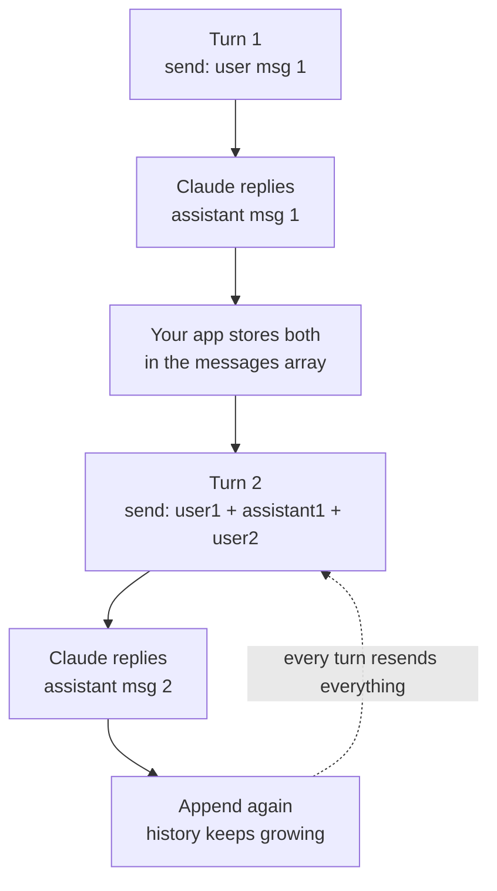
```mermaid
flowchart TD
    A[Turn 1<br/>send: user msg 1] --> B[Claude replies<br/>assistant msg 1]
    B --> C[Your app stores both<br/>in the messages array]
    C --> D[Turn 2<br/>send: user1 + assistant1 + user2]
    D --> E[Claude replies<br/>assistant msg 2]
    E --> F[Append again<br/>history keeps growing]
    F -.->|every turn resends everything| D
```

- **The server keeps nothing.** There is no session you can "continue" with just the latest user message. If you send only message N, the model has amnesia about messages 1..N-1. The full transcript *is* the conversation.
- **`tool` results are content blocks, not a literal role.** When the model calls a tool, you append the result as a `tool_result` content block inside a `user`-role message — the role label is not set to `"tool"`. This trips up developers who expect a symmetric "tool" role; the exam expects you to know the result rides back in a user turn keyed by `tool_use_id`.
- **Consecutive same-role messages are allowed** (the API merges them into one turn), but the array must still begin with `user`.

**Common mistakes:**
- Sending only the latest user turn and wondering why context is "lost" — the context was never stored server-side.
- Letting the array grow unbounded until it overflows the context window (§1.5) — statelessness means *you* own history management, including trimming and summarization.
- Hand-rolling a `{"role": "tool", ...}` message instead of a `tool_result` block.

## 1.3 The `stop_reason` Field in the Response

The Claude API response includes `stop_reason`, which indicates why the model stopped generating:

| Value | Description | Action |
|---|---|---|
| `"end_turn"` | The model finished its response | Show the result to the user |
| `"tool_use"` | The model wants to call a tool | Execute the tool and return the result |
| `"max_tokens"` | Token limit reached | The response is truncated; you may need to increase the limit |
| `"stop_sequence"` | A stop sequence was encountered | Handle based on your application logic |
| `"pause_turn"` | A long-running turn was paused (e.g. during server-side tool use) and can be resumed | Send the response back so the model continues where it left off |
| `"refusal"` | The model declined to continue for safety reasons (Claude 4+) | Stop the loop and handle gracefully—do not blindly retry the same request |

For agentic systems, `"tool_use"` and `"end_turn"` are the most important—they control the agent loop.

**`stop_reason` is the control plane of every agent.** This single field is *the* exam-critical concept in Chapter 1, because the entire agentic loop (Chapter 3, §3.1) branches on it:

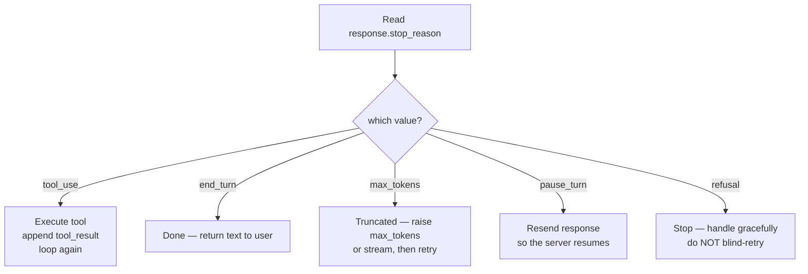
```mermaid
flowchart TD
    A[Read response.stop_reason] --> B{which value?}
    B -->|tool_use| C[Execute tool<br/>append tool_result<br/>loop again]
    B -->|end_turn| D[Done — return text to user]
    B -->|max_tokens| E[Truncated — raise max_tokens<br/>or stream, then retry]
    B -->|pause_turn| F[Resend response<br/>so the server resumes]
    B -->|refusal| G[Stop — handle gracefully<br/>do NOT blind-retry]
```

- **Branch on `stop_reason`, never on text.** The only reliable signal that a task is complete is `stop_reason == "end_turn"`. Parsing the assistant's prose for "done" or "task completed" is the canonical anti-pattern the exam wants you to reject — it is brittle, language-dependent, and easily spoofed by the model's own wording.
- **`max_tokens` means truncated, not finished.** Treat it as an error condition: the output is incomplete. Either raise `max_tokens` and re-request, or switch to streaming (which lets you use a higher ceiling without hitting HTTP timeouts).
- **`pause_turn` is for server-side tools.** When the model uses an Anthropic-hosted tool (web search, code execution) and the server-side loop hits its iteration limit, you get `pause_turn`. Resume by sending the assistant response straight back — **do not** add a `"Continue."` user message; the API detects the trailing server-tool block and resumes automatically.
- **`refusal` must not be blind-retried.** On Claude 4+, a safety decline returns a successful HTTP 200 with `stop_reason == "refusal"`. Re-sending the identical request just burns tokens for the same outcome. Read `stop_reason` *before* touching `response.content` — on a pre-output refusal the content array can be empty, and code that does `response.content[0].text` unconditionally will crash.

**Guard `stop_details` before reading it.** `response.stop_details` is populated *only* when `stop_reason == "refusal"`; for `end_turn`, `max_tokens`, `tool_use`, etc. it is `null`. Reading `.category` without a guard is a runtime error.

## 1.4 System Prompt

The system prompt is a special instruction that defines context and behavioral rules. It:
- Is not part of the `messages` array; it is passed separately in the `system` field
- Has priority over user messages
- Is loaded once and applies throughout the conversation
- Is used to define role, constraints, and output format

**Important for the exam:** system prompt wording can create unintended tool associations. For example, an instruction like "always verify the customer" can cause the model to overuse `get_customer`, even when it is unnecessary.

**Why the system prompt is more than "the instructions."** It is the highest-authority text in the request and it sits at the *front* of the prompt prefix, which has two consequences the exam probes:

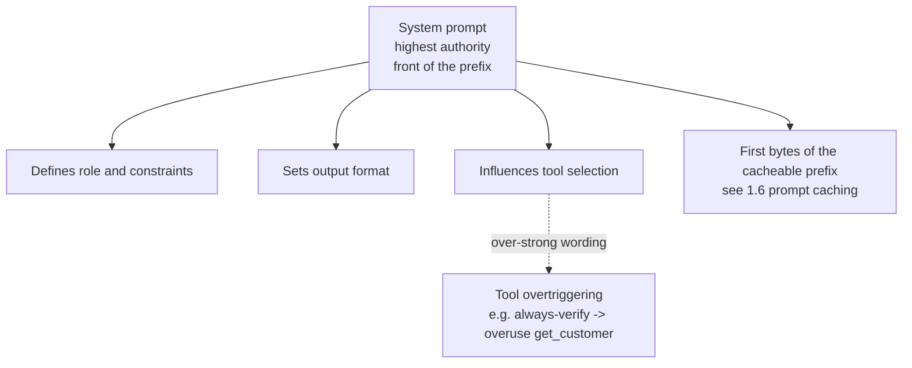
```mermaid
flowchart TD
    SP[System prompt<br/>highest authority<br/>front of the prefix] --> A[Defines role and constraints]
    SP --> B[Sets output format]
    SP --> C[Influences tool selection]
    C -.->|over-strong wording| D[Tool overtriggering<br/>e.g. always-verify -> overuse get_customer]
    SP --> E[First bytes of the cacheable prefix<br/>see 1.6 prompt caching]
```

- **Wording leaks into behavior.** Because the model follows the system prompt closely, imperative phrasing meant to *overcome* reluctance now *over*-triggers. "Always verify the customer" makes the model call `get_customer` even when the request never needed it; "CRITICAL: you MUST use the search tool" makes it search when reasoning would do. The fix is almost always to soften the language ("verify the customer when the request involves account changes"), not to add more guardrails. This is the exam's favorite Chapter 1 nuance, and it ties directly into Domain 4 (prompt design) and Domain 1 (tool-selection behavior).
- **Soft preferences belong here; hard rules do not.** The system prompt yields *probabilistic* compliance — the model usually obeys, but not 100% of the time. Anything that must be guaranteed (a refund ceiling, an identity check before a financial action) belongs in deterministic code or a hook (Chapter 3, §3.5), never in prompt text alone. Putting a money rule in the system prompt is a classic wrong answer.
- **It is set once, applies throughout, and overrides user messages.** A user cannot talk the model out of a constraint that lives in the system prompt as easily as one buried in conversation — which is exactly why operator instructions belong there rather than in a user turn.
- **It is the front of the cacheable prefix.** Because the system prompt is stable and sits first, it is the natural place to anchor prompt caching (§1.6). Interpolating volatile content into it — a timestamp, the user's name, a request ID — invalidates the cache for everything after it. Keep it frozen.

## 1.5 Context Window

The context window is the total amount of text (in tokens) the model can process at once. It includes:
- The system prompt
- The full message history
- Tool definitions
- Tool results

**Key context-window problems:**

1. **Lost-in-the-middle effect:** models reliably process information at the start and end of a long input but can miss details in the middle. Mitigation: place key information near the beginning or end.

2. **Accumulation of tool results:** every tool call adds output to the context. If a tool returns 40+ fields but only 5 matter, then most of the context is wasted.

3. **Progressive summarization:** when compressing history, numeric values, percentages, and dates often get lost and become vague ("about", "roughly", "a few").

**Why the context window is a *budget*, not just a *limit*.** Everything in §1.1–§1.4 competes for the same finite token pool, and because the API is stateless (§1.2), that pool fills up turn after turn as you resend a growing transcript:

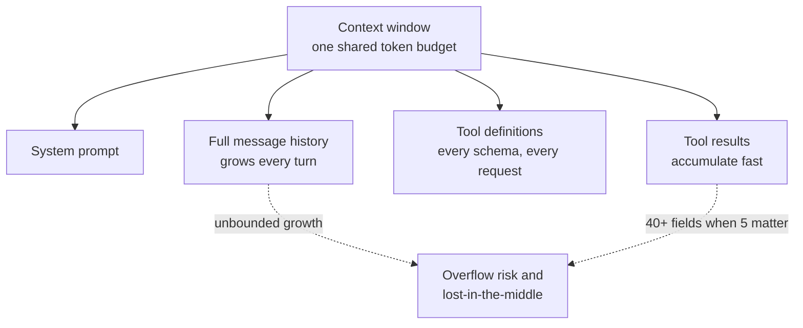
```mermaid
flowchart TD
    CW[Context window<br/>one shared token budget] --> S[System prompt]
    CW --> H[Full message history<br/>grows every turn]
    CW --> T[Tool definitions<br/>every schema, every request]
    CW --> R[Tool results<br/>accumulate fast]
    H -.->|unbounded growth| X[Overflow risk and<br/>lost-in-the-middle]
    R -.->|40+ fields when 5 matter| X
```

- **Lost-in-the-middle is a placement problem.** Models attend most reliably to the *start* and *end* of a long input and can miss findings buried in the middle. So order matters: put the key instruction or the critical finding near the top or the bottom, not at token 40,000 of 60,000. When aggregating data from multiple sources, lead with the most important section under an explicit heading.
- **Tool-result bloat is the silent budget killer.** A tool that returns 40 fields when the model needs 5 wastes the other 35 on every subsequent turn (because history is resent). Trim verbose tool outputs down to the relevant fields *before* they enter the transcript — this is a Domain 5 skill and a recurring exam scenario.
- **Summarization loses exactly the data you cared about.** Progressive summarization tends to compress precise values — numbers, percentages, dates, IDs — into vague language ("about a few", "roughly last quarter"). The mitigation is to extract transactional facts into a persistent, *un*-summarized "case facts" block rather than trusting a rolling summary to preserve them.
- **Modern long-context features exist, but the principles stand.** Even with 200K–1M-token windows, server-side compaction, and context editing, the same failure modes apply — a bigger budget delays the problem, it doesn't repeal it. The exam tests the *principles* (placement, trimming, fact preservation), not the raw window size.

## 1.6 Streaming, Tokens, and Cost

The previous sections describe the *shape* of a call; this section covers the *operational* realities of running it in production — the parts the exam frames as "which approach should you use" trade-offs.

### Streaming

A non-streaming request blocks until the entire response is generated, then returns it all at once. For long outputs this risks an HTTP timeout — the SDKs refuse non-streaming requests that they estimate will take too long, and large `max_tokens` (above ~16K) effectively *requires* streaming. Streaming sends the response incrementally as a series of Server-Sent Events:

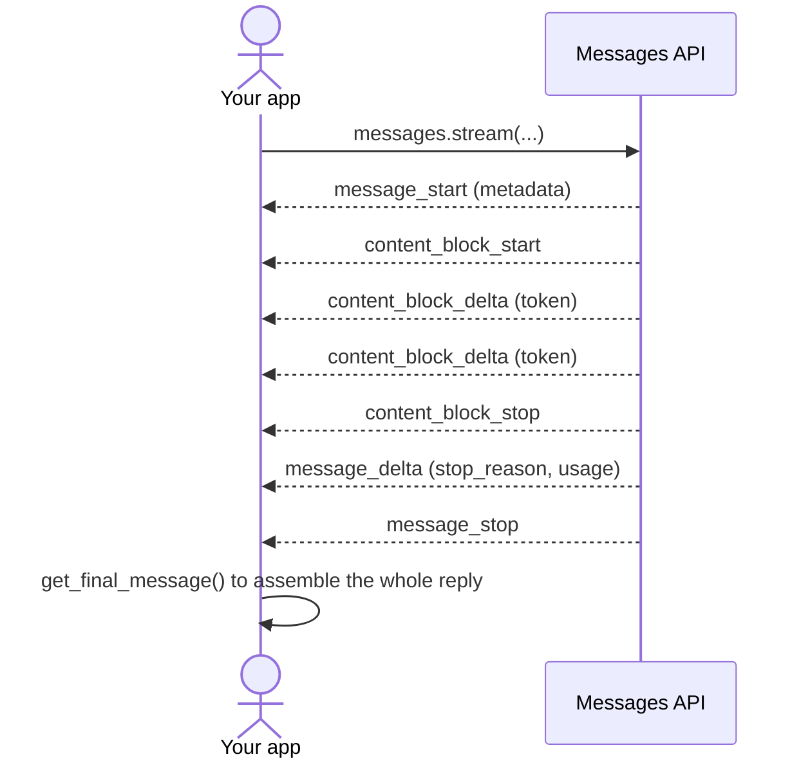
```mermaid
sequenceDiagram
    actor App as Your app
    participant API as Messages API
    App->>API: messages.stream(...)
    API-->>App: message_start (metadata)
    API-->>App: content_block_start
    API-->>App: content_block_delta (token)
    API-->>App: content_block_delta (token)
    API-->>App: content_block_stop
    API-->>App: message_delta (stop_reason, usage)
    API-->>App: message_stop
    App->>App: get_final_message() to assemble the whole reply
```

- **`message_delta` carries the payload you actually need to branch on:** it contains `stop_reason` and the running token `usage`. Even when streaming for UX, call the SDK helper (`get_final_message()` / `.finalMessage()`) to reassemble the complete message — you get the streamed UX *and* timeout protection without having to handle every event by hand.
- **Default to streaming for anything with long input or high `max_tokens`.** It is the standard production posture; non-streaming is fine only for short, fast calls (classification, extraction).

### Tokens and cost

Pricing is per-token, billed separately for input and output, and varies by model:

| Model | Input $/1M | Output $/1M | Context |
|---|---|---|---|
| `claude-opus-4-8` | $5.00 | $25.00 | 1M |
| `claude-sonnet-4-6` | $3.00 | $15.00 | 1M |
| `claude-haiku-4-5` | $1.00 | $5.00 | 200K |

- **Output is far more expensive than input** (5× on every model above). A response that rambles costs more than the prompt that asked for it — another reason a well-scoped `max_tokens` and a concise system prompt matter.
- **Count tokens with the API, not a guess.** To estimate cost or check whether a prompt fits the window, use `POST /v1/messages/count_tokens` (`client.messages.count_tokens(...)`). Do **not** use `tiktoken` or other OpenAI tokenizers — they are calibrated for a different model and undercount Claude tokens, badly on code and non-English text. Token counts are model-specific; pass the same `model` you will use for inference.
- **`usage` reports the real numbers.** Each response carries `usage` with `input_tokens`, `output_tokens`, and the cache fields below. `input_tokens` is the *uncached remainder only* — total prompt size is `input_tokens + cache_creation_input_tokens + cache_read_input_tokens`.

### Prompt caching (basics)

Prompt caching is a **prefix match**: the API caches the rendered prompt up to a `cache_control` breakpoint, and any byte change anywhere in that prefix invalidates everything after it. Render order is `tools` → `system` → `messages`.

- **Keep the stable content first, volatile content last.** A frozen system prompt and a deterministic tool list are ideal cache anchors; a timestamp or per-request ID interpolated into the system prompt silently breaks caching for the whole request.
- **Cache reads cost ~0.1× of base input price**, writes ~1.25× — so a large reused preamble (instructions, few-shot examples, a long document) pays for itself within a couple of requests.
- **Verify with `usage.cache_read_input_tokens`.** If it stays zero across requests that *should* share a prefix, a silent invalidator is at work (commonly `datetime.now()` in the system prompt, an unsorted JSON dump, or a tool set that varies per request).

**Exam angle:** caching, streaming, and token counting are the Chapter 1 building blocks behind Domain 5's cost/reliability scenarios — the questions test *when* to stream, *why* not to use `tiktoken`, and *what* invalidates a cache, not the exact pricing numbers.

## 1.7 End-to-End Case Study: A Multi-Turn Support-Chat Backend

The fields above only matter when they fit together. Here is a complete, realistic backend that ties the chapter into one system — a stateless web service that powers a multi-turn customer-support chat. It uses *only* Chapter 1 concepts: messages, the system prompt, statelessness, streaming, `stop_reason`, token/cost accounting, and prompt caching. (No tools yet — that is Chapter 2.)

### Requirements

- Power a back-and-forth support chat: the user types, the assistant replies, repeat.
- The service is a stateless HTTP backend (multiple instances behind a load balancer) — **it cannot rely on in-process memory** between requests.
- Stream replies token-by-token so the UI shows text as it is generated.
- A fixed support persona and policy text apply to every conversation and must be cached, not re-billed every turn.
- Track token usage per conversation for cost reporting.
- Handle truncated (`max_tokens`) and refused (`refusal`) responses correctly — never show a half-message as if it were complete, never blind-retry a refusal.
- Keep conversations from overflowing the context window.

### Architecture

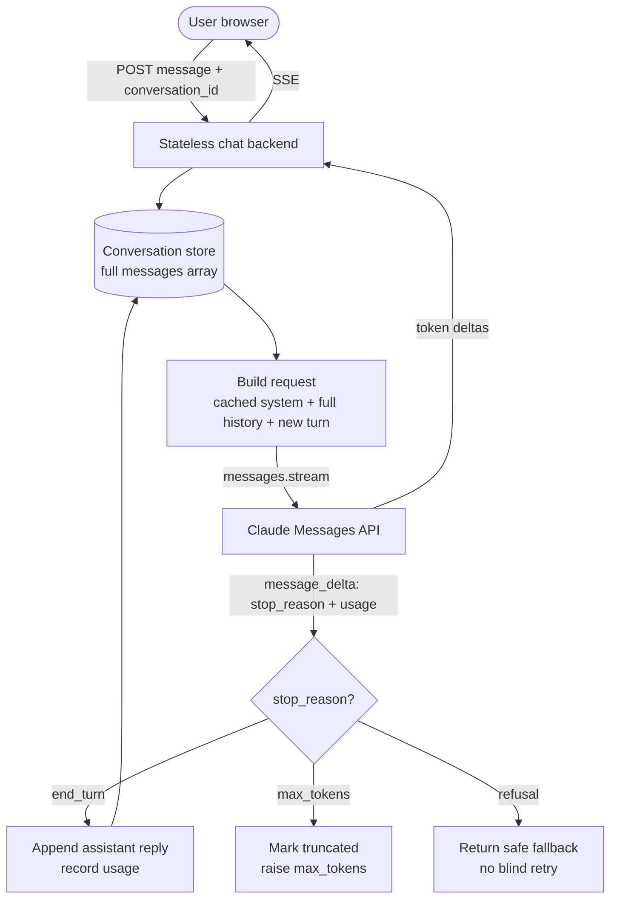
```mermaid
flowchart TD
    User([User browser]) -->|POST message + conversation_id| Svc[Stateless chat backend]
    Svc --> Store[(Conversation store<br/>full messages array)]
    Store --> Build[Build request<br/>cached system + full history + new turn]
    Build -->|messages.stream| API[Claude Messages API]
    API -->|token deltas| Svc
    Svc -->|SSE| User
    API -->|message_delta: stop_reason + usage| Check{stop_reason?}
    Check -->|end_turn| Save[Append assistant reply<br/>record usage]
    Check -->|max_tokens| Retry[Mark truncated<br/>raise max_tokens]
    Check -->|refusal| Safe[Return safe fallback<br/>no blind retry]
    Save --> Store
```

Because the backend is stateless, **the conversation store is the only memory** — every turn rebuilds the full request from it. The system prompt is the cache anchor; the growing `messages` array is the conversation.

### Implementation

A conversation manager that resends full history, caches the persona, and streams:

```python
import anthropic

client = anthropic.Anthropic()

SUPPORT_SYSTEM = (
    "You are Acme's support assistant. Be concise and friendly. "
    "Help with orders and returns. If a request needs an account change, "
    "ask the user to confirm their order number first."
)  # Frozen — no timestamps or per-user data, so it caches cleanly.

def handle_turn(conversation_id: str, user_text: str) -> dict:
    history = store.load(conversation_id)          # full messages array (statelessness)
    history.append({"role": "user", "content": user_text})

    with client.messages.stream(
        model="claude-sonnet-4-6",
        max_tokens=1024,
        cache_control={"type": "ephemeral"},       # cache the stable system prefix
        system=SUPPORT_SYSTEM,
        messages=history,
    ) as stream:
        for text in stream.text_stream:
            push_sse(conversation_id, text)        # stream tokens to the UI
        final = stream.get_final_message()         # reassemble + get stop_reason/usage

    if final.stop_reason == "refusal":
        return {"status": "refused"}               # do NOT re-send the same request
    if final.stop_reason == "max_tokens":
        return {"status": "truncated"}             # incomplete — raise max_tokens & retry

    assistant_text = next(b.text for b in final.content if b.type == "text")
    history.append({"role": "assistant", "content": assistant_text})
    store.save(conversation_id, history)           # persist the growing transcript
    record_usage(conversation_id, final.usage)     # input/output/cache tokens for cost
    return {"status": "ok"}
```

Guard the context window by trimming history when it grows too large, preserving the most recent turns:

```python
def trim(history: list, keep_recent: int = 20) -> list:
    # Statelessness means WE own history management. Keep recent turns;
    # for long sessions, summarize older turns into a persistent facts block
    # rather than dropping precise order numbers and dates (1.5).
    return history if len(history) <= keep_recent else history[-keep_recent:]
```

### Execution trace

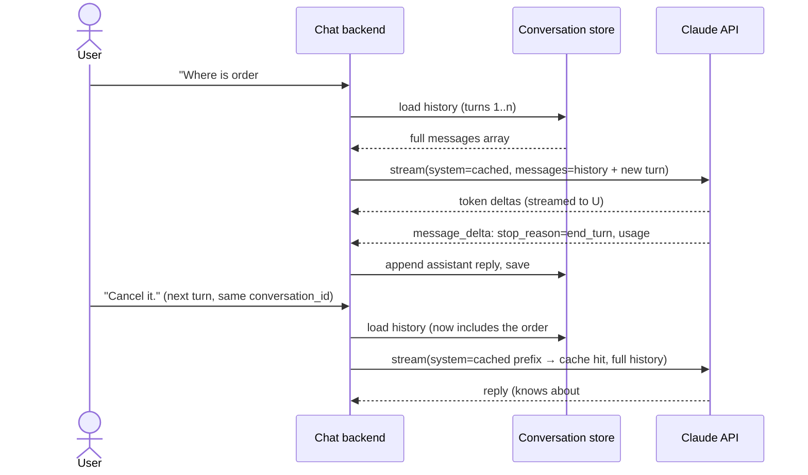
```mermaid
sequenceDiagram
    actor U as User
    participant B as Chat backend
    participant DB as Conversation store
    participant C as Claude API
    U->>B: "Where is order #5512?"
    B->>DB: load history (turns 1..n)
    DB-->>B: full messages array
    B->>C: stream(system=cached, messages=history + new turn)
    C-->>B: token deltas (streamed to U)
    C-->>B: message_delta: stop_reason=end_turn, usage
    B->>DB: append assistant reply, save
    U->>B: "Cancel it." (next turn, same conversation_id)
    B->>DB: load history (now includes the order #5512 exchange)
    B->>C: stream(system=cached prefix → cache hit, full history)
    C-->>B: reply (knows about #5512 only because history was resent)
```

Notice that turn 2 only "remembers" order #5512 because the backend **resent the entire transcript** — the API stored nothing. The second request also gets a **cache hit** on the system prefix, so the persona text is billed at ~0.1× instead of full price.

### Validation

- **Statelessness test:** restart the backend (drop all in-process state) mid-conversation; the next turn must still have full context, proving memory lives in the store, not the process.
- **Cache test:** assert `usage.cache_read_input_tokens > 0` on the second and later turns. If it is zero, a silent invalidator slipped into the system prompt (a timestamp, a per-user string).
- **Truncation test:** force `max_tokens=16` on a long answer and assert the backend reports `truncated` rather than saving a half-sentence as a complete reply.
- **Refusal test:** assert a `refusal` response returns the safe fallback and does *not* fire a second identical request.
- **Context-budget test:** run a long conversation and confirm `trim()` keeps the window bounded without dropping the latest user intent.

### Common pitfalls

- Storing history in process memory and losing the conversation when the load balancer routes the next turn to a different instance (the API is stateless — §1.2).
- Interpolating `datetime.now()` or the user's name into `SUPPORT_SYSTEM`, silently killing the cache (§1.4, §1.6).
- Treating `max_tokens` as success and showing a truncated message as final (§1.3).
- Blind-retrying a `refusal` and burning tokens for the same outcome (§1.3).
- Letting the `messages` array grow unbounded until it overflows the context window (§1.5).
- Estimating cost with `tiktoken` instead of `count_tokens`, undercounting Claude tokens (§1.6).

## 1.8 Exam Focus — Key Takeaways

| Concept | What the exam tests |
|---|---|
| Request structure | Minimum valid call is `model` + `max_tokens` + a `messages` array starting with `user`; `system` is a separate field, not a message (§1.1). |
| Statelessness | The server stores nothing — you resend the full history every turn; you own trimming and summarization (§1.2). |
| `stop_reason` | Branch on `stop_reason`, never on parsed text; `end_turn` = done, `max_tokens` = truncated, `refusal` = stop and don't blind-retry (§1.3). |
| System prompt | Highest authority and front of the prefix; over-strong wording overtriggers tools; hard rules belong in code, not prompts (§1.4). |
| Context window | One shared token budget; mitigate lost-in-the-middle by placement, trim bloated tool results, preserve precise facts (§1.5). |
| Streaming & cost | Stream for long output / high `max_tokens`; read `usage`; count tokens with `count_tokens`, never `tiktoken`; cache the stable prefix (§1.6). |

> **Maps to Domains 1, 4, and 5.** Chapter 1 is the foundation the rest of the guide stands on: `stop_reason` drives the agent loops of Domain 1, the system prompt and message construction drive Domain 4, and statelessness plus the context window drive Domain 5. Master the support-chat backend above — messages, system prompt, streaming, `stop_reason`, cost, caching — and the higher layers become far easier to reason about.

# Chapter 2: Tools and `tool_use`

> Documentation: [Tool Use](https://platform.claude.com/docs/en/build-with-claude/tool-use)

Tools are how Claude stops being a text generator and starts being a system that *acts* — looking up an order, running a query, calling an API. This chapter is the backbone of **Domain 2 — Tool Design and MCP Integration (18% of the exam)**. Where Chapter 3 covers how an agent *orchestrates* tools, this chapter covers the contract underneath every one of those calls: how you *define* a tool, how Claude *requests* it, how you *return* its result (including failures), and how you *steer* selection. By the end you should be able to:

- Explain the **`tool_use` / `tool_result` round trip** (§2.1) — the message exchange every tool call rides on.
- Write a **tool definition** whose `description` actually drives correct selection (§2.2).
- Steer selection with **`tool_choice`** (§2.3) and reason about **parallel tool calls** (§2.4).
- Use **JSON Schema** as the most reliable path to structured output (§2.5), and tell **syntax from semantic** errors (§2.6).
- Return **structured error results** so the model can recover correctly (§2.7).

§2.8 then builds a complete invoice-extraction service end-to-end, and §2.9 distills what the exam tests.

## 2.1 What is `tool_use`

`tool_use` is the mechanism that lets Claude call external functions. The model **does not run code** — it emits a structured *request* to call a tool; **your code executes it** and feeds the result back. Claude is the planner; your runtime is the hands.

Mechanically, a tool call is a four-message round trip carried entirely inside the normal `messages` array:

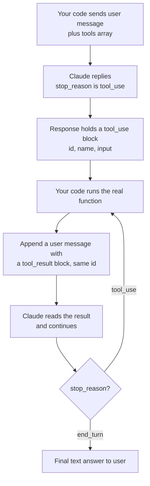
```mermaid
flowchart TD
    A[Your code sends user message<br/>plus tools array] --> B[Claude replies<br/>stop_reason is tool_use]
    B --> C[Response holds a tool_use block<br/>id, name, input]
    C --> D[Your code runs the real function]
    D --> E[Append a user message with<br/>a tool_result block, same id]
    E --> F[Claude reads the result<br/>and continues]
    F --> G{stop_reason?}
    G -->|tool_use| D
    G -->|end_turn| H[Final text answer to user]
```

The wire format matters because the exam tests whether you understand it:

```json
// 1) Claude's response — stop_reason: "tool_use"
{
  "role": "assistant",
  "content": [
    {"type": "text", "text": "Let me look that up."},
    {"type": "tool_use", "id": "toolu_01A...", "name": "get_customer",
     "input": {"email": "ada@example.com"}}
  ]
}

// 2) Your reply — the result goes back as a USER message
{
  "role": "user",
  "content": [
    {"type": "tool_result", "tool_use_id": "toolu_01A...",
     "content": "{\"name\":\"Ada\",\"status\":\"active\"}"}
  ]
}
```

**Why this matters / common mistakes:**
- The `tool_result` block goes back in a message with **`role: "user"`**, not `assistant` — a frequent point of confusion. The `tool_use_id` must match the `id` Claude generated, or the API rejects the turn.
- You must **echo the assistant's `tool_use` turn back** in the next request. The API is stateless; if you drop the assistant turn that contained the `tool_use` block and only send the `tool_result`, the conversation is malformed.
- Claude often emits a `text` block ("Let me look that up.") *alongside* the `tool_use` block. Don't treat that text as the final answer — `stop_reason == "tool_use"` means the turn is not done.

> **Exam angle:** know the role/id pairing (`tool_use.id` ↔ `tool_result.tool_use_id`) and that `tool_result` rides on a `user` message. This is the literal protocol Chapter 3's agentic loop drives.

## 2.2 Tool Definition

Each tool is defined with a JSON schema. The `description` is the single most important field you will write:

```json
{
  "name": "get_customer",
  "description": "Finds a customer by email or ID. Returns the customer profile, including name, email, order history, and account status. Use this tool BEFORE lookup_order to verify the customer's identity. Accepts an email (format: user@domain.com) or a numeric customer_id.",
  "input_schema": {
    "type": "object",
    "properties": {
      "email": {"type": "string", "description": "Customer email"},
      "customer_id": {"type": "integer", "description": "Numeric customer ID"}
    },
    "required": []
  }
}
```

**Critically important aspects of a tool description:**

1. **The description is the primary selection mechanism.** Claude chooses tools almost entirely from their descriptions and schemas — it has no other view of what the tool does. Minimal descriptions ("Retrieves customer information") cause wrong-tool selection the moment two tools overlap.

2. **Include in the description:**
   - What the tool does and what it returns
   - Input formats and example values
   - Edge cases and constraints
   - When to use this tool vs similar alternatives

3. **Avoid** identical or overlapping descriptions across tools. If `analyze_content` and `analyze_document` read almost the same, the model will confuse them. The fix is often to **rename for specificity** (`analyze_content` → `extract_web_results`) and to **split a general tool into focused ones** with distinct input/output contracts — exactly the Domain 2 skill of eliminating functional overlap.

4. **Built-in tools vs MCP tools:** agents tend to prefer built-in tools (Read, Grep) over MCP tools with similar functionality. To counter this, strengthen the MCP tool's description — name the concrete advantage, the unique data, or the context a built-in tool cannot provide.

5. **Mind the system prompt.** Wording in the system prompt can create unintended associations ("you are a *search* assistant" biases the model toward anything named `search_*`). Tool routing is the product of *both* the descriptions and the surrounding prompt.

**Why this matters / common mistakes:** treating descriptions as human documentation rather than the model's routing table. A vague or duplicated description is not a cosmetic issue — it is a correctness bug that surfaces as the agent calling the wrong tool.

> **Exam angle:** given two confusable tools, the right answer is usually to *rewrite/rename the descriptions to disambiguate* (and split overly general tools), not to add more prompt instructions.

## 2.3 The `tool_choice` Parameter

`tool_choice` controls *how* the model selects tools:

| Value | Behavior | When to use |
|---|---|---|
| `{"type": "auto"}` | The model decides whether to call a tool or answer in text | Default for most cases |
| `{"type": "any"}` | The model **must** call some tool (never plain text) | When you need guaranteed structured output |
| `{"type": "tool", "name": "extract_metadata"}` | The model **must** call that specific tool | When you need a forced first step / execution order |
| `{"type": "none"}` | The model **may not** call any tool this turn | Temporarily disable tools without removing them |

**Important scenarios:**
- `tool_choice: "any"` + several extraction tools → the model still picks the best one, but you are guaranteed a tool call rather than a prose answer.
- Forced selection (`type: "tool"`) → when you must guarantee a specific first action (e.g., `extract_metadata` before any enrichment step).

**Why this matters / common mistakes:**
- With `auto`, Claude may legitimately answer in text. If your code unconditionally parses a `tool_use` block, it crashes on the text-only turn. Use `any` when downstream code *requires* structured output.
- **Forcing a tool disables extended thinking** for that turn, and `any`/`tool` mean the model will *always* call something — so a forced tool must be one it is safe to call unconditionally. Don't force a side-effectful tool (e.g., `send_email`) just to get structure; force an extraction/formatting tool instead.

> **Exam angle:** "guarantee structured output, model picks the tool" → `any`. "Guarantee a specific tool runs first" → `{"type":"tool","name":...}`. "Model may answer or call" → `auto`.

## 2.4 Parallel Tool Calls

When a turn needs several independent lookups, Claude can emit **multiple `tool_use` blocks in a single response**. Your code runs them (ideally concurrently) and returns **all** the `tool_result` blocks in **one** following `user` message.

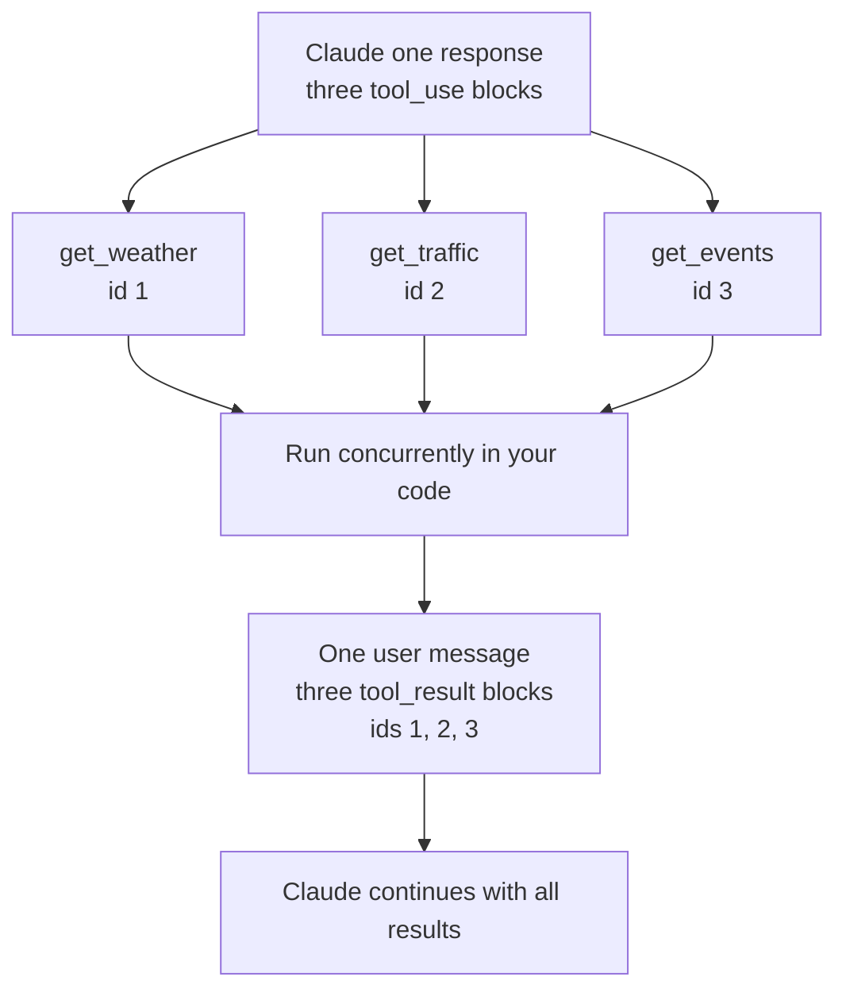
```mermaid
flowchart TD
    A[Claude one response<br/>three tool_use blocks] --> B[get_weather<br/>id 1]
    A --> C[get_traffic<br/>id 2]
    A --> D[get_events<br/>id 3]
    B --> E[Run concurrently in your code]
    C --> E
    D --> E
    E --> F[One user message<br/>three tool_result blocks<br/>ids 1, 2, 3]
    F --> G[Claude continues with all results]
```

**Why this matters / common mistakes:**
- All `tool_result` blocks for a parallel batch must come back in **one** user message, each matched to its `tool_use_id`. Splitting them across multiple messages, or omitting one id, malforms the turn.
- Parallelism is an optimization for **independent** calls. If tool B needs tool A's output, those are *sequential* round trips, not a parallel batch — the model will request A, see the result, then request B.
- You can nudge or suppress parallelism: prompting (e.g., asking the model to gather all needed data at once) encourages it; `disable_parallel_tool_use: true` in `tool_choice` forces at most one call per turn when your backend can't handle concurrency safely.

> **Exam angle:** parallel tool calls = lower latency for independent work; the giveaway in a question is "fetch X, Y, and Z" with no dependency between them. Dependent steps are not parallelizable.

## 2.5 JSON Schemas for Structured Output

Using `tool_use` with a JSON schema is the **most reliable** way to get structured output from Claude. It:
- **Guarantees syntactically valid JSON** (no missing braces, no trailing commas)
- **Enforces the required structure** (required fields are present, enums are respected)
- Does **not** guarantee semantic correctness (the values can still be wrong)

The classic pattern is a single "extractor" tool whose `input_schema` *is* the shape you want back; call it with `tool_choice: {"type":"tool","name":"..."}` and read the `input` of the resulting `tool_use` block.

**Schema design — key principles:**

```json
{
  "type": "object",
  "properties": {
    "category": {
      "type": "string",
      "enum": ["bug", "feature", "docs", "unclear", "other"]
    },
    "category_detail": {
      "type": ["string", "null"],
      "description": "Details if category = 'other' or 'unclear'"
    },
    "severity": {
      "type": "string",
      "enum": ["critical", "high", "medium", "low"]
    },
    "confidence": {
      "type": "number",
      "minimum": 0,
      "maximum": 1
    },
    "optional_field": {
      "type": ["string", "null"],
      "description": "Null if the information was not found in the source"
    }
  },
  "required": ["category", "severity"]
}
```

**Schema design rules:**
1. **Required vs optional:** mark a field `required` only if the information is *always* available. Required fields push the model to **fabricate** a value when the data is missing.
2. **Nullable fields:** use `"type": ["string", "null"]` for information that may be absent, so the model can return `null` instead of hallucinating.
3. **Enums with `"other"`:** add `"other"` + a detail string so data outside your predefined categories isn't silently lost.
4. **Enum `"unclear"`:** for cases where the model can't confidently choose — an honest `"unclear"` beats a confident wrong category.
5. **Describe each field.** The per-field `description` is part of the prompt; "Null if not found in source" measurably reduces hallucination.

**Why this matters / common mistakes:** over-requiring fields and omitting null are the two most common schema bugs, and both manufacture hallucinations. The schema constrains *shape*, never *truth* — which is why §2.6 exists.

> **Exam angle:** "How do I guarantee valid, well-structured output?" → a tool/JSON-schema, not prompt-and-parse. "How do I let the model say *I don't know*?" → nullable types and an `unclear`/`other` enum.

## 2.6 Syntax vs Semantic Errors

A JSON schema closes the door on one whole class of error and not the other. Keeping them separate tells you which mitigation applies.

| Error type | Example | Mitigation |
|---|---|---|
| **Syntax** | Invalid JSON, wrong field type, missing required key | `tool_use` with a JSON schema (**eliminates** this class) |
| **Semantic** | Totals don't add up, value placed in the wrong field, fabricated value | Validation checks, retry with feedback, self-correction |

**Why this matters / common mistakes:** assuming that because the JSON parsed, it is *correct*. A schema guarantees `line_items` is an array of the right shape; it cannot guarantee the line items sum to `total`. Semantic correctness is *your* job — validate after extraction, and on failure re-prompt with the specific discrepancy (e.g., "line items sum to 90.00 but total is 95.00; recompute") so the model self-corrects.

> **Exam angle:** if a question's failure is "malformed JSON / missing field," the fix is the schema. If it's "numbers are wrong / value mis-slotted," the fix is validation + retry — the schema won't help.

## 2.7 Structured Error Results

Tools fail — timeouts, bad input, policy violations, missing permissions. **How you report the failure back to Claude determines whether it recovers correctly.** A tool result is not limited to success payloads; you mark a failed result with **`is_error: true`** (the `isError` flag in MCP), and — critically — you make the *content* machine-actionable:

```json
{
  "type": "tool_result",
  "tool_use_id": "toolu_01B...",
  "is_error": true,
  "content": "{\"errorCategory\":\"transient\",\"isRetryable\":true,\"message\":\"Upstream timeout after 5s\"}"
}
```

Distinguish the error *categories*, because each implies a different recovery:

| Category | Example | Retryable? | What Claude should do |
|---|---|---|---|
| **Transient** | Upstream timeout, 503 | Yes | Retry, ideally with backoff |
| **Validation** | Malformed email, missing field | No | Fix the input and call again |
| **Business** | Refund exceeds policy limit | No | Explain to the user / escalate |
| **Permission/Access** | Token lacks scope | No | Stop and surface, don't loop |

**Why this matters / common mistakes:**
- A generic `"Operation failed"` strips the model of the information it needs to decide *retry vs fix vs stop*. The classic failure mode is the agent **retrying a non-retryable validation or business error forever**.
- Return `isRetryable: false` for business-rule violations *with a clear user-facing `message`*, so the agent explains rather than loops.
- **Distinguish an access failure from a valid empty result.** `search` returning zero rows is a *success* with empty data — not an error. Marking "no matches" as `is_error` makes the model think the tool broke and retry pointlessly.
- **Recover locally where you can.** For transient failures, a subagent should retry internally and only propagate errors it genuinely cannot resolve — don't burden the coordinator with every blip.

> **Exam angle:** the right answer to "the agent keeps retrying a doomed call" is *structured error metadata* (`errorCategory`, `isRetryable`, human-readable `message`), not a longer prompt. And "no results found" is not an error.

## 2.8 End-to-End Case Study: An Invoice-Extraction Service

The pieces above only matter assembled. Here is a complete, realistic build that exercises every concept in this chapter — definitions, `tool_choice`, the round trip, parallel calls, structured errors, and the syntax/semantic split. The job: turn a messy uploaded invoice (PDF text + a vendor ID) into validated structured data, enriched with live tax and vendor info.

### Requirements

- Input: raw invoice text plus a `vendor_id`. Output: a **strictly structured** invoice record (line items, subtotal, tax, total).
- The extraction must be **guaranteed structured** — downstream accounting code cannot parse prose.
- Enrichment needs **two independent lookups** — current `tax_rate` for the region and the canonical `vendor` record — which should run **in parallel** to cut latency.
- Lookups can **fail**; the system must tell retryable timeouts apart from a vendor that simply doesn't exist.
- A correct-shaped invoice can still be **wrong** (line items not summing to the total); that must be caught.

### Architecture

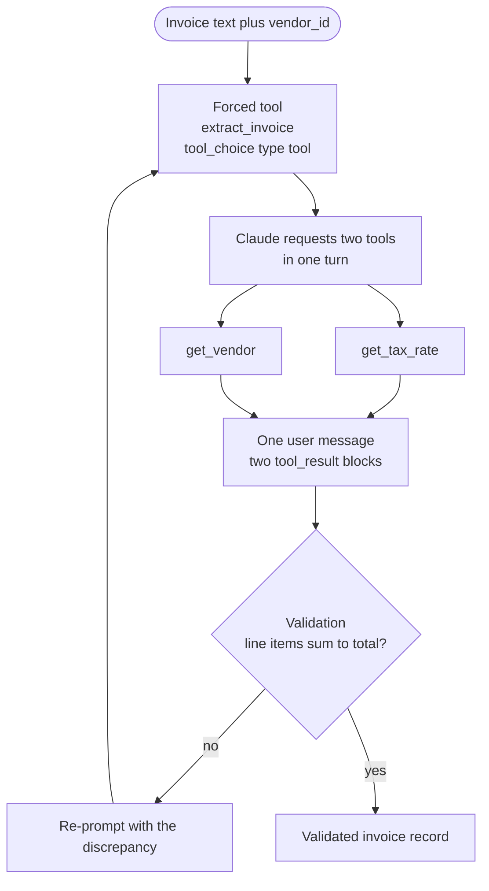
```mermaid
flowchart TD
    In([Invoice text plus vendor_id]) --> Ext[Forced tool<br/>extract_invoice<br/>tool_choice type tool]
    Ext --> Par[Claude requests two tools<br/>in one turn]
    Par --> Tax[get_tax_rate]
    Par --> Ven[get_vendor]
    Tax --> Batch[One user message<br/>two tool_result blocks]
    Ven --> Batch
    Batch --> Val{Validation<br/>line items sum to total?}
    Val -->|no| Retry[Re-prompt with the discrepancy]
    Retry --> Ext
    Val -->|yes| Done[Validated invoice record]
```

`extract_invoice` is **forced** so structure is guaranteed; the two enrichment lookups are **independent**, so Claude is allowed to request them **in parallel**; **structured errors** drive recovery; and a **semantic** check (the sum) sits outside the schema because a schema can't enforce arithmetic.

### Implementation

Define the extractor — its `input_schema` *is* the output shape — plus two enrichment tools:

```python
extract_invoice = {
    "name": "extract_invoice",
    "description": "Extract a structured invoice from raw text. Returns line items, "
                   "subtotal, tax, and total. Use vendor_currency for all amounts.",
    "input_schema": {
        "type": "object",
        "properties": {
            "line_items": {
                "type": "array",
                "items": {
                    "type": "object",
                    "properties": {
                        "desc": {"type": "string"},
                        "amount": {"type": "number"}
                    },
                    "required": ["desc", "amount"]
                }
            },
            "subtotal": {"type": "number"},
            "currency": {"type": "string"},
            "vendor_tax_id": {
                "type": ["string", "null"],
                "description": "Null if no tax id appears in the source"
            }
        },
        "required": ["line_items", "subtotal", "currency"]
    }
}

get_tax_rate = {
    "name": "get_tax_rate",
    "description": "Returns the current tax rate (0..1) for a region code. Read-only.",
    "input_schema": {"type": "object",
        "properties": {"region": {"type": "string"}}, "required": ["region"]}
}

get_vendor = {
    "name": "get_vendor",
    "description": "Returns the canonical vendor record (legal name, region) for a vendor_id. Read-only.",
    "input_schema": {"type": "object",
        "properties": {"vendor_id": {"type": "string"}}, "required": ["vendor_id"]}
}
```

Force the extractor on the first turn so you never get prose back:

```python
resp = client.messages.create(
    model="claude-sonnet-4-6",
    max_tokens=1024,
    tools=[extract_invoice, get_tax_rate, get_vendor],
    tool_choice={"type": "tool", "name": "extract_invoice"},   # guaranteed structure
    messages=[{"role": "user", "content": invoice_text}],
)
invoice = next(b.input for b in resp.content if b.type == "tool_use")
```

Run the two independent lookups concurrently and return **both** results in **one** user message:

```python
def run_tool(call):
    try:
        if call.name == "get_vendor":
            return {"is_error": False, "content": json.dumps(lookup_vendor(call.input["vendor_id"]))}
        if call.name == "get_tax_rate":
            return {"is_error": False, "content": json.dumps(get_rate(call.input["region"]))}
    except TimeoutError:
        return {"is_error": True,
                "content": json.dumps({"errorCategory": "transient", "isRetryable": True,
                                       "message": "Upstream timeout"})}
    except VendorNotFound:
        return {"is_error": True,
                "content": json.dumps({"errorCategory": "validation", "isRetryable": False,
                                       "message": "No vendor with that id"})}

# Claude emitted get_tax_rate and get_vendor in ONE response -> run in parallel
results = parallel_map(run_tool, tool_use_blocks)   # concurrent
tool_results = [
    {"type": "tool_result", "tool_use_id": b.id, **r}
    for b, r in zip(tool_use_blocks, results)
]
messages.append({"role": "user", "content": tool_results})   # all in one message
```

Validate **semantics** the schema can't — and on failure, re-prompt with the exact discrepancy:

```python
computed = round(sum(li["amount"] for li in invoice["line_items"]), 2)
if computed != invoice["subtotal"]:
    feedback = (f"line_items sum to {computed} but subtotal is "
                f"{invoice['subtotal']}. Recompute and call extract_invoice again.")
    # send `feedback` back as a user turn -> the model self-corrects (§2.6)
```

### Execution trace

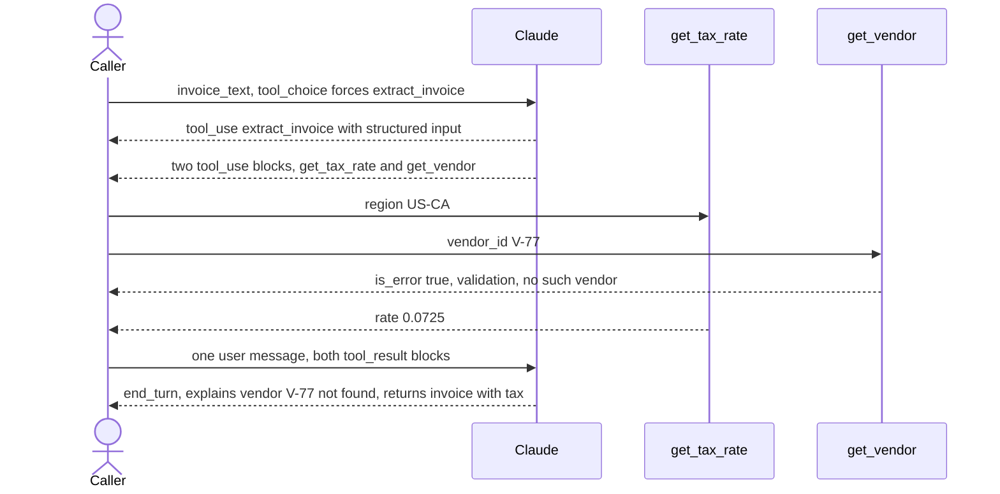
```mermaid
sequenceDiagram
    actor Sys as Caller
    participant Cl as Claude
    participant Tax as get_tax_rate
    participant Ven as get_vendor
    Sys->>Cl: invoice_text, tool_choice forces extract_invoice
    Cl-->>Sys: tool_use extract_invoice with structured input
    Cl-->>Sys: two tool_use blocks, get_tax_rate and get_vendor
    Sys->>Tax: region US-CA
    Sys->>Ven: vendor_id V-77
    Ven-->>Sys: is_error true, validation, no such vendor
    Tax-->>Sys: rate 0.0725
    Sys->>Cl: one user message, both tool_result blocks
    Cl-->>Sys: end_turn, explains vendor V-77 not found, returns invoice with tax
```

Two things to notice. The **forced** `extract_invoice` removed any chance of a prose answer. And the **structured** `get_vendor` error (`validation`, `isRetryable: false`) let Claude *explain* the missing vendor instead of retrying a call that can never succeed — exactly the §2.7 behavior the exam rewards.

### Validation

- **Structure test:** assert the first turn is always a `tool_use` for `extract_invoice` (forcing works) and that its `input` validates against the schema.
- **Parallelism test:** feed an invoice that needs both lookups; assert Claude emits both `tool_use` blocks in **one** response and that you return both `tool_result`s in **one** message.
- **Error-routing test:** make `get_vendor` raise `VendorNotFound`; assert the agent *explains* rather than retries (non-retryable), and that a `TimeoutError` *is* retried.
- **Semantic test:** feed an invoice whose line items don't sum to subtotal; assert the validator catches it and re-prompts. A schema-only design passes this bad invoice silently.

### Common pitfalls

- Returning the `tool_result` on an **`assistant`** message, or with a mismatched `tool_use_id` (§2.1) — the API rejects the turn.
- Using `tool_choice: "auto"` and then unconditionally reading a `tool_use` block, which crashes on a text-only turn (§2.3).
- Splitting parallel `tool_result`s across multiple user messages instead of one (§2.4).
- Marking "vendor not found" as a generic error with no category, so the agent retries forever; or marking an empty search result as an error at all (§2.7).
- Trusting parsed JSON as correct and skipping the sum check (§2.6).

## 2.9 Exam Focus — Key Takeaways

| Concept | What the exam tests |
|---|---|
| `tool_use` round trip | `tool_result` rides on a **`user`** message; `tool_use.id` ↔ `tool_result.tool_use_id`; echo the assistant turn back (§2.1). |
| Tool descriptions | The description is the model's routing table; fix confusable tools by **rewriting/renaming/splitting**, not more prompt (§2.2). |
| `tool_choice` | `any` = some tool guaranteed; `{"type":"tool",...}` = a specific tool; `auto` = model may answer in text (§2.3). |
| Parallel tool calls | Multiple `tool_use` in one turn for **independent** work; return all `tool_result`s in **one** message; dependent steps stay sequential (§2.4). |
| JSON-schema output | Most reliable structured output; nullable types + `unclear`/`other` let the model avoid fabricating (§2.5). |
| Syntax vs semantic | Schema **eliminates** syntax errors but not wrong values; semantics need validation + retry (§2.6). |
| Structured errors | `errorCategory` / `isRetryable` / `message` drive retry-vs-fix-vs-stop; an empty result is **not** an error (§2.7). |

> **Maps to Domain 2 (18%).** If you can build and defend the invoice-extraction service above — definitions, forcing, the round trip, parallel calls, structured errors, and the syntax/semantic split — you have the core of the Tool Design and MCP Integration domain.

# Chapter 3: Claude Agent SDK — Building Agentic Systems

> Documentation: [Agent SDK](https://platform.claude.com/docs/en/agent-sdk/overview) | [Hooks](https://platform.claude.com/docs/en/agent-sdk/hooks) | [Subagents](https://platform.claude.com/docs/en/agent-sdk/subagents) | [Sessions](https://platform.claude.com/docs/en/agent-sdk/sessions)

The Claude Agent SDK turns a single model call into an **autonomous system** that can plan, call tools, delegate to subagents, and enforce guardrails. This chapter is the backbone of **Domain 1 — Agent Architecture and Orchestration (27% of the exam)**, the most heavily weighted domain. By the end you should be able to reason about four building blocks and assemble them into a production agent:

- **The agentic loop** (§3.1) — how an agent decides what to do next.
- **Hub-and-spoke orchestration** (§3.3) — a coordinator delegating to isolated subagents.
- **Explicit context passing** (§3.4) — why subagents are blind unless you tell them everything.
- **Deterministic hooks** (§3.5) — enforcing business rules with 100% reliability.

§3.6 then builds a complete customer-support refund agent end-to-end, and §3.7 distills what the exam tests.

## 3.1 What is an Agentic Loop

The agentic loop is the core pattern for autonomous task execution. The model doesn't just answer—it performs a sequence of actions:

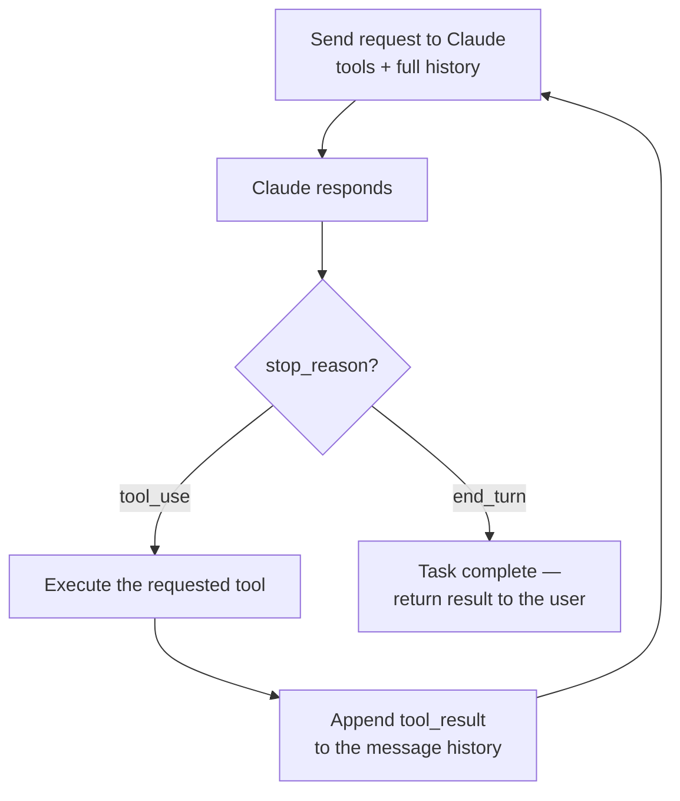
```mermaid
flowchart TD
    A[Send request to Claude<br/>tools + full history] --> B[Claude responds]
    B --> C{stop_reason?}
    C -->|tool_use| D[Execute the requested tool]
    D --> E[Append tool_result<br/>to the message history]
    E --> A
    C -->|end_turn| F[Task complete —<br/>return result to the user]
```

In code the loop is just a `while` that branches on `stop_reason`:

```
1. Send a request to Claude with tools
2. Receive a response
3. Check stop_reason:
   - "tool_use"  -> execute the tool, append the result to history, go to step 1
   - "end_turn"  -> the task is complete, show the result to the user
4. Repeat until completion
```

**This is a model-driven approach:** Claude decides which tool to call next based on context and prior tool results. This differs from hard-coded decision trees where the action sequence is fixed.

**Anti-patterns (avoid):**
- Parsing assistant text to detect completion (“Task completed”)
- Using an arbitrary iteration limit (e.g., `max_iterations=5`) as the primary stop condition
- Checking whether the assistant produced textual content as a completion signal

**Correct approach:** the only reliable completion signal is `stop_reason == "end_turn"`.

## 3.2 `AgentDefinition` Configuration

`AgentDefinition` is the agent configuration object in the Claude Agent SDK:

```python
agent = AgentDefinition(
    name="customer_support",
    description="Handles customer requests for returns and order issues",
    system_prompt="You are a customer support agent...",
    allowed_tools=["get_customer", "lookup_order", "process_refund", "escalate_to_human"],
    # For a coordinator:
    # allowed_tools=["Task", "get_customer", ...]
)
```

**Key parameters:**
- `name` / `description` — identification and description of the agent
- `system_prompt` — system prompt with instructions
- `allowed_tools` — list of allowed tools (principle of least privilege)

## 3.3 Hub-and-Spoke: Coordinator and Subagents

A multi-agent architecture is typically built as a hub-and-spoke topology:

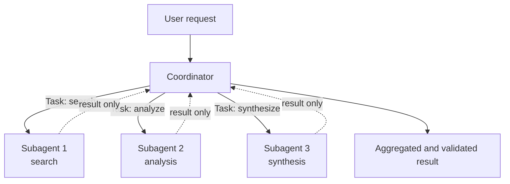
```mermaid
flowchart TD
    U[User request] --> C[Coordinator]
    C -->|Task: search| S1[Subagent 1<br/>search]
    C -->|Task: analyze| S2[Subagent 2<br/>analysis]
    C -->|Task: synthesize| S3[Subagent 3<br/>synthesis]
    S1 -. result only .-> C
    S2 -. result only .-> C
    S3 -. result only .-> C
    C --> R[Aggregated and validated result]
```

**The coordinator is responsible for:**
- Decomposing the task into subtasks
- Deciding which subagents are needed (dynamic selection)
- Delegating work to subagents
- Aggregating and validating results
- Handling errors and retries
- Communicating results to the user

**Critical principle: subagents have isolated context.**
- Subagents do **not** automatically inherit the coordinator's conversation history
- All required context must be **explicitly passed** in the subagent prompt
- Subagents do not share memory across calls
- All communication flows through the coordinator (for observability and error control)

## 3.4 The `Task` Tool for Spawning Subagents

Subagents are spawned via the `Task` tool:

```python
# The coordinator's allowedTools must include "Task"
coordinator_agent = AgentDefinition(
    allowed_tools=["Task", "get_customer"]
)
```

**Explicit context passing is mandatory:**

```
# Bad: the subagent has no context
Task: "Analyze the document"

# Good: full context in the prompt
Task: "Analyze the following document.
Document: [full document text]
Prior search results: [web search results]
Output format requirements: [schema]"
```

**Parallel spawning:** a coordinator can call multiple `Task`s in one response—subagents run in parallel:

```
# One coordinator response contains:
Task 1: "Search for articles about X"
Task 2: "Analyze document Y"
Task 3: "Search for articles about Z"
# All three run concurrently
```

## 3.5 Hooks in the Agent SDK

Hooks allow interception and transformation at specific points in the agent lifecycle.

**PostToolUse** intercepts a tool result before it is provided to the model:

```python
# Example: normalize date formats from different MCP tools
@hook("PostToolUse")
def normalize_dates(tool_result):
    # Convert Unix timestamp -> ISO 8601
    # Convert "Mar 5, 2025" -> "2025-03-05"
    return normalized_result
```

**Outgoing-call interception hook** blocks actions that violate policy:

```python
# Example: block refunds above $500
@hook("PreToolUse")
def enforce_refund_limit(tool_call):
    if tool_call.name == "process_refund" and tool_call.args.amount > 500:
        return redirect_to_escalation(tool_call)
```

**Key difference: hooks vs prompt instructions**

| Attribute | Hooks | Prompt instructions |
|---|---|---|
| Guarantee | **Deterministic** (100%) | **Probabilistic** (>90%, not 100%) |
| When to use | Critical business rules, financial operations, compliance | General preferences, recommendations, formatting |
| Example | Block refunds > $500 | “Try to solve before escalating” |

**Rule:** when failure has financial, legal, or safety consequences—use hooks, not prompts.

## 3.6 End-to-End Case Study: A Customer-Support Refund Agent

The pieces above only matter when they fit together. Here is a complete, realistic agent that ties the chapter into one system — the kind of design the exam's **Customer Support Agent** scenario asks you to reason about.

### Requirements

- Handle customer refund/return requests in natural language.
- Look up the customer and their order (read-only tools).
- Check the refund against company policy.
- **Hard rule:** any refund **over $500 must be approved by a human** — no exceptions, no model discretion.
- Order data arrives from several tools with inconsistent date formats; normalize them before the model reasons about them.

### Architecture

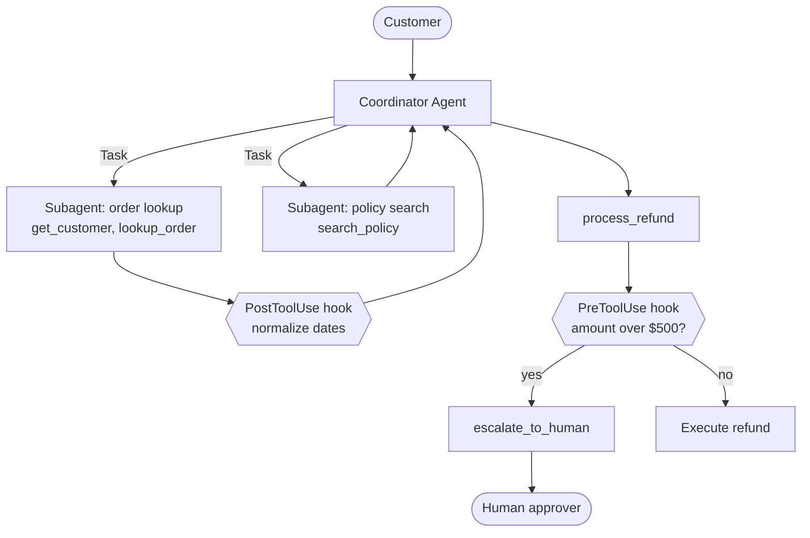
```mermaid
flowchart TD
    User([Customer]) --> Coord[Coordinator Agent]
    Coord -->|Task| Lookup[Subagent: order lookup<br/>get_customer, lookup_order]
    Coord -->|Task| Policy[Subagent: policy search<br/>search_policy]
    Lookup --> Post{{PostToolUse hook<br/>normalize dates}}
    Post --> Coord
    Policy --> Coord
    Coord --> Refund[process_refund]
    Refund --> Pre{{PreToolUse hook<br/>amount over $500?}}
    Pre -->|yes| Esc[escalate_to_human]
    Pre -->|no| Exec[Execute refund]
    Esc --> Human([Human approver])
```

The coordinator owns orchestration; subagents do narrow, least-privilege work; **hooks — not prompt text — enforce the money rule and the date normalization**, because both must be deterministic.

### Implementation

Define the coordinator and a least-privilege subagent:

```python
coordinator = AgentDefinition(
    name="support_coordinator",
    description="Resolves refund and return requests; escalates when required.",
    system_prompt=(
        "You help customers with refunds. Look up the order, check policy, "
        "then call process_refund. Never promise an outcome you have not executed."
    ),
    allowed_tools=["Task", "process_refund", "escalate_to_human"],
)

order_lookup = AgentDefinition(
    name="order_lookup",
    description="Reads customer and order records. Read-only.",
    system_prompt="Return the customer's order details as structured data.",
    allowed_tools=["get_customer", "lookup_order"],   # least privilege: no refund power
)
```

Enforce the $500 rule deterministically with a `PreToolUse` hook — this is the line the exam wants you to get right:

```python
@hook("PreToolUse")
def enforce_refund_limit(tool_call):
    if tool_call.name == "process_refund" and tool_call.args["amount"] > 500:
        # The model cannot bypass this; it is code, not a suggestion.
        return redirect(to="escalate_to_human", reason="refund_over_limit")
    return allow(tool_call)
```

Normalize dates from every tool with a `PostToolUse` hook, so the model never sees three date formats:

```python
@hook("PostToolUse")
def normalize_dates(tool_result):
    tool_result["order_date"] = to_iso8601(tool_result.get("order_date"))
    return tool_result
```

### Execution trace

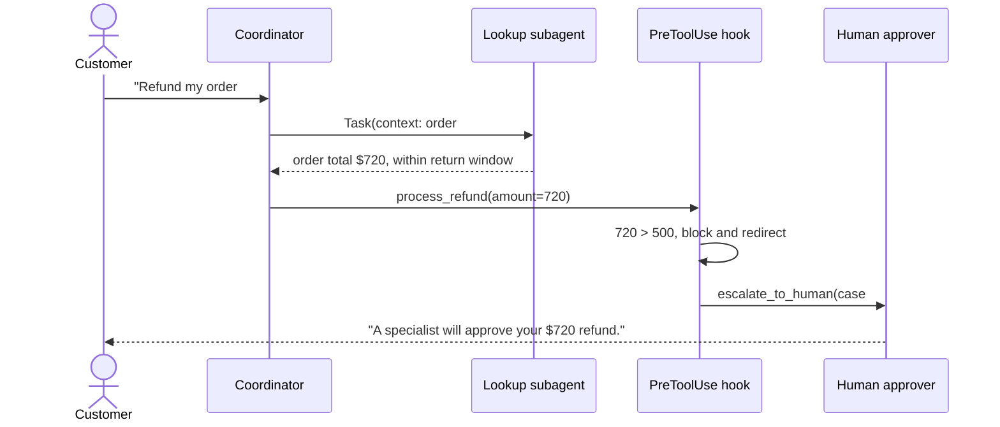
```mermaid
sequenceDiagram
    actor Cust as Customer
    participant Co as Coordinator
    participant L as Lookup subagent
    participant Pre as PreToolUse hook
    participant Hu as Human approver
    Cust->>Co: "Refund my order #1234"
    Co->>L: Task(context: order #1234 + customer id)
    L-->>Co: order total $720, within return window
    Co->>Pre: process_refund(amount=720)
    Pre->>Pre: 720 > 500, block and redirect
    Pre->>Hu: escalate_to_human(case #1234)
    Hu-->>Cust: "A specialist will approve your $720 refund."
```

Notice the coordinator *intended* to refund directly; the **hook overrode it deterministically**. With only a prompt instruction ("escalate refunds over $500"), the model would comply ~90% of the time — not good enough for money.

### Validation

- **Determinism test:** fire 100 refunds of $501 and assert 100 escalations. A prompt-only design will leak; the hook design must be 100%.
- **Context-isolation test:** confirm the lookup subagent receives the order id *in its Task prompt* — remove it and the subagent should fail, proving context isn't shared automatically.
- **Least-privilege test:** assert the `order_lookup` subagent cannot call `process_refund`.

### Common pitfalls

- Putting the $500 rule in the system prompt instead of a hook (probabilistic, not guaranteed).
- Forgetting to pass the order id into the subagent's prompt (isolated context — see §3.3).
- Treating assistant text like "Refund processed" as the completion signal instead of `stop_reason == "end_turn"` (§3.1).

## 3.7 Exam Focus — Key Takeaways

| Concept | What the exam tests |
|---|---|
| Agentic loop | The only reliable stop signal is `stop_reason == "end_turn"` — never parsed text or an iteration cap (§3.1). |
| Hub-and-spoke | Coordinator decomposes, delegates, and aggregates; subagents are isolated (§3.3). |
| Explicit context | Subagents inherit nothing — all context must be passed in the `Task` prompt (§3.4). |
| Hooks vs prompts | Deterministic business/financial/compliance rules → hooks; soft preferences → prompts (§3.5). |
| Least privilege | Each agent's `allowed_tools` is the minimum it needs (§3.2). |

> **Maps to Domain 1 (27%).** If you can build and defend the refund agent above — loop, delegation, context, hooks, least privilege — you have the core of the most heavily weighted exam domain.

# Chapter 4: Model Context Protocol (MCP)

> Documentation: [MCP](https://modelcontextprotocol.io/) | [Tools](https://modelcontextprotocol.io/docs/concepts/tools) | [Resources](https://modelcontextprotocol.io/docs/concepts/resources) | [Servers](https://modelcontextprotocol.io/docs/concepts/servers)

If Chapter 3 was about the *brain* of an agent — the loop, delegation, and hooks — this chapter is about its *hands and eyes*: how an agent reaches the outside world. The Model Context Protocol (MCP) is the open standard that lets Claude talk to your databases, APIs, and internal services without bespoke glue code for each one. This chapter is the backbone of **Domain 2 — Tool Design and MCP Integration (18% of the exam)**, and it directly supports **Domain 1** (an agent is only as capable as the tools you wire into it) and **Domain 5** (structured MCP errors are how multi-agent systems stay reliable).

By the end you should be able to reason about five things and assemble them into a working integration:

- **The protocol and its primitives** (§4.1) — Tools, Resources, Prompts, and the client/server split.
- **Servers and transports** (§4.2) — what a server is, and stdio vs Streamable HTTP.
- **Configuration and scope** (§4.3) — `.mcp.json` (project) vs `~/.claude.json` (user), and secret handling.
- **Structured errors** (§4.4) — the `isError` flag and why generic errors break recovery.
- **Resources** (§4.5) — read-only "maps" that eliminate exploratory tool calls.

§4.6 then builds a complete internal **Deployments MCP server** end-to-end — server, tools, resources, transport, and a permission guard — and §4.7 distills what the exam tests.

## 4.1 What is MCP

The Model Context Protocol (MCP) is an open standard for connecting external systems to Claude. The official analogy is **"USB-C for AI"**: instead of writing a custom adapter for every model–tool pairing, you implement the protocol once and any MCP-compatible client (Claude Code, the Agent SDK, the Claude apps) can use your server. Under the hood MCP is **JSON-RPC 2.0** over a transport — a small, well-specified message format, not a Claude-only API.

MCP defines three primary primitives:

1. **Tools** — functions the agent can *call to perform actions* (CRUD operations, API calls, command execution). Model-invoked: Claude decides when to use them.
2. **Resources** — data the agent can *read for context* (documentation, database schemas, content catalogs). Read-only: they inform, they don't act.
3. **Prompts** — predefined prompt templates for common tasks, surfaced to the user (e.g., as slash commands).

**The mental model is client/server.** The *host* application (Claude Code, the SDK) runs an MCP *client*; each integration is an MCP *server* — a separate process you control. The two communicate over a transport (§4.2).

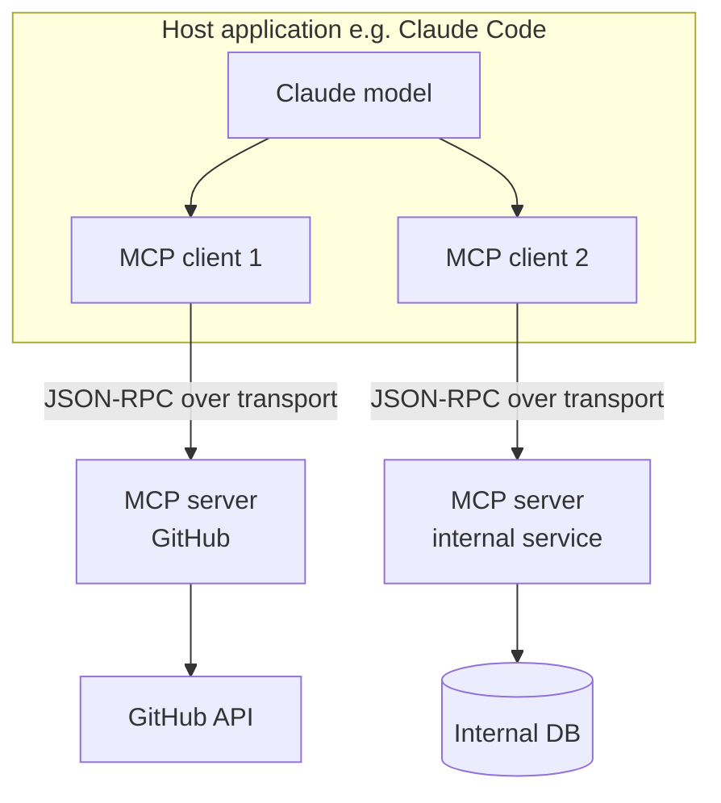
```mermaid
flowchart TD
    subgraph Host[Host application e.g. Claude Code]
        Model[Claude model]
        C1[MCP client 1]
        C2[MCP client 2]
    end
    Model --> C1
    Model --> C2
    C1 -->|JSON-RPC over transport| S1[MCP server<br/>GitHub]
    C2 -->|JSON-RPC over transport| S2[MCP server<br/>internal service]
    S1 --> EXT1[GitHub API]
    S2 --> DB[(Internal DB)]
```

**Why this separation matters (and what the exam probes):** because each server is its own process behind a standard protocol, you get isolation (a crashing server doesn't take down the host), independent auth per server, and reuse across hosts. The exam frames MCP as the *integration layer* — the way you give an agent new capabilities without modifying the agent itself.

**Tools vs Resources is a recurring distinction.** A common mistake is exposing read-only data as a tool. If the agent only needs to *know* something (the list of services, a schema), that is a **Resource**. If it needs to *do* something with side effects (trigger a deploy, write a row), that is a **Tool**. Getting this wrong inflates the tool count — which, per Domain 2, directly hurts tool-selection reliability.

## 4.2 MCP Servers and Transports

An **MCP server** is a process that implements the MCP protocol and exposes tools, resources, and/or prompts. When a client connects to a server:

- All tools are **discovered automatically** at connection time (the client calls `tools/list`).
- Tools from **all connected servers are available at once** to the model.
- **Tool descriptions determine how the model will use them** — the description is the primary selection signal (Domain 2.1). A vague description means unreliable selection.

To avoid name collisions across servers, hosts namespace tools. In Claude Code a tool from a server appears as `mcp__<server>__<tool>` — e.g., the `query_status` tool on a server named `deployments` is `mcp__deployments__query_status`. You reference that exact name when allow-listing tools or forcing `tool_choice`.

### stdio vs Streamable HTTP

MCP defines **two standard transports**, and choosing between them is an architecture decision the exam expects you to make:

| | **stdio** | **Streamable HTTP** |
|---|---|---|
| Topology | Local subprocess (host launches it) | Remote service (POST request + SSE stream) |
| Best for | Local tools, dev, single-user, filesystem/CLI access | Shared team servers, hosted SaaS integrations |
| Auth | Environment-based credentials (env vars) | OAuth 2.0 |
| Lifecycle | Host spawns/kills the process | Long-running service you deploy and operate |

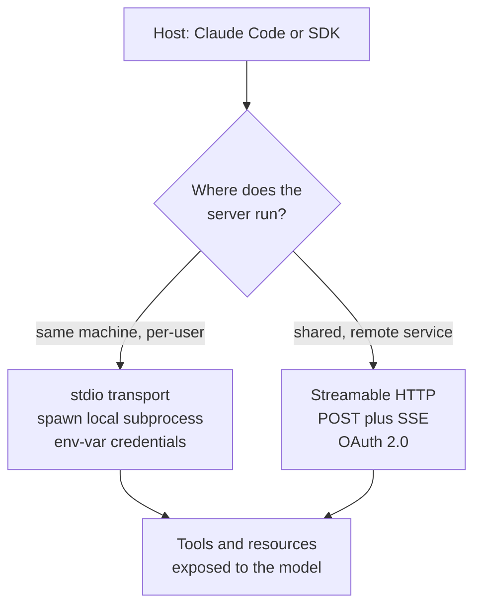
```mermaid
flowchart TD
    H[Host: Claude Code or SDK] --> D{Where does the<br/>server run?}
    D -->|same machine, per-user| STDIO[stdio transport<br/>spawn local subprocess<br/>env-var credentials]
    D -->|shared, remote service| HTTP[Streamable HTTP<br/>POST plus SSE<br/>OAuth 2.0]
    STDIO --> R[Tools and resources<br/>exposed to the model]
    HTTP --> R
```

**Pitfalls and exam angles:**

- **The old SSE-only transport is deprecated.** If a question offers "SSE transport" as the modern remote option, the current answer is **Streamable HTTP** (POST + SSE). Don't pick legacy SSE.
- **Match the transport to the auth model.** A shared team server holding privileged credentials should be **Streamable HTTP with OAuth**, not a stdio server where each user pastes a token. Conversely, a personal local filesystem tool is **stdio with env vars** — standing up an OAuth service for it is over-engineering.
- **A server is not "Claude code."** It's a generic process. The same `deployments` server can serve Claude Code, the Agent SDK, and the Claude desktop app simultaneously — that reuse is the point of the standard.

For *remote* servers there is also the **MCP connector** in the Messages API: Claude can call a remote MCP server directly, server-side, with no local client — you pass an `mcp_servers` entry plus a matching `mcp_toolset` in `tools`. That is the API-level counterpart to a Claude Code HTTP server; the transport story (HTTP + OAuth) is the same.

## 4.3 Configuring MCP Servers

Where you register a server determines **who can use it** — this scope decision is squarely tested in Domain 2.4.

**Project configuration (`.mcp.json`)** — for team usage:

```json
{
  "mcpServers": {
    "github": {
      "command": "npx",
      "args": ["-y", "@modelcontextprotocol/server-github"],
      "env": {
        "GITHUB_TOKEN": "${GITHUB_TOKEN}"
      }
    },
    "jira": {
      "command": "npx",
      "args": ["-y", "mcp-server-jira"],
      "env": {
        "JIRA_TOKEN": "${JIRA_TOKEN}"
      }
    }
  }
}
```

**Key points:**
- `.mcp.json` is stored at the **project root and managed in version control**, so every contributor gets the same servers on checkout.
- **Environment variables (`${GITHUB_TOKEN}`) are used for secrets** — the variable *reference* is committed, the token itself is not. This is the central secret-management pattern: never hard-code a token into `.mcp.json`.
- Available to all project contributors.

**User configuration (`~/.claude.json`)** — for personal/experimental servers:
- Stored in the user's home directory.
- **Not shared via version control.**
- Suitable for personal experiments and testing.

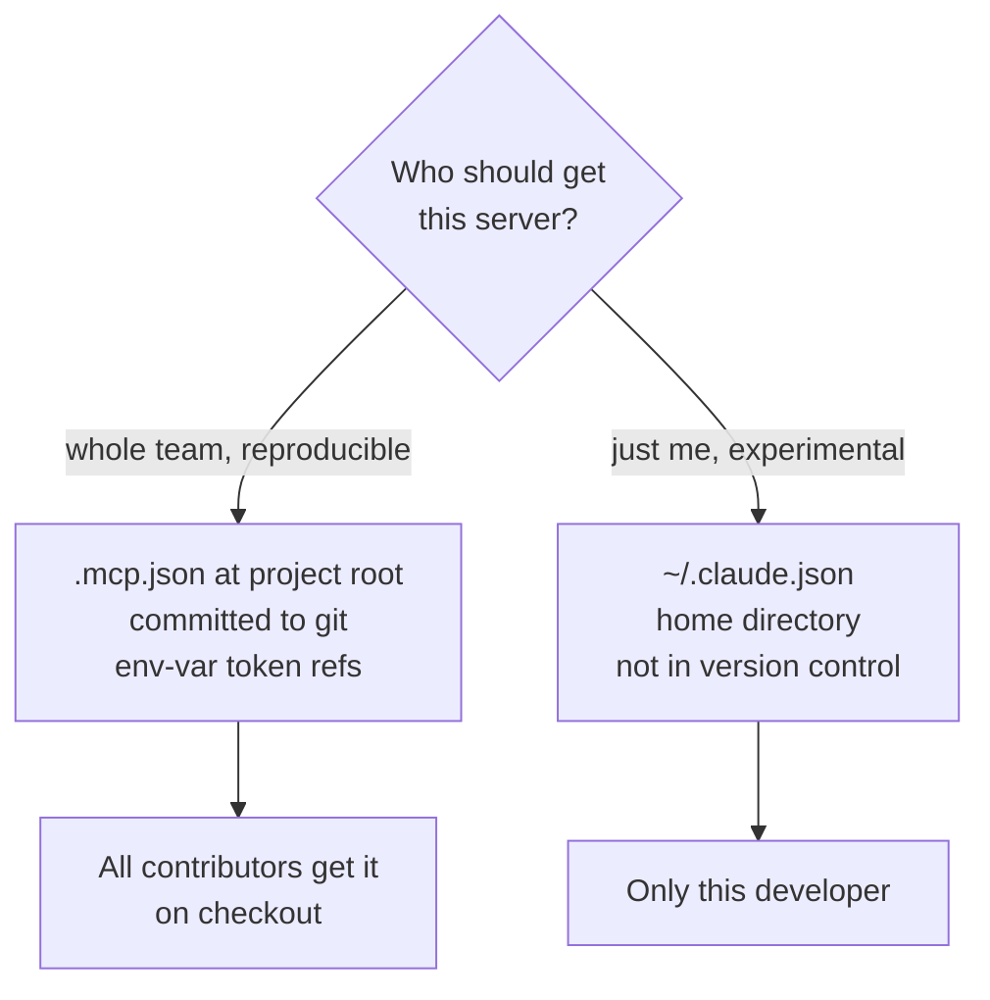
```mermaid
flowchart TD
    Q{Who should get<br/>this server?}
    Q -->|whole team, reproducible| PROJ[.mcp.json at project root<br/>committed to git<br/>env-var token refs]
    Q -->|just me, experimental| USER[~/.claude.json<br/>home directory<br/>not in version control]
    PROJ --> TEAM[All contributors get it<br/>on checkout]
    USER --> SOLO[Only this developer]
```

**Adding servers from the CLI.** In Claude Code you don't have to hand-edit JSON: `claude mcp add` / `claude mcp list` / `claude mcp remove` manage servers, and `--scope user` vs `--scope project` selects which file is written. For HTTP servers needing OAuth, run `/mcp` in-session to authorize. This is the exam-correct answer to "how does each developer get the same server without each editing config by hand": put it in **project `.mcp.json`**, committed once.

**Choosing servers:**
- For **standard integrations (Jira, GitHub, Slack), prefer existing community MCP servers** — they're maintained and battle-tested.
- **Build your own server only for unique, team-specific workflows** that no community server covers (this is exactly the §4.6 case study).

**Context cost — MCP tool search.** Every connected server's tools are loaded into context, and a dozen servers can flood the model with hundreds of tools — bloating context and *degrading* selection (Domain 2.3: too many tools reduces reliability). Claude Code's **MCP tool search** mitigates this by lazily loading tools on demand instead of front-loading all of them, and organizations can ship an org-wide `managed-mcp.json`. The takeaway: connecting a server is not free; tool count is a budget.

## 4.4 The `isError` Flag in MCP

When an MCP tool encounters an error, it sets **`isError: true`** in the response. This signals to the agent that the call failed — but *signaling failure is not enough*. The agent's next move (retry? change the query? escalate? give up?) depends entirely on **what kind** of failure it was. This is the heart of Domain 2.2 and a reliability concern for Domain 5.

**Structured error (good):**

```json
{
  "isError": true,
  "content": {
    "errorCategory": "transient",
    "isRetryable": true,
    "message": "The service is temporarily unavailable. Timeout while calling the orders API.",
    "attempted_query": "order_id=12345",
    "partial_results": null
  }
}
```

**Generic error (anti-pattern):**

```json
{
  "isError": true,
  "content": "Operation failed"
}
```

A generic error gives the agent no information for decision-making — should it retry, change the query, or escalate? The structured version tells it precisely.

**Error categories the exam expects you to distinguish:**

| Category | Meaning | Retryable? | Right agent response |
|---|---|---|---|
| `transient` | Timeout, service briefly down | **Yes** | Retry (ideally with backoff) |
| `validation` | Bad input (malformed id, missing field) | No | Fix the arguments, then retry |
| `business` | Policy/rule violation (e.g., over a limit) | **No** | Stop and explain to the user; do not retry the same call |
| `permission` | Caller lacks access | No | Escalate / request access — distinct from "no results" |

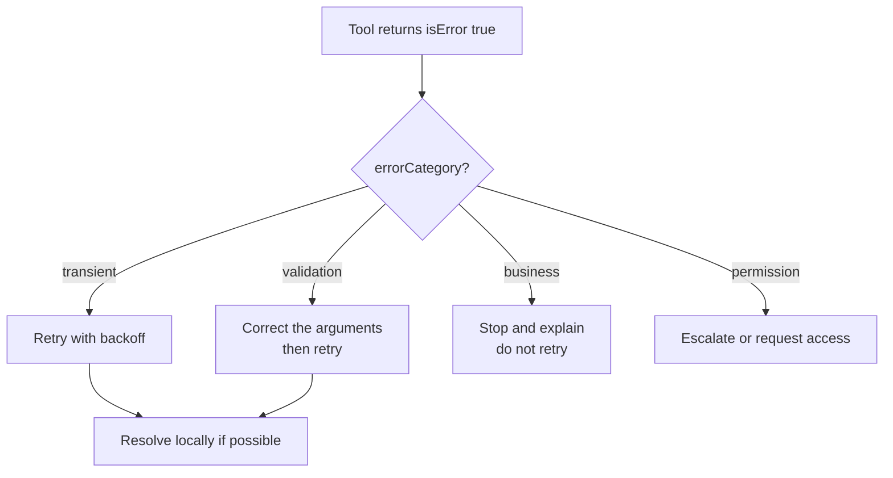
```mermaid
flowchart TD
    E[Tool returns isError true] --> CAT{errorCategory?}
    CAT -->|transient| RETRY[Retry with backoff]
    CAT -->|validation| FIX[Correct the arguments<br/>then retry]
    CAT -->|business| STOP[Stop and explain<br/>do not retry]
    CAT -->|permission| ESC[Escalate or request access]
    RETRY --> OK[Resolve locally if possible]
    FIX --> OK
```

**Pitfalls and exam angles:**

- **Use `isRetryable: false` for business-rule violations** with a clear, user-facing explanation. Marking a policy failure retryable sends the agent into a pointless retry loop.
- **An empty result is not an error.** A search that legitimately found nothing should return `isError: false` with an empty result set — *not* `isError: true`. Conflating "no matches" with "access failed" makes the agent escalate when it should simply report "none found" (Domain 2.2).
- **Recover locally, propagate selectively.** A subagent should resolve transient failures itself (retry) and only propagate errors it genuinely can't resolve up to the coordinator — this keeps error noise out of the hub-and-spoke system (Domain 5.3).

## 4.5 MCP Resources

**Resources** are data an agent can request to gain context **without taking action**. Where a tool *does*, a resource *informs*:

- Content catalogs (e.g., a list of all project tasks, hierarchical navigation).
- Database schemas (understanding data structure before querying).
- Documentation (API references, internal guides).
- Issue/task summaries.

**Resource advantage:** the agent does **not** need exploratory tool calls to discover what data exists. A resource provides an immediate **"map."** Without it, an agent might burn three or four tool calls (and the tokens and latency they cost) just to learn the shape of the system before doing any real work.

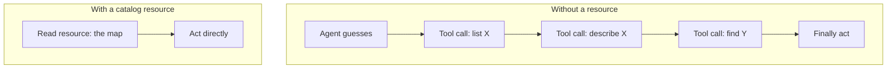
```mermaid
flowchart TD
    subgraph Without[Without a resource]
        A1[Agent guesses] --> A2[Tool call: list X]
        A2 --> A3[Tool call: describe X]
        A3 --> A4[Tool call: find Y]
        A4 --> A5[Finally act]
    end
    subgraph With[With a catalog resource]
        B1[Read resource: the map] --> B2[Act directly]
    end
```

**Pitfalls and exam angles:**

- **Don't model read-only context as a tool.** If the agent only needs to *read* the service catalog, expose it as a **Resource**, not a `list_services` tool. This keeps the tool count down (helping selection) and signals intent correctly.
- **Resources cut exploratory tool calls**, which is the phrasing the exam uses — they trade many round-trips for one up-front read. That is both a context-management win (Domain 5) and a tool-design win (Domain 2).
- Resources are **read-only by definition** — they never have side effects. If you find yourself wanting a resource to "also update" something, you actually want a tool.

## 4.6 End-to-End Case Study: An Internal "Deployments" MCP Server

The pieces above only matter when they fit together. Here is a complete, realistic MCP server — the kind of *unique, team-specific* integration §4.3 says you should build yourself, and exactly the design the exam's MCP-integration scenarios probe.

### Requirements

A platform team wants Claude Code to help during incident response. The agent must be able to:

- **See the service catalog** — every service, its owner, and its current version — without exploratory calls.
- **Query a service's deployment status** (read-only).
- **Trigger a rollback** of a service to its previous version (an *action* with real consequences).
- **Hard rule:** a rollback of a **production** service must be **denied at the protocol level** unless the caller holds an explicit `prod-rollback` grant — never left to model discretion.
- Return **structured errors** so the agent recovers correctly (retry a flaky status check, but never retry a denied prod rollback).
- Run locally over **stdio** for an on-call engineer, and the same server runs as a shared **Streamable HTTP** service (OAuth) for the team.

### Architecture

```mermaid
flowchart TD
    User([On-call engineer]) --> CC[Claude Code host]
    CC -->|JSON-RPC over stdio or HTTP| Srv[Deployments MCP server]
    Srv --> Res[[Resource: service-catalog<br/>read-only map]]
    Srv --> T1[Tool: query_status<br/>read-only]
    Srv --> T2[Tool: trigger_rollback<br/>action]
    T2 --> Guard{prod and no grant?}
    Guard -->|yes| Deny[Return isError<br/>permission, not retryable]
    Guard -->|no| Exec[Execute rollback]
    T1 --> DEP[(Deployment system)]
    Exec --> DEP
```

The **catalog is a Resource** (read-only context, no exploratory calls); **status and rollback are Tools** (status reads, rollback acts); the **production guard lives in the server**, not in a prompt — so it holds regardless of which host or model connects.

### Implementation

A minimal server using the Python MCP SDK. The catalog is a resource; status and rollback are tools; the prod guard returns a **structured permission error**.

```python
from mcp.server import Server
from mcp.types import Tool, Resource, TextContent
import mcp.server.stdio

app = Server("deployments")

# --- Resource: the service catalog (read-only "map") ---
@app.list_resources()
async def list_resources() -> list[Resource]:
    return [Resource(
        uri="catalog://services",
        name="Service catalog",
        description="All services, owners, and current versions.",
        mimeType="application/json",
    )]

@app.read_resource()
async def read_resource(uri: str) -> str:
    # Returns the catalog JSON: [{service, owner, env, version}, ...]
    return get_service_catalog_json()

# --- Tools ---
@app.list_tools()
async def list_tools() -> list[Tool]:
    return [
        Tool(name="query_status",
             description="Read the current deployment status of one service. Read-only.",
             inputSchema={"type": "object",
                          "properties": {"service": {"type": "string"}},
                          "required": ["service"]}),
        Tool(name="trigger_rollback",
             description="Roll a service back to its previous version. Mutating action.",
             inputSchema={"type": "object",
                          "properties": {"service": {"type": "string"}},
                          "required": ["service"]}),
    ]

@app.call_tool()
async def call_tool(name: str, args: dict) -> list[TextContent]:
    if name == "query_status":
        try:
            status = deployment_api.status(args["service"])
        except TimeoutError:
            return error("transient", retryable=True,
                         message="Deployment API timed out; safe to retry.")
        return ok(status)

    if name == "trigger_rollback":
        svc = catalog.get(args["service"])
        # The production guard — code, not a prompt. The model cannot bypass it.
        if svc.env == "production" and not caller_has_grant("prod-rollback"):
            return error("permission", retryable=False,
                         message="Production rollback denied: 'prod-rollback' grant required.")
        result = deployment_api.rollback(args["service"])
        return ok(result)
```

The structured-error helpers keep every failure machine-readable (§4.4):

```python
def error(category, retryable, message):
    payload = {"errorCategory": category, "isRetryable": retryable, "message": message}
    return [TextContent(type="text", text=json.dumps(payload))]  # isError set on the response
```

Run it over **stdio** locally:

```python
async def main():
    async with mcp.server.stdio.stdio_server() as (read, write):
        await app.run(read, write, app.create_initialization_options())
```

Register it as a **project** server so the whole team gets it on checkout (§4.3) — stdio for local use, with a shared HTTP+OAuth deployment for the team:

```json
{
  "mcpServers": {
    "deployments": {
      "command": "python",
      "args": ["-m", "deployments_server"],
      "env": { "DEPLOY_API_TOKEN": "${DEPLOY_API_TOKEN}" }
    }
  }
}
```

In Claude Code the tools now appear as `mcp__deployments__query_status` and `mcp__deployments__trigger_rollback`, and the catalog as a readable resource.

### Execution trace

An on-call engineer asks Claude Code to roll back a production service they're not authorized for:

```mermaid
sequenceDiagram
    actor Eng as On-call engineer
    participant CC as Claude Code
    participant S as Deployments server
    participant G as Prod guard
    Eng->>CC: "Roll back checkout-api, it's erroring"
    CC->>S: read resource catalog://services
    S-->>CC: checkout-api is env production
    CC->>S: call trigger_rollback(checkout-api)
    S->>G: production and no prod-rollback grant?
    G-->>S: deny
    S-->>CC: isError permission, not retryable
    CC-->>Eng: "Blocked: production rollback needs the prod-rollback grant. Escalating."
```

Notice Claude *intended* to roll back directly; the **server's guard denied it deterministically**, and because the error was categorized `permission` / not-retryable, the agent escalated instead of looping. A prompt instruction ("don't roll back prod without approval") would comply only ~90% of the time — not good enough for production.

### Validation

- **Permission test:** call `trigger_rollback` on a production service without the grant 100 times; assert 100 structured `permission` errors and zero rollbacks. The guard must be 100%, like the §3.5 money rule.
- **Error-category test:** simulate a `query_status` timeout and assert `transient` / `retryable: true`; simulate a denied prod rollback and assert `permission` / `retryable: false`. The agent should retry the first and never retry the second.
- **Resource-vs-tool test:** confirm the catalog is reachable via `read_resource` (no tool call) — proving the agent gets its "map" without exploratory calls (§4.5).
- **Empty-vs-error test:** querying a non-existent service should be a clean "not found" result, not `isError: true` (§4.4).

### Common pitfalls

- Putting the production-rollback rule in the system prompt instead of the **server guard** (probabilistic, not guaranteed — see §3.5 and §4.4).
- Exposing the catalog as a `list_services` **tool** instead of a **Resource**, inflating the tool count and forcing exploratory calls (§4.5).
- Returning `"Operation failed"` instead of a categorized error, so the agent can't tell a retryable timeout from a hard denial (§4.4).
- Hard-coding `DEPLOY_API_TOKEN` into `.mcp.json` instead of using a `${...}` env reference (§4.3).
- Choosing legacy **SSE** for the shared remote deployment instead of **Streamable HTTP** (§4.2).

## 4.7 Exam Focus — Key Takeaways

| Concept | What the exam tests |
|---|---|
| Primitives | Tools *act*, Resources *inform* (read-only), Prompts are templates; MCP is an open JSON-RPC standard, "USB-C for AI" (§4.1). |
| Client/server | The host runs a client; each integration is a separate server process — isolation and reuse across hosts (§4.1). |
| Transports | **stdio** (local subprocess, env-var auth) vs **Streamable HTTP** (remote, OAuth); legacy SSE-only is deprecated (§4.2). |
| Scope & secrets | `.mcp.json` (project, committed, team) vs `~/.claude.json` (user); `${VAR}` for tokens — never commit the secret (§4.3). |
| Tool count | All connected servers' tools load at once; too many degrades selection — MCP tool search loads lazily (§4.2–4.3). |
| Structured errors | `isError` + `errorCategory`/`isRetryable`; transient→retry, business/permission→stop; empty ≠ error (§4.4). |
| Resources | Read-only "maps" that eliminate exploratory tool calls; don't model read-only context as a tool (§4.5). |

> **Maps to Domain 2 (18%)**, with direct support for Domain 1 (tools are an agent's capabilities) and Domain 5 (structured errors keep multi-agent systems reliable). If you can build and defend the Deployments server above — primitives, transport, scope, the server-side guard, and categorized errors — you have the core of the MCP-integration domain.

# Chapter 5: Claude Code — Configuration and Workflows

> Documentation: [Claude Code](https://code.claude.com/docs/en/overview) | [Memory / CLAUDE.md](https://code.claude.com/docs/en/memory) | [Skills](https://code.claude.com/docs/en/skills) | [MCP](https://code.claude.com/docs/en/mcp) | [Hooks](https://code.claude.com/docs/en/hooks) | [Sub-agents](https://code.claude.com/docs/en/sub-agents) | [GitHub Actions](https://code.claude.com/docs/en/github-actions) | [Headless](https://code.claude.com/docs/en/headless)

## 5.1 The CLAUDE.md Hierarchy

CLAUDE.md is the instruction file(s) for Claude Code. There is a three-level hierarchy:

```
1. User-level: ~/.claude/CLAUDE.md
   - Applies only to that user
   - NOT shared via VCS
   - Personal preferences and working style

2. Project-level: .claude/CLAUDE.md or a root CLAUDE.md
   - Applies to all project contributors
   - Managed via VCS
   - Coding standards, testing standards, architectural decisions

3. Directory-level: CLAUDE.md in subdirectories
   - Applies when working with files in that directory
   - Conventions specific to that part of the codebase
```

**Common mistake:** a new team member does not receive project instructions because they were placed in `~/.claude/CLAUDE.md` (user-level) instead of `.claude/CLAUDE.md` (project-level).

## 5.2 `@path` Syntax (File Imports)

CLAUDE.md can reference external files using `@path`, making configuration modular:

```markdown
# Project CLAUDE.md

Coding standards are described in @./standards/coding-style.md
Test requirements are in @./standards/testing-requirements.md
Project overview is in @README.md and dependencies are in @package.json
```

**Rules for `@path`:**
- Use `@` immediately before the file path (no space)
- Relative and absolute paths are supported
- Relative paths are resolved relative to the file that contains the import
- Maximum import nesting depth is 5

This avoids duplication and lets each package include only relevant standards.

## 5.3 The `.claude/rules/` Directory

`.claude/rules/` is an alternative to a monolithic CLAUDE.md, used to organize rules by topic:

```
.claude/rules/
  testing.md          -- testing conventions
  api-conventions.md  -- API conventions
  deployment.md       -- deployment rules
  react-patterns.md   -- React patterns
```

**Key feature: YAML frontmatter with `paths` for conditional loading:**

```yaml
---
paths: ["src/api/**/*"]
---

For API files, use async/await with explicit error handling.
Each endpoint must return a standard response wrapper.
```

```yaml
---
paths: ["**/*.test.tsx", "**/*.test.ts"]
---

Tests must use describe/it blocks.
Use data factories instead of hardcoding.
Do not mock the database—use a test database.
```

**How it works:**
- A rule is loaded **only** when Claude Code edits a file matching the `paths` pattern
- This saves context and tokens—irrelevant rules are not loaded
- Glob patterns let you apply conventions by file type regardless of location (ideal for tests scattered across the codebase)

**When to use `.claude/rules/` with `paths` vs directory-level CLAUDE.md:**
- `.claude/rules/` with `paths` — when conventions apply to files spread across many directories (tests, migrations)
- Directory-level CLAUDE.md — when conventions are tied to a specific directory and are not needed elsewhere

## 5.4 Custom Slash Commands and Skills

> **Note:** in the current Claude Code version, custom commands (`.claude/commands/`) are unified with skills (`.claude/skills/`). Both formats create `/name` commands. The exam guide references `.claude/commands/`—that format is still supported.

Slash commands are reusable prompt templates invoked via `/name`:

**`.claude/commands/` format (legacy, supported):**

```
.claude/commands/
  review.md        -- /review -- standard code review
  test-gen.md      -- /test-gen -- test generation
```

**`.claude/skills/` format (current):**

```
.claude/skills/
  review/SKILL.md  -- /review -- with frontmatter configuration
  test-gen/SKILL.md
```

**Project commands** (`.claude/commands/` or `.claude/skills/`):
- Stored in VCS and available to everyone when cloning the repo
- Ensure consistent workflows across the team

**User commands** (`~/.claude/commands/` or `~/.claude/skills/`):
- Personal commands not shared via VCS
- For individual workflows

## 5.5 Skills — `.claude/skills/`

Skills are advanced commands configured via SKILL.md frontmatter:

```yaml
---
context: fork
allowed-tools: ["Read", "Grep", "Glob"]
argument-hint: "Path to the directory to analyze"
---

Analyze the code structure in the specified directory.
Output a report on dependencies and architectural patterns.
```

**Frontmatter parameters:**

| Parameter | Description |
|---|---|
| `context: fork` | Runs the skill in an isolated subagent. Verbose output does not pollute the main session |
| `allowed-tools` | Restricts which tools are available (security—e.g., the skill cannot delete files if not allowed) |
| `argument-hint` | Hint that asks for an argument when invoked without parameters |

**When to use a skill vs CLAUDE.md:**
- **Skill** — on-demand invocation for a specific task (review, analysis, generation)
- **CLAUDE.md** — always-loaded general standards and conventions

**Personal skills (`~/.claude/skills/`):**
- Create personal variants under different names so you don't affect teammates

## 5.6 Planning Mode vs Direct Execution

**Planning mode:**
- The model only investigates and plans; it does not make changes
- Uses Read, Grep, Glob to explore the codebase
- Produces an implementation plan that the user approves
- Safe exploration with no side effects

**When to use planning mode:**
- Large changes (dozens of files)
- Multiple plausible approaches (microservices: how to define boundaries?)
- Architectural decisions (which framework? what structure?)
- Unfamiliar codebase (you must understand before changing)
- Library migrations affecting 45+ files

**When to use direct execution:**
- Single-file fixes with a clear stack trace
- Adding one validation check
- Well-understood, unambiguous changes

**Combined approach:**
1. Planning mode for investigation and design
2. User approves the plan
3. Direct execution to implement the approved plan

**Explore subagent** — a specialized subagent for exploring the codebase:
- Isolates verbose output from the main context
- Returns only a summary
- Prevents context-window exhaustion in multi-phase tasks

## 5.7 The `/compact` Command

`/compact` is a built-in command for compressing context:
- Summarizes prior history to free up the context window
- Used in long investigation sessions when the context fills up with verbose tool output
- Risk: exact numeric values, dates, and specific details can be lost during summarization

## 5.8 The `/memory` Command

`/memory` is a built-in command for managing memory between sessions:
- Opens the `CLAUDE.md` file for editing, allowing you to save notes, preferences, and context
- Information persists across sessions and is automatically loaded on startup
- Useful for storing project conventions, user preferences, frequently used commands, and current work context
- Alternative to re-explaining the same instructions in every session

## 5.9 Claude Code CLI for CI/CD

**The `-p` (or `--print`) flag:**

```bash
claude -p "Analyze this pull request for security issues"
```

- Non-interactive mode: processes the prompt, prints to stdout, exits
- Does not wait for user input
- The only correct way to run Claude in CI/CD pipelines

**Structured output for CI:**

```bash
claude -p "Review this PR" --output-format json --json-schema '{"type":"object",...}'
```

- `--output-format json` — output in JSON
- `--json-schema` — validate output against a schema
- The result can be parsed to automatically post inline PR comments

**Session context isolation:**
The same Claude session that generated code is often less effective at reviewing it (the model retains its reasoning context and is less likely to challenge its own decisions). Use an independent instance for review.

**Preventing duplicate comments:**
When re-reviewing after new commits, include prior review results in context and instruct Claude to report only new or unresolved issues.

## 5.10 `fork_session` and Session Management

**`--resume <session-name>`** resumes a named session:

```bash
claude --resume investigation-auth-bug
```

- Continues a prior conversation with saved context
- Useful for long investigations across multiple sessions
- Risk: if files changed since the prior session, tool results may be stale

**`fork_session`** creates an independent branch from shared context:

```
Codebase investigation
         |
    fork_session
    /           \
Approach A:      Approach B:
Redux            Context API
```

- Both forks inherit context up to the branch point
- Afterwards, they diverge independently
- Useful for comparing approaches or testing strategies

**When to start a new session instead of resuming:**
- Tool results are stale (files changed)
- A lot of time has passed and context has degraded
- It is better to restart with "Here is a short summary of what we found: ..." than to resume with old tool data

---

# Chapter 6: Prompt Engineering — Advanced Techniques

> Documentation: [Prompt Engineering](https://platform.claude.com/docs/en/build-with-claude/prompt-engineering/overview) | [Anthropic Cookbook](https://github.com/anthropics/anthropic-cookbook)

## 6.1 Few-shot Prompting

Few-shot prompting is the inclusion of 2–4 input/output examples in a prompt to demonstrate the expected behavior.

**Why few-shot is more effective than textual descriptions:**
- A vague instruction like “be more precise” can be interpreted in many ways
- An example unambiguously shows the expected format and decision logic
- The model generalizes the pattern to new cases (it does not just repeat the examples)

**Types of few-shot examples and when to use them:**

1. **Examples for ambiguous scenarios:**

```
Request: "My order is broken"
Action: Call get_customer -> lookup_order -> check status.
Rationale: “broken” may mean a damaged item; you need order details.

Request: "Get me a manager"
Action: Immediately call escalate_to_human.
Rationale: The customer explicitly requests a human. Do not attempt to solve autonomously.
```

2. **Examples for output formatting:**

```
Finding example:
{
  "location": "src/auth/login.ts:42",
  "issue": "SQL injection in the username parameter",
  "severity": "critical",
  "suggested_fix": "Use a parameterized query"
}
```

3. **Examples to separate acceptable vs problematic code:**

```
// Acceptable (do not flag):
const items = data.filter(x => x.active);

// Problem (flag):
const items = data.filter(x => x.active == true); // Use strict equality ===
```

4. **Examples for extraction from different document formats:**

```
Document with inline citations:
"As shown in the study (Smith, 2023), the rate is 42%."
-> {"value": "42%", "source": "Smith, 2023", "type": "inline_citation"}

Document with bibliography references:
"The rate is 42%. [1]"
-> {"value": "42%", "source": "reference_1", "type": "bibliography"}
```

5. **Examples for informal measurements:**

```
Text: "about two handfuls of rice"
-> {"amount": "~100g", "original_text": "two handfuls", "precision": "approximate"}

Text: "a pinch of salt"
-> {"amount": "~1g", "original_text": "a pinch", "precision": "approximate"}
```

Few-shot is especially effective for extracting informal and non-standard measurement units that are too diverse for purely rule-based instructions.

**Format normalization rules in prompts:**
When using strict JSON schemas for structured output, add normalization rules in the prompt:

```
Normalization:
- Dates: always ISO 8601 (YYYY-MM-DD); "yesterday" -> compute an absolute date
- Currency: numeric amount + currency code; "five bucks" -> {"amount": 5, "currency": "USD"}
- Percentages: decimal fraction; "half" -> 0.5
```

This prevents semantic errors where the JSON is syntactically valid but values are inconsistent.

## 6.2 Explicit Criteria vs Vague Instructions

**Bad (vague):**

```
Check code comments for accuracy.
Be conservative—report only high-confidence findings.
```

**Good (explicit criteria):**

```
Flag a comment as problematic ONLY if:
1. The comment describes behavior that CONTRADICTS the actual code behavior
2. The comment references a non-existent function or variable
3. A TODO/FIXME comment refers to a bug that has already been fixed in code

Do NOT flag:
- Comments that are merely stylistically outdated
- Comments with minor wording inaccuracies
- Missing comments (that is a separate category)
```

**Define severity criteria with examples:**

```
CRITICAL: Runtime failure for users
  Example: NullPointerException while processing a payment

HIGH: Security vulnerability
  Example: SQL injection, XSS, missing authorization checks

MEDIUM: Logic bug without immediate impact
  Example: Wrong sorting, off-by-one error

LOW: Code quality
  Example: Duplication, suboptimal algorithm for small data
```

## 6.3 Prompt Chaining

Prompt chaining breaks a complex task into a sequence of focused steps:

```
Step 1: Analyze auth.ts (local issues only)
       -> Output: list of issues in auth.ts

Step 2: Analyze database.ts (local issues only)
       -> Output: list of issues in database.ts

Step 3: Integration pass (cross-file dependencies)
       -> Output: issues at module boundaries
```

**Why this matters:**
- Avoids **attention dilution**—when the model receives too many files at once, it may miss bugs in some files while providing shallow commentary on others
- Ensures consistent analysis quality per file
- Allows separate analysis of cross-file interactions

**When to use prompt chaining vs dynamic decomposition:**
- **Prompt chaining** — predictable, repeatable tasks (code review, file migrations)
- **Dynamic decomposition** — open-ended investigations where subtasks become clear only during execution

## 6.4 The “Interview” Pattern

Before implementing a solution, Claude asks clarifying questions:

```
Claude: "Before implementing caching for the API, a few questions:
1. Which cache invalidation strategy do you prefer—TTL or event-based?
2. Is stale data acceptable when the cache is unavailable?
3. Should caching be per-user or global?
4. What is the expected data volume to cache?"
```

**When this is useful:**
- Unfamiliar domain (fintech, healthcare, legal systems)
- Tasks with non-obvious implications (cache strategies, failure modes)
- Multiple viable approaches where the best choice depends on context

## 6.5 Validation and Retry-with-Feedback

When extracted data fails validation:

```
Step 1: Extract data from the document
Step 2: Validate (Pydantic, JSON Schema, business rules)
Step 3: If there's an error—retry with context:
  - The original document
  - The previous (incorrect) extraction
  - The specific error: "Field 'total' = 150, but sum(line_items) = 145. Re-check values."
```

**When retry will be effective:**
- Format errors (date in the wrong format)
- Structural errors (a field placed in the wrong location)
- Arithmetic inconsistencies (the model can re-check)

**When retry will NOT help:**
- The information is absent from the source document
- The required context is external (the data is in another document not provided)

**Pydantic as a validation tool:**
Pydantic is a Python library for schema-based data validation. For the exam, the key points are:
- **Structural validation:** types, requiredness, enum constraints checked in code after receiving JSON from Claude
- **Semantic validation:** custom validators enforce business logic (sum of items equals total; start_date < end_date)
- **Validate–retry loops:** on Pydantic validation failure, construct an error message and re-prompt Claude with the error context
- **JSON Schema generation:** Pydantic models can generate JSON Schema for `tool_use`, providing a single source of truth

## 6.6 Self-correction

A pattern for detecting internal contradictions:

```json
{
  "stated_total": "$150.00",
  "calculated_total": "$145.00",
  "conflict_detected": true,
  "line_items": [
    {"name": "Widget A", "price": 75.00},
    {"name": "Widget B", "price": 70.00}
  ]
}
```

The model extracts both the stated value and a computed value—if they differ, `conflict_detected` allows you to handle the discrepancy.

---

# Chapter 7: Message Batches API

> Documentation: [Message Batches](https://platform.claude.com/docs/en/build-with-claude/message-batches)

## 7.1 Overview

The Message Batches API lets you submit batches of requests for asynchronous processing:

| Attribute | Value |
|---|---|
| Savings | **50%** compared to synchronous calls |
| Processing window | Up to **24 hours** (no latency SLA guarantee) |
| Multi-turn tool calling | **Not supported** (one request = one response) |
| Correlation | `custom_id` field to link request and response |

## 7.2 When to Use Batch API vs Synchronous API

| Task | API | Why |
|---|---|---|
| Pre-merge PR check | **Synchronous** | The developer is waiting; 24 hours is unacceptable |
| Overnight tech-debt report | **Batch** | Result is needed by morning; 50% savings |
| Weekly security audit | **Batch** | Not urgent; 50% savings |
| Interactive code review | **Synchronous** | Immediate response required |
| Processing 10,000 documents | **Batch** | Bulk processing; savings are significant |

## 7.3 Using `custom_id`

```json
{
  "custom_id": "doc-invoice-2024-001",
  "params": {
    "model": "claude-sonnet-4-6",
    "max_tokens": 1024,
    "messages": [{"role": "user", "content": "Extract data from: ..."}]
  }
}
```

`custom_id` allows you to:
- Link the result to the original document
- On failure, re-submit only the failed documents
- Avoid re-processing successful documents

## 7.4 Handling Failures in Batches

1. Submit a batch of 100 documents
2. 95 succeed; 5 fail (context limit exceeded)
3. Identify failures by `custom_id`
4. Modify strategy (e.g., split long documents into chunks)
5. Re-submit only the 5 failed documents

## 7.5 SLA Planning

If you need a result in 30 hours and the Batch API can take up to 24 hours:
- Submission window: 30 - 24 = **6 hours**
- Batches must be submitted no later than 24 hours before the deadline
- For frequent submissions, split into 4-hour windows

---

# Chapter 8: Task Decomposition Strategies

## 8.1 Fixed Pipelines (Prompt Chaining)

Each step is defined in advance:

```
Document -> Metadata extraction -> Data extraction -> Validation -> Enrichment -> Final output
```

**When to use:**
- The task structure is predictable (reviews always follow the same template)
- All steps are known up front
- You need stability and reproducibility

## 8.2 Dynamic Adaptive Decomposition

Subtasks are generated based on intermediate results:

```
1. "Add tests for a legacy codebase"
2. -> First: map the structure (Glob, Grep)
3. -> Found: 3 modules with no tests, 2 with partial coverage
4. -> Prioritize: start with the payments module (high risk)
5. -> During work: discovered a dependency on an external API
6. -> Adapt: add a mock for the external API before writing tests
```

**When to use:**
- Open-ended investigative tasks
- When the full scope is unknown up front
- When each step depends on the results of the previous step

## 8.3 Multi-pass Code Review

For pull requests with 10+ files:

```
Pass 1 (per-file): Analyze auth.ts -> list local issues
Pass 1 (per-file): Analyze database.ts -> list local issues
Pass 1 (per-file): Analyze routes.ts -> list local issues
...
Pass 2 (integration): Analyze relationships between files
  -> Cross-file issues: inconsistent types, circular dependencies
```

**Why a single pass over 14 files is bad:**
- Attention dilution: deep analysis for some files, shallow for others
- Inconsistent comments: a pattern is flagged in one file but approved in another
- Missed bugs: obvious errors get skipped due to cognitive overload

---

# Chapter 9: Escalation and Human-in-the-Loop

## 9.1 When to Escalate to a Human

**Escalation triggers (clear rules):**

| Situation | Action |
|---|---|
| The customer explicitly asks “get me a manager” | Escalate immediately; do not attempt to solve |
| Policy does not cover the request | Escalate (e.g., competitor price matching when policy is silent) |
| The agent cannot make progress | Escalate after a reasonable number of attempts |
| Financial operation above a threshold | Escalate (preferably enforced via a hook, not a prompt) |
| Multiple matches when searching for a customer | Ask for additional identifiers; do not guess |

**What is NOT a reliable trigger:**

| Unreliable method | Why it fails |
|---|---|
| Sentiment analysis | Customer mood does not correlate with case complexity |
| Model self-rated confidence (1–10) | The model can be confidently wrong; calibration is poor |
| An automatic classifier | Overengineering; may require training data you don’t have |

## 9.2 Escalation Patterns

**Immediate escalation:**

```
Customer: "I want to speak to a manager"
Agent: [immediately calls escalate_to_human]
NOT: "I can help with your issue, let me..."
```

**Escalation after an attempt to resolve:**

```
Customer: "My refrigerator broke two days after purchase"
Agent: [checks the order, offers a warranty replacement]
If the customer is not satisfied -> escalate
```

**Nuanced escalation (acknowledge → resolve → escalate on reiteration):**

```
Customer: "This is outrageous, I'm very unhappy with the quality!"
Agent: [acknowledges frustration] "I understand your frustration."
       [offers resolution] "I can offer a replacement or a refund."
Customer: "No, I want to talk to someone!"
Agent: [customer insists again -> immediate escalation]
```

Key principle: acknowledge emotion first, then propose a concrete solution, and only escalate if the customer reiterates the desire for a human. Do not escalate on the first expression of dissatisfaction (that is not the same as requesting a manager).

**Escalation for a policy gap:**

```
Customer: "Competitor X has this item 30% cheaper—give me a discount"
Policy: covers price adjustments only on your own site
Agent: [escalates — policy does not cover competitor price matching]
```

## 9.3 Structured Handoff Protocols

On escalation, the agent should pass a structured summary to a human:

```json
{
  "customer_id": "CUST-12345",
  "customer_name": "Ivan Petrov",
  "issue_summary": "Refund request for a damaged item",
  "order_id": "ORD-67890",
  "root_cause": "Item arrived damaged; photos attached",
  "actions_taken": [
    "Verified customer via get_customer",
    "Confirmed order via lookup_order",
    "Offered a standard replacement — customer insists on a refund"
  ],
  "refund_amount": "$89.99",
  "recommended_action": "Approve a full refund",
  "escalation_reason": "Customer requested to speak with a manager"
}
```

The human operator does not have access to the full conversation transcript—they only see this summary. Therefore it must be complete and self-contained.

## 9.4 Confidence Calibration and Human Oversight

For data extraction systems:

1. **Field-level confidence scores:** the model outputs a confidence score per extracted field
2. **Calibration:** use labeled validation sets to tune thresholds
3. **Routing:**
   - High confidence + stable accuracy -> automated processing
   - Low confidence or ambiguous sources -> human review

**Stratified random sampling:**
- Even for high-confidence extractions, regularly audit a sample
- An aggregate 97% accuracy can hide 40% errors for a particular document type
- Analyze accuracy by document type and by field, not only overall

---

# Chapter 10: Error Handling in Multi-agent Systems

## 10.1 Error Categories

| Category | Examples | Retryable | Agent action |
|---|---|---|---|
| **Transient** | Timeout, 503, network failure | Yes | Retry with exponential backoff |
| **Validation** | Invalid input format, missing required field | No (fix input) | Modify request and retry |
| **Business** | Policy violation, threshold exceeded | No | Explain to the user; propose an alternative |
| **Permission** | Access denied | No | Escalate |

## 10.2 Error-handling Anti-patterns

| Anti-pattern | Problem | Correct approach |
|---|---|---|
| Generic status “search unavailable” | The coordinator can’t decide how to recover | Return error type, query, partial results, alternatives |
| Silent suppression (empty result = success) | Coordinator thinks there were no matches, but it was a failure | Distinguish “no results” from “search failure” |
| Aborting the whole workflow on one failure | You lose all partial results | Continue with partial results; annotate gaps |
| Infinite retries inside a subagent | Latency and wasted resources | Local recovery (1–2 retries), then propagate to coordinator |

## 10.3 A Structured Subagent Error

```json
{
  "status": "partial_failure",
  "failure_type": "timeout",
  "attempted_query": "AI impact on music industry 2024",
  "partial_results": [
    {"title": "AI Music Generation Report", "url": "...", "relevance": 0.8}
  ],
  "alternative_approaches": [
    "Try a narrower query: 'AI music composition tools'",
    "Use an alternative data source"
  ],
  "coverage_impact": "Not covered: AI impact on music production"
}
```

This provides the coordinator with the information needed to decide:
- Retry with a modified query?
- Use partial results?
- Delegate to a different subagent?
- Continue without this section and annotate the gap?

## 10.4 Coverage Annotations in the Final Synthesis

```markdown
## Report: AI Impact on Creative Industries

### Visual Art (FULL COVERAGE)
[research results]

### Music (PARTIAL COVERAGE — search agent timeout)
[partial results]
⚠️ Note: coverage for this section is limited due to a timeout in the search agent.

### Literature (FULL COVERAGE)
[research results]
```

---

# Chapter 11: Context Management in Production Systems

## 11.1 Extract Facts into a Separate Block

Instead of relying on conversation history (which degrades during summarization), extract key facts into a structured block:

```
=== CASE FACTS (updated whenever a new fact appears) ===
Customer ID: CUST-12345
Order ID: ORD-67890
Order Date: 2025-01-15
Order Amount: $89.99
Issue: Damaged item on delivery
Customer Request: Full refund
Status: Pending manager approval
===
```

Include this block in every prompt, regardless of how history is summarized.

## 11.2 Trimming Tool Results

If `lookup_order` returns 40+ fields but you only need 5 for the current task:

```python
# PostToolUse hook: keep only relevant fields
@hook("PostToolUse", tool="lookup_order")
def trim_order_fields(result):
    return {
        "order_id": result["order_id"],
        "status": result["status"],
        "total": result["total"],
        "items": result["items"],
        "return_eligible": result["return_eligible"]
    }
```

This conserves context and reduces noise.

## 11.3 Position-aware Input

Place critical information with the lost-in-the-middle effect in mind:

```
[KEY FINDINGS — at the top]
Found 3 critical vulnerabilities...

[DETAILED RESULTS — middle]
=== File auth.ts ===
...
=== File database.ts ===
...

[ACTION ITEMS — at the end]
Priority: fix auth.ts vulnerabilities before merge.
```

## 11.4 Scratchpad Files

In long investigations, the agent can write key findings to a scratchpad file:

```
# investigation-scratchpad.md
## Key findings
- PaymentProcessor in src/payments/processor.ts inherits from BaseProcessor
- refund() is called from 3 places: OrderController, AdminPanel, CronJob
- External PaymentGateway API has a rate limit of 100 req/min
- Migration #47 added refund_reason (NOT NULL) — 2024-12-01
```

When context degrades (or in a new session), the agent can consult the scratchpad instead of re-running discovery.

## 11.5 Delegating to Subagents to Protect Context

```
Main agent: "Investigate dependencies of the payments module"
  -> Subagent (Explore): reads 15 files, traces imports
  -> Returns: "Payments depends on AuthService, OrderModel, and the external PaymentGateway API"

Main agent: keeps one line in context instead of 15 files
```

**Separate context layer:**
In multi-agent systems, each subagent operates within a limited context budget—it receives only the information required for its task. The coordinator acts as a separate context layer: it aggregates subagent outputs, stores global state, and allocates context. This prevents “context leakage,” where one agent consumes the window with information irrelevant to others.

**Constrained context budgets for subagents:**
- Send minimal context: a specific task + necessary data
- Instruct the subagent to return structured results, not raw data dumps
- Use `allowedTools` to limit the subagent’s toolset—fewer tools means fewer distractions and lower context cost

## 11.6 Structured State Persistence (for crash recovery)

Each agent exports its state to a known location:

```json
// agent-state/web-search-agent.json
{
  "status": "completed",
  "queries_executed": ["AI music 2024", "AI music composition"],
  "results_count": 12,
  "key_findings": [...],
  "coverage": ["music composition", "music production"],
  "gaps": ["music distribution", "music licensing"]
}
```

The coordinator loads a manifest on resume:

```json
// agent-state/manifest.json
{
  "web-search": "completed",
  "doc-analysis": "in_progress",
  "synthesis": "not_started"
}
```

---

## Context Engineering (Modern Framing)

> Background: this is the current Anthropic framing for the techniques in this chapter. The exam tests the underlying ideas; this vocabulary helps you connect them. Source: [Anthropic — Effective context engineering for AI agents](https://www.anthropic.com/engineering/effective-context-engineering-for-ai-agents).

**Context engineering** is the discipline of curating and maintaining the *optimal set of tokens* during inference — the whole information environment (system prompt, tools, external data, message history), not just the prompt. It is broader than prompt engineering: prompt engineering crafts the instructions; context engineering manages everything that lands in the window, dynamically, as the agent runs over many turns.

**Context is a finite resource.** As the token count grows, recall degrades — a phenomenon called **context rot** (attention must relate every token pair, an n² cost that stretches thin over long inputs). The goal is the *smallest set of high-signal tokens* that still does the job — not "stuff everything in."

**Core techniques:**
- **Just-in-time retrieval** — keep lightweight identifiers (file paths, URLs, IDs) and load the actual content at runtime via tools, instead of pre-loading everything (a generalization of the scratchpad idea above).
- **Compaction** — when nearing the limit, summarize the history, preserving key decisions and discarding redundant tool output, then continue from the summary. The `/compact` command and the Agent SDK do this automatically.
- **Structured note-taking (memory)** — persist findings to external memory outside the window and retrieve them when needed, giving long-horizon coherence across context resets.
- **Sub-agent architectures** — hand focused work to subagents with clean context windows; they return condensed summaries to the coordinator, separating detailed work from high-level synthesis. (This is why delegating discovery to a subagent beats stuffing it into the main context.)

These are the same mitigations this chapter covers (lost-in-the-middle, progressive summarization, scratchpad files, subagent isolation) — *context engineering* is the umbrella term for doing them deliberately.

---

# Chapter 12: Preserving Provenance

## 12.1 The Attribution Loss Problem

When summarizing results from multiple sources, the “claim → source” link can be lost:

```
Bad: "The AI music market is estimated at $3.2B." (No source, no year.)

Good:
{
  "claim": "The AI music market is estimated at $3.2B.",
  "source_url": "https://example.com/report",
  "source_name": "Global AI Music Report 2024",
  "publication_date": "2024-06-15",
  "confidence": 0.9
}
```

## 12.2 Handling Conflicting Data

When two sources provide different values:

```json
{
  "claim": "Share of AI-generated music on streaming platforms",
  "values": [
    {
      "value": "12%",
      "source": "Spotify Annual Report 2024",
      "date": "2024-03",
      "methodology": "Automated classification"
    },
    {
      "value": "8%",
      "source": "Music Industry Association Survey",
      "date": "2024-07",
      "methodology": "Survey of 500 labels"
    }
  ],
  "conflict_detected": true,
  "possible_explanation": "Difference in methodology and time period"
}
```

Do not arbitrarily choose one value. Preserve both with attribution and let the coordinator decide.

## 12.3 Include Dates for Correct Interpretation

Without dates, temporal differences can be misinterpreted as contradictions:

```
Bad: "Source A says 10%, source B says 15%. Contradiction."
Good: "Source A (2023) says 10%, source B (2024) says 15%. Likely +5% growth over a year."
```

## 12.4 Render by Content Type

Don’t force everything into one format:
- Financial data -> tables
- News and analysis -> prose
- Technical findings -> structured lists
- Time series -> chronological ordering

---

# Chapter 13: Claude Code Built-in Tools

## 13.1 Tool Selection Reference

| Task | Tool | Example |
|---|---|---|
| Find files by name/pattern | **Glob** | `**/*.test.tsx`, `src/components/**/*.ts` |
| Search within files | **Grep** | Function name, error message, import |
| Read a file in full | **Read** | Load a file for analysis |
| Write a new file | **Write** | Create a file from scratch |
| Edit an existing file precisely | **Edit** | Replace a specific snippet via unique text match |
| Run a shell command | **Bash** | git, npm, run tests, build |

## 13.2 Incremental Investigation Strategy

Do not read all files at once. Build understanding incrementally:

```
1. Grep: find entry points (function definition, export)
2. Read: read the found files
3. Grep: find usages (import, calls)
4. Read: read consumer files
5. Repeat until you have a complete picture
```

## 13.3 Fallback: Read + Write Instead of Edit

When Edit fails due to a non-unique text match:
1. Read — load the full file content
2. Modify the content programmatically
3. Write — write the updated version

---

# PART II: EXAM DOMAIN NOTES

---

# Domain 1: Agent Architecture and Orchestration (27%)

## 1.1 Designing Agentic Loops for Autonomous Task Execution

### Key knowledge:
- Agent loop lifecycle: send a Claude request, check `stop_reason` (`"tool_use"` vs `"end_turn"`), execute tools, return results for the next iteration
- Tool results are appended to the conversation history so the model can decide the next action
- Model-driven decision making (Claude chooses the next tool) vs hard-coded decision trees

### Key skills:
- Flow control: continue the loop when `stop_reason = "tool_use"` and stop on `"end_turn"`
- Appending tool results to context between iterations
- Anti-patterns to avoid: parsing assistant text for completion, using arbitrary iteration limits as the primary stopping mechanism

## 1.2 Orchestrating Multi-agent Systems (Coordinator–Subagent)

### Key knowledge:
- Hub-and-spoke architecture: the coordinator owns all inter-agent communication, error handling, and routing
- Subagents operate with isolated context—they do not automatically inherit the coordinator’s history
- Coordinator responsibilities: task decomposition, delegation, result aggregation, dynamic selection of subagents
- Risk of overly narrow decomposition by the coordinator

### Key skills:
- Split research coverage among subagents to minimize duplication
- Implement iterative refinement loops (coordinator evaluates synthesis and re-routes tasks)
- Route all communication through the coordinator for observability

## 1.3 Configuring Subagent Calls, Context Passing, and Spawning

### Key knowledge:
- `Task` tool spawns subagents; the coordinator’s `allowedTools` must include `"Task"`
- Subagent context must be explicitly included in the prompt; subagents do not inherit parent context
- `AgentDefinition` configuration: descriptions, system prompts, tool constraints
- Session management via `fork_session` for exploring alternatives

### Key skills:
- Include full outputs from prior agents in the subagent prompt
- Use structured formats to separate data from metadata when passing context
- Spawn parallel subagents via multiple `Task` calls in a single coordinator turn
- Write coordinator prompts in terms of goals and quality criteria rather than step-by-step instructions

## 1.4 Implementing Multi-step Workflows with Enforcement and Handoff Patterns

### Key knowledge:
- The difference between **programmatic enforcement** (hooks, preconditions) and **prompt guidance** for ordering a workflow
- When you need deterministic guarantees (e.g., identity verification before financial operations), prompts alone are insufficient
- Structured handoff protocols during escalation (customer ID, reason, recommended action)

### Key skills:
- Programmatic preconditions that block downstream calls until prior steps are complete (e.g., block `process_refund` until `get_customer` returns a verified ID)
- Decompose multi-aspect customer requests into separate items
- Produce structured summaries when escalating to a human

## 1.5 Agent SDK Hooks for Intercepting Tool Calls and Normalizing Data

### Key knowledge:
- Hook patterns (e.g., `PostToolUse`) to intercept tool results before the model consumes them
- Hooks that intercept outgoing calls to enforce compliance rules (e.g., block refunds above a threshold)
- Hooks provide **deterministic guarantees** vs prompt instructions that provide **probabilistic compliance**

### Key skills:
- `PostToolUse` hooks for normalizing data formats (Unix timestamps, ISO 8601, numeric status codes)
- Interception hooks to block policy-violating actions with redirection to escalation
- Choose hooks over prompts when business rules require guaranteed compliance

## 1.6 Task Decomposition Strategies for Complex Workflows

### Key knowledge:
- **Fixed pipelines** (prompt chaining) vs **dynamic adaptive decomposition** based on intermediate results
- Prompt chaining: sequential steps (analyze each file separately, then run an integration pass)
- Adaptive investigation plans that generate subtasks based on what was discovered

### Key skills:
- Use prompt chaining for predictable multi-aspect reviews; use dynamic decomposition for open-ended investigations
- Split large code reviews into per-file analysis plus a separate cross-file integration pass
- Decompose open-ended tasks: map structure first, then build a prioritized plan

## 1.7 Session State, Resuming, and Forking

### Key knowledge:
- `--resume <session-name>` to continue named sessions
- `fork_session` to create independent investigation branches from shared context
- The importance of informing the agent about file changes when resuming sessions
- A new session with a structured summary can be more reliable than resuming with stale results

### Key skills:
- Use `--resume` to continue named investigation sessions
- Use `fork_session` to compare approaches in parallel
- Choose between resuming (context still current) vs starting a new session (results stale)

---

# Domain 2: Tool Design and MCP Integration (18%)

## 2.1 Designing Tool Interfaces with Clear Descriptions

### Key knowledge:
- Tool descriptions are the **primary mechanism** an LLM uses to select tools; minimal descriptions lead to unreliable selection
- The importance of including input formats, example queries, edge cases, and applicability boundaries
- Ambiguous or overlapping descriptions cause misrouting
- System prompt wording can create unintended associations with tools

### Key skills:
- Write descriptions that clearly distinguish each tool from similar alternatives
- Rename tools to eliminate functional overlap (e.g., `analyze_content` -> `extract_web_results`)
- Split general-purpose tools into specialized ones with clear input/output contracts

## 2.2 Implementing Structured Error Responses for MCP Tools

### Key knowledge:
- The `isError` flag in MCP tool responses
- The difference between **transient errors** (timeouts), **validation errors** (bad input), **business errors** (policy violations), and **access/permission errors**
- Generic errors ("Operation failed") prevent correct recovery decisions
- The difference between retryable and non-retryable errors

### Key skills:
- Return structured metadata such as `errorCategory` (transient/validation/permission), `isRetryable`, and a human-readable message
- Use `retryable: false` for business-rule violations with clear user-facing explanations
- Do local recovery inside subagents for transient failures; propagate only errors they cannot resolve
- Distinguish access failures (retry decision) from valid empty results (no matches)

## 2.3 Allocating Tools Across Agents and Configuring `tool_choice`

### Key knowledge:
- Too many tools per agent (e.g., 18 instead of 4–5) **reduces** tool selection reliability
- Agents with tools outside their specialization tend to misuse them
- Scoped tool access: only role-relevant tools plus a limited set of cross-role utilities
- `tool_choice`: `"auto"`, `"any"`, and forced tool selection (`{"type": "tool", "name": "..."}`)

### Key skills:
- Restrict each subagent’s toolset to what is relevant for its role
- Replace general tools with constrained alternatives (e.g., `fetch_url` -> `load_document`)
- Use `tool_choice: "any"` to guarantee a tool call instead of a text answer
- Force a specific tool to ensure execution order

## 2.4 Integrating MCP Servers into Claude Code and Agent Workflows

### Key knowledge:
- MCP server scope: project (`.mcp.json`) for teams vs user (`~/.claude.json`) for experiments
- Environment variable substitution in `.mcp.json` (e.g., `${GITHUB_TOKEN}`) for secret management
- Tools from all connected MCP servers are discovered on connection and are available simultaneously
- MCP resources as “content catalogs” (task summaries, database schemas) to reduce exploratory tool calls

### Key skills:
- Configure shared MCP servers in project `.mcp.json` with env-var-based tokens
- Keep personal/experimental servers in `~/.claude.json`
- Prefer community MCP servers over custom servers for standard integrations

## 2.5 Selecting and Applying Built-in Tools (Read, Write, Edit, Bash, Grep, Glob)

### Key knowledge:
- **Grep**: search within file contents (function names, error messages, imports)
- **Glob**: find files by name/extension patterns
- **Read/Write**: full-file operations; **Edit**: precise changes via unique text matches
- If Edit fails due to non-unique matches, fall back to Read + Write

### Key skills:
- Use Grep for content search and Glob for file discovery by patterns
- Build understanding incrementally: Grep entry points, then Read to trace flows
- Trace function usage through wrapper modules

---

# Domain 3: Claude Code Configuration and Workflows (20%)

## 3.1 Configuring CLAUDE.md with Hierarchy, Scope, and Modular Organization

### Key knowledge:
- CLAUDE.md hierarchy: user (`~/.claude/CLAUDE.md`), project (`.claude/CLAUDE.md` or root `CLAUDE.md`), and directory-level (CLAUDE.md in subdirectories)
- User-level settings apply only to one user and are not shared via VCS
- `@path` syntax for referencing external files (e.g., `@./standards/coding-style.md`) to modularize CLAUDE.md
- The `.claude/rules/` directory for topic-focused rule files instead of a monolithic CLAUDE.md

### Key skills:
- Diagnose hierarchy issues (a new team member misses instructions because they are user-level instead of project-level)
- Use `@path` (e.g., `@./standards/testing.md`) to selectively include standards in each package’s CLAUDE.md
- Split large CLAUDE.md into multiple `.claude/rules/` files (testing.md, api-conventions.md, deployment.md)

## 3.2 Creating and Configuring Custom Slash Commands and Skills

### Key knowledge:
- **Project commands** in `.claude/commands/` (shared via VCS) vs **user commands** in `~/.claude/commands/`
- Skills in `.claude/skills/` with `SKILL.md` frontmatter: `context: fork`, `allowed-tools`, `argument-hint`
- `context: fork` runs the skill in an isolated subagent context so it does not pollute the main session
- Personal skill variants can live in `~/.claude/skills/` under different names

### Key skills:
- Store project slash commands in `.claude/commands/` so the whole team gets them
- Use `context: fork` to isolate skills with verbose output
- Use `allowed-tools` to restrict what tools a skill can use
- Use `argument-hint` to prompt developers for required parameters

## 3.3 Using Path-specific Rules for Conditional Convention Loading

### Key knowledge:
- `.claude/rules/` files can include YAML frontmatter `paths` to activate rules based on glob patterns
- Path-scoped rules load **only** when editing matching files, saving context and tokens
- Glob-based path rules can be preferable to directory-level CLAUDE.md when conventions apply across many directories (e.g., tests)

### Key skills:
- Create `.claude/rules/` files with `paths: ["terraform/**/*"]` to load only when working on matching files
- Use glob patterns (`**/*.test.tsx`) to apply conventions by file type regardless of location
- Prefer path-specific rules over directory-level CLAUDE.md when conventions span the codebase

## 3.4 Deciding When to Use Planning Mode vs Direct Execution

### Key knowledge:
- **Planning mode**: for complex tasks with large changes, multiple viable approaches, and architectural decisions
- **Direct execution**: for simple, well-understood changes (e.g., adding a single validation)
- Planning mode enables safe exploration of the codebase before making changes
- Explore subagent isolates verbose discovery output

### Key skills:
- Use planning mode for tasks with architectural consequences (microservices, migrations touching 45+ files)
- Use direct execution for fixes with a clear stack trace and a single file
- Use Explore subagent to prevent context-window exhaustion in multi-phase tasks
- Combine approaches: plan for discovery, then execute for implementation

## 3.5 Iterative Refinement for Progressive Improvement

### Key knowledge:
- Concrete input/output examples are the most effective way to communicate expectations
- **Test-driven iteration**: write tests first, then iterate based on failures
- The “interview” pattern: Claude asks questions to surface non-obvious design considerations
- When to provide all issues in one message (interdependent) vs sequentially (independent)

### Key skills:
- Provide 2–3 concrete input/output examples to clarify transformation requirements
- Build test sets with expected behavior, edge cases, and performance requirements before implementation
- Use the interview pattern to surface design aspects (cache invalidation, failure modes)
- Provide concrete test cases with sample inputs and expected outputs for edge cases

## 3.6 Integrating Claude Code into CI/CD Pipelines

### Key knowledge:
- The `-p` (or `--print`) flag for non-interactive mode in automated pipelines
- `--output-format json` and `--json-schema` for structured output in CI
- CLAUDE.md provides project context (testing standards, review criteria) for CI-triggered Claude Code
- **Session context isolation**: the same session that generated code is less effective at reviewing it than an independent instance

### Key skills:
- Run Claude Code in CI with `-p` to avoid hanging on interactive input
- Use `--output-format json` + `--json-schema` for structured results (e.g., inline PR comments)
- Include prior review results when re-running after new commits (report only new/unfixed issues)
- Document testing standards and available fixtures in CLAUDE.md to improve test generation quality
- Include existing test files in context when generating new tests to avoid duplication and keep style consistent

---

# Domain 4: Prompt Engineering and Structured Output (20%)

## 4.1 Designing Prompts with Explicit Criteria to Improve Accuracy

### Key knowledge:
- Explicit criteria are more effective than vague instructions (e.g., “flag comments only when they contradict code” vs “check comment accuracy”)
- Generic guidance like “be more conservative” works worse than concrete categorical criteria
- The effect of false positives on developer trust: high false-positive rates in some categories undermine trust in accurate categories

### Key skills:
- Define review criteria: what to report (bugs, security) vs what to ignore (minor style)
- Temporarily disable categories with high false-positive rates
- Define explicit severity criteria with code examples for each level

## 4.2 Using Few-shot Prompting to Improve Output Consistency

### Key knowledge:
- Few-shot examples are the most effective method for producing consistently formatted, actionable output
- Few-shot can demonstrate handling of ambiguous cases (tool selection, gaps in test coverage)
- Few-shot helps the model generalize to new patterns rather than just repeating defaults
- Few-shot can reduce hallucinations in extraction tasks

### Key skills:
- Provide 2–4 targeted examples for ambiguous scenarios with rationale
- Include few-shot examples that demonstrate the output format (location, issue, severity, suggested fix)
- Provide examples that distinguish acceptable code patterns from real issues
- Provide examples of correct extraction from documents with different structures

## 4.3 Enforcing Structured Output with `tool_use` and JSON Schemas

### Key knowledge:
- `tool_use` with JSON Schemas is the most reliable way to guarantee schema-conformant output and eliminate JSON syntax errors
- With `tool_choice: "auto"` the model can return text; with `"any"` it must call a tool; forced selection chooses a specific tool
- Strict JSON Schemas eliminate syntax errors but do not prevent semantic errors (totals don’t add up; values in wrong fields)
- Schema design: required vs optional fields; enums with “other” plus a detail string for extensibility

### Key skills:
- Define extraction tools with JSON Schemas and parse data from `tool_use` results
- Use `tool_choice: "any"` to guarantee structured output when multiple schemas exist
- Force a specific tool call: `tool_choice: {"type": "tool", "name": "extract_metadata"}`
- Make fields optional/nullable when the source may not contain information to avoid fabricating values
- Use enum values like `"unclear"` and `"other"` plus detail fields for extensible categorization

## 4.4 Implementing Validation, Retries, and Feedback Loops for Extraction Quality

### Key knowledge:
- Retry-with-error-feedback: include concrete validation errors in the retry prompt to guide corrections
- Retries are ineffective when the information is simply absent from the source
- Feedback loop design: track the pattern that triggered a finding (`detected_pattern`)
- Semantic errors (totals don’t reconcile) vs syntax errors (addressed by `tool_use`)

### Key skills:
- Follow-up prompts with the original document, an incorrect extraction, and specific validation errors
- Identify when retry will be ineffective (the required info is only in an external document)
- Include `detected_pattern` fields in findings to analyze false positives
- Design self-correction by extracting both `calculated_total` and `stated_total` to detect discrepancies

## 4.5 Designing Efficient Batch Processing Strategies

### Key knowledge:
- Message Batches API: 50% savings, up to 24-hour processing window, no latency SLA guarantees
- Batch processing is suitable for non-blocking tasks (overnight reports, audits) and not suitable for blocking tasks (pre-merge checks)
- Batch API does not support multi-turn tool calling within a single request
- `custom_id` fields correlate request/response within batches

### Key skills:
- Use synchronous API for blocking checks; use Batch API for overnight/weekly workloads
- Plan batch submission cadence based on SLA needs (e.g., 4-hour windows for a 30-hour guarantee with 24-hour processing)
- Handle failures by re-submitting only failed documents (identified by `custom_id`)
- Iterate on prompts using a sample before running large-scale processing

## 4.6 Designing Multi-instance and Multi-pass Review Architectures

### Key knowledge:
- Self-review limitations: the model retains its reasoning context and is less likely to challenge its own decisions
- Independent review instances (without generation context) are better at finding subtle issues
- Multi-pass review: per-file local analysis plus a cross-file integration pass to avoid attention dilution

### Key skills:
- Use a second independent Claude instance to review changes without generation context
- Split multi-file reviews into per-file passes plus integration passes for cross-file dataflow analysis
- Use verification passes with self-rated confidence to route reviews in a calibrated way

---

# Domain 5: Context Management and Reliability (15%)

## 5.1 Managing Conversation Context to Preserve Critical Information

### Key knowledge:
- Risks of progressive summarization: numeric values, percentages, and dates get condensed into vague summaries
- Lost-in-the-middle effect: models reliably process the start and end of long inputs, but may miss findings from the middle
- Tool outputs can accumulate in context disproportionately to relevance (40+ fields when 5 are needed)
- The importance of sending the full conversation history in subsequent API requests

### Key skills:
- Extract transactional facts into a persistent “case facts” block outside the summarized history
- Trim verbose tool outputs down to relevant fields
- Place key findings at the beginning of aggregated data with explicit section headings
- Require subagents to include metadata (dates, sources) in structured outputs

## 5.2 Designing Effective Escalation Patterns and Resolving Ambiguity

### Key knowledge:
- Suitable escalation triggers: explicit request for a human, policy gaps/exceptions, inability to make progress
- Immediate escalation (explicit request) vs attempt-to-resolve (within agent scope)
- Sentiment analysis and model confidence self-ratings are unreliable proxies for case complexity
- Multiple customer matches require asking for additional identifiers, not heuristic guessing

### Key skills:
- Explicit escalation criteria with few-shot examples in the system prompt
- Execute explicit requests for a human immediately without additional investigation
- Escalate when policy is ambiguous or silent for a specific request
- Ask for additional identifiers when tool results contain multiple matches

## 5.3 Implementing Error Propagation Strategies in Multi-agent Systems

### Key knowledge:
- Structured error context (failure type, query, partial results, alternatives) enables smarter coordinator recovery
- Distinguish access failures (timeouts require a retry decision) from valid empty results (no matches)
- Generic error statuses (“search unavailable”) hide valuable context from the coordinator
- Silent suppression or aborting the whole workflow on a single failure are both anti-patterns

### Key skills:
- Return structured error context: failure type, what was attempted, partial results, possible alternatives
- Distinguish access failures from valid empty results
- Perform local recovery in subagents for transient failures; propagate only non-recoverable errors with partial results
- Annotate coverage in synthesis: what is well-supported vs where gaps remain

## 5.4 Managing Context Efficiently When Investigating Large Codebases

### Key knowledge:
- Context degradation in long sessions: the model starts producing unstable answers and referring to “typical patterns” instead of specific classes
- Scratchpad files preserve key findings across context boundaries
- Delegating to subagents isolates verbose discovery output
- Structured state persistence enables crash recovery

### Key skills:
- Spawn subagents for specific questions while keeping high-level coordination in the main agent
- Use scratchpad files to store key findings and reference them later
- Summarize key findings before spawning next-phase subagents
- Use `/compact` to reduce context usage during long investigations

## 5.5 Designing Workflows with Human Oversight and Confidence Calibration

### Key knowledge:
- Aggregate metrics (e.g., 97% overall accuracy) can mask poor performance on specific document types or fields
- Stratified random sampling measures error rates in high-confidence extractions
- Field-level confidence calibration using labeled validation sets
- Validate accuracy by document type and field segment before automating

### Key skills:
- Implement stratified random sampling to detect new error patterns
- Analyze accuracy by document type and field to validate stable performance
- Output field-level confidence scores and calibrate review thresholds using labeled data
- Route low-confidence or ambiguous-source extractions to human review

## 5.6 Preserving Provenance and Handling Uncertainty in Multi-source Synthesis

### Key knowledge:
- Attribution is lost during summarization without preserving “claim → source” mappings
- Structured mappings must be preserved during aggregation
- Handle conflicting statistics by annotating conflicts with attribution rather than arbitrarily choosing one value
- Include publication/collection dates to avoid misreading temporal differences as contradictions

### Key skills:
- Require subagents to output “claim → source” mappings (URL, document name, quotes)
- Structure reports to separate stable findings from disputed ones
- Preserve conflicting values with annotations and pass them to the coordinator for reconciliation
- Include publication dates for correct temporal interpretation
- Render content by type: financial data as tables, news as prose, technical findings as structured lists

---

# PART III: Modern Agent Engineering (Beyond the Foundations Exam)

> **Scope note:** This part covers current Anthropic engineering practice (2026) for building robust agents — **Workflows vs Agents, the agent harness, and loop engineering**. These topics go **beyond the official Foundations exam syllabus**; they are here for deeper Claude mastery, not because they are guaranteed to be tested. Each chapter cites Anthropic's primary sources.

---

# Chapter 14: Workflows vs Agents

> *Advanced — beyond the official exam scope.* Source: [Anthropic — Building Effective Agents](https://www.anthropic.com/engineering/building-effective-agents).

Anthropic draws a sharp line between two kinds of "agentic" system:

- **Workflow** — "systems where LLMs and tools are orchestrated through **predefined code paths**." *You* control the flow.
- **Agent** — "systems where LLMs **dynamically direct their own processes** and tool usage, maintaining control over how they accomplish tasks." *The model* controls the flow.

**Start simple.** Use the simplest pattern that passes your evals — often a single well-tooled LLM call, or a workflow. Reserve agents for **open-ended problems where you can't predict the number of steps or hardcode the path, but can still verify progress.** Agents trade predictability for flexibility: more latency, more tokens, and the risk that an early mistake compounds.

## The five workflow patterns

1. **Prompt chaining** — break a task into sequential steps; each call processes the previous output, with programmatic checks between steps.
2. **Routing** — classify the input and send it to a specialized handler (separation of concerns).
3. **Parallelization** — run subtasks at once, by **sectioning** (independent pieces) or **voting** (same task several times, then aggregate).
4. **Orchestrator–workers** — a central LLM breaks the task down and delegates to worker LLMs, then synthesizes their results (the coordinator/subagent pattern from Domain 1).
5. **Evaluator–optimizer** — one LLM generates, another evaluates and gives feedback, in an iterative refine loop (see Chapter 16).

## Should you build an agent?

Check all four before reaching for an agent: **complexity** (multi-step, hard to fully specify), **value** (worth the cost and latency), **viability** (Claude is capable at this task), and **cost of error** (mistakes are catchable and recoverable — tests, review, rollback). If any answer is "no," stay at a simpler tier.

## Invest in the agent–computer interface (ACI)

Spend "just as much effort in creating good agent-computer interfaces (ACI)" as you would on a human UI: clear tool documentation, example usage, edge cases, unambiguous parameters, and testing. On modern Claude, **tool descriptions and schemas matter more than clever prompting** — this is where reliability is won.

---

# Chapter 15: The Agent Harness

> *Advanced — beyond the official exam scope.* Source: [Anthropic — Effective harnesses for long-running agents](https://www.anthropic.com/engineering/effective-harnesses-for-long-running-agents).

The model emits tool calls; the **harness** is the infrastructure around it that turns a model into an *agent*. It executes tools, manages the context lifecycle across sessions and context windows, persists state so the agent knows prior progress, enforces permissions and guardrails, provides observability, and runs verification. For **long-running** agents, the harness — not the prompt — is where reliability lives.

## Design principles for long-running harnesses

- **Differentiated initialization** — use a *different prompt for the first context window* that lays down scaffolding (feature list, repo, progress docs) later sessions can read.
- **Structured state management** — keep machine-readable artifacts (e.g. a feature list in JSON, a progress file) so a fresh context window can quickly understand the state of work.
- **Incremental decomposition** — have the agent do **one feature at a time** rather than trying to one-shot the whole thing and running out of context mid-task.
- **Environmental cleanup** — require the agent to commit progress to git with descriptive messages and leave a clean state a human could pick up.
- **Explicit verification** — mandate end-to-end tests before a feature is declared done; don't trust the model's "it works" without evidence.
- **Session startup routines** — begin each session by reading the progress file, reviewing git history, and running basic checks before new work.

This is the production-grade version of the exam's tool-design, reliability, and context-management themes.

---

# Chapter 16: Loop Engineering

> *Advanced — beyond the official exam scope.* Sources: [The New Stack — Loop engineering](https://thenewstack.io/loop-engineering/); Anthropic — Building Effective Agents (evaluator–optimizer) and Effective harnesses.

As agents grew more capable, the highest-leverage design shifted from *writing the perfect one-shot prompt* to **designing the loop the agent runs in** — "ditched prompting, now writes loops." The loop (model → tool calls → feedback → repeat) is the unit you engineer.

## Generator–evaluator (GAN-style) loops

The most consequential choice in a loop: **split the agent that produces the work from the agent that checks it.** A model grading its **own** output is too generous — it rationalizes its own mistakes. A **separate evaluator** with different instructions and a clean context catches the failures the generator reasoned itself into. This is the **evaluator–optimizer** pattern (Chapter 14) applied as the core loop, and it maps onto the normal software lifecycle — code review and QA play the evaluator role.

## Making loops work

- Give the evaluator **explicit, checkable "done" criteria** — vague criteria produce noisy loops.
- Keep the evaluator's context **fresh and independent** of the generator's reasoning.
- Pair it with the **harness** (Chapter 15): the verification step is what lets the loop run autonomously without drifting or declaring premature success.
- Know when to stop: loop until the evaluator passes, a budget is hit, or you escalate to a human (Domain 5).

---

# PART IV: Complete Claude Platform Reference (Beyond the Foundations Exam)

> **Scope note:** PART IV is a reference to the **full current Claude platform** (2026) for comprehensive mastery — the API, tools, SDKs, Managed Agents, MCP, and modern Claude Code. Most of it is **beyond the official Foundations syllabus** (some is even on the exam's explicit out-of-scope list); it is here so you can *learn all of Claude*, not only pass the exam. Each chapter cites official docs. Current models referenced: flagship **Claude Fable 5** (`claude-fable-5`); default Opus **Claude Opus 4.8** (`claude-opus-4-8`); plus **Sonnet 4.6** and **Haiku 4.5**.

---

# Chapter 17: Thinking, Effort & Reasoning Control

> *Reference — beyond the exam scope.* Docs: [Adaptive thinking](https://platform.claude.com/docs/en/build-with-claude/adaptive-thinking) · [Effort](https://platform.claude.com/docs/en/build-with-claude/effort).

Modern Claude models reason before answering. You control *how much* with two dials:

- **Adaptive thinking** — `thinking: {type: "adaptive"}`. The model decides when and how much to think, and interleaves thinking between tool calls automatically. This is the current approach on Claude 4.6+.
- **Effort** — `output_config: {effort: "low" | "medium" | "high" | "xhigh" | "max"}`. Controls reasoning depth *and* overall token spend. Default is `high` on Opus 4.8; **`xhigh`** is the sweet spot for coding/agentic work; `low` for cheap or latency-sensitive tasks.

**The old way is gone.** Fixed `thinking: {type: "enabled", budget_tokens: N}` is **deprecated and returns a 400 on Opus 4.7/4.8 and Fable 5** — use adaptive thinking + effort instead. (Older models still use `budget_tokens`, which must be `< max_tokens`.)

**Seeing the reasoning.** On Opus 4.7/4.8 and Fable 5, `thinking.display` defaults to `"omitted"` (thinking blocks come back empty). Set `thinking: {type: "adaptive", display: "summarized"}` to stream a readable summary.

**Task budgets (advanced).** `output_config: {task_budget: {type: "tokens", total: N}}` gives the model a token ceiling for a *whole agentic loop* — it sees a countdown and paces itself to finish gracefully (distinct from `max_tokens`, an enforced per-response cap the model doesn't see). Beta `task-budgets-2026-03-13`; Fable 5 / Opus 4.8 / 4.7.

---

**Example (Python):**

```python
response = client.messages.create(
    model="claude-opus-4-8",
    max_tokens=16000,
    thinking={"type": "adaptive", "display": "summarized"},
    output_config={"effort": "high"},   # low | medium | high | xhigh | max
    messages=[{"role": "user", "content": "..."}],
)
```

# Chapter 18: Prompt Caching

> *Reference — the exam only expects you to "know it exists"; here is the working knowledge.* Docs: [Prompt caching](https://platform.claude.com/docs/en/build-with-claude/prompt-caching).

Caching reuses a stable prompt prefix across requests to cut cost (~90%) and latency.

**The one rule everything follows from:** caching is a **prefix match** — any byte change *anywhere* in the prefix invalidates everything after it. Render order is **`tools` → `system` → `messages`**, so put stable content first and volatile content (timestamps, per-request IDs, the varying question) last.

- Mark a breakpoint with `cache_control: {type: "ephemeral"}` on the last stable block (5-minute TTL; `{..., ttl: "1h"}` for one hour). Max **4** breakpoints per request.
- **Economics:** cache reads ≈ 0.1× input price; writes ≈ 1.25× (5m) or 2× (1h). Break-even is ~2 requests at the 5-minute TTL.
- **Verify** with `usage.cache_read_input_tokens` — if it is 0 across identical-prefix requests, a **silent invalidator** is at work: `datetime.now()`/UUIDs in the system prompt, unsorted `json.dumps()`, or a changing tool set.
- **Don't** change tools or switch models mid-conversation — both invalidate the whole cache.

---

**Example (Python):**

```python
response = client.messages.create(
    model="claude-opus-4-8",
    max_tokens=1024,
    system=[{
        "type": "text",
        "text": LARGE_STABLE_CONTEXT,
        "cache_control": {"type": "ephemeral"},   # cache the prefix up to here
    }],
    messages=[{"role": "user", "content": question}],   # volatile part goes last
)
print(response.usage.cache_read_input_tokens)  # > 0 means a cache hit
```

# Chapter 19: Structured Outputs & Strict Tool Use

> *Reference — beyond the exam scope (the exam covers `tool_use` JSON schemas; this is the formal feature).* Docs: [Structured outputs](https://platform.claude.com/docs/en/build-with-claude/structured-outputs).

Two features guarantee machine-readable output:

- **Structured outputs** — `output_config: {format: {type: "json_schema", schema: {...}}}` constrains the *response* to your schema (constrained decoding), so the text block is always schema-valid JSON. Prefer `client.messages.parse()` (validates and returns typed objects). The old top-level `output_format` parameter is **deprecated** — use `output_config.format`.
- **Strict tool use** — `strict: true` on a tool definition guarantees `tool_use.input` validates *exactly* against the schema (needs `additionalProperties: false` + `required`). This is the enforced version of Chapter 2's `tool_use` schemas.

**When to use which:** strict tool use when the model should *call a function*; structured outputs when the model's *final answer* must be JSON. They compose.

**Schema limits:** no recursive schemas, no numeric (`minimum`/`maximum`) or string-length constraints, and `additionalProperties` must be `false`. **Incompatible with citations.** A new schema has a one-time compile cost, then caches for 24h.

---

**Example (Python):**

```python
from pydantic import BaseModel

class Invoice(BaseModel):
    number: str
    total: float

msg = client.messages.parse(
    model="claude-opus-4-8",
    max_tokens=1024,
    messages=[{"role": "user", "content": "Extract the invoice fields: ..."}],
    output_format=Invoice,        # response is constrained to this schema
)
invoice = msg.parsed_output       # a validated Invoice instance
```

# Chapter 20: Server-Side & Advanced Tools

> *Reference — beyond the exam scope.* Docs: [Tool use overview](https://platform.claude.com/docs/en/agents-and-tools/tool-use/overview).

Beyond your own custom tools, Claude offers built-in and advanced tool patterns:

**Tool-use patterns**
- **Parallel tool use** (default) — one assistant turn can emit several `tool_use` blocks; execute them concurrently and return **all** `tool_result`s in a **single** user message (splitting them trains the model to stop parallelizing).
- **Tool runner** (SDK helper) — drives the call → execute → loop automatically (Python `@beta_tool` + `tool_runner`, TS `betaZodTool` + `toolRunner`), so you don't hand-write the agent loop.
- **Programmatic tool calling (PTC)** — Claude calls your tools from *inside* code execution; intermediate results stay in the running script (out of the context window) and only the final output returns. Large token savings on long tool chains.

**Server-side tools** (run on Anthropic's infrastructure — just declare them in `tools`):
- **Web search** (`web_search_20260209`) — live search with citations and dynamic filtering.
- **Web fetch** (`web_fetch_20260209`) — fetch/parse a specific URL already present in the conversation.
- **Code execution** (`code_execution`) — sandboxed Python/bash container (data-science libs preinstalled; containers reusable ~30 days). Free when paired with web tools.
- **Tool search** (`tool_search_tool_regex` / `_bm25`) — discover tools on demand from a large library; mark the rest `defer_loading: true`. Schemas are *appended*, preserving the cache.

**Client-side / Anthropic-defined tools** (you execute):
- **Bash** (`bash_20250124`) and **text editor** (`text_editor_20250728`) — schema-less; reference implementations provided; sandbox them.
- **Memory tool** (`memory_20250818`) — Claude reads/writes a `/memories` directory for cross-session state; you implement the backend.
- **Computer use** — screenshots + mouse/keyboard control of a GUI (beta).
- **Advisor** (`advisor_20260301`, beta) — pairs a cheaper executor model with a smarter advisor consulted mid-generation (advisor model must be ≥ executor).

---

# Chapter 21: Long-Context Techniques (Compaction, Context Editing, Memory)

> *Reference — beyond the exam scope.* Docs: [Compaction](https://platform.claude.com/docs/en/build-with-claude/compaction) · [Context editing](https://platform.claude.com/docs/en/build-with-claude/context-editing).

For agents that run long enough to strain the context window, three distinct API mechanisms (don't confuse them):

- **Compaction** — *summarizes* older history server-side when nearing the limit, then continues from the summary. Beta `compact-2026-01-12` (`context_management.edits: [{type: "compact_20260112"}]`). **Critical:** append the whole `response.content` (including the compaction block) back on the next request, or you lose the compacted state.
- **Context editing** — *clears* (not summarizes) stale content: `clear_tool_uses_20250919` drops old tool results, `clear_thinking_20251015` drops thinking blocks. Beta `context-management-2025-06-27`. Use when old tool output is dead weight.
- **Memory (cross-session)** — the memory tool (Chapter 20) or Managed Agents **memory stores** persist information *outside* the window, surviving context resets and whole sessions.

**Choosing:** context editing prunes within a session; compaction summarizes when you're near the limit; memory persists across sessions. Long-running agents often use all three (plus prompt caching, Chapter 18).

---

# Chapter 22: Documents & Multimodal Input

> *Reference — the exam lists Vision and token counting as out-of-scope; this is for real-world work.* Docs: [Files API](https://platform.claude.com/docs/en/build-with-claude/files) · [PDF support](https://platform.claude.com/docs/en/build-with-claude/pdf-support).

- **Files API** (beta `files-api-2025-04-14`) — upload a file once, then reference it by `file_id` across many requests instead of re-sending bytes. (Not on Bedrock/Vertex.)
- **Vision** — `{"type": "image", "source": {...}}` content blocks (base64, URL, or `file_id`); JPEG/PNG/GIF/WebP. Opus 4.7+ supports high-resolution images (up to 2576px long edge) with pixel-accurate coordinates — useful for computer use and document understanding.
- **PDF input** — `{"type": "document", ...}` blocks process PDFs natively (text *and* visual layout); base64 (no beta) or via the Files API; up to ~600 pages / 32MB.
- **Citations** — `citations: {enabled: true}` on a document makes responses carry `cited_text` plus char/page locations for verifiable, grounded answers. (Incompatible with structured outputs.)
- **Token counting** — the `count_tokens` endpoint gives exact, model-specific counts *before* you send. Never estimate Claude tokens with `tiktoken` (it is OpenAI's tokenizer and is wrong for Claude).

---

# Chapter 23: The Claude Agent SDK

> *Reference — beyond the exam scope.* Docs: [Agent SDK overview](https://code.claude.com/docs/en/agent-sdk/overview).

The **Claude Agent SDK** (Python `claude-agent-sdk`, TypeScript `@anthropic-ai/claude-agent-sdk`) is **Claude Code as a library** — the same built-in tools, agent loop, and context management, callable from your own code. (It was formerly the "Claude Code SDK"; `claude -p` is its CLI form.)

- **Agent loop** — gather context → take action (tools) → verify → repeat until done. The SDK runs the loop *in your process*; you don't hand-write it.
- **Built-in tools** — Read/Write/Edit/Bash/Grep/Glob and more, ready to use.
- **Subagents** — `AgentDefinition`s for isolated/parallel/specialized work that protects the main context.
- **Hooks** — lifecycle callbacks (PreToolUse, PostToolUse, session start/end, compaction) to log, block, modify, or gate actions.
- **Sessions** — persistent state; resume with full context or fork to explore alternatives.
- **MCP & permissions** — declare MCP servers; per-tool allow/deny/ask with custom callbacks (human-in-the-loop).

**Three surfaces, one mental model:** **Client SDK** (`anthropic`) = raw Messages API, you write the loop. **Agent SDK** = the loop + tools run in *your* process. **Managed Agents** (Chapter 24) = Anthropic hosts the loop *and* a sandbox. Pick by who runs the loop and who provides the compute.

---

# Chapter 24: Managed Agents

> *Reference — beyond the exam scope.* Docs: [Managed Agents overview](https://platform.claude.com/docs/en/managed-agents/overview). Beta header `managed-agents-2026-04-01`.

**Managed Agents** is Anthropic-hosted: Anthropic runs the agent loop **and** provisions a per-session container where the agent's tools (bash, file ops, code) execute. You supply config and drive an event stream.

**Object model (memorize this):**
- **Agent** (`/v1/agents`) — a *persisted, versioned* config: `model`, `system`, `tools`, `mcp_servers`, `skills`. **Create once, reference by ID.**
- **Session** (`/v1/sessions`) — one run that references an agent by ID + an environment. **Every run.**
- **Environment** (`/v1/environments`) — a reusable container template.

> ⚠️ **The #1 rule:** `model`/`system`/`tools` live on the **agent**, never the session; the session only takes a pointer (`agent: {id, version}`). Create the agent once in setup and reuse the ID — calling `agents.create()` per run is the classic anti-pattern.

**Key capabilities:**
- **Events & streaming** — an SSE stream (`agent.message`, `agent.thinking`, `agent.tool_use`, `session.status_*`); open the stream *before* sending, and reconnect-with-dedupe (SSE has no replay).
- **Multi-agent** — `multiagent: {type: "coordinator", agents: [...]}`; a coordinator delegates to subagent *threads* that share the container.
- **Outcomes** — send a `user.define_outcome` event with a rubric; a separate grader runs an iterate → grade → revise loop until it passes.
- **Memory stores** — workspace-scoped persistent docs mounted into the container, surviving sessions (versioned, redactable).
- **Vaults** — credential store (MCP OAuth with auto-refresh, static bearer, env-var secrets); secrets are injected at egress and never visible in the sandbox.
- **Scheduled deployments** — cron-fire sessions automatically (this is what powers the cloud "routines").
- **Self-hosted sandboxes** — `config: {type: "self_hosted"}` runs tool execution in *your* infra via an outbound-polling worker; Anthropic still runs the loop.
- **Webhooks** — HMAC-signed state-change notifications instead of holding a stream open.

---

**Example (Python):**

```python
# 1) Create the agent ONCE — store agent.id (do NOT call this per run)
agent = client.beta.agents.create(
    name="Coding Assistant",
    model="claude-opus-4-8",
    tools=[{"type": "agent_toolset_20260401"}],
)
# 2) Every run: a session that references the agent by id
session = client.beta.sessions.create(
    agent={"type": "agent", "id": agent.id, "version": agent.version},
    environment_id=environment.id,
)
```

# Chapter 25: MCP In Depth

> *Reference — extends Chapter 4.* Docs: [Model Context Protocol](https://modelcontextprotocol.io/) · [MCP connector](https://platform.claude.com/docs/en/agents-and-tools/mcp-connector).

- **Primitives** (recap) — **Tools** (model-invoked actions), **Resources** (read-only context data), **Prompts** (reusable templates). MCP is an open JSON-RPC 2.0 standard — "USB-C for AI."
- **Transports** — **stdio** (local subprocess) and **Streamable HTTP** (POST + SSE) are the two standards; the old SSE-only transport is deprecated.
- **Authorization** — OAuth 2.0 for HTTP servers; environment-based credentials for stdio.
- **MCP connector (Messages API)** — let Claude call a *remote* MCP server directly, server-side, with no local client: pass `mcp_servers: [{type:"url", name, url}]` **and** a matching `tools: [{type:"mcp_toolset", mcp_server_name}]` entry. Beta `mcp-client-2025-11-20`. (Both halves are required — `mcp_servers` alone is rejected.)
- **Credentials in Managed Agents** — MCP auth is supplied via **vaults** (Chapter 24), not in the agent's `mcp_servers` block; Anthropic matches credentials to servers by URL and auto-refreshes OAuth.
- **Claude Code** — `claude mcp add/list/remove`, `.mcp.json` (project) vs `~/.claude.json` (user), `/mcp` for in-session OAuth, and **MCP tool search** to lazily load tools and save context.

---

# Chapter 26: Modern Claude Code (2026)

> *Reference — beyond the exam scope.* Docs: [Claude Code docs](https://code.claude.com/docs/en/overview) · [What's new](https://code.claude.com/docs/en/whats-new).

Claude Code is now **multi-surface** (terminal, VS Code, JetBrains, desktop app, web/iOS, Slack, Chrome) sharing one engine, so CLAUDE.md, settings, skills, and MCP carry across all of them. Notable 2026 capabilities a guide usually misses:

- **Dynamic workflows + `ultracode`** — Claude writes a JavaScript script that orchestrates **dozens–hundreds** of subagents in the background (caps: 16 concurrent / 1,000 total); `/effort ultracode` enables auto-orchestration. *Who holds the plan:* subagents/skills → Claude turn-by-turn; **agent teams** → a lead via a shared task list; **workflows** → a script (only the final answer hits context).
- **Fork subagents / `context: fork`** — inherit the parent conversation instead of starting fresh; `isolation: worktree` runs a subagent's edits in a throwaway git worktree.
- **Checkpoints / `/rewind`** — auto-checkpoint before each edit; restore code/conversation/both. **Limitation:** it does **not** track bash-modified or external/concurrent file changes — not a Git replacement.
- **Auto memory** — Claude writes its own machine-local learnings to a `MEMORY.md`, reloaded each session (distinct from hand-written CLAUDE.md).
- **Headless for CI** — `-p`/`--print`, `--output-format json`, **`--json-schema`** (schema-conforming `structured_output`), and **`--bare`** (skip auto-discovery for deterministic runs; slated to become the `-p` default).
- **Permission modes** — `default`/`acceptEdits`/`plan`/`bypassPermissions`, plus newer **`auto`** (server-side safety classifier) and **`dontAsk`** (read-only/pre-approved only).
- **MCP tool search & managed MCP** — lazily load MCP tools to save context; org-wide `managed-mcp.json`; `claude mcp login` from the shell.
- **Output styles, effort levels, plugins, expanded hooks** — `/output-style` personas; `/effort` (incl. `xhigh`/`ultracode`); plugin marketplaces bundling skills/agents/hooks/MCP; many new hook events (e.g. `SubagentStart`, `PreCompact`, `SessionEnd`).
- **Scheduling & remote** — cloud **routines** (cron), **channels** (push external events into a session), and **remote control** from another device.

---

# Chapter 27: Evals for Agents

> *Reference — beyond the exam scope, but essential in practice.* Docs: [Demystifying evals for AI agents](https://www.anthropic.com/engineering/demystifying-evals-for-ai-agents).

You can't improve (or safely ship) what you don't measure. Evals are the test suite for agents.

- **Three grader types** — **code** (deterministic checks: did the file compile? does the JSON validate?), **model-based** ("LLM-as-judge" for open-ended quality against a rubric), and **human** (the gold standard for ambiguous cases; use it to calibrate the others).
- **Grade outcomes *and* trajectories** — not just "was the final answer right," but "did it take a sensible path" (which tools, in what order, how many turns). A right answer via a broken path will break on the next task.
- **Handle non-determinism** — agents vary run to run; use **pass@k** (does it succeed within k attempts?) and run multiple trials rather than judging a single run.
- **Realistic tasks** — evaluate on representative, end-to-end tasks (ideally from production traffic), not toy prompts.
- **Why it pays off** — a solid eval set lets you upgrade models in days, catch regressions before they reach users, and tune `effort`/prompts/tools with evidence instead of vibes. Without evals, bugs surface in production.

This is the measurement layer behind the generator–evaluator loop (Chapter 16) and the verification step in a harness (Chapter 15).

---

# Chapter 28: Model Lineup & Selection (2026)

> *Reference — the exam treats model comparison as out-of-scope; this is for real builds.* Docs: [Models overview](https://platform.claude.com/docs/en/about-claude/models/overview) · query live via the [Models API](https://platform.claude.com/docs/en/api/models).

Current models (mid-2026):

| Model | API ID | Context | Max output | Input / Output ($/MTok) | Use for |
|---|---|---|---|---|---|
| **Claude Fable 5** | `claude-fable-5` | 1M | 128K | $10 / $50 | The hardest reasoning & long-horizon agentic work (flagship) |
| **Claude Opus 4.8** | `claude-opus-4-8` | 1M | 128K | $5 / $25 | Default for complex/agentic tasks |
| **Claude Sonnet 4.6** | `claude-sonnet-4-6` | 1M | 128K | $3 / $15 | Best speed/intelligence balance; high-volume |
| **Claude Haiku 4.5** | `claude-haiku-4-5` | 200K | 64K | $1 / $5 | Fast, cheap, simple/latency-critical tasks |

- **Choosing:** start at **Opus 4.8** for complex work; **Sonnet 4.6** for the volume/cost sweet spot; **Haiku 4.5** for speed/cost; **Fable 5** only when you need the absolute ceiling (premium price).
- **Model IDs are pinned snapshots.** From the 4.6 generation on, IDs are dateless but still pinned (e.g. `claude-opus-4-8`); older ones resolve via dated aliases.
- **Legacy (still active):** Opus 4.7/4.6, Sonnet 4.5, Opus 4.5. **Deprecated:** Opus 4.1 (retires 2026-08-05). Migrate off retiring models.
- **Don't hardcode assumptions** — query the **Models API** (`max_input_tokens`, `max_tokens`, `capabilities`) at runtime to discover context windows and feature support, since the lineup changes.

---

# Examples of Exam Questions with Explanations

## Question 1 (Scenario: Customer Support Agent)

**Situation:** Data shows that in 12% of cases the agent skips `get_customer` and calls `lookup_order` using only the customer’s name, which leads to incorrect refunds.

**Which change is most effective?**

- A) Add a programmatic precondition that blocks `lookup_order` and `process_refund` until an ID is obtained from `get_customer` **[CORRECT]**
- B) Improve the system prompt
- C) Add few-shot examples
- D) Implement a routing classifier

**Why A:** When critical business logic requires a specific tool sequence, software provides **deterministic guarantees** that prompt-based approaches (B, C) cannot. D addresses availability, not tool ordering.

---

## Question 2 (Scenario: Customer Support Agent)

**Situation:** The agent often calls `get_customer` instead of `lookup_order` for order-related questions. Tool descriptions are minimal and similar.

**What is the first step?**

- A) Few-shot examples
- B) Expand each tool’s description with input formats, examples, and boundaries **[CORRECT]**
- C) Add a routing layer
- D) Merge the tools

**Why B:** Tool descriptions are the model’s primary selection mechanism. This is the lowest-effort, highest-impact fix. A adds tokens without addressing the root cause. C is overengineering. D requires more effort than justified.

---

## Question 3 (Scenario: Customer Support Agent)

**Situation:** The agent resolves only 55% of issues with a target of 80%. It escalates simple cases and tries to handle complex policy exceptions autonomously.

**How do you improve calibration?**

- A) Add explicit escalation criteria with few-shot examples **[CORRECT]**
- B) Self-rated confidence (1–10) with automatic escalation
- C) A separate classifier trained on historical data
- D) Sentiment analysis

**Why A:** It directly addresses the root cause—unclear decision boundaries. B is unreliable (the model can be confidently wrong). C is overengineering. D solves a different problem (mood != complexity).

---

## Question 4 (Scenario: Code Generation with Claude Code)

**Situation:** You need a custom `/review` command for standard code review that is available to the whole team when they clone the repository.

**Where should you create the command file?**

- A) `.claude/commands/` in the project repository **[CORRECT]**
- B) `~/.claude/commands/`
- C) Root `CLAUDE.md`
- D) `.claude/config.json`

**Why A:** Project commands stored in `.claude/commands/` are version-controlled and automatically available to everyone. B is for personal commands. C is for instructions, not command definitions. D does not exist.

---

## Question 5 (Scenario: Code Generation with Claude Code)

**Situation:** You need to restructure a monolith into microservices (dozens of files, service-boundary decisions).

**What approach should you use?**

- A) Planning mode: explore the codebase, understand dependencies, design an approach **[CORRECT]**
- B) Direct execution incrementally
- C) Direct execution with detailed up-front instructions
- D) Direct execution and switch to planning when it gets hard

**Why A:** Planning mode is designed for large changes, multiple possible approaches, and architectural decisions. B risks expensive rework. C assumes you already know the structure. D is reactive.

---

## Question 6 (Scenario: Code Generation with Claude Code)

**Situation:** A codebase has different conventions across areas (React, API, database). Tests are co-located with code. You want conventions to be applied automatically.

**What approach should you use?**

- A) `.claude/rules/` files with YAML frontmatter and glob patterns **[CORRECT]**
- B) Put everything in the root CLAUDE.md
- C) Skills in `.claude/skills/`
- D) CLAUDE.md in every directory

**Why A:** `.claude/rules/` with glob patterns (e.g., `**/*.test.tsx`) enables automatic convention application based on file paths—ideal for tests spread across the codebase. B relies on model inference. C is manual/on-demand. D does not work well when relevant files are in many directories.

---

## Question 7 (Scenario: Multi-agent Research System)

**Situation:** The system researches “AI impact on creative industries,” but reports cover only visual art. The coordinator decomposed the topic into: “AI in digital art,” “AI in graphic design,” “AI in photography.”

**What’s the cause?**

- A) The synthesis agent does not detect gaps
- B) The coordinator decomposed the task too narrowly **[CORRECT]**
- C) The web search agent does not search thoroughly enough
- D) The document analysis agent filters out non-visual sources

**Why B:** The logs show the coordinator decomposed “creative industries” only into visual subtopics, completely missing music, literature, and film. Subagents executed correctly—the issue is what they were assigned.

---

## Question 8 (Scenario: Multi-agent Research System)

**Situation:** A web-search subagent times out while researching a complex topic. You need to design how error information is passed back to the coordinator.

**Which error propagation approach best enables intelligent recovery?**

- A) Return structured error context to the coordinator: failure type, query, partial results, and alternatives **[CORRECT]**
- B) Implement automatic retries with exponential backoff inside the subagent, then return a generic “search unavailable” status
- C) Catch the timeout inside the subagent and return an empty result set marked as success
- D) Propagate the timeout exception to a top-level handler that terminates the whole workflow

**Why A:** Structured error context gives the coordinator what it needs to decide whether to retry with a modified query, try an alternative approach, or continue with partial results. B hides context behind a generic status. C masks failure as success. D aborts the entire workflow unnecessarily.

---

## Question 9 (Scenario: Multi-agent Research System)

**Situation:** The synthesis agent often needs to verify specific claims while merging results. Currently, when verification is needed, the synthesis agent hands control back to the coordinator, which calls the web-search agent and then re-runs synthesis with the new results. This adds 2–3 extra round trips per task and increases latency by 40%. Your assessment shows that 85% of these checks are simple fact checks (dates, names, statistics), while 15% require deeper investigation.

**How do you reduce overhead while maintaining reliability?**

- A) Give the synthesis agent a limited `verify_fact` tool for simple checks, and continue routing complex verification through the coordinator **[CORRECT]**
- B) Accumulate all verification needs into a batch and return them to the coordinator at the end
- C) Give the synthesis agent full access to all web-search tools
- D) Proactively cache additional context around each source

**Why A:** This applies the principle of least privilege: the synthesis agent gets exactly what it needs for the 85% common case (simple fact checks) while preserving the coordinator-mediated path for complex investigations. B introduces blocking dependencies (later synthesis steps may depend on earlier verified facts). C breaks separation of responsibilities. D relies on speculative caching that cannot reliably predict needs.

---

## Question 10 (Scenario: Claude Code for CI)

**Situation:** A pipeline runs `claude "Analyze this pull request for security issues"`, but hangs waiting for interactive input.

**What is the correct approach?**

- A) Use the `-p` flag: `claude -p "Analyze this pull request for security issues"` **[CORRECT]**
- B) Set `CLAUDE_HEADLESS=true`
- C) Redirect stdin from `/dev/null`
- D) Use `--batch`

**Why A:** `-p` (or `--print`) is the documented way to run Claude Code in non-interactive mode. It processes the prompt, prints to stdout, and exits. The other options are either non-existent features or Unix workarounds.

---

## Question 11 (Scenario: Claude Code for CI)

**Situation:** The team wants to reduce API cost for automated analysis. Claude currently serves two workflows in real time: (1) a blocking pre-merge check that must complete before developers can merge a PR, and (2) a tech-debt report generated overnight for morning review. A manager proposes moving both to the Message Batches API to save 50%.

**How should you evaluate this proposal?**

- A) Use batch processing only for tech-debt reports; keep real-time calls for pre-merge checks **[CORRECT]**
- B) Move both workflows to batch processing and poll for completion
- C) Keep real-time calls for both to avoid ordering issues in batch results
- D) Move both to batch processing with a fallback to real time if a batch takes too long

**Why A:** The Message Batches API saves 50%, but processing time can be up to 24 hours with no guaranteed latency SLA. That makes it unsuitable for blocking pre-merge checks where developers are waiting, but ideal for overnight batch workloads like tech-debt reports.

---

## Question 12 (Scenario: Multi-file Code Review)

**Situation:** A pull request changes 14 files in an inventory tracking module. A single-pass review of all files produces inconsistent results: detailed comments for some files but superficial ones for others, missed obvious bugs, and contradictory feedback (a pattern is flagged as problematic in one file but approved in identical code in another file).

**How should you restructure the review?**

- A) Split into focused passes: analyze each file individually for local issues, then run a separate integration pass for cross-file data flows **[CORRECT]**
- B) Require developers to split large PRs into submissions of 3–4 files
- C) Switch to a higher-tier model with a larger context window to review all 14 files in one pass
- D) Run three independent full-PR review passes and report only issues found in at least two runs

**Why A:** Focused passes directly address the root cause—attention dilution when processing many files at once. Per-file analysis ensures consistent depth, and a separate integration pass catches cross-file issues. B shifts burden to developers without improving the system. C is a misconception: larger context does not fix attention quality. D suppresses real bugs by requiring consensus across inconsistent detections.

---

# Practice Test

> 100 questions across 8 scenarios. Format and difficulty match the real exam.
> 
> Alternatively, you can practice these questions in an exam-like HTML file: [Practical Test (EN)](practical_test_en.html)

## Scenario: Multi-agent Research System

---

## Question 1 (Scenario: Multi-agent Research System)

**Situation:** A document analysis agent discovers that two credible sources contain directly contradictory statistics for a key metric: a government report states 40% growth, while an industry analysis states 12%. Both sources look credible, and the discrepancy could materially affect the research conclusions. How should the document analysis agent handle this situation most effectively?

**Which approach is most effective?**

- A) Apply credibility heuristics to pick the most likely correct number, finish analysis with that value, and add a footnote mentioning the discrepancy.
- B) Include both numbers in the analysis output without marking them as conflicting, letting the synthesis agent decide which to use based on broader context.
- C) Stop analysis and immediately escalate to the coordinator, asking it to decide which source is more authoritative before continuing.
- D) Complete analysis with both numbers, explicitly annotate the conflict with source attribution, and let the coordinator decide how to reconcile the data before passing to synthesis. **[CORRECT]**

**Why D:** This approach preserves separation of responsibilities: the analysis agent completes its core work without blocking, preserves both conflicting values with clear attribution, and correctly passes reconciliation to the coordinator, which has broader context.

---

## Question 2 (Scenario: Multi-agent Research System)

**Situation:** The web-search and document-analysis agents have completed their tasks and returned results to the coordinator. What is the next step for creating an integrated research report?

**Which next step is most appropriate?**

- A) Each agent sends its results directly to the report-writing agent, bypassing the coordinator.
- B) The document analysis agent requests web-search results and merges them internally.
- C) The coordinator passes both sets of results to the synthesis agent for a unified integration. **[CORRECT]**
- D) The coordinator concatenates the raw outputs from both agents and returns them as the final result.

**Why C:** In a coordinator–subagent architecture, the coordinator forwards both result sets to the synthesis agent for centralized integration, preserving control and ensuring high-quality merging.

---

## Question 3 (Scenario: Multi-agent Research System)

**Situation:** A document analysis subagent frequently fails when processing PDF files: some have corrupted sections that trigger parsing exceptions, others are password-protected, and sometimes the parsing library hangs on large files. Currently, any exception immediately terminates the subagent and returns an error to the coordinator, which must decide whether to retry, skip, or fail the whole task. This causes excessive coordinator involvement in routine error handling. What architectural improvement is most effective?

**Which improvement is most effective?**

- A) Create a dedicated error-handling agent that monitors all failures via a shared queue and decides recovery actions, sending restart commands directly to subagents.
- B) Configure the subagent to always return partial results with a success status, embedding error details in metadata; the coordinator treats all responses as successful.
- C) Make the coordinator validate all documents before sending them to the subagent, rejecting documents that might cause failures.
- D) Implement local recovery in the subagent for transient failures and escalate to the coordinator only errors it cannot resolve, including attempted steps and partial results. **[CORRECT]**

**Why D:** Handle errors at the lowest level capable of resolving them. Local recovery reduces coordinator workload while still escalating truly unrecoverable issues with full context and partial progress.

---

## Question 4 (Scenario: Multi-agent Research System)

**Situation:** After running the system on “AI impact on creative industries,” you observe that every subagent completes successfully: the web-search agent finds relevant articles, the document analysis agent summarizes them correctly, and the synthesis agent produces coherent text. However, final reports cover only visual art and completely miss music, literature, and film. In the coordinator logs, you see it decomposed the topic into three subtasks: “AI in digital art,” “AI in graphic design,” and “AI in photography.” What is the most likely root cause?

**What is the most likely root cause?**

- A) The synthesis agent lacks instructions to detect coverage gaps.
- B) The document analysis agent filters out non-visual sources due to overly strict relevance criteria.
- C) The coordinator’s task decomposition is too narrow, assigning subagents work that does not cover all relevant areas. **[CORRECT]**
- D) The web-search agent’s queries are insufficient and should be broadened to cover more sectors.

**Why C:** The coordinator decomposed a broad topic only into visual-art subtasks, missing music, literature, and film entirely. Since subagents executed their assignments correctly, the narrow decomposition is the obvious root cause.

---

## Question 5 (Scenario: Multi-agent Research System)

**Situation:** The web-search subagent returns results for only 3 of 5 requested source categories (competitor sites and industry reports succeed, but news archives and social feeds time out). The document analysis subagent successfully processes all provided documents. The synthesis subagent must produce a summary from mixed-quality upstream inputs. Which error-propagation strategy is most effective?

**Which error-propagation strategy is most effective?**

- A) Continue synthesis using only successful sources and produce an output without mentioning which data was unavailable.
- B) The synthesis subagent returns an error to the coordinator, triggering a full retry or task failure due to incomplete data.
- C) The synthesis subagent asks the coordinator to retry timed-out sources with a longer timeout before starting synthesis.
- D) Structure the synthesis output with coverage annotations that indicate which conclusions are well-supported and where gaps exist due to unavailable sources. **[CORRECT]**

**Why D:** Coverage annotations implement graceful degradation with transparency, preserving value from completed work while propagating uncertainty to enable informed decisions about confidence.

---

## Question 6 (Scenario: Multi-agent Research System)

**Situation:** The document analysis subagent encounters a corrupted PDF file that it cannot parse. When designing the system’s error handling, what is the most effective way to handle this failure?

**Which approach is most effective?**

- A) Return an error with context to the coordinator agent, allowing it to decide how to proceed. **[CORRECT]**
- B) Silently skip the corrupted document and continue processing the remaining files to avoid interrupting the workflow.
- C) Automatically retry parsing the document three times with exponential backoff before reporting a failure.
- D) Throw an exception that terminates the entire research workflow.

**Why A:** Returning an error with context to the coordinator is the most effective approach because it lets the coordinator make an informed decision—skip the file, try an alternative parsing method, or notify the user—while maintaining visibility into the failure.

---

## Question 7 (Scenario: Multi-agent Research System)

**Situation:** Production logs show a persistent pattern: requests like “analyze the uploaded quarterly report” are routed to the web-search agent 45% of the time instead of the document analysis agent. Reviewing tool definitions, you find that the web-search agent has a tool `analyze_content` described as “analyzes content and extracts key information,” while the document analysis agent has a tool `analyze_document` described as “analyzes documents and extracts key information.” How should you fix the misrouting problem?

**How should you fix the misrouting problem?**

- A) Add a pre-routing classifier that detects whether the user refers to uploaded files or web content before the coordinator decides on delegation.
- B) Rename the web-search tool to `extract_web_results` and update its description to “processes and returns information retrieved from web search and URLs.” **[CORRECT]**
- C) Add few-shot examples to the coordinator prompt showing correct routing: “User uploads a quarterly report → document analysis agent” and “User asks about a web page → web-search agent.”
- D) Expand the document analysis tool description with usage examples like “Use for uploaded PDFs, Word docs, and spreadsheets,” leaving the web-search tool unchanged.

**Why B:** Renaming the web-search tool to `extract_web_results` and updating its description to explicitly reference web search and URLs directly removes the root cause by eliminating semantic overlap between the two tool names and descriptions. This makes each tool’s purpose unambiguous, enabling the coordinator to reliably distinguish document analysis from web search.

---

## Question 8 (Scenario: Multi-agent Research System)

**Situation:** A colleague proposes that the document analysis agent should send its results directly to the synthesis agent, bypassing the coordinator. What is the main advantage of keeping the coordinator as the central hub for all communication between subagents?

**What is the main advantage of keeping the coordinator as the central hub?**

- A) The coordinator can observe all interactions, handle errors uniformly, and decide what information each subagent should receive. **[CORRECT]**
- B) The coordinator batches multiple requests to subagents, reducing total API calls and overall latency.
- C) Routing through the coordinator enables automatic retry logic that direct inter-agent calls cannot support.
- D) Subagents use isolated memory, and direct communication would require complex serialization that only the coordinator can perform.

**Why A:** The coordinator pattern provides centralized visibility into all interactions, uniform error handling across the system, and fine-grained control over what information each subagent receives—these are the primary advantages of a star-shaped communication topology.

---

## Question 9 (Scenario: Multi-agent Research System)

**Situation:** The web-search subagent times out while researching a complex topic. You need to design how information about this failure is returned to the coordinator. Which error-propagation approach best enables intelligent recovery?

**Which error-propagation approach best enables intelligent recovery?**

- A) Return structured error context to the coordinator including the failure type, the query executed, any partial results, and potential alternative approaches. **[CORRECT]**
- B) Catch the timeout within the subagent and return an empty result set marked as successful.
- C) Implement automatic exponential-backoff retries inside the subagent, only returning a generic “search unavailable” status after exhausting retries.
- D) Propagate the timeout exception directly to the top-level handler, terminating the entire research workflow.

**Why A:** Returning structured error context—including failure type, executed query, partial results, and alternative approaches—gives the coordinator everything needed to make intelligent recovery decisions (e.g., retry with a modified query or continue with partial results). It preserves maximum context for informed coordination-level decision-making.

---

## Question 10 (Scenario: Multi-agent Research System)

**Situation:** In your system design, you gave the document analysis agent access to a general-purpose tool `fetch_url` so it could download documents by URL. Production logs show this agent now frequently downloads search engine results pages to perform ad hoc web search—behavior that should be routed through the web-search agent—causing inconsistent results. Which fix is most effective?

**Which fix is most effective?**

- A) Replace `fetch_url` with a `load_document` tool that validates that URLs point to document formats. **[CORRECT]**
- B) Remove `fetch_url` from the document analysis agent and route all URL fetching through the coordinator to the web-search agent.
- C) Implement filtering that blocks `fetch_url` calls to known search engine domains while allowing other URLs.
- D) Add instructions to the document analysis agent prompt that `fetch_url` should only be used to download document URLs, not to search.

**Why A:** Replacing a general-purpose tool with a document-specific tool that validates URLs against document formats fixes the root cause by constraining capability at the interface level. This follows the principle of least privilege, making undesired search behavior impossible rather than merely discouraged.

---

## Question 11 (Scenario: Multi-agent Research System)

**Situation:** While researching a broad topic, you observe that the web-search agent and the document analysis agent investigate the same subtopics, leading to substantial duplication in their outputs. Token usage nearly doubles without a proportional increase in research breadth or depth. What is the most effective way to address this?

**What is the most effective way to address this?**

- A) Allow both agents to finish in parallel, then have the coordinator deduplicate overlapping results before passing them to the synthesis agent.
- B) The coordinator explicitly partitions the research space before delegating, assigning each agent distinct subtopics or source types. **[CORRECT]**
- C) Implement a shared-state mechanism where agents log their current focus area so other agents can dynamically avoid duplication during execution.
- D) Switch to sequential execution where document analysis runs only after web search completes, using web-search results as context to avoid duplication.

**Why B:** Having the coordinator explicitly partition the research space before delegating is most effective because it addresses the root cause—unclear task boundaries—before any work begins. It preserves parallelism while preventing duplicated effort and wasted tokens.

---

## Question 12 (Scenario: Multi-agent Research System)

**Situation:** During research, the web-search subagent queries three source categories with different outcomes: academic databases return 15 relevant papers, industry reports return “0 results,” and patent databases return “Connection timeout.” When designing error propagation to the coordinator, which approach enables the best recovery decisions?

**Which approach enables the best recovery decisions?**

- A) Aggregate the results into a single success-percentage metric (e.g., “67% source coverage”) with detailed logs available on demand.
- B) Report both “timeout” and “0 results” as failures requiring coordinator intervention.
- C) Retry transient failures internally and report only persistent errors.
- D) Distinguish access failures (timeout) that require a retry decision from valid empty results (“0 results”) that represent successful queries. **[CORRECT]**

**Why D:** A timeout (access failure) and “0 results” (valid empty result) are semantically different outcomes requiring different responses. Distinguishing them allows the coordinator to retry the patent database while accepting the industry reports “0 results” as a valid, informative finding.

---

## Question 13 (Scenario: Multi-agent Research System)

**Situation:** Production monitoring shows inconsistent synthesis quality. When aggregated results are ~75K tokens, the synthesis agent reliably cites information from the first 15K tokens (web-search headlines/snippets) and the last 10K tokens (document analysis conclusions), but often misses critical findings in the middle 50K tokens—even when they directly answer the research question. How should you restructure the aggregated input?

**How should you restructure the aggregated input?**

- A) Summarize all subagent outputs to under 20K tokens before aggregation to keep content within the model’s reliable processing range.
- B) Stream subagent results to the synthesis agent incrementally, processing web-search results first to completion, then adding document analysis results.
- C) Place a key-findings summary at the start of the aggregated input and organize detailed results with explicit section headings for easier navigation. **[CORRECT]**
- D) Implement rotation that alternates which subagent’s results appear first across research tasks to ensure both sources get equal top positioning over time.

**Why C:** Putting a key-findings summary at the start leverages primacy effects so critical information sits in the most reliably processed position. Adding explicit section headings throughout helps the model navigate and attend to mid-input content, directly mitigating the “lost in the middle” phenomenon.

---

## Question 14 (Scenario: Multi-agent Research System)

**Situation:** In testing, the combined output of the web-search agent (85K tokens including page content) and the document analysis agent (70K tokens including chains of thought) totals 155K tokens, but the synthesis agent performs best with inputs under 50K tokens. Which solution is most effective?

**Which solution is most effective?**

- A) Modify upstream agents to return structured data (key facts, quotes, relevance scores) instead of verbose content and reasoning. **[CORRECT]**
- B) Add an intermediate summarization agent that condenses findings before passing them to synthesis.
- C) Have the synthesis agent process findings in sequential batches, maintaining state between calls.
- D) Store findings in a vector database and give the synthesis agent search tools to query during its work.

**Why A:** Modifying upstream agents to return structured data fixes the root cause by reducing token volume at the source while preserving essential information. It avoids passing bulky page content and reasoning traces that inflate tokens without improving the synthesis step.

---

## Question 15 (Scenario: Multi-agent Research System)

**Situation:** In testing, you observe that the synthesis agent often needs to verify specific claims while merging results. Currently, when verification is needed, the synthesis agent returns control to the coordinator, which calls the web-search agent and then re-invokes synthesis with the results. This adds 2–3 extra loops per task and increases latency by 40%. Your assessment shows 85% of these verifications are simple fact checks (dates, names, stats) and 15% require deeper research. Which approach most effectively reduces overhead while preserving system reliability?

**Which approach is most effective?**

- A) Give the synthesis agent access to all web-search tools so it can handle any verification need directly without coordinator loops.
- B) Have the synthesis agent accumulate all verification needs and return them as a batch to the coordinator at the end, which then sends them all to the web-search agent at once.
- C) Have the web-search agent proactively cache extra context around each source during initial research in anticipation of synthesis needing verification.
- D) Give the synthesis agent a limited-scope `verify_fact` tool for simple checks, while routing complex verifications through the coordinator to the web-search agent. **[CORRECT]**

**Why D:** A limited-scope fact-verification tool lets the synthesis agent handle 85% of simple checks directly, eliminating most loops, while preserving the coordinator delegation path for the 15% of complex verifications. This applies least privilege while significantly reducing latency.

---

## Scenario: Claude Code for Continuous Integration

---

## Question 16 (Scenario: Claude Code for Continuous Integration)

**Situation:** Your CI pipeline runs the Claude Code CLI (in `--print` mode) using CLAUDE.md to provide project context for code review, and developers generally find the reviews substantive. However, they report that integrating findings into the workflow is difficult—Claude outputs narrative paragraphs that must be manually copied into PR comments. The team wants to automatically post each finding as a separate inline PR comment at the relevant place in code, which requires structured data with file path, line number, severity level, and suggested fix. Which approach is most effective?

**Which approach is most effective?**

- A) Add an “Output Format for Review” section to CLAUDE.md with examples of structured findings so Claude learns the expected format from project context.
- B) Use the CLI flags `--output-format json` and `--json-schema` to enforce structured findings, then parse the output to post inline comments via the GitHub API. **[CORRECT]**
- C) Include explicit formatting instructions in the review prompt requiring each finding to follow a parseable template like `[FILE:path] [LINE:n] [SEVERITY:level] ...`.
- D) Keep narrative review format but add a summarization step that uses Claude to generate a structured JSON summary of findings.

**Why B:** Using `--output-format json` with `--json-schema` enforces structured output at the CLI level, guaranteeing well-formed JSON with the required fields (file path, line number, severity, suggested fix) that can be reliably parsed and posted as inline PR comments via the GitHub API. It leverages built-in CLI capabilities designed specifically for structured output.

---

## Question 17 (Scenario: Claude Code for Continuous Integration)

**Situation:** Your team uses Claude Code for generating code suggestions, but you notice a pattern: non-obvious issues—performance optimizations that break edge cases, cleanups that unexpectedly change behavior—are only caught when another team member reviews the PR. Claude’s reasoning during generation shows it considered these cases but concluded its approach was correct. Which approach directly addresses the root cause of this self-check limitation?

**Which approach directly addresses the root cause?**

- A) Run a second independent instance of Claude Code to review the changes without access to the generator’s reasoning. **[CORRECT]**
- B) Enable extended thinking mode for the generation stage to allow more thorough deliberation before producing suggestions.
- C) Add explicit self-review instructions to the generation prompt asking Claude to critique its own suggestions before finalizing output.
- D) Include full test files and documentation in prompt context so Claude better understands expected behavior during generation.

**Why A:** A second independent Claude Code instance without access to the generator’s reasoning directly addresses the root cause by avoiding confirmation bias. This “fresh eyes” perspective mirrors human peer review, where another reviewer catches issues the author rationalized.

---

## Question 18 (Scenario: Claude Code for Continuous Integration)

**Situation:** Your code review component is iterative: Claude analyzes the changed file, then may request related files (imports, base classes, tests) via tool calls to understand context before providing final feedback. Your application defines a tool that lets Claude request file contents; Claude calls the tool, gets results, and continues analysis. You’re evaluating batch processing to reduce API cost. What is the primary technical limitation when considering batch processing for this workflow?

**What is the primary technical limitation?**

- A) Batch processing does not include correlation IDs to map outputs back to input requests.
- B) The asynchronous model cannot execute tools mid-request and return results for Claude to continue analysis. **[CORRECT]**
- C) The Batch API does not support tool definitions in request parameters.
- D) The batch processing latency of up to 24 hours is too slow for pull request feedback, although the workflow would otherwise function.

**Why B:** A “fire-and-forget” asynchronous Batch API model has no mechanism to intercept a tool call during a request, execute the tool, and return results for Claude to continue analysis. This is fundamentally incompatible with iterative tool-calling workflows that require multiple tool request/response rounds within a single logical interaction.

---

## Question 19 (Scenario: Claude Code for Continuous Integration)

**Situation:** Your CI/CD system runs three Claude-based analyses: (1) fast style checks on every PR that block merging until completion, (2) comprehensive weekly security audits of the entire codebase, and (3) nightly test-case generation for recently changed modules. The Message Batches API offers 50% savings but processing can take up to 24 hours. You want to optimize API cost while maintaining an acceptable developer experience. Which combination correctly matches each task to an API approach?

**Which combination is correct?**

- A) Use the Message Batches API for all three tasks to maximize 50% savings, configuring the pipeline to poll for batch completion.
- B) Use synchronous calls for PR style checks; use the Message Batches API for weekly security audits and nightly test generation. **[CORRECT]**
- C) Use synchronous calls for all three tasks for consistent response times, relying on prompt caching to reduce costs across workloads.
- D) Use synchronous calls for PR style checks and nightly test generation; use the Message Batches API only for weekly security audits.

**Why B:** PR style checks block developers and require immediate responses via synchronous calls, while weekly security audits and nightly test generation are scheduled tasks with flexible deadlines that can tolerate up to a 24-hour batch window—capturing 50% savings for both.

---

## Question 20 (Scenario: Claude Code for Continuous Integration)

**Situation:** Your automated reviews find real issues, but developers report the feedback is not actionable. Findings include phrases like “complex ticket routing logic” or “potential null pointer” without specifying what exactly to change. When you add detailed instructions like “always include concrete fix suggestions,” the model still produces inconsistent output—sometimes detailed, sometimes vague. Which prompting technique most reliably produces consistently actionable feedback?

**Which prompting technique is most reliable?**

- A) Further refine instructions with more explicit requirements for each part of the feedback format (location, issue, severity, proposed fix).
- B) Expand the context window to include more surrounding codebase so the model has enough information to propose concrete fixes.
- C) Implement a two-pass approach where one prompt identifies issues and a second generates fixes, allowing specialization.
- D) Add 3–4 few-shot examples showing the exact required format: identified issue, location in code, concrete fix suggestion. **[CORRECT]**

**Why D:** Few-shot examples are the most effective technique for achieving consistent output format when instructions alone produce variable results. Providing 3–4 examples that show the exact desired structure (issue, location, concrete fix) gives the model a concrete pattern to follow, which is more reliable than abstract instructions.

---

## Question 21 (Scenario: Claude Code for Continuous Integration)

**Situation:** Your CI pipeline includes two Claude-based code review modes: a pre-merge-commit hook that blocks PR merge until completion, and a “deep analysis” that runs overnight, polls for batch completion, and posts detailed suggestions to the PR. You want to reduce API cost using the Message Batches API, which offers 50% savings but requires polling and can take up to 24 hours. Which mode should use batch processing?

**Which mode should use batch processing?**

- A) Only the pre-merge-commit hook.
- B) Only the deep analysis. **[CORRECT]**
- C) Both modes.
- D) Neither mode.

**Why B:** Deep analysis is an ideal candidate for batch processing because it already runs overnight, tolerates delay, and uses a polling model before publishing results—matching the asynchronous, polling-based architecture of the Message Batches API while capturing 50% savings.

---

## Question 22 (Scenario: Claude Code for Continuous Integration)

**Situation:** Your automated review analyzes comments and docstrings. The current prompt instructs Claude to “check that comments are accurate and up to date.” Findings often flag acceptable patterns (TODO markers, simple descriptions) while missing comments describing behavior the code no longer implements. What change addresses the root cause of this inconsistent analysis?

**What change addresses the root cause?**

- A) Include `git blame` data so Claude can identify comments that predate recent code changes.
- B) Add few-shot examples of misleading comments to help the model recognize similar patterns in the codebase.
- C) Filter TODO, FIXME, and descriptive comment patterns before analysis to reduce noise.
- D) Specify explicit criteria: flag comments only when the behavior they claim contradicts the code’s actual behavior. **[CORRECT]**

**Why D:** Explicit criteria—flagging comments only when claimed behavior contradicts actual code behavior—directly addresses the root cause by replacing a vague instruction with a precise definition of what constitutes a problem. This reduces false positives on acceptable patterns and misses of truly misleading comments.

---

## Question 23 (Scenario: Claude Code for Continuous Integration)

**Situation:** Your automated code review system shows inconsistent severity ratings—similar issues like null pointer risks are rated “critical” in some PRs but only “medium” in others. Developer surveys show growing distrust—many start dismissing findings without reading because “half are wrong.” High-false-positive categories erode trust in accurate categories. Which approach best restores developer trust while improving the system?

**Which approach best restores developer trust?**

- A) Temporarily disable high-false-positive categories (style, naming, documentation) and keep only high-precision categories while improving prompts. **[CORRECT]**
- B) Keep all categories enabled but display confidence scores with each finding so developers can decide what to investigate.
- C) Keep all categories enabled and add few-shot examples to improve accuracy for each category over the next few weeks.
- D) Apply a uniform strictness reduction across all categories to bring the overall false-positive rate down.

**Why A:** Temporarily disabling high-false-positive categories immediately stops trust erosion by removing noisy findings that cause developers to dismiss everything, while preserving value from high-precision categories like security and correctness. It also creates space to improve prompts for problematic categories before re-enabling them.

---

## Question 24 (Scenario: Claude Code for Continuous Integration)

**Situation:** Your automated review generates test-case suggestions for each PR. Reviewing a PR that adds course completion tracking, Claude suggests 10 test cases, but developer feedback shows that 6 duplicate scenarios already covered by the existing test suite. What change most effectively reduces duplicate suggestions?

**What change is most effective?**

- A) Include the existing test file in context so Claude can determine what scenarios are already covered. **[CORRECT]**
- B) Reduce the requested number of suggestions from 10 to 5, assuming Claude prioritizes the most valuable cases first.
- C) Add instructions directing Claude to focus exclusively on edge cases and error conditions rather than success paths.
- D) Implement post-processing that filters suggestions whose descriptions match existing test names via keyword overlap.

**Why A:** Including the existing test file fixes the root cause of duplication: Claude can only avoid suggesting already-covered scenarios if it knows what tests already exist. This gives Claude the information needed to propose genuinely new, valuable tests.

---

## Question 25 (Scenario: Claude Code for Continuous Integration)

**Situation:** After an initial automated review identifies 12 findings, a developer pushes new commits to address issues. Re-running review produces 8 findings, but developers report that 5 duplicate previous comments on code that was already fixed in the new commits. What is the most effective way to eliminate this redundant feedback while maintaining thoroughness?

**What is the most effective way to eliminate redundant feedback?**

- A) Run review only when the PR is created and in the final pre-merge state, skipping intermediate commits.
- B) Add a post-processing filter that removes findings that match previous ones by file paths and issue descriptions before posting comments.
- C) Restrict review scope to files changed in the most recent push, excluding files from earlier commits.
- D) Include previous review findings in context and instruct Claude to report only new or still-unresolved issues. **[CORRECT]**

**Why D:** Including prior review findings in context lets Claude distinguish new problems from those already addressed in recent commits. This preserves review thoroughness while using Claude’s reasoning to avoid redundant feedback on fixed code.

---

## Question 26 (Scenario: Claude Code for Continuous Integration)

**Situation:** Your pipeline script runs `claude "Analyze this pull request for security issues"`, but the job hangs indefinitely. Logs show Claude Code is waiting for interactive input. What is the correct approach to run Claude Code in an automated pipeline?

**What is the correct approach?**

- A) Add a `--batch` flag: `claude --batch "Analyze this pull request for security issues"`.
- B) Add the `-p` flag: `claude -p "Analyze this pull request for security issues"`. **[CORRECT]**
- C) Redirect stdin from `/dev/null`: `claude "Analyze this pull request for security issues" < /dev/null`.
- D) Set the environment variable `CLAUDE_HEADLESS=true` before running the command.

**Why B:** The `-p` (or `--print`) flag is the documented way to run Claude Code non-interactively. It processes the prompt, prints the result to stdout, and exits without waiting for user input—ideal for CI/CD pipelines.

---

## Question 27 (Scenario: Claude Code for Continuous Integration)

**Situation:** A pull request changes 14 files in an inventory tracking module. A single-pass review that analyzes all files together produces inconsistent results: detailed feedback on some files but shallow comments on others, missed obvious bugs, and contradictory feedback (a pattern is flagged in one file but identical code is approved in another file in the same PR). How should you restructure the review?

**How should you restructure the review?**

- A) Run three independent full-PR review passes and flag only issues that appear in at least two of the three runs.
- B) Split into focused passes: review each file individually for local issues, then run a separate integration-oriented pass to examine cross-file data flows. **[CORRECT]**
- C) Require developers to split large PRs into smaller submissions of 3–4 files before running automated review.
- D) Switch to a larger model with a bigger context window so it can pay sufficient attention to all 14 files in one pass.

**Why B:** Focused per-file passes address the root cause—attention dilution—by ensuring consistent depth and reliable local issue detection. A separate integration-oriented pass then covers cross-file concerns such as dependency and data-flow interactions.

---

## Question 28 (Scenario: Claude Code for Continuous Integration)

**Situation:** Your automated code review averages 15 findings per pull request, and developers report a 40% false-positive rate. The bottleneck is investigation time: developers must click into each finding to read Claude’s rationale before deciding whether to fix or dismiss it. Your CLAUDE.md already contains comprehensive rules for acceptable patterns, and stakeholders rejected any approach that filters findings before developers see them. What change best addresses investigation time?

**What change best addresses investigation time?**

- A) Require Claude to include its rationale and confidence estimate directly in each finding. **[CORRECT]**
- B) Add a post-processor that analyzes finding patterns and automatically suppresses those that match historical false-positive signatures.
- C) Categorize findings as “blocking issues” vs “suggestions,” with different review requirements by level.
- D) Configure Claude to show only high-confidence findings, filtering uncertain flags before developers see them.

**Why A:** Including rationale and confidence directly in each finding reduces investigation time by letting developers quickly triage without opening each finding. It satisfies the “no filtering” constraint because all findings remain visible while accelerating developer decision-making.

---

## Question 29 (Scenario: Claude Code for Continuous Integration)

**Situation:** Analysis of your automated code review shows large differences in false-positive rates by finding category: security/correctness findings have 8% false positives, performance findings 18%, style/naming findings 52%, and documentation findings 48%. Developer surveys show growing distrust—many start dismissing findings without reading because “half are wrong.” High-false-positive categories erode trust in accurate categories. Which approach best restores developer trust while improving the system?

**Which approach best restores developer trust?**

- A) Temporarily disable high-false-positive categories (style, naming, documentation) and keep only high-precision categories while improving prompts. **[CORRECT]**
- B) Keep all categories enabled but display confidence scores with each finding so developers can decide what to investigate.
- C) Keep all categories enabled and add few-shot examples to improve accuracy for each category over the next few weeks.
- D) Apply a uniform strictness reduction across all categories to bring the overall false-positive rate down.

**Why A:** Temporarily disabling high-false-positive categories immediately stops trust erosion by removing noisy findings that cause developers to dismiss everything, while preserving value from high-precision categories like security and correctness. It also creates space to improve prompts for problematic categories before re-enabling them.

---

## Question 30 (Scenario: Claude Code for Continuous Integration)

**Situation:** Your team wants to reduce API costs for automated analysis. Currently, synchronous Claude calls support two workflows: (1) a blocking pre-merge check that must complete before developers can merge, and (2) a technical debt report generated overnight for review the next morning. Your manager proposes moving both to the Message Batches API to save 50%. How should you evaluate this proposal?

**How should you evaluate this proposal?**

- A) Move both to batch processing with fallback to synchronous calls if batches take too long.
- B) Move both workflows to batch processing with status polling to verify completion.
- C) Use batch processing only for technical debt reports; keep synchronous calls for pre-merge checks. **[CORRECT]**
- D) Keep synchronous calls for both workflows to avoid issues with batch result ordering.

**Why C:** Message Batches API processing can take up to 24 hours with no latency SLA, which is acceptable for overnight technical debt reports but unacceptable for blocking pre-merge checks where developers wait. This matches each workflow to the right API based on latency requirements.

---

## Scenario: Code Generation with Claude Code

---

## Question 31 (Scenario: Code Generation with Claude Code)

**Situation:** You asked Claude Code to implement a function that transforms API responses into an internal normalized format. After two iterations, the output structure still doesn’t match expectations—some fields are nested differently and timestamps are formatted incorrectly. You described requirements in prose, but Claude interprets them differently each time.

**Which approach is most effective for the next iteration?**

- A) Write a JSON schema describing the expected output structure and validate Claude’s output against it after each iteration.
- B) Provide 2–3 concrete input-output examples showing the expected transformation for representative API responses. **[CORRECT]**
- C) Rewrite requirements with more technical precision, specifying exact field mappings, nesting rules, and timestamp format strings.
- D) Ask Claude to explain its current understanding of the requirements to identify where interpretations diverge.

**Why B:** Concrete input-output examples remove ambiguity inherent in prose descriptions by showing Claude the exact expected transformation results. This directly addresses the root cause—misinterpretation of textual requirements—by providing unambiguous patterns for field nesting and timestamp formatting.

---

## Question 32 (Scenario: Code Generation with Claude Code)

**Situation:** You need to add Slack as a new notification channel. The existing codebase has clear, established patterns for email, SMS, and push channels. However, Slack’s API offers fundamentally different integration approaches—incoming webhooks (simple, one-way), bot tokens (support delivery confirmation and programmatic control), or Slack Apps (two-way events, requires workspace approval). Your task says “add Slack support” without specifying integration method or requiring advanced features like delivery tracking.

**How should you approach this task?**

- A) Start in direct execution mode using incoming webhooks to match the existing one-way notification pattern.
- B) Switch to planning mode to explore integration options and architectural implications, then present a recommendation before implementation. **[CORRECT]**
- C) Start in direct execution mode by scaffolding a Slack channel class using existing patterns, deferring the integration method decision.
- D) Start in direct execution mode using a bot-token approach to ensure delivery confirmation is possible.

**Why B:** Slack integration has multiple valid approaches with significantly different architectural implications, and requirements are ambiguous. Planning mode lets you evaluate trade-offs among webhooks, bot tokens, and Slack Apps and align on an approach before implementation.

---

## Question 33 (Scenario: Code Generation with Claude Code)

**Situation:** Your CLAUDE.md file has grown to 400+ lines containing coding standards, testing conventions, a detailed PR review checklist, deployment instructions, and database migration procedures. You want Claude to always follow coding standards and testing conventions, but apply PR review, deploy, and migration guidance only when doing those tasks.

**Which restructuring approach is most effective?**

- A) Move all guidance into separate Skills files organized by workflow type, leaving only a brief project description in CLAUDE.md.
- B) Keep everything in CLAUDE.md but use `@import` syntax to organize into separately maintained files by category.
- C) Split CLAUDE.md into files under `.claude/rules/` with path-bound glob patterns so each rule loads only for the relevant file types.
- D) Keep universal standards in CLAUDE.md and create Skills for workflow-specific guidance (PR review, deploy, migrations) with trigger keywords. **[CORRECT]**

**Why D:** CLAUDE.md content loads in every session, ensuring coding standards and testing conventions always apply, while Skills are invoked on demand when Claude detects trigger keywords—ideal for workflow-specific guidance like PR review, deployment, and migrations.

---

## Question 34 (Scenario: Code Generation with Claude Code)

**Situation:** You’re tasked with restructuring your team’s monolithic application into microservices. This impacts changes across dozens of files and requires decisions about service boundaries and module dependencies.

**Which approach should you choose?**

- A) Switch to planning mode to explore the codebase, understand dependencies, and design the implementation approach before making changes. **[CORRECT]**
- B) Start in direct execution mode and switch to planning only after encountering unexpected complexity during implementation.
- C) Start in direct execution mode and make incremental changes, letting implementation reveal natural service boundaries.
- D) Use direct execution with detailed upfront instructions that specify each service structure.

**Why A:** Planning mode is the right strategy for complex architectural restructuring like splitting a monolith: it allows safe exploration and informed decisions about boundaries before committing to potentially expensive changes across many files.

---

## Question 35 (Scenario: Code Generation with Claude Code)

**Situation:** Your team created a `/analyze-codebase` skill that performs deep code analysis—dependency scanning, test coverage counts, and code quality metrics. After running the command, team members report Claude becomes less responsive in the session and loses the context of the original task.

**How do you most effectively fix this while keeping full analysis capabilities?**

- A) Add `context: fork` in the skill frontmatter to run the analysis in an isolated subagent context. **[CORRECT]**
- B) Add `model: haiku` in frontmatter to use a faster, cheaper model for analysis.
- C) Split the skill into three smaller skills, each producing less output.
- D) Add instructions to the skill to compress all results into a short summary before displaying them.

**Why A:** `context: fork` runs the analysis in an isolated subagent context so the large output does not pollute the main session’s context window and Claude does not lose track of the original task. It preserves full analysis capability while keeping the main session responsive.

---

## Question 36 (Scenario: Code Generation with Claude Code)

**Situation:** Your team uses a `/commit` skill in `.claude/skills/commit/SKILL.md`. A developer wants to customize it for their personal workflow (different commit message format, extra checks) without affecting teammates.

**What do you recommend?**

- A) Create a personal version under `~/.claude/skills/` with a different name, e.g., `/my-commit`.
- B) Add conditional logic based on username in the project skill frontmatter.
- C) Create a personal version at `~/.claude/skills/commit/SKILL.md` with the same name. **[CORRECT]**
- D) Set `override: true` in the personal skill frontmatter to prioritize it over the project version.

**Why C:** Personal skills take precedence over project skills with the same name. A personal skill at `~/.claude/skills/commit/SKILL.md` will override the team’s project skill, allowing the developer to customize their workflow while maintaining the familiar `/commit` command name for their personal use. This approach is better than option A because it preserves the original command name, improving the developer’s workflow without affecting teammates.

---

## Question 37 (Scenario: Code Generation with Claude Code)

**Situation:** Your team has used Claude Code for months. Recently, three developers report Claude follows the guidance “always include comprehensive error handling,” but a fourth developer who just joined says Claude does not follow it. All four work in the same repo and have up-to-date code.

**What is the most likely cause and fix?**

- A) The guidance lives in the original developers’ user-level `~/.claude/CLAUDE.md` files, not in the project `.claude/CLAUDE.md`. Move the instruction to the project-level file so all team members receive it. **[CORRECT]**
- B) The new developer’s `~/.claude/CLAUDE.md` contains conflicting instructions overriding project settings; they should delete the conflicting section.
- C) Claude Code learns per-user preferences over time; the new developer must repeat the requirement until Claude “remembers” it.
- D) Claude Code caches CLAUDE.md after first read; original developers use cached versions. Everyone should clear the Claude Code cache.

**Why A:** If the guidance was added only to the original developers’ user-level configs and not to the project-level `.claude/CLAUDE.md`, new team members won’t receive it. Moving it to the project-level configuration ensures all current and future team members automatically get the guidance.

---

## Question 38 (Scenario: Code Generation with Claude Code)

**Situation:** You find that including 2–3 full endpoint implementation examples as context significantly improves consistency when generating new API endpoints. However, this context is useful only when creating new endpoints—not when debugging, reviewing code, or other work in the API directory.

**Which configuration approach is most effective?**

- A) Add endpoint examples and pattern documentation to the project CLAUDE.md so they are always available.
- B) Manually reference endpoint examples in every generation request by copying code into the prompt.
- C) Configure path-specific rules in `.claude/rules/api/` that include endpoint examples and activate when working in the API directory.
- D) Create a skill that references the endpoint examples and contains pattern-following instructions, invoked on demand via a slash command. **[CORRECT]**

**Why D:** A skill invoked on demand loads the example context only when generating new endpoints, not during unrelated tasks like debugging or review. This keeps the main context clean while preserving high-quality generation when needed.

---

## Question 39 (Scenario: Code Generation with Claude Code)

**Situation:** Your team created a `/migration` skill that generates database migration files. It takes the migration name via `$ARGUMENTS`. In production you observe three issues: (1) developers often run the skill without arguments, causing poorly named files, (2) the skill sometimes uses database schema details from unrelated prior conversations, and (3) a developer accidentally ran destructive test cleanup when the skill had broad tool access.

**Which configuration approach fixes all three problems?**

- A) Use positional parameters `$1` and `$2` instead of `$ARGUMENTS` to enforce specific inputs, include explicit schema file references via `@` syntax for context control, and add a frontmatter description warning about destructive operations.
- B) Add `argument-hint` in frontmatter to request required parameters, use `context: fork` to isolate execution, and restrict `allowed-tools` to file-write operations. **[CORRECT]**
- C) Split into `/migration-create` and `/migration-apply` skills, add validation instructions to request migration name if missing, and use different `allowed-tools` scopes for each.
- D) Add validation instructions in the skill SKILL.md to ensure `$ARGUMENTS` is a valid name, add prompts to ignore prior conversation context, and list prohibited operations to avoid.

**Why B:** This uses three separate configuration features to address each problem: `argument-hint` improves argument entry and reduces missing arguments, `context: fork` prevents context leakage from prior conversations, and `allowed-tools` constrains the skill to safe file-writing operations, preventing destructive actions.

---

## Question 40 (Scenario: Code Generation with Claude Code)

**Situation:** Your codebase contains areas with different coding conventions: React components use functional style with hooks, API handlers use async/await with specific error handling, and database models follow the repository pattern. Test files are distributed across the codebase next to the code under test (e.g., `Button.test.tsx` next to `Button.tsx`), and you want all tests to follow the same conventions regardless of location.

**What is the most supported way to ensure Claude automatically applies the correct conventions when generating code?**

- A) Put all conventions in the root CLAUDE.md under headings for each area and rely on Claude to infer which section applies.
- B) Create skills in `.claude/skills/` for each code type, embedding conventions in each SKILL.md.
- C) Place a separate CLAUDE.md file in each subdirectory containing conventions for that area.
- D) Create rule files under `.claude/rules/` with YAML frontmatter specifying glob patterns to conditionally apply conventions based on file paths. **[CORRECT]**

**Why D:** `.claude/rules/` files with YAML frontmatter and glob patterns (e.g., `**/*.test.tsx`, `src/api/**/*.ts`) enable deterministic, path-based convention application regardless of directory structure. This is the most supported approach for cross-cutting patterns like distributed test files.

---

## Question 41 (Scenario: Code Generation with Claude Code)

**Situation:** You want to create a custom slash command `/review` that runs your team’s standard code review checklist. It should be available to every developer when they clone or update the repository.

**Where should you create the command file?**

- A) In `~/.claude/commands/` in each developer’s home directory.
- B) In the project repository under `.claude/commands/`. **[CORRECT]**
- C) In `.claude/config.json` as an array of commands.
- D) In the root project CLAUDE.md.

**Why B:** Putting custom slash commands under `.claude/commands/` inside the project repository ensures they are version-controlled and automatically available to every developer who clones or updates the repo. This is the intended location for project-level custom commands in Claude Code.

---

## Question 42 (Scenario: Code Generation with Claude Code)

**Situation:** Your team’s CLAUDE.md grew beyond 500 lines mixing TypeScript conventions, testing guidance, API patterns, and deployment procedures. Developers find it hard to locate and update the right sections.

**What approach does Claude Code support to organize project-level instructions into focused topical modules?**

- A) Define a `.claude/config.yaml` mapping file patterns to specific sections inside CLAUDE.md.
- B) Create separate Markdown files in `.claude/rules/`, each covering one topic (e.g., `testing.md`, `api-conventions.md`). **[CORRECT]**
- C) Split instructions into README.md files in relevant subdirectories that Claude automatically loads as instructions.
- D) Create multiple files named CLAUDE.md at different levels of the directory tree, each overriding parent instructions.

**Why B:** Claude Code supports a `.claude/rules/` directory where you can create separate Markdown files for topical guidance (e.g., `testing.md`, `api-conventions.md`), allowing teams to organize large instruction sets into focused, maintainable modules.

---

## Question 43 (Scenario: Code Generation with Claude Code)

**Situation:** You create a custom skill `/explore-alternatives` that your team uses to brainstorm and evaluate implementation approaches before choosing one. Developers report that after running the skill, subsequent Claude responses are influenced by the alternatives discussion—sometimes referencing rejected approaches or retaining exploration context that interferes with actual implementation.

**How should you most effectively configure this skill?**

- A) Use the `!` prefix in the skill to run exploration logic as a bash subprocess.
- B) Add `context: fork` in the skill frontmatter. **[CORRECT]**
- C) Split into two skills—`/explore-start` and `/explore-end`—to mark boundaries when exploration context should be discarded.
- D) Create the skill in `~/.claude/skills/` instead of `.claude/skills/`.

**Why B:** `context: fork` runs the skill in an isolated subagent context so exploration discussions do not pollute the main conversation history. This prevents rejected approaches and brainstorming context from influencing subsequent implementation work.

---

## Question 44 (Scenario: Code Generation with Claude Code)

**Situation:** Your team wants to add a GitHub MCP server for searching PRs and checking CI status via Claude Code. Each of six developers has their own personal GitHub access token. You want consistent tooling across the team without committing credentials to version control.

**Which configuration approach is most effective?**

- A) Have each developer add the server in user scope via `claude mcp add --scope user`.
- B) Create an MCP server wrapper that reads tokens from a `.env` file and proxies GitHub API calls, then add the wrapper to the project `.mcp.json`.
- C) Add the server to the project `.mcp.json` using environment variable substitution (`${GITHUB_TOKEN}`) for auth and document the required environment variable in the project README. **[CORRECT]**
- D) Configure the server in project scope with a placeholder token, then tell developers to override it in their local config.

**Why C:** A project `.mcp.json` with environment variable substitution is idiomatic: it provides a single version-controlled source of truth for MCP configuration while letting each developer supply credentials via environment variables. Documenting the variable makes onboarding easy without committing secrets.

---

## Question 45 (Scenario: Code Generation with Claude Code)

**Situation:** You’re adding error-handling wrappers around external API calls across a 120-file codebase. The work has three phases: (1) discover all call sites and patterns, (2) collaboratively design the error-handling approach, and (3) implement wrappers consistently. In Phase 1, Claude generates large output listing hundreds of call sites with context, quickly filling the context window before discovery finishes.

**Which approach is most effective to complete the task while maintaining implementation consistency?**

- A) Use an Explore subagent for Phase 1 to isolate verbose discovery output and return a summary, then continue Phases 2–3 in the main conversation. **[CORRECT]**
- B) Do all phases in the main conversation, periodically using `/compact` to reduce context usage while moving through files.
- C) Switch to headless mode with `--continue`, passing explicit context summaries between batch calls to maintain continuity.
- D) Define the error-handling pattern in CLAUDE.md, then process files in batches across multiple sessions relying on the shared memory file for consistency.

**Why A:** An Explore subagent isolates the verbose discovery output in a separate context and returns only a concise summary to the main conversation. This preserves the main context window for the collaborative design and consistent implementation phases where retained context is most valuable.

---

## Scenario: Customer Support Agent

---

## Question 46 (Scenario: Customer Support Agent)

**Situation:** While testing, you notice the agent often calls `get_customer` when users ask about order status, even though `lookup_order` would be more appropriate. What should you check first to address this problem?

**What should you check first?**

- A) Implement a preprocessing classifier to detect order-related requests and route them directly to `lookup_order`.
- B) Reduce the number of tools available to the agent to simplify choice.
- C) Add few-shot examples to the system prompt covering all possible order request patterns to improve tool selection.
- D) Check the tool descriptions to ensure they clearly differentiate each tool’s purpose. **[CORRECT]**

**Why D:** Tool descriptions are the primary input the model uses to decide which tool to call. When an agent consistently picks the wrong tool, the first diagnostic step is to verify that tool descriptions clearly separate each tool’s purpose and usage boundaries.

---

## Question 47 (Scenario: Customer Support Agent)

**Situation:** Your agent handles single-issue requests with 94% accuracy (e.g., “I need a refund for order #1234”). But when customers include multiple issues in one message (e.g., “I need a refund for order #1234 and also want to update the shipping address for order #5678”), tool selection accuracy drops to 58%. The agent usually solves only one issue or mixes parameters across requests. What approach most effectively improves reliability for multi-issue requests?

**What approach is most effective?**

- A) Implement a preprocessing layer that uses a separate model call to decompose multi-issue messages into separate requests, handle each independently, and merge results.
- B) Combine related tools into fewer universal tools.
- C) Add few-shot examples to the prompt demonstrating correct reasoning and tool sequencing for multi-issue requests. **[CORRECT]**
- D) Implement response validation that detects incomplete answers and automatically reprompts the agent to resolve missed issues.

**Why C:** Few-shot examples that demonstrate correct reasoning and tool sequencing for multi-issue requests are most effective because the agent already performs well on single issues—what it needs is guidance on the pattern for decomposing and routing multiple issues and keeping parameters separated.

---

## Question 48 (Scenario: Customer Support Agent)

**Situation:** Production logs show that for simple requests like “refund for order #1234,” your agent resolves the issue in 3–4 tool calls with 91% success. But for complex requests like “I was billed twice, my discount didn’t apply, and I want to cancel,” the agent averages 12+ tool calls with only 54% success—often investigating issues sequentially and fetching redundant customer data for each. What change most effectively improves handling of complex requests?

**What change is most effective?**

- A) Add explicit verification checkpoints between stages, requiring the agent to record progress after resolving each issue before moving to the next.
- B) Reduce the number of tools by combining `get_customer`, `lookup_order`, and billing-related tools into a single `investigate_issue` tool.
- C) Decompose the request into separate issues, then investigate each in parallel using shared customer context before synthesizing a final resolution. **[CORRECT]**
- D) Add few-shot examples to the system prompt demonstrating ideal tool-call sequences for various multi-faceted billing scenarios.

**Why C:** Decomposing into separate issues and investigating in parallel with shared customer context fixes both key problems: it eliminates redundant data retrieval by reusing shared context across issues and reduces total tool-call loops by parallelizing investigation before synthesizing a single resolution.

---

## Question 49 (Scenario: Customer Support Agent)

**Situation:** Your agent achieves 55% first-contact resolution, well below the 80% target. Logs show it escalates simple cases (standard replacements for damaged goods with photo proof) while trying to handle complex situations requiring policy exceptions autonomously. What is the most effective way to improve escalation calibration?

**What is the most effective way to improve escalation calibration?**

- A) Require the agent to self-rate confidence on a 1–10 scale before each response and automatically route to humans when confidence drops below a threshold.

- B) Deploy a separate classifier model trained on historical tickets to predict which requests need escalation before the main agent starts processing.
- C) Add explicit escalation criteria to the system prompt with few-shot examples showing when to escalate versus resolve autonomously. **[CORRECT]**
- D) Implement sentiment analysis to determine customer frustration level and automatically escalate past a negative sentiment threshold.

**Why C:** Explicit escalation criteria with few-shot examples directly address the root cause—unclear decision boundaries between simple and complex cases. It’s the most proportional, effective first intervention that teaches the agent when to escalate and when to resolve autonomously without extra infrastructure.

---

## Question 50 (Scenario: Customer Support Agent)

**Situation:** After calling `get_customer` and `lookup_order`, the agent has all available system data but still faces uncertainty. Which situation is the most justified trigger for calling `escalate_to_human`?

**Which situation is most justified for escalation?**

- A) A customer wants to cancel an order shipped yesterday and arriving tomorrow. The agent should escalate because the customer might change their mind after receiving the package.
- B) A customer claims they didn’t receive an order, but tracking shows it was delivered and signed for at their address three days ago. The agent should escalate because presenting contradictory evidence could harm the customer relationship.
- C) A customer requests competitor price matching. Your policies allow price adjustments for price drops on your own site within 14 days, but say nothing about competitor prices. The agent should escalate for policy interpretation. **[CORRECT]**
- D) A customer message contains both a billing question and a product return. The agent should escalate so a human can coordinate both issues in one interaction.

**Why C:** This is a genuine policy gap: company rules cover price drops on your own site but do not address competitor price matching. The agent must not invent policy and should escalate for human judgment on how to interpret or extend existing rules.

---

## Question 51 (Scenario: Customer Support Agent)

**Situation:** Production logs show that in 12% of cases your agent skips `get_customer` and calls `lookup_order` directly using only the customer-provided name, sometimes leading to misidentified accounts and incorrect refunds. What change most effectively fixes this reliability problem?

**What change is most effective?**

- A) Add few-shot examples showing that the agent always calls `get_customer` first, even when customers voluntarily provide order details.
- B) Implement a routing classifier that analyzes each request and enables only a subset of tools appropriate for that request type.
- C) Add a programmatic precondition that blocks `lookup_order` and `process_refund` until `get_customer` returns a verified customer identifier. **[CORRECT]**
- D) Strengthen the system prompt stating that customer verification via `get_customer` is mandatory before any order operations.

**Why C:** A programmatic precondition provides a deterministic guarantee that required sequencing is followed. It’s the most effective approach because it eliminates the possibility of skipping verification, regardless of LLM behavior.

---

## Question 52 (Scenario: Customer Support Agent)

**Situation:** Production metrics show that when resolving complex billing disputes or multi-order returns, customer satisfaction scores are 15% lower than for simple cases—even when the resolution is technically correct. Root-cause analysis shows the agent provides accurate solutions but inconsistently explains rationale: sometimes omitting relevant policy details, sometimes missing timeline info or next steps. The specific context gaps vary case by case. You want to improve solution quality without adding human oversight. What approach is most effective?

**What approach is most effective?**

- A) Add a self-critique stage where the agent evaluates a draft response for completeness—ensuring it resolves the customer’s issue, includes relevant context, and anticipates follow-up questions. **[CORRECT]**
- B) Add a confirmation stage where the agent asks “Does this fully resolve your issue?” before closing, allowing customers to request additional information if needed.
- C) Upgrade the model from Haiku to Sonnet for complex cases, routing based on a defined complexity metric.
- D) Implement few-shot examples in the system prompt showing complete explanations for five common complex case types, demonstrating how to include policy context, timelines, and next steps.

**Why A:** A self-critique stage (the evaluator-optimizer pattern) directly addresses inconsistent explanation completeness by forcing the agent to assess its own draft against concrete criteria—such as policy context, timelines, and next steps—before presenting it. This catches case-specific gaps without human oversight.

---

## Question 53 (Scenario: Customer Support Agent)

**Situation:** Production metrics show your agent averages 4+ API loops per resolution. Analysis reveals Claude often requests `get_customer` and `lookup_order` in separate sequential turns even when both are needed initially. What is the most effective way to reduce the number of loops?

**What is the most effective way to reduce loops?**

- A) Implement speculative execution that automatically calls likely-needed tools in parallel with any requested tool and returns all results regardless of what was requested.
- B) Increase `max_tokens` to give Claude more room to plan and naturally combine tool requests.
- C) Create composite tools like `get_customer_with_orders` that bundle common lookup combinations into single calls.
- D) Instruct Claude in the prompt to bundle tool requests into one turn and return all results together before the next API call. **[CORRECT]**

**Why D:** Prompting Claude to bundle related tool requests into a single turn leverages its native ability to request multiple tools at once. It directly fixes the sequential-call pattern with minimal architectural change.

---

## Question 54 (Scenario: Customer Support Agent)

**Situation:** Production logs show a pattern: customers reference specific amounts (e.g., “the 15% discount I mentioned”), but the agent responds with incorrect values. Investigation shows these details were mentioned 20+ turns ago and condensed into vague summaries like “promotional pricing was discussed.” What fix is most effective?

**What fix is most effective?**

- A) Increase the summarization threshold from 70% to 85% so conversations have more room before summarization triggers.
- B) Store full conversation history in external storage and implement retrieval when the agent detects references like “as I mentioned.”
- C) Extract transactional facts (amounts, dates, order numbers) into a persistent “case facts” block included in every prompt outside the summarized history. **[CORRECT]**
- D) Revise the summarization prompt to explicitly preserve all numbers, percentages, dates, and customer-stated expectations verbatim.

**Why C:** Summarization inherently loses precise details. Extracting transactional facts into a structured “case facts” block outside the summarized history preserves critical information so it’s reliably available in every prompt regardless of how many turns have been summarized.

---

## Question 55 (Scenario: Customer Support Agent)

**Situation:** Your `get_customer` tool returns all matches when searching by name. Currently, when there are multiple results, Claude picks the customer with the most recent order, but production data shows this selects the wrong account 15% of the time for ambiguous matches. How should you address this?

**How should you address this?**

- A) Implement a confidence scoring system that acts autonomously above 85% confidence and requests clarification below the threshold.
- B) Instruct Claude to request an additional identifier (email, phone, or order number) when `get_customer` returns multiple matches before taking any customer-specific action. **[CORRECT]**
- C) Modify `get_customer` to return only a single most-likely match based on a ranking algorithm, eliminating ambiguity.
- D) Add few-shot examples to the prompt demonstrating correct reasoning and tool sequencing for ambiguous matches.

**Why B:** Asking the user for an additional identifier is the most reliable way to resolve ambiguity because the user has definitive knowledge of their identity. One extra conversational turn is a small price to pay to eliminate a 15% error rate caused by choosing the wrong account.

---

## Question 56 (Scenario: Customer Support Agent)

**Situation:** Production logs show a consistent pattern: when customers include the word “account” in their message (e.g., “I want to check my account for an order I made yesterday”), the agent calls `get_customer` first 78% of the time. When customers phrase similar requests without “account” (e.g., “I want to check an order I made yesterday”), it calls `lookup_order` first 93% of the time. Tool descriptions are clear and unambiguous. What is the most likely root cause of this discrepancy?

**What is the most likely root cause?**

- A) The system prompt contains keyword-sensitive instructions that steer behavior based on terms like “account,” creating unintended tool-selection patterns. **[CORRECT]**
- B) The model’s base training creates associations between “account” terminology and customer-related operations that override tool descriptions.
- C) The model needs more training data on multi-concept messages and should be fine-tuned on examples containing both account and order terminology.
- D) Tool descriptions need additional negative examples specifying when NOT to use each tool to prevent this keyword-induced confusion.

**Why A:** The systematic keyword-driven pattern (78% vs 93%) strongly indicates explicit routing logic in the system prompt reacting to the word “account” and steering the agent toward customer-related tools. Since tool descriptions are already clear, the discrepancy points to prompt-level instructions creating unintended behavioral steering.

---

## Question 57 (Scenario: Customer Support Agent)

**Situation:** Production logs show the agent often calls `get_customer` when users ask about orders (e.g., “check my order #12345”) instead of calling `lookup_order`. Both tools have minimal descriptions (“Gets customer information” / “Gets order details”) and accept similar-looking identifier formats. What is the most effective first step to improve tool selection reliability?

**What is the most effective first step?**

- A) Implement a routing layer that analyzes user input before each turn and preselects the correct tool based on detected keywords and ID patterns.
- B) Combine both tools into a single `lookup_entity` that accepts any identifier and internally decides which backend to query.
- C) Add few-shot examples to the system prompt demonstrating correct tool selection patterns, with 5–8 examples routing order-related queries to `lookup_order`.
- D) Expand each tool’s description to include input formats, example queries, edge cases, and boundaries explaining when to use it versus similar tools. **[CORRECT]**

**Why D:** Expanding tool descriptions with input formats, example queries, edge cases, and clear boundaries directly fixes the root cause—minimal descriptions that don’t give the LLM enough information to distinguish similar tools. It’s a low-effort, high-impact first step that improves the primary mechanism the LLM uses for tool selection.

---

## Question 58 (Scenario: Customer Support Agent)

**Situation:** You are implementing the agent loop for your support agent. After each Claude API call, you must decide whether to continue the loop (run requested tools and call Claude again) or stop (present the final answer to the customer). What determines this decision?

**What determines this decision?**

- A) Check the `stop_reason` field in Claude’s response—continue if it is `tool_use` and stop if it is `end_turn`. **[CORRECT]**
- B) Parse Claude’s text for phrases like “I’m done” or “Can I help with anything else?”—natural language signals indicate task completion.
- C) Set a maximum iteration count (e.g., 10 calls) and stop when reached, regardless of whether Claude indicates more work is needed.
- D) Check whether the response contains assistant text content—if Claude generated explanatory text, the loop should terminate.

**Why A:** `stop_reason` is Claude’s explicit structured signal for loop control: `tool_use` indicates Claude wants to run a tool and receive results back, while `end_turn` indicates Claude has completed its response and the loop should end.

---

## Question 59 (Scenario: Customer Support Agent)

**Situation:** Production logs show the agent misinterprets outputs from your MCP tools: Unix timestamps from `get_customer`, ISO 8601 dates from `lookup_order`, and numeric status codes (1=pending, 2=shipped). Some tools are third-party MCP servers you cannot modify. Which approach to data format normalization is most maintainable?

**Which approach is most maintainable?**

- A) Use a PostToolUse hook to intercept tool outputs and apply formatting transformations before the agent processes them. **[CORRECT]**
- B) Modify tools you control to return human-readable formats and create wrappers for third-party tools.
- C) Create a `normalize_data` tool that the agent calls after every data retrieval to transform values.
- D) Add detailed format documentation to the system prompt explaining each tool’s data conventions.

**Why A:** A PostToolUse hook provides a centralized, deterministic point to intercept and normalize all tool outputs—including third-party MCP server data—before the agent processes them. It’s more maintainable because transformations live in code and apply uniformly, rather than relying on LLM interpretation.

---

## Question 60 (Scenario: Customer Support Agent)

**Situation:** Production logs show the agent sometimes chooses `get_customer` when `lookup_order` would be more appropriate, especially for ambiguous queries like “I need help with my recent purchase.” You decide to add few-shot examples to the system prompt to improve tool selection. Which approach most effectively addresses the problem?

**Which approach is most effective?**

- A) Add explicit “use when” and “don’t use when” guidance in each tool description covering ambiguous cases.
- B) Add examples grouped by tool—all `get_customer` scenarios together, then all `lookup_order` scenarios.
- C) Add 4–6 examples targeted at ambiguous scenarios, each with rationale for why one tool was chosen over plausible alternatives. **[CORRECT]**
- D) Add 10–15 examples of clear, unambiguous requests demonstrating correct tool choice for typical scenarios for each tool.

**Why C:** Targeting few-shot examples at the specific ambiguous scenarios where errors occur, with explicit rationale for why one tool is preferable to alternatives, teaches the model the comparative decision process needed for edge cases. This is more effective than generic examples or declarative rules.

---

## Scenario: Conversational AI Architecture Patterns

---

## Question 61 (Scenario: Conversational AI Architecture Patterns)

**Situation:** Your `remove_team_member` tool uses a `dry_run: boolean` parameter for previewing impacts before execution. Production monitoring shows the agent bypasses the preview step by calling with `dry_run=false` directly. You need to ensure every removal is preceded by a preview that the user explicitly confirms.

**What is the most reliable approach?**

- A) Add server-side validation that permits `dry_run=false` only when a `dry_run=true` call with identical parameters occurred within the past 60 seconds.
- B) Annotate the tool as requiring confirmation and configure the orchestration layer to prompt the user for approval before forwarding any calls to annotated tools.
- C) Add detailed instructions and few-shot examples to the tool description requiring the agent to always call with `dry_run=true` first and wait for user confirmation before calling again.
- D) Replace with two tools: `preview_remove_member` returns impact details and a single-use confirmation token; `execute_remove_member` requires that token, binding execution to the preview. **[CORRECT]**

**Why D:** The two-tool token-binding approach makes it architecturally impossible to execute without a prior preview—the execute tool literally requires a token that only the preview tool can generate. This is the only approach that enforces the constraint at the code level rather than relying on LLM compliance with instructions (C), timing heuristics (A), or orchestration infrastructure (B).

---

## Question 62 (Scenario: Conversational AI Architecture Patterns)

**Situation:** Production monitoring shows your `search_catalog` tool fails 12% of the time: 8% are network timeouts that succeed when retried, and 4% are query syntax errors that never succeed regardless of retries. Currently both error types are returned identically, causing wasted retries.

**How should you modify the tool's error handling?**

- A) Add few-shot examples to your system prompt demonstrating how to distinguish network errors from syntax errors.
- B) Apply exponential backoff retry logic to all errors uniformly.
- C) Implement automatic retry with backoff for network timeouts inside the tool; return syntax errors immediately with parameter validation details. **[CORRECT]**
- D) Return all errors with a `retryable` boolean flag and error type details.

**Why C:** Handling retries at the tool level for transient errors is the correct abstraction boundary—the tool has definitive knowledge of the error type and can implement deterministic retry logic without relying on the agent to interpret a flag (D) or follow prompt-level instructions (A). Uniform backoff (B) wastes time on syntax errors that will never succeed.

---

## Question 63 (Scenario: Conversational AI Architecture Patterns)

**Situation:** Over several turns discussing investment strategy, a user stated "I have a very low risk tolerance" and later "I want to maximize my returns." They now ask: "What should I invest in?"

**Which approach best ensures the recommendation aligns with the user's actual priority?**

- A) Surface the contradiction and ask the user to clarify which matters more. **[CORRECT]**
- B) Provide separate recommendations for both scenarios.
- C) Proceed with the most recently stated preference.
- D) Recommend a balanced portfolio without addressing the conflict.

**Why A:** When user preferences directly contradict each other, surfacing the conflict and asking for clarification is the only way to guarantee the recommendation aligns with the user's true intent. Any other approach involves making an assumption that may be wrong—maximizing returns and low risk tolerance are fundamentally incompatible goals that require a human decision.

---

## Question 64 (Scenario: Conversational AI Architecture Patterns)

**Situation:** Users refine playlist preferences over multiple conversation turns. Two messages after a user said "I love jazz," Claude asks "What genres do you enjoy?"

**What is the most likely cause?**

- A) Claude requires a vector database connection to maintain conversation memory.
- B) The model's context window has been exceeded.
- C) The Claude API requires a `session_id` parameter.
- D) Your application isn't including prior messages in the `messages` array. **[CORRECT]**

**Why D:** Claude has no server-side memory—every API call is stateless. Without including the full conversation history in the `messages` array of each request, Claude has no knowledge of prior turns. Vector databases (A) and `session_id` (C) are not part of Claude's architecture; context window overflow (B) is impossible for two-message exchanges.

---

## Question 65 (Scenario: Conversational AI Architecture Patterns)

**Situation:** After a 40-minute cooking session, the conversation reaches 78,000 tokens. History includes allergies, recipe scaling, clarified cooking terms, and general discussion. You must reduce tokens while preserving important information.

**What approach best balances preservation with token reduction?**

- A) Summarize the entire conversation history.
- B) Keep only the most recent 20,000 tokens.
- C) Extract critical structured data (allergies, quantities, preferences), summarize general discussion, and keep recent exchanges verbatim. **[CORRECT]**
- D) Store the full conversation externally and retrieve relevant parts via semantic search.

**Why C:** The hybrid approach preserves the highest-value information at the lowest cost. Critical facts like allergies and recipe quantities are extracted into a compact structured block (preventing the precision loss that occurs during summarization), general discussion is summarized, and recent exchanges are kept verbatim for conversational coherence. Options A and B risk losing critical dietary information; D is architectural overkill for a single cooking session.

---

## Question 66 (Scenario: Conversational AI Architecture Patterns)

**Situation:** Users report that during extended conversations the assistant loses track of earlier topics and preferences. Your current implementation keeps only the last 25 message pairs.

**What is the most effective solution?**

- A) Hybrid approach: summarize older messages while keeping recent ones verbatim. **[CORRECT]**
- B) Vector similarity search over the full conversation history.
- C) Increase the window to 50 message pairs.
- D) Summarize dropped messages every turn and prepend the running summary.

**Why A:** The hybrid approach addresses both dimensions of the problem: retaining exact recent context (critical for conversational coherence) while maintaining a compressed representation of earlier preferences (preventing total loss when pairs are dropped). Increasing the window (C) simply delays the same problem. Vector search (B) may miss important context that isn't semantically similar to the current query. Full per-turn summarization (D) adds overhead and accumulates summarization errors.

---

## Question 67 (Scenario: Conversational AI Architecture Patterns)

**Situation:** Users report that latency increases and costs rise when conversations exceed 50 turns.

**What is the primary cause?**

- A) The entire conversation history is included with each API request. **[CORRECT]**
- B) The model generates progressively longer responses.
- C) Database operations slow down as history grows.
- D) The model builds an internal user profile requiring more processing.

**Why A:** Claude's API is fully stateless—every request must include the complete conversation history in the `messages` array. As conversations grow, each request carries more tokens, which directly increases both processing latency and cost. The model does not maintain any internal state between calls (D is false), and response length is not inherently tied to conversation length (B).

---

## Question 68 (Scenario: Conversational AI Architecture Patterns)

**Situation:** After three months of weekly sessions, conversation history grows to 85,000 tokens. When a user asks "What did we conclude about the theme of isolation?", the assistant gives generic answers instead of referencing previous discussions.

**What is the most effective approach?**

- A) Rolling window truncation.
- B) Progressive summarization capturing key conclusions.
- C) Semantic embeddings with retrieval of relevant exchanges. **[CORRECT]**
- D) Add structured XML tags marking discussion conclusions.

**Why C:** Semantic search over conversation history is the only approach that scales to three months of discussion while being able to surface specific relevant exchanges on demand. Rolling window (A) would discard most of the history. Progressive summarization (B) compresses discussions into abstractions that lose the specific conclusions users are asking about. XML tags (D) require restructuring all past content and don't solve the retrieval problem at this scale.

---

## Question 69 (Scenario: Conversational AI Architecture Patterns)

**Situation:** During QA testing, Claude follows system prompt guidelines for the first 10–15 turns, but later responses deviate. The conversation is still within token limits.

**What is the best solution?**

- A) Move behavioral guidelines into the first user message.
- B) Start a new conversation after 20 turns.
- C) Insert user-role messages reinforcing guidelines at conversation breakpoints. **[CORRECT]**
- D) Use post-response validation to regenerate non-compliant responses.

**Why C:** Periodic injection of behavioral reminders directly combats instruction drift by re-establishing constraints at regular intervals as conversation history accumulates. Moving guidelines to the first user message (A) reduces their authority. Starting a new conversation (B) destroys context. Post-response validation (D) is corrective rather than preventive and adds significant latency.

---

## Question 70 (Scenario: Conversational AI Architecture Patterns)

**Situation:** Your AI tutor has a 2,800-token system prompt defining teaching methodology and adaptation rules. After 12 turns, the assistant starts ignoring proficiency levels.

**What is the most effective fix?**

- A) Inject reminders every 4–5 turns.
- B) Replace verbose rules with few-shot examples demonstrating proficiency-level adaptation. **[CORRECT]**
- C) Place critical rules at the end of the system prompt.
- D) Evaluate responses and regenerate if difficulty level mismatches.

**Why B:** A 2,800-token system prompt with declarative rules is vulnerable to drift because abstract rules require the model to reason about them on every turn. Replacing verbose rules with concrete few-shot examples that demonstrate correct proficiency-level adaptation gives the model clear behavioral patterns to match—this is more reliably followed across many turns than abstract instructions. Reminder injection (A) helps but addresses symptoms; end-placement (C) helps initially but not with turn-level drift; regeneration (D) is expensive and corrective.

---

## Question 71 (Scenario: Conversational AI Architecture Patterns)

**Situation:** Your assistant must maintain an enthusiastic tone, explain its reasoning, and ask clarifying questions. Where should these behavioral guidelines be defined?

**Where should these behavioral guidelines be defined?**

- A) Prepended to each user message.
- B) In the system prompt. **[CORRECT]**
- C) In the first assistant message.
- D) In environment variables.

**Why B:** The system prompt is specifically designed for persistent behavioral constraints and guidelines that apply throughout the entire conversation. Prepending to each user message (A) is redundant overhead. The first assistant message (C) is unreliable because the model can deviate from its own prior statements. Environment variables (D) have no effect on model behavior.

---

## Question 72 (Scenario: Conversational AI Architecture Patterns)

**Situation:** Users report repetitive response openings like "Certainly!" and "I'd be happy to help!"

**What is the most effective approach?**

- A) Append a partial assistant message with a direct response opening. **[CORRECT]**
- B) Lower the temperature setting.
- C) Post-process responses to remove greetings.
- D) Add system prompt instructions to avoid those phrases.

**Why A:** Prefilling the assistant's response with the beginning of a direct answer prevents greeting patterns at the generation level—the model continues from the prefill rather than generating new opening phrases. System prompt instructions (D) can help but are less reliable since the model may still produce variants. Post-processing (C) is a fragile workaround. Temperature (B) controls randomness, not specific phrase patterns.

---

## Question 73 (Scenario: Conversational AI Architecture Patterns)

**Situation:** A webhook notifies your system that a user's package has shipped while the user is actively chatting. You want the assistant to incorporate this naturally into the next response.

**What is the best approach?**

- A) Add shipping status to the system prompt.
- B) Send an immediate synthetic user message.
- C) Force the assistant to call a status tool on each turn.
- D) Append the status update as a prefix to the next user message. **[CORRECT]**

**Why D:** Prefixing the status update to the next user message injects real-time context at a natural conversation boundary without disrupting the flow. Modifying the system prompt (A) requires rebuilding the session or is architecturally cumbersome. A synthetic user message (B) can break the natural dialogue flow and confuse attribution. Forcing a tool call each turn (C) is wasteful when events are rare.

---

## Question 74 (Scenario: Conversational AI Architecture Patterns)

**Situation:** Users frequently send requests like "Book a venue for the party." The assistant asks 4+ clarifying questions, causing 35% abandonment.

**What approach best improves the trade-off?**

- A) Proceed with hidden defaults.
- B) Ask all clarifying questions in one compound message.
- C) State assumptions explicitly and proceed while inviting corrections. **[CORRECT]**
- D) Use a structured intake form.

**Why C:** Stating assumptions explicitly and proceeding gives the user an immediate, useful response while preserving their ability to correct wrong assumptions. Hidden defaults (A) leave the user unaware of what was assumed. A compound question list (B) still demands upfront effort from the user. A structured form (D) adds more friction, not less—contradicting the goal of reducing abandonment.

---

## Question 75 (Scenario: Conversational AI Architecture Patterns)

**Situation:** Your assistant uses a contractor-persona system prompt. Early turns follow the rules, but by turn 7 the assistant gives generic advice. Conversation length is only 2,500 tokens.

**What is the most likely cause?**

- A) System prompts only establish initial behavior.
- B) Model attention weakens as turns accumulate.
- C) Accumulated assistant responses dilute system prompt influence. **[CORRECT]**
- D) The system prompt is only sent once.

**Why C:** As assistant responses accumulate in the conversation history, the proportion of text reflecting the system prompt's behavioral constraints decreases relative to the growing body of assistant-generated content. The model increasingly pattern-matches to its own prior outputs rather than the system prompt, compounding drift even at short token lengths. The system prompt is included in every API call (D is false as a standalone explanation), and model attention degradation (B) doesn't operate at 2,500 tokens.

---

## Question 76 (Scenario: Conversational AI Architecture Patterns)

**Situation:** Users ask vague requests like "Can you help with the report?" The assistant responds by asking multiple questions (which report? what help? deadline?), causing 40% abandonment.

**What is the best solution?**

- A) Make reasonable assumptions, state them explicitly, and offer to adjust. **[CORRECT]**
- B) Classify ambiguity with a smaller model before responding.
- C) Use predefined interpretations without stating assumptions.
- D) Limit the assistant to one clarifying question per turn.

**Why A:** Proceeding with reasonable stated assumptions eliminates the back-and-forth entirely while keeping the user informed and in control. Predefined silent interpretations (C) leave users confused when the response doesn't match their intent. A single-question limit (D) still requires turns of back-and-forth. A smaller classification model (B) adds latency and infrastructure complexity without solving the core UX problem.

---

## Scenario: Developer Productivity Tools

---

## Question 77 (Scenario: Developer Productivity Tools)

**Situation:** An engineer asks the agent to find every place a function `calculate_tax` is defined and called across a 2,000-file repository. The agent has Read, Write, Edit, Bash, Grep, and Glob available.

**Which approach is most effective?**

- A) Read every file in the repository sequentially and scan the contents for the function name.
- B) Use Grep to search file contents for `calculate_tax`, narrowing file types with Glob if needed. **[CORRECT]**
- C) Use Bash to run `find . | xargs cat` and look for the function in the combined output.
- D) Ask the user to paste the relevant files into the conversation.

**Why B:** Grep is purpose-built for content search across many files and returns just the matching lines with locations, keeping the context window small. Reading every file (A) wastes context and is slow; piping everything through Bash `cat` (C) dumps unstructured output and loses file/line attribution; asking the user to paste files (D) defeats the point of an automated tool with repository access.

---

## Question 78 (Scenario: Developer Productivity Tools)

**Situation:** To map an unfamiliar codebase, the agent runs a broad discovery pass that lists hundreds of modules with descriptions. The raw output is enormous and starts crowding out the main conversation before the engineer's actual task begins.

**What is the best way to handle the discovery output?**

- A) Delegate discovery to an Explore subagent (or a `context: fork` skill) that returns a concise summary to the main session. **[CORRECT]**
- B) Increase `max_tokens` so the full discovery output fits.
- C) Truncate the discovery output to the first 50 modules and proceed.
- D) Restart the session after discovery so the context is fresh.

**Why A:** A subagent isolates the verbose discovery in a separate context and returns only a distilled summary, preserving the main context window for the real work. `max_tokens` (B) governs output length, not context pressure. Truncating (C) silently drops modules that may matter. Restarting (D) throws away the discovery you just paid for.

---

## Question 79 (Scenario: Developer Productivity Tools)

**Situation:** Generated boilerplate keeps diverging from the team's conventions (import ordering, error-handling style, test layout). Different engineers get different output for the same request.

**What is the most durable fix?**

- A) Add the conventions to a CLAUDE.md so they load automatically for every request in the project. **[CORRECT]**
- B) Ask each engineer to restate the conventions in their prompt each time.
- C) Lower the temperature so output is more consistent.
- D) Run a formatter after generation to reshape the code.

**Why A:** CLAUDE.md is the project's persistent memory—conventions placed there apply to every session and every engineer automatically, fixing the root cause. Restating conventions per prompt (B) is error-prone and unscalable. Temperature (C) affects variability, not adherence to unstated rules. A formatter (D) catches formatting but not error-handling style or structural conventions.

---

## Question 80 (Scenario: Developer Productivity Tools)

**Situation:** An engineer requests a refactor that will touch ~15 files and involves a non-trivial design decision (how to split a module). They want to review the approach before any code changes.

**Which Claude Code capability fits best?**

- A) Use planning mode to produce and confirm an approach before making edits. **[CORRECT]**
- B) Start editing immediately and let the engineer review the diff afterward.
- C) Use a single Bash command to apply all changes at once.
- D) Generate the whole refactor in one message without tool calls.

**Why A:** Planning mode separates design from execution, letting the engineer approve the approach for an ambiguous, multi-file change before any file is touched—exactly when up-front alignment pays off. Editing first (B) risks large rework if the approach is wrong. A bulk Bash apply (C) skips review entirely. One-shot generation (D) gives no checkpoint and no tool-verified edits.

---

## Question 81 (Scenario: Developer Productivity Tools)

**Situation:** The agent tries to Edit a file but the operation is rejected because the file changed since it was last read in this session.

**What is the correct response?**

- A) Re-read the file to get current contents, then reapply the edit against the new state. **[CORRECT]**
- B) Force the edit by switching to a Bash `sed` command.
- C) Retry the identical Edit until it succeeds.
- D) Overwrite the whole file with Write using the agent's last known version.

**Why A:** The staleness guard fires because the on-disk content no longer matches what the agent last saw; re-reading restores an accurate basis for the edit. Forcing it through Bash `sed` (B) bypasses the safety check and can corrupt concurrent changes. Retrying the identical Edit (C) keeps failing for the same reason. Overwriting with a stale version via Write (D) discards whatever changed the file.

---

## Question 82 (Scenario: Developer Productivity Tools)

**Situation:** The team wants the agent to look up and update tickets in an internal issue tracker that exposes a REST API. Engineers should not paste ticket data by hand, and API credentials must not be embedded in prompts.

**What is the best integration approach?**

- A) Expose the tracker through an MCP server so the agent gets structured tools with credentials handled outside the conversation. **[CORRECT]**
- B) Have engineers copy ticket JSON into the chat whenever it's needed.
- C) Put the API key in CLAUDE.md so the agent can `curl` the API via Bash.
- D) Hardcode ticket contents into a skill file.

**Why A:** An MCP server is the standard way to give an agent typed tools backed by a backend service, with authentication managed by the server rather than the prompt. Manual pasting (B) is unscalable and goes stale. Putting the key in CLAUDE.md (C) leaks a secret into a committed file. Hardcoding tickets in a skill (D) can't reflect live data.

---

## Question 83 (Scenario: Developer Productivity Tools)

**Situation:** Every release, an engineer walks the agent through the same six steps (bump version, update changelog, run tests, tag, build notes, open PR). They want to invoke it as one repeatable action.

**What should they create?**

- A) A custom slash command (or skill) in `.claude/` that encodes the six-step workflow. **[CORRECT]**
- B) A longer CLAUDE.md describing the steps in prose.
- C) A saved chat transcript they re-read each release.
- D) A Bash script that bypasses the agent entirely.

**Why A:** A custom command/skill captures a repeatable, parameterizable workflow that the engineer invokes by name—purpose-built for exactly this. Describing it in CLAUDE.md (B) provides background context but isn't an invokable action. Re-reading a transcript (C) is manual and brittle. A pure Bash script (D) loses the agent's judgment for steps like changelog and PR text.

---

## Question 84 (Scenario: Developer Productivity Tools)

**Situation:** The team wants a set of strict API-design rules to apply only when the agent works on files under `src/api/`, without polluting every other file's context.

**Which mechanism fits?**

- A) Add a rule file in `.claude/rules/` with a `paths` glob scoping it to `src/api/**`. **[CORRECT]**
- B) Put the rules in the top-level CLAUDE.md so they always load.
- C) Paste the rules into every prompt that touches the API.
- D) Create a separate repository for API code.

**Why A:** Path-scoped rule files load conditionally based on which files are in play, so the API rules apply under `src/api/` and nowhere else—keeping other contexts clean. Top-level CLAUDE.md (B) loads everywhere, the opposite of what's wanted. Per-prompt pasting (C) is manual and inconsistent. Splitting the repo (D) is a heavy structural change to solve a context-scoping problem.

---

## Scenario: Structured Data Extraction

---

## Question 85 (Scenario: Structured Data Extraction)

**Situation:** A pipeline extracts fields from invoices, and downstream code needs reliably parseable, well-typed output. Free-text responses occasionally break the parser.

**Which approach gives the most reliable structured output?**

- A) Define the fields as a JSON schema and have the model return them via `tool_use`. **[CORRECT]**
- B) Ask the model to "respond in JSON" in the system prompt and parse the text.
- C) Parse the model's prose answer with regular expressions.
- D) Lower `max_tokens` so the model stays terse.

**Why A:** Driving extraction through a `tool_use` JSON schema constrains the output's shape and types, so downstream parsing is dependable. A prose "respond in JSON" instruction (B) is not enforced and drifts. Regex over prose (C) is brittle and breaks on any phrasing change. `max_tokens` (D) controls length, not structure.

---

## Question 86 (Scenario: Structured Data Extraction)

**Situation:** Some invoices have no purchase-order number. The current schema marks `po_number` as required, so the model fabricates plausible-looking values to satisfy it.

**What is the correct schema design?**

- A) Make `po_number` optional/nullable so the model can return null when it's absent. **[CORRECT]**
- B) Keep it required and accept the occasional invented value.
- C) Remove `po_number` from the schema entirely.
- D) Add an instruction saying "never guess" while keeping the field required.

**Why A:** Marking the field nullable/optional gives the model a correct way to represent "not present," removing the pressure to fabricate. Keeping it required (B) guarantees hallucinated values. Removing the field (C) discards data when it does exist. A "never guess" instruction while the field is still required (D) conflicts with the schema and is unreliable—the structure should make the right answer expressible.

---

## Question 87 (Scenario: Structured Data Extraction)

**Situation:** A `document_type` field usually falls into a known set (invoice, receipt, statement), but occasionally a document matches none of them.

**How should the schema handle this best?**

- A) Use an enum of known types plus an "other" value paired with a free-text detail field. **[CORRECT]**
- B) Use a free-text string with no constraints.
- C) Use an enum of only the three known types and force a choice.
- D) Add a new enum value every time an unexpected type appears.

**Why A:** An enum captures the common cases for clean downstream handling, while "other" + a detail field gives a correct, inspectable home for the long tail. A pure free-text string (B) loses the consistency an enum provides. A closed three-value enum (C) forces miscategorization of genuine outliers. Continuously expanding the enum (D) is reactive and unmaintainable.

---

## Question 88 (Scenario: Structured Data Extraction)

**Situation:** Extracted output is schema-valid, but line-item amounts sometimes don't sum to the stated invoice total—an error the JSON schema cannot catch.

**What is the most effective safeguard?**

- A) Add semantic validation (e.g., Pydantic checks) and feed failures back to the model in a retry loop. **[CORRECT]**
- B) Tighten the JSON schema with more field types.
- C) Lower the temperature to reduce arithmetic mistakes.
- D) Accept the output since it is schema-valid.

**Why A:** Schema validation checks shape and types, not cross-field business rules; a semantic validator catches the sum mismatch, and a retry-with-feedback loop lets the model correct itself. More field types (B) still can't express "items must sum to total." Temperature (C) doesn't guarantee arithmetic consistency. Accepting schema-valid-but-wrong data (D) ships the error.

---

## Question 89 (Scenario: Structured Data Extraction)

**Situation:** You must extract fields from 50,000 archived documents. The job is a one-time backfill with no latency requirement, and cost matters.

**Which mechanism fits best?**

- A) Submit the work through the Message Batches API. **[CORRECT]**
- B) Send 50,000 individual synchronous requests as fast as possible.
- C) Concatenate all documents into one request.
- D) Process them interactively, one at a time, by hand.

**Why A:** The Message Batches API is built for large, non-latency-sensitive volume and runs at roughly half the cost—ideal for a one-time backfill. Firing 50,000 synchronous requests (B) is costlier and pressures rate limits. Concatenating everything (C) blows past the context window and entangles documents. Manual processing (D) doesn't scale.

---

## Question 90 (Scenario: Structured Data Extraction)

**Situation:** Downstream code requires that the model's tool input conform *exactly* to the schema—no missing required keys, no extra properties—every time.

**Which option provides the strongest guarantee?**

- A) Enable strict mode on the tool so inputs are validated against the schema at generation time. **[CORRECT]**
- B) Add "follow the schema exactly" to the system prompt.
- C) Validate after the fact and discard non-conforming results.
- D) Provide a few-shot example of a correct payload.

**Why A:** Strict tool use enforces the schema as the model generates the tool input, guaranteeing conformant payloads. A prompt instruction (B) is advisory, not guaranteed. Post-hoc discard (C) wastes calls and still needs a fallback. A few-shot example (D) nudges format but provides no guarantee.

---

## Question 91 (Scenario: Structured Data Extraction)

**Situation:** A scanned contract is too degraded to determine the effective date with confidence, yet the schema lists `effective_date` as required.

**What is the most responsible behavior?**

- A) Return null (or a flag) for the field with low confidence so it can be routed for human review. **[CORRECT]**
- B) Output the most plausible date to satisfy the required field.
- C) Skip the document silently.
- D) Halt the entire batch until a human intervenes.

**Why A:** Surfacing "unknown" with low confidence lets a human resolve the genuinely ambiguous case without corrupting the dataset (which is also why the field should be nullable). Emitting a plausible guess (B) injects silent errors. Skipping silently (C) loses the record with no trace. Halting the whole batch (D) blocks thousands of good extractions for one bad scan.

---

## Question 92 (Scenario: Structured Data Extraction)

**Situation:** Before trusting the pipeline, you need to know how accurate extraction is per field and set confidence thresholds for auto-accept vs. human review.

**Which approach gives a trustworthy measure?**

- A) Score per-field confidence and calibrate it against a labeled set, sampling documents in a stratified way across types. **[CORRECT]**
- B) Use one overall confidence score for the whole document.
- C) Trust the model's self-reported confidence without checking it.
- D) Spot-check a handful of easy documents.

**Why A:** Field-level scoring calibrated on labeled data shows where the pipeline is reliable, and stratified sampling ensures every document type is represented—so thresholds reflect real accuracy. A single document-level score (B) hides which fields fail. Uncalibrated self-reported confidence (C) may not match reality. Spot-checking easy cases (D) yields a biased, optimistic estimate.

---

## Scenario: Agentic AI Tools

---

## Question 93 (Scenario: Agentic AI Tools)

**Situation:** An agent must be able to issue refunds. Refunds are irreversible and must be gated by a confirmation/permission step before they execute.

**How should this capability be exposed?**

- A) As a dedicated `process_refund` tool the harness can gate, validate, and require confirmation for. **[CORRECT]**
- B) As a general `bash` capability the model composes (e.g., a `curl` to the refund endpoint).
- C) By instructing the model in the system prompt to always ask before refunding.
- D) By trusting the model to refund only when appropriate.

**Why A:** A dedicated tool gives the harness a typed, interceptable hook where it can enforce confirmation and permissions before a destructive, irreversible action—control the prompt alone cannot guarantee. A generic `bash` capability (B) is an opaque command string the harness can't reliably gate. A system-prompt instruction (C) and pure trust (D) are not enforcement; the model can still act without the gate.

---

## Question 94 (Scenario: Agentic AI Tools)

**Situation:** An agent frequently calls `get_customer` when it should call `lookup_order`. The two tools have terse, similar descriptions.

**What should you try first?**

- A) Rewrite the tool descriptions so each clearly states when to use it and how it differs from the other. **[CORRECT]**
- B) Add a routing classifier model in front of the agent.
- C) Remove one of the tools.
- D) Force `tool_choice` to `lookup_order` for all requests.

**Why A:** The model selects tools largely from their descriptions, so disambiguating the descriptions targets the root cause at the lowest cost. A separate classifier (B) adds latency and infrastructure for a problem solvable in text. Removing a tool (C) loses needed capability. Forcing `lookup_order` everywhere (D) breaks the legitimate cases that need `get_customer`.

---

## Question 95 (Scenario: Agentic AI Tools)

**Situation:** You are writing the loop that decides when an agent's turn is complete after tool calls.

**What is the correct termination signal?**

- A) Continue while `stop_reason` is `tool_use`, and stop when it is `end_turn`. **[CORRECT]**
- B) Stop after a fixed number of iterations regardless of state.
- C) Parse the assistant's text for phrases like "I'm done."
- D) Stop as soon as any tool returns a result.

**Why A:** `stop_reason` is the API's explicit, reliable signal: `tool_use` means run the tool and continue; `end_turn` means the model is finished. A fixed iteration cap (B) either cuts off legitimate work or loops needlessly. Parsing text for "done" (C) is fragile and easily wrong. Stopping after the first tool result (D) ends multi-step tasks prematurely.

---

## Question 96 (Scenario: Agentic AI Tools)

**Situation:** To answer a request, the agent needs three independent lookups (customer, order, inventory) that don't depend on one another's results.

**What is the most efficient pattern?**

- A) Issue the three tool calls in parallel in one turn and return all three results together in the next user message. **[CORRECT]**
- B) Call them strictly one at a time across three turns.
- C) Combine all three into a single overloaded tool.
- D) Ask the user to choose which lookup matters most.

**Why A:** Independent calls can run in parallel within one assistant turn, and returning all `tool_result` blocks together in a single user message is the supported pattern—minimizing round-trips. Sequential calls (B) waste turns for work with no dependencies. One overloaded tool (C) muddies responsibilities and schemas. Asking the user to pick (D) discards needed information.

---

## Question 97 (Scenario: Agentic AI Tools)

**Situation:** A `get_account` tool returns 40+ fields, but the agent only ever needs five. Over a long session, the unused fields pile up and crowd the context window.

**What is the best fix?**

- A) Change the tool to return only the fields the agent needs. **[CORRECT]**
- B) Increase the context window by switching to a larger model.
- C) Tell the model to ignore the extra fields.
- D) Summarize the whole conversation more often.

**Why A:** Trimming the tool's output at the source removes the wasted tokens on every call—fixing the root cause. A bigger context window (B) just delays the same accumulation at higher cost. Telling the model to ignore fields (C) still pays to carry them in context. More frequent summarization (D) treats the symptom and risks dropping detail.

---

## Question 98 (Scenario: Agentic AI Tools)

**Situation:** A tool wraps a flaky external API. Sometimes it times out (worth a retry); sometimes it returns a permanent "not found" (not worth retrying). Right now every failure looks identical to the model.

**How should tool errors be propagated?**

- A) Return structured errors with a category and a retryable flag so the model retries transient failures and escalates permanent ones. **[CORRECT]**
- B) Return a generic "error" string for every failure.
- C) Silently return empty results on any failure.
- D) Discard the tool call and end the turn.

**Why A:** Distinguishing transient from permanent failures—via a category and a retryable flag—lets the model make the right recovery decision per case. A generic error (B) erases that distinction. Silent empties (C) hide failures and mislead the model into thinking the call succeeded. Ending the turn (D) abandons recoverable work.

---

## Question 99 (Scenario: Agentic AI Tools)

**Situation:** For a specific workflow step, the agent must call the `validate_address` tool before proceeding—skipping it is not acceptable.

**Which mechanism enforces this?**

- A) Set `tool_choice` to force the `validate_address` tool for that request. **[CORRECT]**
- B) Add "always validate the address" to the system prompt and hope it complies.
- C) Lower the temperature so the model is more obedient.
- D) Remove every other tool for the whole session.

**Why A:** `tool_choice` can require a specific tool, guaranteeing the call happens for that step. A prompt instruction (B) is not a guarantee. Temperature (C) doesn't control tool selection. Removing all other tools for the entire session (D) is a blunt, over-broad change that breaks every other step.

---

## Question 100 (Scenario: Agentic AI Tools)

**Situation:** A support agent reaches a case with no matching policy and has already failed to make progress after several attempts.

**What is the correct behavior?**

- A) Invoke `escalate_to_human` with the gathered context so a person can take over. **[CORRECT]**
- B) Keep retrying the same tools until something works.
- C) Make a best-guess decision and act on it.
- D) End the conversation without resolution or handoff.

**Why A:** Escalation with accumulated context is the designed path when the agent faces a policy gap or can't make progress—handing a person the work already done. Endless retries (B) waste resources and frustrate the user. Acting on a guess (C) risks a wrong, possibly irreversible decision. Ending with no handoff (D) abandons the user.

---

# Practical Exercises

## Exercise 1: Multi-tool Agent with Escalation Logic

**Goal:** Design an agent loop with tool integration, structured error handling, and escalation.

**Steps:**
1. Define 3–4 MCP tools with detailed descriptions (include two similar tools to test tool selection)
2. Implement an agent loop checking `stop_reason` (`"tool_use"` / `"end_turn"`)
3. Add structured error responses: `errorCategory`, `isRetryable`, description
4. Implement an interceptor hook that blocks operations above a threshold and routes to escalation
5. Test with multi-aspect requests

**Domains:** 1 (Agent architecture), 2 (Tools and MCP), 5 (Context and reliability)

---

## Exercise 2: Configuring Claude Code for Team Development

**Goal:** Configure CLAUDE.md, custom commands, path-specific rules, and MCP servers.

**Steps:**
1. Create a project-level CLAUDE.md with universal standards
2. Create `.claude/rules/` files with YAML frontmatter for different code areas (`paths: ["src/api/**/*"]`, `paths: ["**/*.test.*"]`)
3. Create a project skill under `.claude/skills/` with `context: fork` and `allowed-tools`
4. Configure an MCP server in `.mcp.json` with environment variables + a personal override in `~/.claude.json`
5. Test planning mode vs direct execution on tasks of different complexity

**Domains:** 3 (Claude Code configuration), 2 (Tools and MCP)

---

## Exercise 3: Structured Data Extraction Pipeline

**Goal:** JSON schemas, `tool_use` for structured output, validation/retry loops, batch processing.

**Steps:**
1. Define an extraction tool with a JSON schema (required/optional fields, enums with "other", nullable fields)
2. Build a validation loop: on error, retry with the document, the incorrect extraction, and the specific validation error
3. Add few-shot examples for documents with different structures
4. Use batch processing via the Message Batches API: 100 documents, handle failures via `custom_id`
5. Route to humans: field-level confidence scores, document-type analysis

**Domains:** 4 (Prompt engineering), 5 (Context and reliability)

---

## Exercise 4: Designing and Debugging a Multi-agent Research Pipeline

**Goal:** Subagent orchestration, context passing, error propagation, synthesis with source tracking.

**Steps:**
1. A coordinator with 2+ subagents (`allowedTools` includes `"Task"`, context is passed explicitly in prompts)
2. Run subagents in parallel via multiple `Task` calls in a single response
3. Require structured subagent output: claim, quote, source URL, publication date
4. Simulate a subagent timeout: return structured error context to the coordinator and continue with partial results
5. Test with conflicting data: preserve both values with attribution; separate confirmed vs disputed findings

**Domains:** 1 (Agent architecture), 2 (Tools and MCP), 5 (Context and reliability)

---

# Appendix: Technologies and Concepts

| Technology | Key aspects |
|---|---|
| **Claude Agent SDK** | AgentDefinition, agent loops, `stop_reason`, hooks (PostToolUse), spawning subagents via Task, `allowedTools` |
| **Model Context Protocol (MCP)** | MCP servers, tools, resources, `isError`, tool descriptions, `.mcp.json`, environment variables |
| **Claude Code** | CLAUDE.md hierarchy, `.claude/rules/` with glob patterns, `.claude/commands/`, `.claude/skills/` with SKILL.md, planning mode, `/compact`, `--resume`, `fork_session` |
| **Claude Code CLI** | `-p` / `--print` for non-interactive mode, `--output-format json`, `--json-schema` |
| **Claude API** | `tool_use` with JSON schemas, `tool_choice` ("auto"/"any"/forced), `stop_reason`, `max_tokens`, system prompts |
| **Message Batches API** | 50% savings, up to 24-hour window, `custom_id`, no multi-turn tool calling |
| **JSON Schema** | Required vs optional, nullable fields, enum types, "other" + detail, strict mode |
| **Pydantic** | Schema validation, semantic errors, validation/retry loops |
| **Built-in tools** | Read, Write, Edit, Bash, Grep, Glob — purpose and selection criteria |
| **Few-shot prompting** | Targeted examples for ambiguous situations, generalization to new patterns |
| **Prompt chaining** | Sequential decomposition into focused passes |
| **Context window** | Token budgets, progressive summarization, "lost in the middle", scratchpad files |
| **Session management** | Resume, `fork_session`, named sessions, context isolation |
| **Confidence calibration** | Field-level scoring, calibration on labeled sets, stratified sampling |

---

# Out-of-Scope Topics

The following adjacent topics will **NOT** be on the exam:

- Fine-tuning Claude models or training custom models
- Claude API authentication, billing, or account management
- Detailed implementation in specific programming languages or frameworks (beyond what’s needed for tool/schema configuration)
- Deploying or hosting MCP servers (infrastructure, networking, container orchestration)
- Claude’s internal architecture, training process, or model weights
- Constitutional AI, RLHF, or safety training methodologies
- Embedding models or vector database implementation details
- Computer use (browser automation, desktop interaction)
- Image analysis capabilities (Vision)
- Streaming API or server-sent events
- Rate limiting, quotas, or detailed API cost calculations
- OAuth, API key rotation, or authentication protocol details
- Cloud-provider-specific configurations (AWS, GCP, Azure)
- Performance benchmarks or model comparison metrics
- Prompt caching implementation details (beyond knowing it exists)
- Token counting algorithms or tokenization specifics

---

# Preparation Recommendations

1. **Build an agent with the Claude Agent SDK** — implement a full agent loop with tool calling, error handling, and session management. Practice subagents and explicit context passing.

2. **Configure Claude Code for a real project** — use CLAUDE.md hierarchy, path-specific rules in `.claude/rules/`, skills with `context: fork` and `allowed-tools`, and MCP server integration.

3. **Design and test MCP tools** — write descriptions that differentiate similar tools, return structured errors with categories and retry flags, and test against ambiguous user requests.

4. **Build a data extraction pipeline** — use `tool_use` with JSON schemas, validation/retry loops, optional/nullable fields, and batch processing via the Message Batches API.

5. **Practice prompt engineering** — add few-shot examples for ambiguous scenarios, explicit review criteria, and multi-pass architectures for large code reviews.

6. **Study context management patterns** — extract facts from verbose outputs, use scratchpad files, and delegate discovery to subagents to handle context limits.

7. **Understand escalation and human-in-the-loop** — when to escalate (policy gaps, explicit user request, inability to make progress) and confidence-based routing workflows.

8. **Take a practice exam** before the real one. It uses the same scenarios and format.


# Appendix: The Complete Claude Application Map (2026)

> A panoramic reference to everything Claude can do and how it is used across the internet, current as of 2026. This appendix is **beyond the exam scope** — it exists to give you a complete mental model of the Claude platform that the certification sits inside. Pricing and model IDs change; always confirm against the official docs linked at the end.

---

## 1. The Claude Model Family

All current models share a 1M-token context window except Haiku. Prices are USD per **million tokens (MTok)**, standard tier; batch is 50% off and prompt-cache reads are ~0.1×.

| Model | Model ID | Context | Max output | Input $/MTok | Output $/MTok | Positioning |
|---|---|---|---|---|---|---|
| Claude Fable 5 | `claude-fable-5` | 1M | 128K | $10 | $50 | Most capable widely-released model; hardest reasoning + long-horizon agentic work. Thinking always on; safety classifiers may refuse. |
| Claude Mythos 5 | `claude-mythos-5` | 1M | 128K | $10 | $50 | Same as Fable 5; available **only** via Project Glasswing (security/defensive research program). |
| Claude Opus 4.8 | `claude-opus-4-8` | 1M | 128K | $5 | $25 | Flagship Opus — default for most demanding work; state-of-the-art autonomous agents, knowledge work, memory. |
| Claude Opus 4.7 | `claude-opus-4-7` | 1M | 128K | $5 | $25 | Previous-gen Opus; strong agentic + vision + memory. |
| Claude Opus 4.6 | `claude-opus-4-6` | 1M | 128K | $5 | $25 | Older Opus; adaptive thinking, 128K output. |
| Claude Sonnet 4.6 | `claude-sonnet-4-6` | 1M | 128K | $3 | $15 | Best speed/intelligence balance for high-volume production. |
| Claude Haiku 4.5 | `claude-haiku-4-5` | 200K | 64K | $1 | $5 | Fastest, cheapest; simple/latency-sensitive tasks and cheap subagents. |

- **Use exact IDs, never date-suffixed variants** (e.g. `claude-opus-4-8`, not `claude-opus-4-8-20xxxxxx`). Source: [Models overview](https://platform.claude.com/docs/en/about-claude/models/overview), [Pricing](https://platform.claude.com/docs/en/pricing).
- **Live discovery:** the Models API returns context window (`max_input_tokens`), output cap (`max_tokens`), and a `capabilities` tree per model — `GET /v1/models/{id}`.
- **Thinking & effort differ by tier:** Fable 5 / Opus 4.8 / 4.7 reject `budget_tokens` — use `thinking: {type:"adaptive"}` + `output_config.effort` (`low`→`max`, plus `xhigh` on 4.7/4.8). Legacy models still use `budget_tokens`.

---

## 2. Ways to Use Claude

### 2a. The Claude apps (web · desktop · mobile)

The consumer/prosumer product at [claude.ai](https://claude.ai) (plus native macOS/Windows desktop and iOS/Android apps). Key features:

| Feature | What it does |
|---|---|
| **Projects** | Persistent workspaces with shared knowledge, custom instructions, and chat history scoped to a body of work. |
| **Artifacts** | Live side-panel for generated content (code, docs, diagrams, **runnable mini-apps/React**) that can be iterated on and shared/published. |
| **Files** | Upload PDFs, spreadsheets, images, code; Claude reads and analyzes them in-conversation. |
| **Memory** | Claude remembers context and preferences across conversations (per-project memory). |
| **Web Search** | Live web results with citations, surfaced inline in answers. |
| **Connectors** | MCP-based integrations to external apps/data (Google Drive, GitHub, Notion, Box, Slack, and the broader [Connectors directory](https://claude.com/connectors)). |
| **Skills** | On-demand task expertise (e.g. xlsx/pptx/docx/pdf authoring) loaded when relevant. |
| **Code execution / Analysis** | Sandboxed Python for data analysis, chart generation, file creation. |

Editions: Free, Pro, Max, **Team**, and **Enterprise** (SSO, audit, expanded context, admin controls). Vertical offerings: **[Claude for Education](https://www.anthropic.com/news/introducing-claude-for-education)** (Socratic "Learning mode", Canvas LMS), **[Claude for Life Sciences](https://www.anthropic.com/news/claude-for-life-sciences)** (Benchling/PubMed/10x connectors).

### 2b. Claude in the browser

The **Claude extension for Chrome** lets Claude see and act inside the browser tab — read pages, fill forms, click, and complete multi-step web tasks as an agent (a research-preview "agentic browsing" capability, rolling out to higher tiers). It is the consumer-facing relative of the API's **computer use** tool. See [anthropic.com/claude-in-chrome](https://www.anthropic.com/news/claude-for-chrome).

### 2c. Claude Code

Anthropic's agentic coding tool — runs in the terminal, IDEs, and the cloud; natively powered by Claude. [Repo](https://github.com/anthropics/claude-code) · [Docs](https://code.claude.com/docs).

**Surfaces**
- **Terminal CLI** (`claude`) — the primary surface.
- **IDE extensions** — VS Code, JetBrains; plus third-party hosting via ACP (Zed, JetBrains) and Agent HQ (VS Code).
- **Cloud / async agents** and the **GitHub action** for CI and background tasks.
- **Web/mobile** session surfaces for kicking off and reviewing runs.

**Key feature groups**
| Group | Highlights |
|---|---|
| **Project memory** | `CLAUDE.md` hierarchy, `@path` imports, `.claude/rules/`. |
| **Extensibility** | Custom **slash commands**, **Skills** (`.claude/skills/`), **subagents**, **hooks** (PreToolUse/PostToolUse, etc.), **plugins**. |
| **Tools** | Built-ins: Read, Write, Edit, Bash, Grep, Glob, WebFetch/WebSearch; plus **MCP servers** and **connectors**. |
| **Workflow** | Planning mode, `/compact`, `/memory`, `/goal`, session fork/resume, permission gating, todo tracking. |
| **Config** | `settings.json` (permissions, env, hooks), effort/model selection, MCP config. |

### 2d. Developer Platform / API

Everything runs through one endpoint: **`POST /v1/messages`**. Tools and output constraints are features of this one endpoint, not separate APIs. [Platform docs](https://platform.claude.com/docs) · [Console](https://console.anthropic.com).

- **SDKs:** Python, TypeScript, Java, Go, Ruby, C#, PHP (+ `ant` CLI). Supporting endpoints: **Batches**, **Files**, **Token Counting**, **Models**, **Skills**.
- **Surfaces by tier:** single LLM call → workflow (API + tool use) → custom agent (your loop) → **Managed Agents** (Anthropic runs the loop + hosts the sandbox). See §4.

### 2e. Cloud providers (parity notes)

| Provider | Model IDs | Notes |
|---|---|---|
| **[Claude Platform on AWS](https://docs.aws.amazon.com/claude-platform/latest/userguide/welcome.html)** | bare (`claude-opus-4-8`) | Anthropic-operated; **same-day first-party parity**, AWS IAM + Marketplace billing, SigV4. |
| **[Amazon Bedrock](https://aws.amazon.com/bedrock/anthropic/)** | `anthropic.`-prefixed | AWS-operated; feature subset; FedRAMP High / DoD IL4-5. No batches, web fetch, code execution, Managed Agents, Files API. |
| **[Google Vertex AI](https://docs.cloud.google.com/vertex-ai/generative-ai/docs/partner-models/claude)** | bare ID (`@`-versioned snapshots) | GCP IAM/billing. Web search basic-only; no web fetch/code execution/batches/Files/Managed Agents. |
| **[Microsoft Foundry](https://learn.microsoft.com/en-us/azure/foundry/foundry-models/how-to/use-foundry-models-claude)** | bare | Most features in **beta**; usable as Foundry Agent Service reasoning core with MCP. |

> **Parity rule of thumb:** First-party API and Claude Platform on AWS are full-surface. Bedrock/Vertex are model-inference + tool-use (build agents with your own loop). Foundry mirrors much of the surface in beta. The single source of truth is the [platform availability table](https://platform.claude.com/docs).

---

## 3. Core Capabilities

| Capability | Summary | Docs |
|---|---|---|
| **Long context (1M)** | Up to 1M input tokens (200K on Haiku) at standard pricing — whole codebases, long document sets, multi-agent transcripts. | [context-windows](https://platform.claude.com/docs/en/build-with-claude/context-windows) |
| **Vision & PDF** | Images (base64/URL/file) and PDFs (32MB/≤600 pages) natively; high-resolution vision (to 2576px long edge) on Opus 4.7+. | [vision](https://platform.claude.com/docs/en/build-with-claude/vision) · [pdf](https://platform.claude.com/docs/en/build-with-claude/pdf-support) |
| **Adaptive thinking + effort** | `thinking:{type:"adaptive"}` lets Claude decide depth and interleave thinking with tool calls; `output_config.effort` (`low`→`max`, `xhigh`) trades quality vs cost. | [adaptive-thinking](https://platform.claude.com/docs/en/build-with-claude/adaptive-thinking) · [effort](https://platform.claude.com/docs/en/build-with-claude/effort) |
| **Tool use** | User-defined tools (JSON schema), `tool_choice`, parallel calls, strict mode, the SDK **tool runner**, and programmatic tool calling (Claude calls tools from inside code execution). | [tool-use](https://platform.claude.com/docs/en/agents-and-tools/tool-use/overview) |
| **Server tools** | Anthropic-hosted, no client loop: **web search** / **web fetch** (`_20260209`, with dynamic filtering), **code execution**, **tool search** (BM25/regex), **advisor**. | [code-execution](https://platform.claude.com/docs/en/agents-and-tools/tool-use/code-execution-tool) |
| **Structured outputs** | `output_config.format` (JSON schema) and `strict:true` tools guarantee parseable output; `messages.parse()` validates automatically. | [structured-outputs](https://platform.claude.com/docs/en/build-with-claude/structured-outputs) |
| **Prompt caching** | Prefix-match cache; reads ~0.1×, writes 1.25× (5m) / 2× (1h). Auto or manual breakpoints (max 4). Pre-warm with `max_tokens:0`. | [prompt-caching](https://platform.claude.com/docs/en/build-with-claude/prompt-caching) |
| **Batches** | Async at **50% cost**; up to 100K requests/batch; results within ~1h (max 24h). Key by `custom_id` (unordered). | [batch-processing](https://platform.claude.com/docs/en/build-with-claude/batch-processing) |
| **Citations** | Per-document `citations:{enabled:true}` yields cited spans with char/page locations (incompatible with structured outputs). | [citations](https://platform.claude.com/docs/en/build-with-claude/citations) |
| **Skills** | Folder-based (`SKILL.md`) task expertise with progressive disclosure; pre-built (xlsx/docx/pptx/pdf) + custom via Skills API. | [skills](https://platform.claude.com/docs/en/agents-and-tools/skills) |
| **Context management** | **Compaction** (summarize near limit) and **context editing** (clear stale tool results/thinking) for long runs. | [compaction](https://platform.claude.com/docs/en/build-with-claude/compaction) |
| **Memory tool** | `memory_20250818` — Claude reads/writes a `/memories` directory persisting across sessions (you own the backend). | [memory-tool](https://platform.claude.com/docs/en/agents-and-tools/tool-use/memory-tool) |

---

## 4. Building Agents

Three ways to build, in increasing hand-off to Anthropic:

### Custom agents (Claude API + tool use)
You host the compute and run the loop (or use the SDK **tool runner**). Maximum flexibility; right when you need your own runtime, approval gates, or custom logging. See [agent-design](https://platform.claude.com/docs/en/agents-and-tools).

### Managed Agents (Anthropic runs the loop + hosts the sandbox)
Server-managed stateful agents. **Mandatory flow: Agent (once) → Session (every run).** [Managed Agents docs](https://platform.claude.com/docs/en/managed-agents/overview).

| Concept | Role |
|---|---|
| **Agent** (`/v1/agents`) | Persisted, **versioned** config: model, system prompt, tools, MCP servers, skills. Create once, reference by ID. |
| **Session** (`/v1/sessions`) | A stateful run referencing an agent + environment; produces an SSE **event stream**. |
| **Environment** (`/v1/environments`) | Template for the **container** (cloud or self-hosted, networking policy). |
| **Container** | Isolated workspace where tools execute (bash, file ops, code). The loop runs on Anthropic's orchestration layer. |

Extras: **vaults** (MCP/secret credentials, substituted at egress), **memory stores** (cross-session persistence), **outcomes** (rubric-graded iterate→grade loop), **multiagent** coordinator/threads, **scheduled deployments** (cron), **webhooks**.

### Agent SDK
The **[Claude Agent SDK](https://code.claude.com/docs/en/agent-sdk/overview)** (Python + TypeScript; formerly the Claude Code SDK) exposes the same agent loop, tool execution, context management, subagents, hooks, and Skills system that power Claude Code — for building your own autonomous Claude agents.

### MCP — the Model Context Protocol
Open standard for connecting models to tools/data. [modelcontextprotocol.io](https://modelcontextprotocol.io).

| Form | What it is |
|---|---|
| **Connectors** | Vetted, OAuth-based MCP integrations in the Claude apps ([directory](https://claude.com/connectors)). |
| **MCP servers** | Programs exposing tools/resources/prompts (local stdio or remote Streamable-HTTP). |
| **MCP connector (API)** | `mcp_servers` + `mcp_toolset` let the Messages API call a remote server directly (beta). |
| **Tunnels / remote** | Hosted remote servers (e.g. `mcp.stripe.com`, `mcp.linear.app`) reachable over HTTP with OAuth. |

---

## 5. The Claude Ecosystem Across the Internet

### 5a. Third-party coding tools

| Tool | Category | Claude usage |
|---|---|---|
| [Cursor](https://docs.cursor.com/models) | AI code editor | Sonnet/Opus selectable for agent chat, edits, completion. |
| [Windsurf](https://windsurf.com/changelog) | Agentic IDE | Cascade agent runs Sonnet/Opus (BYO key). |
| [GitHub Copilot](https://docs.github.com/copilot) | IDE assistant | Claude Sonnet/Opus in the model picker. |
| [VS Code (Agent HQ)](https://code.visualstudio.com/docs/copilot/agents/third-party-agents) | Editor | Hosts the official Claude Agent SDK harness. |
| [Zed](https://zed.dev/blog/claude-code-via-acp) · [JetBrains](https://blog.jetbrains.com/ai/2025/09/introducing-claude-agent-in-jetbrains-ides/) | Editors/IDEs | Native Claude + Claude Code via Agent Client Protocol (ACP). |
| [Cline](https://docs.cline.bot) · [Roo Code](https://github.com/RooCodeInc/Roo-Code) · [Kilo Code](https://kilo.ai/docs/ai-providers/anthropic) | OSS VS Code agents | Autonomous multi-file editing on your Anthropic key. |
| [Sourcegraph Cody](https://sourcegraph.com/changelog/claude-4-models-available-in-cody) · [Continue](https://docs.continue.dev) · [Tabnine](https://www.tabnine.com/blog/claude-3-7-is-now-available-in-tabnine/) · [Augment](https://www.augmentcode.com/changelog/claude-sonnet-4-5-is-now-available-as-the-default-model-in-augment-code) | Codebase-aware assistants | Claude as selectable/default LLM. |
| [Aider](https://aider.chat/docs/llms/anthropic.html) · [Warp](https://docs.warp.dev/agent-platform/cli-agents/claude-code) | Terminal | CLI pair-programming / hosts Claude Code. |
| [Replit](https://claude.com/customers/replit) · [Bolt.new](https://bolt.new/blog/we-ve-partnered-with-anthropic-to-bring-claude-sonnet-4-to-all-bolt-users) · [Devin](https://claude.com/customers/cognition) | App builders / autonomous SWE | Full-app generation and long-horizon PRs on Claude. |

### 5b. Other apps using Claude

- **Productivity:** [Notion](https://claude.com/customers/notion), [Slack](https://slack.com/marketplace/A08SF47R6P4-claude), [Raycast](https://www.raycast.com/core-features/ai/models), [Asana](https://claude.com/customers/asana), [Box](https://www.techbuzz.ai/articles/anthropic-brings-interactive-workplace-apps-to-claude).
- **Search / answer engines:** [Perplexity](https://www.perplexity.ai/help-center/en/articles/10354919), [Quora Poe](https://poe.com/anthropic), [DuckDuckGo Duck.ai](https://duckduckgo.com/duckduckgo-help-pages/duckai/chat-models).
- **Browsers:** [Brave Leo](https://support.brave.app/hc/en-us/articles/26727364100493), Perplexity Comet.
- **Design / content:** [Canva](https://www.canva.com/newsroom/news/canva-claude-design/).
- **Customer support:** [Intercom Fin](https://www.intercom.com/blog/fin-2-powered-by-anthropic-claude-llm/), [Zendesk](https://support.zendesk.com/hc/en-us/articles/10630133525018).
- **Data / voice:** [Snowflake Cortex](https://www.snowflake.com/en/news/press-releases/snowflake-and-anthropic-announce-200-million-partnership-to-bring-agentic-ai-to-global-enterprises/), [Amazon Alexa+](https://www.anthropic.com/news/claude-and-alexa-plus).

### 5c. The MCP server ecosystem

- **Registries/directories:** [Official MCP Registry](https://registry.modelcontextprotocol.io/), [reference servers monorepo](https://github.com/modelcontextprotocol/servers), [GitHub MCP Registry](https://github.com/mcp), [Anthropic Connectors](https://claude.com/connectors), community [awesome-mcp-servers](https://github.com/punkpeye/awesome-mcp-servers).
- **Reference servers** (active): Filesystem, Git, Fetch, Memory, Sequential Thinking, Time, Everything.
- **Official third-party:** [GitHub](https://github.com/github/github-mcp-server), [Stripe](https://github.com/stripe/agent-toolkit), [Cloudflare](https://github.com/cloudflare/mcp-server-cloudflare), [Sentry](https://github.com/getsentry/sentry-mcp), [Playwright (Microsoft)](https://github.com/microsoft/playwright-mcp), [Notion](https://github.com/makenotion/notion-mcp-server), [Atlassian](https://github.com/atlassian/atlassian-mcp-server), [Linear](https://linear.app/docs/mcp), [Postgres MCP Pro](https://github.com/crystaldba/postgres-mcp).
- **Archived references** (superseded): Slack, Google Drive, PostgreSQL (read-only), Puppeteer (→ Playwright), GitLab, SQLite.

### 5d. Agent frameworks

| Framework | Language | Claude integration |
|---|---|---|
| [LangChain](https://docs.langchain.com/oss/python/integrations/chat/anthropic) | Py/TS | `ChatAnthropic` — tools, streaming, adaptive thinking, caching, built-in tools. |
| [LlamaIndex](https://docs.llamaindex.ai/en/stable/examples/llm/anthropic/) | Py | RAG/agents, structured output, citations, token counting. |
| [CrewAI](https://github.com/crewAIInc/crewAI) · [AutoGen](https://microsoft.github.io/autogen/stable//reference/python/autogen_ext.models.anthropic.html) · [AG2](https://docs.ag2.ai/latest/docs/user-guide/models/anthropic/) | Py | Multi-agent orchestration on Claude. |
| [Pydantic AI](https://ai.pydantic.dev/models/anthropic/) | Py | Typed agents; built-in web search, thinking, MCP. |
| [Vercel AI SDK](https://www.npmjs.com/package/@ai-sdk/anthropic) · [Mastra](https://mastra.ai/models/providers/anthropic) | TS | Unified interface + Agent abstraction; Mastra wraps the Agent SDK. |
| [Strands](https://aws.amazon.com/blogs/opensource/introducing-strands-agents-an-open-source-ai-agents-sdk/) · [Google ADK](https://google.github.io/adk-docs/agents/models/anthropic/) | Py/TS/Java/Go | Model-driven SDKs with Claude (direct + Bedrock/Vertex). |
| **[Claude Agent SDK](https://code.claude.com/docs/en/agent-sdk/overview)** | Py/TS | Official — the Claude Code engine as a library. |

### 5e. Industry use cases

**Software engineering:** [Cursor](https://www.anthropic.com/news/claude-4), [Sourcegraph](https://claude.com/customers/sourcegraph), [Replit](https://www.anthropic.com/news/claude-4) — agentic coding on Claude.

**Cybersecurity** (its own subsection given the security-architect audience):

| Org | Use |
|---|---|
| [eSentire](https://aws.amazon.com/solutions/case-studies/esentire-anthropic/) | SOC threat investigation on Claude (Bedrock) — ~95% senior-analyst alignment across 1,000 investigations; days→minutes. |
| [Anthropic Threat Intel](https://www.anthropic.com/news/disrupting-AI-espionage) | Detected/disrupted the first reported AI-orchestrated cyber-espionage campaign (GTG-1002). |
| [Project Glasswing](https://www.anthropic.com/news/claude-code-security) (CrowdStrike, AWS, Google, Microsoft, NVIDIA) | Defensive AI scanner reasoning over code to find and patch vulnerabilities; hardens critical codebases. |
| HackerOne | Hai agents on Sonnet 4.5 — vuln-intake time −44%, accuracy +25%. |
| [Snyk](https://snyk.io/articles/anthropic-launches-claude-code-security/) | Claude in its AI Security Platform across code, deps, containers, AI artifacts. |

> **Note:** Claude's safety classifiers (notably on Fable 5) target offensive cyber and bio content and may **refuse** requests. Legitimate defensive security work can trip false positives — architects should plan refusal handling (server-side `fallbacks` / fallback credit to Opus 4.8) and run security tooling on Opus-tier models.

**Other verticals:** Legal — [Harvey](https://claude.com/customers/harvey), [Robin AI](https://www.anthropic.com/news/claude-4). Healthcare/Life-sciences — [Commure](https://www.anthropic.com/news/healthcare-life-sciences), [Banner Health](https://www.anthropic.com/news/healthcare-life-sciences), [Sanofi](https://www.anthropic.com/news/claude-for-life-sciences). Finance — [NBIM](https://claude.com/customers/nbim), [Bridgewater](https://www.anthropic.com/news/claude-4). Customer service — [Intercom](https://claude.com/customers/intercom). Education — [Claude for Education](https://www.anthropic.com/news/introducing-claude-for-education). Content — [Canva](https://claude.com/customers/canva).

---

## 6. Official Documentation & Where to Go Deeper

| Topic | Link |
|---|---|
| Platform docs (API, build-with-claude, agents-and-tools) | https://platform.claude.com/docs |
| Models overview & pricing | https://platform.claude.com/docs/en/about-claude/models/overview · https://platform.claude.com/docs/en/pricing |
| Claude Code | https://code.claude.com/docs · https://github.com/anthropics/claude-code |
| Claude Agent SDK | https://code.claude.com/docs/en/agent-sdk/overview |
| Managed Agents | https://platform.claude.com/docs/en/managed-agents/overview |
| Model Context Protocol | https://modelcontextprotocol.io · https://registry.modelcontextprotocol.io |
| Connectors directory | https://claude.com/connectors |
| Console (keys, usage, workspaces) | https://console.anthropic.com |
| Customer stories | https://claude.com/customers |
| News & research | https://www.anthropic.com/news |
| Status | https://status.anthropic.com |
