# Claude 認證架構師 — 基礎認證

## 學習指南(依據官方考試指南)

---

## 簡介

**Claude 認證架構師 — 基礎認證**確認專家在實作真實世界中以 Claude 為基礎的解決方案時,能做出妥善的權衡取捨決策。本考試評量對 Claude Code、Claude Agent SDK、Claude API 以及模型上下文協定(MCP)的基礎知識——這些是以 Claude 建構正式環境應用程式的核心技術。

考題以實際的產業情境為基礎:為客戶支援建構代理式系統、設計多代理研究管線、將 Claude Code 整合至 CI/CD、打造開發者生產力工具,以及從非結構化文件中擷取結構化資料。

---

## 目標應試者

理想的應試者是以 Claude 設計並交付正式環境應用程式的**解決方案架構師**。你應具備至少 6 個月以下領域的實作經驗:

- **Claude Agent SDK** — 多代理編排、委派給子代理、工具整合、生命週期 Hooks
- **Claude Code** — CLAUDE.md、MCP 伺服器、Agent Skills、規劃模式
- **模型上下文協定(MCP)** — 用於後端整合的工具與資源
- **提示工程** — JSON 結構描述、少樣本範例、資料擷取範本
- **上下文視窗** — 處理長文件、多代理上下文傳遞
- **CI/CD 管線** — 自動化程式碼審查、測試產生
- **升級與可靠性** — 錯誤處理、人在迴路(human-in-the-loop)

---

## 考試形式

| 參數 | 數值 |
|---|---|
| 題型 | 單選題(四選一) |
| 計分 | 100–1000 級距,及格分數 **720** |
| 猜題扣分 | 無(每一題都要作答!) |
| 情境 | 8 個可能情境中選出 4 個(隨機選取) |

---

## 考試內容:5 個涵蓋領域

| 涵蓋領域 | 權重 |
|---|---|
| 1. 代理架構與編排 | **27%** |
| 2. 工具設計與 MCP 整合 | **18%** |
| 3. Claude Code 設定與工作流程 | **20%** |
| 4. 提示工程與結構化輸出 | **20%** |
| 5. 上下文管理與可靠性 | **15%** |

---

## 考試情境

### 情境 1:客戶支援代理
你使用 Claude Agent SDK 建構一個代理,處理退貨、帳務爭議與帳戶問題。該代理使用 MCP 工具(`get_customer`、`lookup_order`、`process_refund`、`escalate_to_human`)。目標是達到 80% 以上的首次接觸解決率,並在適當時機升級。

### 情境 2:使用 Claude Code 產生程式碼
你使用 Claude Code 加速開發:程式碼產生、重構、除錯、文件撰寫。你需要將它與自訂斜線命令及 CLAUDE.md 設定整合,並了解何時使用規劃模式。

### 情境 3:多代理研究系統
一個協調者代理將任務委派給專門的子代理:網路研究、文件分析、綜整,以及報告產生。該系統必須產出附帶引用的完整報告。

### 情境 4:開發者生產力工具
該代理協助工程師探索不熟悉的程式碼庫、產生樣板程式碼,以及自動化例行任務。會使用內建工具(Read、Write、Bash、Grep、Glob)與 MCP 伺服器。

### 情境 5:用於持續整合的 Claude Code
將 Claude Code 整合至 CI/CD 管線,以進行自動化程式碼審查、測試產生與 pull request 回饋。提示必須經過設計以盡量減少誤報。

### 情境 6:結構化資料擷取
該系統從非結構化文件中擷取資訊,以 JSON 結構描述驗證輸出,並維持高準確度。它必須正確處理邊界案例。

### 情境 7:對話式 AI 架構模式
你設計多輪對話式系統,涵蓋上下文視窗管理、跨輪次的指令持續性、記憶策略、用於安全執行的工具設計,以及處理模糊或衝突的使用者輸入。

### 情境 8:代理式 AI 工具
你設計並治理自主代理在真實世界中行動所依賴的工具。工作範圍涵蓋工具設計(何時提供專用工具,何時改用通用的 `bash` 能力)、撰寫能區分相似動作的工具描述與 JSON 結構描述、以 `tool_choice` 與平行工具呼叫控制執行,以及為破壞性或不可逆的操作加入安全控制(冪等性、確認步驟與權限把關)。你透過 `stop_reason` 驅動代理迴圈、以足夠的結構傳遞工具錯誤讓模型得以復原,並避免累積的工具結果灌爆上下文視窗。目標是打造一個能選對工具、安全地失敗,並在長時間多步驟任務中保持可靠的代理。

---

# 官方文件

| 資源 | URL |
|---|---|
| **Claude API — Messages** | https://platform.claude.com/docs/en/api/messages |
| **Claude API — Tool Use** | https://platform.claude.com/docs/en/build-with-claude/tool-use |
| **Claude API — Message Batches** | https://platform.claude.com/docs/en/build-with-claude/message-batches |
| **Claude Agent SDK — Overview** | https://platform.claude.com/docs/en/agent-sdk/overview |
| **Claude Agent SDK — Hooks** | https://platform.claude.com/docs/en/agent-sdk/hooks |
| **Claude Agent SDK — Subagents** | https://platform.claude.com/docs/en/agent-sdk/subagents |
| **Claude Agent SDK — Sessions** | https://platform.claude.com/docs/en/agent-sdk/sessions |
| **Model Context Protocol (MCP)** | https://modelcontextprotocol.io/ |
| **MCP — Tools** | https://modelcontextprotocol.io/docs/concepts/tools |
| **MCP — Resources** | https://modelcontextprotocol.io/docs/concepts/resources |
| **MCP — Servers** | https://modelcontextprotocol.io/docs/concepts/servers |
| **Claude Code — Documentation** | https://code.claude.com/docs/en/overview |
| **Claude Code — CLAUDE.md and Memory** | https://code.claude.com/docs/en/memory |
| **Claude Code — Skills (incl. slash commands)** | https://code.claude.com/docs/en/skills |
| **Claude Code — Hooks** | https://code.claude.com/docs/en/hooks |
| **Claude Code — Sub-agents** | https://code.claude.com/docs/en/sub-agents |
| **Claude Code — MCP Integration** | https://code.claude.com/docs/en/mcp |
| **Claude Code — GitHub Actions CI/CD** | https://code.claude.com/docs/en/github-actions |
| **Claude Code — GitLab CI/CD** | https://code.claude.com/docs/en/gitlab-ci-cd |
| **Claude Code — Headless (non-interactive mode)** | https://code.claude.com/docs/en/headless |
| **Prompt Engineering Guide** | https://platform.claude.com/docs/en/build-with-claude/prompt-engineering/overview |
| **Extended Thinking** | https://platform.claude.com/docs/en/build-with-claude/extended-thinking |
| **Anthropic Cookbook (code examples)** | https://github.com/anthropics/anthropic-cookbook |

---

# 第一部分:理論基礎

本部分涵蓋你成功通過考試所需的所有理論。教材是依技術與概念來組織,而非依考試涵蓋領域編排——這有助於你對每個主題建立更深入的理解。

---

# 第 1 章:Claude API — 模型互動基礎

> 文件:[Messages API](https://platform.claude.com/docs/en/api/messages) | [Prompt Engineering](https://platform.claude.com/docs/en/build-with-claude/prompt-engineering/overview)

每一個 Claude 系統——無論是單次分類呼叫、一段 Claude Code 工作階段,或一個 20 個代理的研究群集——本質上都是對單一端點 `POST /v1/messages` 的一連串 HTTP 請求。Messages API 是本書其餘內容賴以建構的基礎。工具使用(第 2 章)、Agent SDK(第 3 章)與 MCP(第 4 章)全都是*這個端點的功能,或是對它的封裝*。如果你誤解了請求如何構成、`stop_reason` 代表什麼,或是 API 為何無狀態,這些錯誤就會擴散到每一個更高的層級。

本章同時支撐三個考試領域:**Domain 1 — 代理架構與編排(27%)**(代理迴圈完全由 `stop_reason` 驅動)、**Domain 4 — 提示工程與結構化輸出(20%)**(`system` 欄位與訊息構建)、以及 **Domain 5 — 上下文管理與可靠性(15%)**(上下文視窗,以及無狀態 API 的後果)。讀完你應能掌握:

- **請求/回應契約**(§1.1)— 每次呼叫帶了什麼,哪些欄位是關鍵。
- **訊息角色與無狀態**(§1.2)— 為何每次都要重送整段對話。
- **`stop_reason`**(§1.3)— 控制代理迴圈與錯誤處理的單一欄位。
- **系統提示**(§1.4)— 行為如何設定,以及它的措辭如何滲入工具選擇。
- **上下文視窗**(§1.5)— 上述一切共享的有限預算。
- **串流、token 與成本**(§1.6)— 在正式環境執行 API 的營運現實。

§1.7 接著從頭到尾建構一個完整的多輪客服聊天後端,§1.8 則濃縮考試重點。

## 1.1 API 請求結構

Claude API 遵循請求—回應模型。每個送往 Claude Messages API 的請求都包含:

```json
{
  "model": "claude-sonnet-4-6",
  "max_tokens": 1024,
  "system": "You are a helpful assistant.",
  "messages": [
    {"role": "user", "content": "Hi!"},
    {"role": "assistant", "content": "Hello!"},
    {"role": "user", "content": "How are you?"}
  ],
  "tools": [...],
  "tool_choice": {"type": "auto"}
}
```

**主要欄位:**
- `model` — 模型選擇(`claude-opus-4-8`、`claude-sonnet-4-6`、`claude-haiku-4-5`)
- `max_tokens` — 回應中的最大 token 數
- `system` — 系統提示(定義模型行為)
- `messages` — 對話歷史(**你必須送出完整的歷史**以維持連貫性)
- `tools` — 可用工具的定義
- `tool_choice` — 工具選擇策略

**為何每個欄位是這樣設計——以及常見錯誤:**

- **`model`** 是精確的 ID 字串,不是可以隨意加料的模糊別名。`claude-opus-4-8` 是能力最強的層級;`claude-sonnet-4-6` 平衡成本與智慧;`claude-haiku-4-5` 最快也最便宜。打錯字(`claude-sonnet-4.6`)或自己編造日期後綴(`claude-sonnet-4-6-20251114`)都會回傳 **404 `not_found_error`**——考試很喜歡測你「不要自己拼湊 ID」。
- **`max_tokens`** 只限制*輸出*,而且模型並不知道這個上限。設得太小,回應會在句子中途被無聲截斷,並帶著 `stop_reason == "max_tokens"`。開放式生成請設大一點(非串流 16K;串流時可到 64K–128K),分類則設極小值(例如 256)。低估 `max_tokens` 是「模型講到一半就停了」最常見的原因。
- **`system`** 是*獨立的頂層欄位*,不是 `messages` 的第一個元素。新手常想在陣列前面塞一個 `{"role": "system", ...}`——這在過去會報錯;即使現在某些情況支援對話中途的 system 訊息,*最初*的指令仍應放在頂層 `system` 欄位。(詳見 §1.4。)
- **`messages`** 必須非空、必須以 `user` 回合開頭,第一則訊息絕不能是 `assistant`——否則回 `400`。連續同角色的條目會被合併,但整個陣列就是模型擁有的全部記憶(見 §1.2)。
- **`tools` / `tool_choice`** 是選填。沒有工具時,模型只能產生文字。`tool_choice` 預設 `{"type": "auto"}`(模型自行決定)。這是通往第 2 章的接縫;現在只要記得:它們的*存在*會耗用上下文視窗的 token,因為每個工具的 JSON schema 都會在每次請求中送出。

**考試角度:**題目常問「構成有效呼叫的最低需求是什麼?」——答案是 `model`、`max_tokens`,以及一個以 `user` 回合開頭的 `messages` 陣列。其餘皆為選填。

## 1.2 訊息角色

`messages` 陣列使用三種角色:
- `user` — 使用者訊息
- `assistant` — 模型回應(送出歷史時會包含)
- `tool` — 工具呼叫結果(此角色不會明確設定;它會以 `tool_result` 內容區塊的形式出現)

**至關重要:**每個 API 請求你都必須送出**完整的對話歷史**。模型不會在請求之間保留狀態——每次呼叫都是獨立的。

**為何這比表面看起來更重要。**「無狀態」不是次要的實作細節;它是 API 的定義性質,並決定了其上每一個多輪系統的設計:

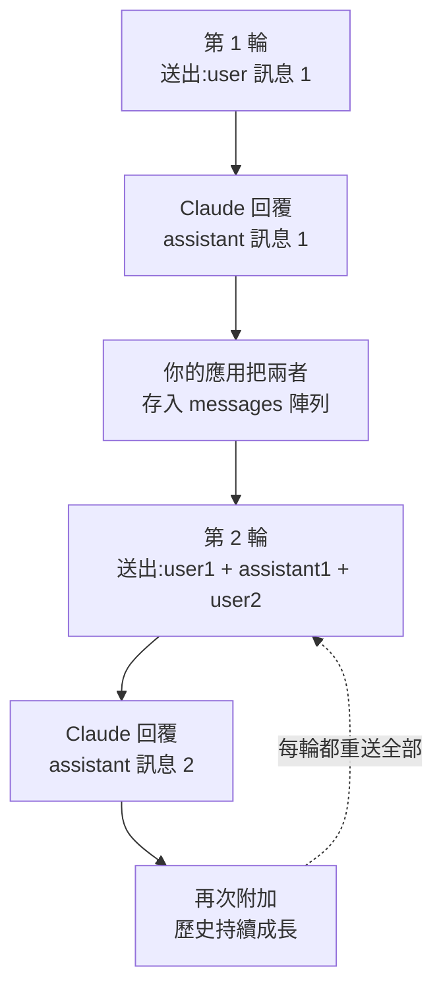
```mermaid
flowchart TD
    A[第 1 輪<br/>送出:user 訊息 1] --> B[Claude 回覆<br/>assistant 訊息 1]
    B --> C[你的應用把兩者<br/>存入 messages 陣列]
    C --> D[第 2 輪<br/>送出:user1 + assistant1 + user2]
    D --> E[Claude 回覆<br/>assistant 訊息 2]
    E --> F[再次附加<br/>歷史持續成長]
    F -.->|每輪都重送全部| D
```

- **伺服器什麼都不留。** 沒有任何可以只用最新 user 訊息「續接」的工作階段。如果你只送第 N 則訊息,模型對第 1..N-1 則就會失憶。完整的逐字稿*就是*對話本身。
- **`tool` 結果是內容區塊,不是字面上的角色。** 當模型呼叫工具時,你把結果以 `tool_result` 內容區塊的形式附加在一則 `user` 角色的訊息中——角色標籤並不會被設成 `"tool"`。期待有對稱「tool」角色的開發者常在此跌倒;考試要你知道結果是搭著一個 user 回合、以 `tool_use_id` 為鍵回傳的。
- **允許連續同角色的訊息**(API 會合併成一個回合),但陣列仍必須以 `user` 開頭。

**常見錯誤:**
- 只送最新的 user 回合,然後納悶為何上下文「不見了」——上下文從來沒有被存在伺服器端。
- 任由陣列無限成長直到溢出上下文視窗(§1.5)——無狀態意味著*你*要負責歷史管理,包括修剪與摘要。
- 自己手刻一個 `{"role": "tool", ...}` 訊息,而不是用 `tool_result` 區塊。

## 1.3 回應中的 `stop_reason` 欄位

Claude API 的回應包含 `stop_reason`,用以表示模型為何停止生成:

| 值 | 說明 | 動作 |
|---|---|---|
| `"end_turn"` | 模型已完成其回應 | 將結果呈現給使用者 |
| `"tool_use"` | 模型想要呼叫工具 | 執行該工具並回傳結果 |
| `"max_tokens"` | 已達 token 上限 | 回應被截斷;你可能需要提高上限 |
| `"stop_sequence"` | 遇到停止序列 | 依你的應用程式邏輯處理 |
| `"pause_turn"` | 長時間執行的回合被暫停(例如伺服器端工具使用期間),可被恢復 | 將回應送回,讓模型從中斷處繼續 |
| `"refusal"` | 模型基於安全理由拒絕繼續(Claude 4+) | 停止迴圈並妥善處理——不要原封不動地重試相同請求 |

對代理式系統而言,`"tool_use"` 和 `"end_turn"` 最為重要——它們控制著代理迴圈。

**`stop_reason` 是每個代理的控制平面。** 這個單一欄位是第 1 章*最*關鍵的考試概念,因為整個代理迴圈(第 3 章 §3.1)都依它分支:

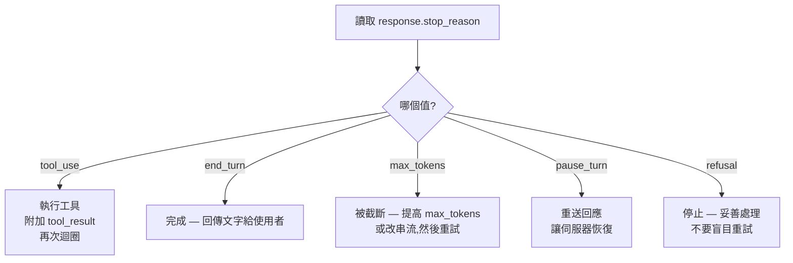
```mermaid
flowchart TD
    A[讀取 response.stop_reason] --> B{哪個值?}
    B -->|tool_use| C[執行工具<br/>附加 tool_result<br/>再次迴圈]
    B -->|end_turn| D[完成 — 回傳文字給使用者]
    B -->|max_tokens| E[被截斷 — 提高 max_tokens<br/>或改串流,然後重試]
    B -->|pause_turn| F[重送回應<br/>讓伺服器恢復]
    B -->|refusal| G[停止 — 妥善處理<br/>不要盲目重試]
```

- **依 `stop_reason` 分支,絕不依文字。** 任務完成唯一可靠的訊號是 `stop_reason == "end_turn"`。解析助理的散文找「done」或「task completed」是考試要你否定的典型反模式——它脆弱、依賴語言,且容易被模型自己的措辭騙過。
- **`max_tokens` 代表被截斷,不是完成。** 把它當成錯誤狀況處理:輸出不完整。要嘛提高 `max_tokens` 重新請求,要嘛改用串流(讓你在不撞 HTTP 逾時的情況下用更高的上限)。
- **`pause_turn` 是給伺服器端工具用的。** 當模型使用 Anthropic 託管的工具(網路搜尋、程式碼執行)而伺服器端迴圈達到其迭代上限時,你會收到 `pause_turn`。把助理回應直接送回即可恢復——**不要**再加一則 `"Continue."` 的 user 訊息;API 會偵測到結尾的伺服器工具區塊並自動恢復。
- **`refusal` 絕不能盲目重試。** 在 Claude 4+,安全拒絕會回傳一個成功的 HTTP 200,帶著 `stop_reason == "refusal"`。重送一模一樣的請求只是為同樣的結果燒 token。要在碰 `response.content` *之前*先讀 `stop_reason`——在輸出前就拒絕的情況下,content 陣列可能是空的,無條件執行 `response.content[0].text` 的程式碼會當掉。

**讀 `stop_details` 前要先防護。** `response.stop_details` *只有*在 `stop_reason == "refusal"` 時才會被填入;對 `end_turn`、`max_tokens`、`tool_use` 等它都是 `null`。不加防護就讀 `.category` 會是執行期錯誤。

## 1.4 系統提示

系統提示是一種特殊指令,用以定義上下文與行為規則。它:
- 不屬於 `messages` 陣列;它會在 `system` 欄位中單獨傳遞
- 優先於使用者訊息
- 載入一次後便在整段對話中持續套用
- 用來定義角色、限制條件與輸出格式

**考試重點:**系統提示的措辭可能會造成非預期的工具關聯。例如,像「務必驗證客戶」這樣的指令,可能會導致模型過度使用 `get_customer`,即使在不必要的情況下也是如此。

**為何系統提示不只是「那些指令」。** 它是請求中權威最高的文字,並位於提示前綴的*最前端*,這帶來兩個考試會考的後果:

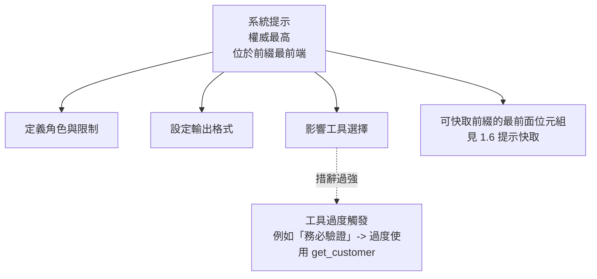
```mermaid
flowchart TD
    SP[系統提示<br/>權威最高<br/>位於前綴最前端] --> A[定義角色與限制]
    SP --> B[設定輸出格式]
    SP --> C[影響工具選擇]
    C -.->|措辭過強| D[工具過度觸發<br/>例如「務必驗證」-> 過度使用 get_customer]
    SP --> E[可快取前綴的最前面位元組<br/>見 1.6 提示快取]
```

- **措辭會滲入行為。** 因為模型會密切遵循系統提示,原本用來*克服*猶豫的命令式措辭如今反而*過度*觸發。「務必驗證客戶」會讓模型即使在這次請求根本不需要時也呼叫 `get_customer`;「CRITICAL: 你必須使用搜尋工具」會讓它在用推理就能解決時去搜尋。修正幾乎總是把語氣放軟(「當請求涉及帳戶變更時才驗證客戶」),而不是加更多護欄。這是考試最愛的第 1 章細節,並直接連結 Domain 4(提示設計)與 Domain 1(工具選擇行為)。
- **軟性偏好放這裡;硬性規則不放。** 系統提示產生的是*機率性*遵循——模型通常會聽,但不是 100%。任何必須被保證的事(退款上限、財務動作前的身分檢核)都屬於確定性程式碼或 hook(第 3 章 §3.5),絕不能只靠提示文字。把金額規則放進系統提示是典型的錯誤答案。
- **它設定一次、全程套用,且覆蓋使用者訊息。** 使用者無法像說服埋在對話裡的限制那樣,輕易把模型勸離一條住在系統提示裡的限制——這正是為何操作者指令應放在那裡,而不是放在 user 回合。
- **它是可快取前綴的最前端。** 因為系統提示穩定且位居最前,它是錨定提示快取的天然位置(§1.6)。把易變內容插進去——時間戳記、使用者名稱、請求 ID——會讓其後的一切快取失效。保持它凍結不變。

## 1.5 上下文視窗

上下文視窗是指模型一次能處理的文字總量(以 token 計)。它包含:
- 系統提示
- 完整的訊息歷史
- 工具定義
- 工具結果

**上下文視窗的主要問題:**

1. **迷失在中間效應:**模型能可靠地處理長輸入開頭與結尾的資訊,但可能會漏掉中間的細節。緩解方式:將關鍵資訊放在靠近開頭或結尾處。

2. **工具結果的累積:**每次工具呼叫都會把輸出加進上下文。如果一個工具回傳 40 個以上的欄位,但只有 5 個有用,那麼大部分的上下文都被浪費了。

3. **漸進式摘要:**在壓縮歷史時,數值、百分比與日期往往會遺失並變得模糊(「大約」、「差不多」、「幾個」)。

**為何上下文視窗是*預算*,而非只是*上限*。** §1.1–§1.4 的一切都在爭奪同一個有限的 token 池,而且因為 API 無狀態(§1.2),這個池會隨著你重送一段不斷成長的逐字稿而一輪輪被填滿:

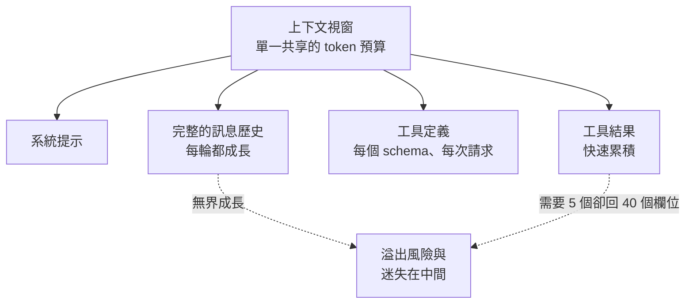
```mermaid
flowchart TD
    CW[上下文視窗<br/>單一共享的 token 預算] --> S[系統提示]
    CW --> H[完整的訊息歷史<br/>每輪都成長]
    CW --> T[工具定義<br/>每個 schema、每次請求]
    CW --> R[工具結果<br/>快速累積]
    H -.->|無界成長| X[溢出風險與<br/>迷失在中間]
    R -.->|需要 5 個卻回 40 個欄位| X
```

- **迷失在中間是一個擺放問題。** 模型對長輸入的*開頭*與*結尾*注意得最可靠,可能漏掉埋在中間的發現。所以順序很重要:把關鍵指令或關鍵發現放在靠近頂端或底部,而不是放在 60,000 token 中的第 40,000 個。當彙整多個來源的資料時,以最重要的段落、配上明確的標題開頭。
- **工具結果膨脹是無聲的預算殺手。** 一個在模型只需要 5 個欄位時回傳 40 個的工具,會在之後每一輪都浪費另外 35 個(因為歷史會重送)。在工具輸出進入逐字稿*之前*,先把它修剪到相關欄位——這是 Domain 5 的技能,也是反覆出現的考試情境。
- **摘要恰恰會弄丟你在乎的資料。** 漸進式摘要傾向把精確值——數字、百分比、日期、ID——壓縮成模糊語言(「大約幾個」、「差不多上一季」)。緩解方式是把交易性事實抽取到一個持久、*未*經摘要的「case facts」區塊,而不是信任滾動摘要去保留它們。
- **現代長上下文功能存在,但原則不變。** 即使有 200K–1M token 的視窗、伺服器端 compaction 與 context editing,同樣的失效模式仍適用——更大的預算只是延後問題,並非廢除它。考試考的是*原則*(擺放、修剪、事實保留),而不是視窗的原始大小。

## 1.6 串流、token 與成本

前面幾節描述了呼叫的*形狀*;本節討論執行它的*營運*現實——考試會把這些包裝成「你該用哪種做法」的取捨。

### 串流

非串流請求會阻塞,直到整個回應生成完畢才一次回傳。對於長輸出,這有 HTTP 逾時的風險——SDK 會拒絕它們估計會耗時太久的非串流請求,而大的 `max_tokens`(超過約 16K)實質上*要求*串流。串流會以一連串 Server-Sent Events 的形式逐步送出回應:

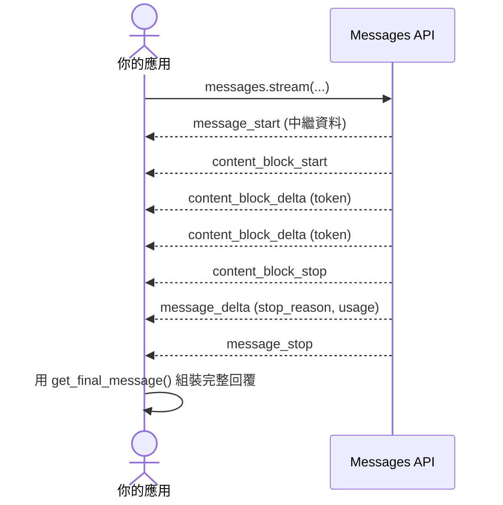
```mermaid
sequenceDiagram
    actor App as 你的應用
    participant API as Messages API
    App->>API: messages.stream(...)
    API-->>App: message_start (中繼資料)
    API-->>App: content_block_start
    API-->>App: content_block_delta (token)
    API-->>App: content_block_delta (token)
    API-->>App: content_block_stop
    API-->>App: message_delta (stop_reason, usage)
    API-->>App: message_stop
    App->>App: 用 get_final_message() 組裝完整回覆
```

- **`message_delta` 帶著你真正需要拿來分支的東西:** 它包含 `stop_reason` 與累進的 token `usage`。即使是為了體驗而串流,也呼叫 SDK 輔助函式(`get_final_message()` / `.finalMessage()`)把完整訊息重新組裝——你能同時得到串流體驗*與*逾時保護,而不必親手處理每一個事件。
- **任何有長輸入或高 `max_tokens` 的情況都預設串流。** 這是標準的正式環境姿態;非串流只適合短而快的呼叫(分類、抽取)。

### token 與成本

定價以 token 計,輸入與輸出分開計費,並依模型而異:

| 模型 | 輸入 $/1M | 輸出 $/1M | 上下文 |
|---|---|---|---|
| `claude-opus-4-8` | $5.00 | $25.00 | 1M |
| `claude-sonnet-4-6` | $3.00 | $15.00 | 1M |
| `claude-haiku-4-5` | $1.00 | $5.00 | 200K |

- **輸出遠比輸入昂貴**(上表每個模型都是 5 倍)。一個囉嗦的回應,比要求它的提示還貴——這又是一個「妥善界定 `max_tokens` 與精簡系統提示」很重要的理由。
- **用 API 數 token,不要用猜的。** 要估成本或檢查提示是否塞得進視窗,請用 `POST /v1/messages/count_tokens`(`client.messages.count_tokens(...)`)。**不要**用 `tiktoken` 或其他 OpenAI 分詞器——它們是為不同模型校準的,會低估 Claude 的 token 數,在程式碼與非英語文字上低估得很嚴重。token 數依模型而定;傳入你將用於推理的同一個 `model`。
- **`usage` 報告真實數字。** 每個回應都帶著 `usage`,含 `input_tokens`、`output_tokens` 與下方的快取欄位。`input_tokens` *只是未快取的剩餘部分*——提示總大小是 `input_tokens + cache_creation_input_tokens + cache_read_input_tokens`。

### 提示快取(基礎)

提示快取是**前綴比對**:API 會快取渲染後的提示直到某個 `cache_control` 斷點,而該前綴中任何位元組的變動都會讓其後的一切失效。渲染順序是 `tools` → `system` → `messages`。

- **把穩定內容放前面,易變內容放後面。** 凍結的系統提示與確定性的工具清單是理想的快取錨點;一個插進系統提示的時間戳記或每次請求的 ID,會無聲地破壞整個請求的快取。
- **快取讀取約為基礎輸入價格的 0.1 倍**,寫入約 1.25 倍——所以一段大型、重複使用的前言(指令、few-shot 範例、一份長文件)在幾次請求內就回本。
- **用 `usage.cache_read_input_tokens` 驗證。** 如果它在*應該*共享前綴的請求間一直是零,那就有無聲的失效因子在作怪(常見的是系統提示裡的 `datetime.now()`、未排序的 JSON 傾印,或每次請求都變動的工具集)。

**考試角度:**快取、串流與 token 計數是 Domain 5 成本/可靠性情境背後的第 1 章構件——題目考的是*何時*串流、*為何*不用 `tiktoken`、*什麼*會讓快取失效,而不是確切的定價數字。

## 1.7 端到端案例研究:多輪客服聊天後端

上述欄位唯有組合在一起才有意義。以下是一個完整、真實的後端,把整章串成一個系統——一個驅動多輪客服聊天的無狀態 Web 服務。它*只*用第 1 章的概念:messages、系統提示、無狀態、串流、`stop_reason`、token/成本計算,以及提示快取。(還沒有工具——那是第 2 章。)

### 需求

- 驅動一來一往的客服聊天:使用者輸入、助理回覆、循環往復。
- 此服務是無狀態 HTTP 後端(多個實例位於負載平衡器之後)——**它不能依賴行程內記憶**橫跨請求。
- 逐 token 串流回覆,讓 UI 在生成時就顯示文字。
- 固定的客服人設與政策文字套用於每段對話,且必須被快取,而非每輪重新計費。
- 依對話追蹤 token 用量以供成本報告。
- 正確處理被截斷(`max_tokens`)與被拒絕(`refusal`)的回應——絕不把半截訊息當成完整的顯示出去,絕不盲目重試拒絕。
- 避免對話溢出上下文視窗。

### 架構

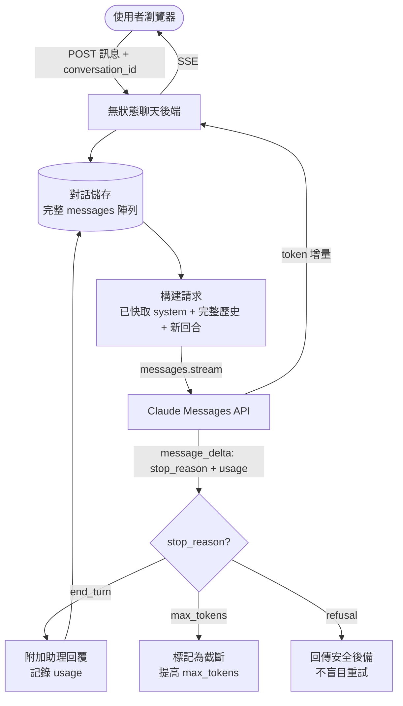
```mermaid
flowchart TD
    User([使用者瀏覽器]) -->|POST 訊息 + conversation_id| Svc[無狀態聊天後端]
    Svc --> Store[(對話儲存<br/>完整 messages 陣列)]
    Store --> Build[構建請求<br/>已快取 system + 完整歷史 + 新回合]
    Build -->|messages.stream| API[Claude Messages API]
    API -->|token 增量| Svc
    Svc -->|SSE| User
    API -->|message_delta: stop_reason + usage| Check{stop_reason?}
    Check -->|end_turn| Save[附加助理回覆<br/>記錄 usage]
    Check -->|max_tokens| Retry[標記為截斷<br/>提高 max_tokens]
    Check -->|refusal| Safe[回傳安全後備<br/>不盲目重試]
    Save --> Store
```

因為後端無狀態,**對話儲存是唯一的記憶**——每一輪都從它重建完整請求。系統提示是快取錨點;不斷成長的 `messages` 陣列就是對話。

### 實作

一個會重送完整歷史、快取人設並串流的對話管理器:

```python
import anthropic

client = anthropic.Anthropic()

SUPPORT_SYSTEM = (
    "You are Acme's support assistant. Be concise and friendly. "
    "Help with orders and returns. If a request needs an account change, "
    "ask the user to confirm their order number first."
)  # 凍結 — 沒有時間戳記或個別使用者資料,所以能乾淨地快取。

def handle_turn(conversation_id: str, user_text: str) -> dict:
    history = store.load(conversation_id)          # 完整 messages 陣列(無狀態)
    history.append({"role": "user", "content": user_text})

    with client.messages.stream(
        model="claude-sonnet-4-6",
        max_tokens=1024,
        cache_control={"type": "ephemeral"},       # 快取穩定的 system 前綴
        system=SUPPORT_SYSTEM,
        messages=history,
    ) as stream:
        for text in stream.text_stream:
            push_sse(conversation_id, text)        # 把 token 串流給 UI
        final = stream.get_final_message()         # 重組 + 取得 stop_reason/usage

    if final.stop_reason == "refusal":
        return {"status": "refused"}               # 不要重送相同請求
    if final.stop_reason == "max_tokens":
        return {"status": "truncated"}             # 不完整 — 提高 max_tokens 並重試

    assistant_text = next(b.text for b in final.content if b.type == "text")
    history.append({"role": "assistant", "content": assistant_text})
    store.save(conversation_id, history)           # 持久化不斷成長的逐字稿
    record_usage(conversation_id, final.usage)     # input/output/cache token 供成本
    return {"status": "ok"}
```

當歷史成長過大時修剪它以保護上下文視窗,並保留最近的回合:

```python
def trim(history: list, keep_recent: int = 20) -> list:
    # 無狀態意味著「歷史管理」由我們負責。保留最近的回合;
    # 對於長工作階段,把較舊的回合摘要進一個持久的事實區塊,
    # 而不是丟掉精確的訂單編號與日期(1.5)。
    return history if len(history) <= keep_recent else history[-keep_recent:]
```

### 執行軌跡

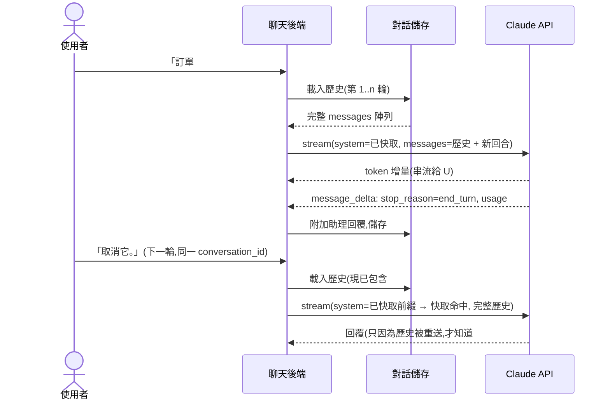
```mermaid
sequenceDiagram
    actor U as 使用者
    participant B as 聊天後端
    participant DB as 對話儲存
    participant C as Claude API
    U->>B: 「訂單 #5512 在哪?」
    B->>DB: 載入歷史(第 1..n 輪)
    DB-->>B: 完整 messages 陣列
    B->>C: stream(system=已快取, messages=歷史 + 新回合)
    C-->>B: token 增量(串流給 U)
    C-->>B: message_delta: stop_reason=end_turn, usage
    B->>DB: 附加助理回覆,儲存
    U->>B: 「取消它。」(下一輪,同一 conversation_id)
    B->>DB: 載入歷史(現已包含 #5512 的往來)
    B->>C: stream(system=已快取前綴 → 快取命中, 完整歷史)
    C-->>B: 回覆(只因為歷史被重送,才知道 #5512)
```

注意第 2 輪之所以「記得」訂單 #5512,純粹是因為後端**重送了整段逐字稿**——API 什麼都沒存。第二個請求也在 system 前綴上獲得**快取命中**,所以人設文字以約 0.1 倍而非全價計費。

### 驗證

- **無狀態測試:** 在對話中途重啟後端(清掉所有行程內狀態);下一輪仍必須有完整上下文,證明記憶住在儲存裡,而非行程裡。
- **快取測試:** 斷言第二輪及之後的 `usage.cache_read_input_tokens > 0`。如果是零,就有無聲的失效因子溜進了系統提示(時間戳記、個別使用者字串)。
- **截斷測試:** 在一個長答案上強制 `max_tokens=16`,並斷言後端回報 `truncated`,而不是把半句話當成完整回覆存下來。
- **拒絕測試:** 斷言 `refusal` 回應會回傳安全後備,且*不會*再發一個一模一樣的請求。
- **上下文預算測試:** 跑一段長對話,確認 `trim()` 把視窗維持在有界範圍內,且不丟掉最新的使用者意圖。

### 常見陷阱

- 把歷史存在行程記憶裡,當負載平衡器把下一輪導向不同實例時就弄丟對話(API 無狀態——§1.2)。
- 把 `datetime.now()` 或使用者名稱插進 `SUPPORT_SYSTEM`,無聲地殺死快取(§1.4、§1.6)。
- 把 `max_tokens` 當成成功,把被截斷的訊息當成最終結果顯示(§1.3)。
- 盲目重試 `refusal`,為同樣的結果燒 token(§1.3)。
- 任由 `messages` 陣列無界成長直到溢出上下文視窗(§1.5)。
- 用 `tiktoken` 而非 `count_tokens` 估成本,低估 Claude 的 token 數(§1.6)。

## 1.8 考試重點 — 關鍵整理

| 概念 | 考試考什麼 |
|---|---|
| 請求結構 | 有效呼叫的最低需求是 `model` + `max_tokens` + 一個以 `user` 開頭的 `messages` 陣列;`system` 是獨立欄位,不是訊息(§1.1)。 |
| 無狀態 | 伺服器什麼都不存——每輪重送完整歷史;修剪與摘要由你負責(§1.2)。 |
| `stop_reason` | 依 `stop_reason` 分支,絕不依解析文字;`end_turn` = 完成、`max_tokens` = 截斷、`refusal` = 停止且不盲目重試(§1.3)。 |
| 系統提示 | 權威最高且位於前綴最前端;措辭過強會過度觸發工具;硬性規則屬於程式碼,不屬於提示(§1.4)。 |
| 上下文視窗 | 單一共享的 token 預算;以擺放緩解迷失在中間、修剪膨脹的工具結果、保留精確事實(§1.5)。 |
| 串流與成本 | 長輸出/高 `max_tokens` 就串流;讀 `usage`;用 `count_tokens` 數 token,絕不用 `tiktoken`;快取穩定前綴(§1.6)。 |

> **對應 Domain 1、4、5。** 第 1 章是本書其餘內容立足的地基:`stop_reason` 驅動 Domain 1 的代理迴圈,系統提示與訊息構建驅動 Domain 4,無狀態加上下文視窗驅動 Domain 5。把上面的客服聊天後端——messages、系統提示、串流、`stop_reason`、成本、快取——掌握好,更高的層級就會變得容易推理得多。

# 第 2 章:工具與 `tool_use`

> 文件:[Tool Use](https://platform.claude.com/docs/en/build-with-claude/tool-use)

工具是 Claude 從「文字產生器」變成會*動手*的系統的關鍵——查訂單、跑查詢、呼叫 API。本章是 **Domain 2 — 工具設計與 MCP 整合(佔考試 18%)** 的骨幹。第 3 章談的是代理如何*編排*工具,本章則談每一次工具呼叫底層的契約:你如何*定義*工具、Claude 如何*請求*工具、你如何*回傳*它的結果(包含失敗),以及你如何*引導*選擇。讀完你應能:

- 解釋 **`tool_use` / `tool_result` 往返**(§2.1)——每次工具呼叫所依附的訊息交換。
- 寫出 `description` 能真正驅動正確選擇的**工具定義**(§2.2)。
- 用 **`tool_choice`** 引導選擇(§2.3),並推理**平行工具呼叫**(§2.4)。
- 以 **JSON Schema** 作為取得結構化輸出最可靠的途徑(§2.5),並分辨**語法**與**語意**錯誤(§2.6)。
- 回傳**結構化的錯誤結果**,讓模型能正確復原(§2.7)。

§2.8 接著從頭到尾建構一個完整的發票擷取服務,§2.9 則濃縮考試重點。

## 2.1 什麼是 `tool_use`

`tool_use` 是讓 Claude 能呼叫外部函式的機制。模型**不會執行程式碼**——它會發出一個結構化的*請求*來呼叫工具;**由你的程式碼執行它**並把結果回饋回去。Claude 是規劃者;你的執行環境是雙手。

就機制而言,一次工具呼叫是一個四訊息的往返,而且完全承載在一般的 `messages` 陣列裡:

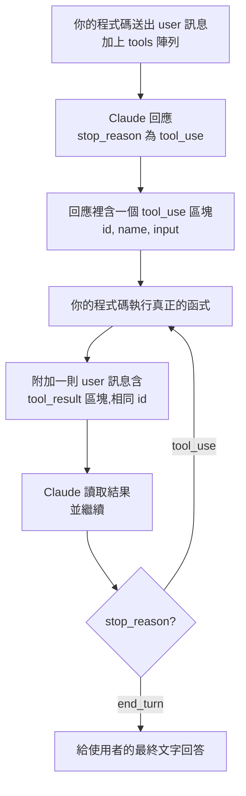
```mermaid
flowchart TD
    A[你的程式碼送出 user 訊息<br/>加上 tools 陣列] --> B[Claude 回應<br/>stop_reason 為 tool_use]
    B --> C[回應裡含一個 tool_use 區塊<br/>id, name, input]
    C --> D[你的程式碼執行真正的函式]
    D --> E[附加一則 user 訊息含<br/>tool_result 區塊,相同 id]
    E --> F[Claude 讀取結果<br/>並繼續]
    F --> G{stop_reason?}
    G -->|tool_use| D
    G -->|end_turn| H[給使用者的最終文字回答]
```

線路格式很重要,因為考試會考你是否理解它:

```json
// 1) Claude 的回應 — stop_reason: "tool_use"
{
  "role": "assistant",
  "content": [
    {"type": "text", "text": "Let me look that up."},
    {"type": "tool_use", "id": "toolu_01A...", "name": "get_customer",
     "input": {"email": "ada@example.com"}}
  ]
}

// 2) 你的回覆 — 結果以一則 USER 訊息回傳
{
  "role": "user",
  "content": [
    {"type": "tool_result", "tool_use_id": "toolu_01A...",
     "content": "{\"name\":\"Ada\",\"status\":\"active\"}"}
  ]
}
```

**為何重要 / 常見錯誤:**
- `tool_result` 區塊要放在一則 **`role: "user"`** 的訊息回傳,而非 `assistant`——這是常見的混淆點。`tool_use_id` 必須對應 Claude 生成的 `id`,否則 API 會拒絕這一回合。
- 你必須在下一個請求中**把助理的 `tool_use` 回合原樣帶回去**。API 是無狀態的;如果你丟掉含 `tool_use` 區塊的助理回合、只送 `tool_result`,對話就會格式錯誤。
- Claude 經常在 `tool_use` 區塊*旁邊*一併發出 `text` 區塊(「Let me look that up.」)。別把那段文字當成最終答案——`stop_reason == "tool_use"` 代表這一回合還沒完成。

> **考試角度:**要熟記角色/id 的配對(`tool_use.id` ↔ `tool_result.tool_use_id`),以及 `tool_result` 承載在 `user` 訊息上。這就是第 3 章代理迴圈所驅動的底層協定。

## 2.2 工具定義

每個工具都使用 JSON 結構描述來定義。`description` 是你會寫到的最重要欄位:

```json
{
  "name": "get_customer",
  "description": "Finds a customer by email or ID. Returns the customer profile, including name, email, order history, and account status. Use this tool BEFORE lookup_order to verify the customer's identity. Accepts an email (format: user@domain.com) or a numeric customer_id.",
  "input_schema": {
    "type": "object",
    "properties": {
      "email": {"type": "string", "description": "Customer email"},
      "customer_id": {"type": "integer", "description": "Numeric customer ID"}
    },
    "required": []
  }
}
```

**工具描述至關重要的面向:**

1. **描述是主要的選擇機制。** Claude 幾乎完全依據工具的描述與結構描述來選擇工具——它沒有其他途徑能知道工具在做什麼。過於精簡的描述(「Retrieves customer information」)會在兩個工具功能重疊的當下,導致選錯工具。

2. **描述中應包含:**
   - 工具的功能與回傳內容
   - 輸入格式與範例值
   - 邊界案例與限制
   - 何時應使用此工具,而非類似的替代工具

3. **避免**在不同工具之間使用相同或重疊的描述。如果 `analyze_content` 與 `analyze_document` 讀起來幾乎相同,模型會把兩者混淆。解法通常是**為了具體性而重新命名**(`analyze_content` → `extract_web_results`),並把一個通用工具**拆成多個聚焦的工具**、各自有清楚的輸入/輸出契約——這正是 Domain 2 消除功能重疊的技能。

4. **內建工具 vs MCP 工具:** 代理傾向偏好內建工具(Read、Grep),而非功能類似的 MCP 工具。為了抵銷這點,請強化 MCP 工具的描述——點出內建工具無法提供的具體優勢、獨特資料或上下文。

5. **留意系統提示。** 系統提示的措辭會造成非預期的關聯(「你是*搜尋*助理」會讓模型偏向任何名為 `search_*` 的東西)。工具路由是描述*與*周邊提示共同作用的結果。

**為何重要 / 常見錯誤:**把描述當成給人看的文件,而非模型的路由表。模糊或重複的描述不是表面問題——它是一個正確性的 bug,會以代理呼叫到錯誤工具的形式浮現。

> **考試角度:**面對兩個容易混淆的工具,正確答案通常是*改寫/重新命名描述以區別之*(並拆分過於通用的工具),而不是增加提示指令。

## 2.3 `tool_choice` 參數

`tool_choice` 控制模型*如何*選擇工具:

| 值 | 行為 | 何時使用 |
|---|---|---|
| `{"type": "auto"}` | 模型自行決定要呼叫工具或以文字回答 | 多數情況的預設值 |
| `{"type": "any"}` | 模型**必須**呼叫某個工具(絕不純文字) | 當你需要保證取得結構化輸出時 |
| `{"type": "tool", "name": "extract_metadata"}` | 模型**必須**呼叫那個特定工具 | 當你需要強制的第一步 / 執行順序時 |
| `{"type": "none"}` | 模型本回合**不可**呼叫任何工具 | 暫時停用工具卻不移除它們 |

**重要情境:**
- `tool_choice: "any"` + 多個擷取工具 → 模型仍會挑選最合適的一個,但你能保證取得工具呼叫,而非散文式回答。
- 強制選擇(`type: "tool"`)→ 當你必須保證特定的第一個動作時(例如,在任何豐富化步驟前先執行 `extract_metadata`)。

**為何重要 / 常見錯誤:**
- 在 `auto` 下,Claude 可能合理地以文字回答。如果你的程式碼無條件去解析 `tool_use` 區塊,遇到純文字回合就會崩潰。當下游程式碼*需要*結構化輸出時,請用 `any`。
- **強制一個工具會停用該回合的延伸思考(extended thinking)**,而 `any`/`tool` 代表模型*一定*會呼叫某個工具——所以被強制的工具必須是可以無條件安全呼叫的。別只為了取得結構就強制一個有副作用的工具(例如 `send_email`);改為強制一個擷取/格式化的工具。

> **考試角度:**「保證結構化輸出、由模型挑工具」→ `any`。「保證某個特定工具先執行」→ `{"type":"tool","name":...}`。「模型可回答或呼叫」→ `auto`。

## 2.4 平行工具呼叫

當一個回合需要多個彼此獨立的查詢時,Claude 可以在**單一回應中發出多個 `tool_use` 區塊**。你的程式碼執行它們(最好是並行的),並在**後續一則** `user` 訊息中回傳**全部**的 `tool_result` 區塊。

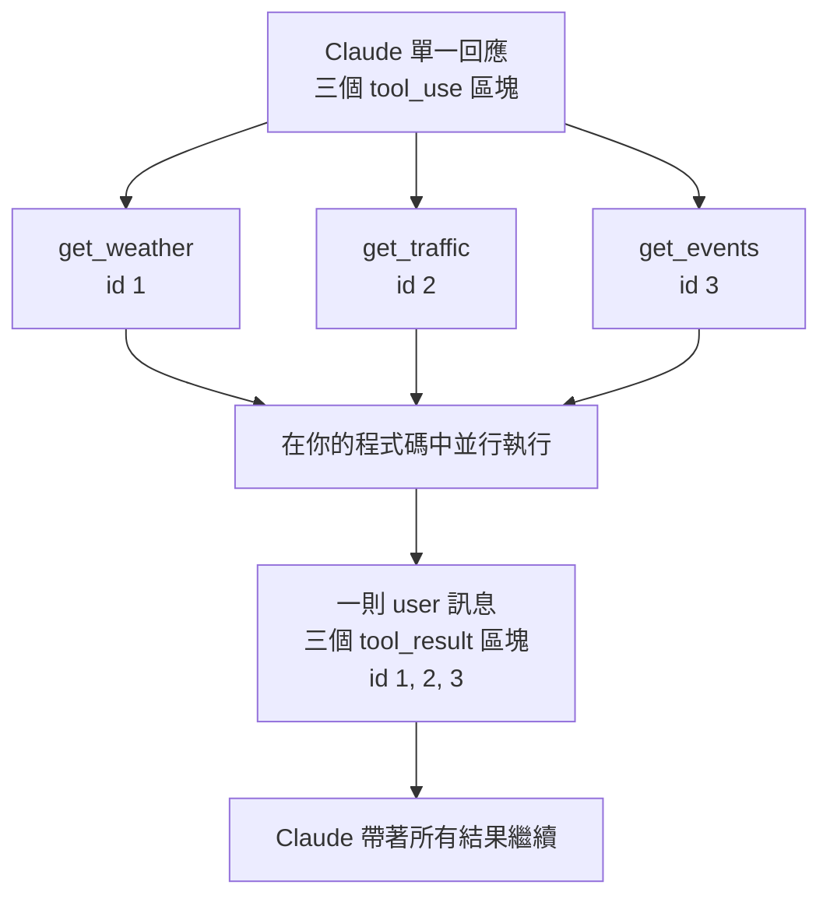
```mermaid
flowchart TD
    A[Claude 單一回應<br/>三個 tool_use 區塊] --> B[get_weather<br/>id 1]
    A --> C[get_traffic<br/>id 2]
    A --> D[get_events<br/>id 3]
    B --> E[在你的程式碼中並行執行]
    C --> E
    D --> E
    E --> F[一則 user 訊息<br/>三個 tool_result 區塊<br/>id 1, 2, 3]
    F --> G[Claude 帶著所有結果繼續]
```

**為何重要 / 常見錯誤:**
- 一個平行批次的所有 `tool_result` 區塊都必須在**一則** user 訊息中回傳,且各自對應到它的 `tool_use_id`。把它們拆散到多則訊息、或漏掉某個 id,都會讓這一回合格式錯誤。
- 平行化是針對**獨立**呼叫的最佳化。如果工具 B 需要工具 A 的輸出,那是*循序*的往返,不是平行批次——模型會請求 A、看到結果,然後才請求 B。
- 你可以推動或抑制平行化:用提示(例如請模型一次蒐集所有需要的資料)會鼓勵它;在 `tool_choice` 裡設 `disable_parallel_tool_use: true` 則會在你的後端無法安全處理並行時,強制每回合至多一次呼叫。

> **考試角度:**平行工具呼叫 = 為獨立工作降低延遲;題目中的線索是「抓取 X、Y 與 Z」且彼此之間沒有相依。有相依的步驟無法平行化。

## 2.5 用於結構化輸出的 JSON 結構描述

搭配 JSON 結構描述使用 `tool_use` 是從 Claude 取得結構化輸出**最可靠**的方式。它能:
- **保證語法上有效的 JSON**(沒有缺漏的大括號,沒有多餘的逗號)
- **強制套用所需的結構**(必填欄位都存在、列舉值被遵守)
- **不**保證語意正確性(值仍可能有誤)

經典模式是用單一「擷取器」工具,其 `input_schema` *就是*你想拿回的形狀;以 `tool_choice: {"type":"tool","name":"..."}` 呼叫它,然後讀取產生的 `tool_use` 區塊的 `input`。

**結構描述設計——關鍵原則:**

```json
{
  "type": "object",
  "properties": {
    "category": {
      "type": "string",
      "enum": ["bug", "feature", "docs", "unclear", "other"]
    },
    "category_detail": {
      "type": ["string", "null"],
      "description": "Details if category = 'other' or 'unclear'"
    },
    "severity": {
      "type": "string",
      "enum": ["critical", "high", "medium", "low"]
    },
    "confidence": {
      "type": "number",
      "minimum": 0,
      "maximum": 1
    },
    "optional_field": {
      "type": ["string", "null"],
      "description": "Null if the information was not found in the source"
    }
  },
  "required": ["category", "severity"]
}
```

**結構描述設計規則:**
1. **必填 vs 選填:** 只有在資訊*永遠*都會有的情況下,才將欄位標記為 `required`。必填欄位會在資料缺失時,促使模型**捏造**值。
2. **可為 null 的欄位:** 對於可能不存在的資訊,使用 `"type": ["string", "null"]`,讓模型可以回傳 `null`,而不會產生幻覺。
3. **含 `"other"` 的列舉:** 加入 `"other"` + 一個詳細說明字串,以免落在你預先定義類別之外的資料被悄悄遺失。
4. **列舉值 `"unclear"`:** 用於模型無法有信心挑選的情況——誠實的 `"unclear"` 勝過一個自信但錯誤的類別。
5. **為每個欄位加描述。** 每個欄位的 `description` 是提示的一部分;「Null if not found in source」能可衡量地降低幻覺。

**為何重要 / 常見錯誤:**過度設定必填欄位、以及省略 null,是兩個最常見的結構描述 bug,而兩者都會製造幻覺。結構描述約束的是*形狀*,從不是*真實性*——這正是 §2.6 存在的原因。

> **考試角度:**「我如何保證有效、結構良好的輸出?」→ 工具/JSON 結構描述,而非提示後再解析。「我如何讓模型能說*我不知道*?」→ 可為 null 的型別,以及 `unclear`/`other` 列舉。

## 2.6 語法錯誤 vs 語意錯誤

JSON 結構描述能徹底關閉某一整類錯誤的大門,卻關不了另一類。把它們分開看,就能知道該套用哪種緩解方式。

| 錯誤類型 | 範例 | 緩解方式 |
|---|---|---|
| **語法** | 無效的 JSON、錯誤的欄位型別、缺漏必填鍵 | 搭配 JSON 結構描述使用 `tool_use`(**可消除**這一類) |
| **語意** | 總計加不起來、值放錯欄位、捏造的值 | 驗證檢查、帶回饋的重試、自我修正 |

**為何重要 / 常見錯誤:**以為 JSON 既然解析成功,它就是*正確*的。結構描述能保證 `line_items` 是一個形狀正確的陣列;它無法保證這些明細加總起來等於 `total`。語意正確性是*你*的工作——擷取後要驗證,失敗時帶著具體差異重新提示(例如「明細加總為 90.00 但 total 是 95.00;請重算」),讓模型自我修正。

> **考試角度:**如果題目的失敗是「JSON 格式錯誤 / 缺欄位」,解法是結構描述。如果是「數字錯了 / 值放錯欄位」,解法是驗證 + 重試——結構描述幫不上忙。

## 2.7 結構化的錯誤結果

工具會失敗——逾時、輸入錯誤、違反政策、缺少權限。**你如何把失敗回報給 Claude,決定了它能否正確復原。** 工具結果不限於成功的酬載;你用 **`is_error: true`**(MCP 中的 `isError` 旗標)標記失敗結果,而且——關鍵在於——讓其*內容*可被機器據以行動:

```json
{
  "type": "tool_result",
  "tool_use_id": "toolu_01B...",
  "is_error": true,
  "content": "{\"errorCategory\":\"transient\",\"isRetryable\":true,\"message\":\"Upstream timeout after 5s\"}"
}
```

要區分錯誤的*類別*,因為每一種都意味著不同的復原方式:

| 類別 | 範例 | 可重試? | Claude 應該做什麼 |
|---|---|---|---|
| **暫時性(Transient)** | 上游逾時、503 | 是 | 重試,最好搭配退避(backoff) |
| **驗證(Validation)** | 格式錯誤的 email、缺欄位 | 否 | 修正輸入後再次呼叫 |
| **業務(Business)** | 退款超過政策上限 | 否 | 向使用者說明 / 升級 |
| **權限/存取(Permission/Access)** | token 缺少 scope | 否 | 停下並回報,別繞圈 |

**為何重要 / 常見錯誤:**
- 一個籠統的 `"Operation failed"` 會剝奪模型決定*重試 vs 修正 vs 停止*所需的資訊。經典的失敗模式是代理**對一個不可重試的驗證或業務錯誤無止盡地重試**。
- 對業務規則違規回傳 `isRetryable: false`,*並附上清楚、面向使用者的 `message`*,讓代理去說明而非繞圈。
- **區分存取失敗與有效的空結果。** `search` 回傳零筆是帶著空資料的*成功*——不是錯誤。把「查無相符」標記為 `is_error` 會讓模型以為工具壞了而無謂重試。
- **能在本地復原就在本地復原。** 對暫時性失敗,子代理應在內部重試,只把它真的無法解決的錯誤往上傳——別讓協調者承擔每一次小故障。

> **考試角度:**「代理一直重試一個注定失敗的呼叫」的正確答案是*結構化的錯誤中介資料*(`errorCategory`、`isRetryable`、人類可讀的 `message`),而不是更長的提示。而且「查無結果」不是錯誤。

## 2.8 端到端案例研究:發票擷取服務

上述元件唯有組合在一起才有意義。以下是一個完整、真實的建置,演練本章的每一個概念——定義、`tool_choice`、往返、平行呼叫、結構化錯誤,以及語法/語意之分。任務:把一張雜亂的上傳發票(PDF 文字 + 一個 vendor ID)變成經過驗證的結構化資料,並以即時稅率與供應商資訊加以豐富。

### 需求

- 輸入:原始發票文字加上一個 `vendor_id`。輸出:一筆**嚴格結構化**的發票紀錄(明細、小計、稅、總計)。
- 擷取必須**保證結構化**——下游的會計程式無法解析散文。
- 豐富化需要**兩個彼此獨立的查詢**——該地區當前的 `tax_rate`,以及標準的 `vendor` 紀錄——兩者應**平行**執行以縮短延遲。
- 查詢可能**失敗**;系統必須分辨可重試的逾時,以及一個根本不存在的供應商。
- 一張形狀正確的發票仍可能是**錯**的(明細加總不等於總計);這必須被抓出來。

### 架構

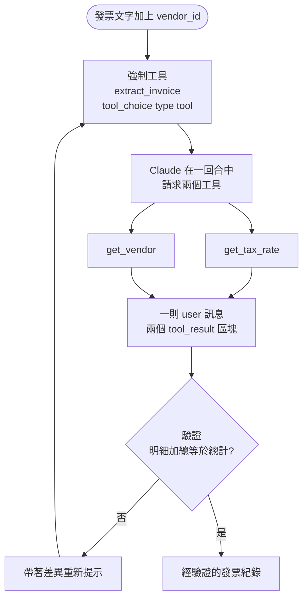
```mermaid
flowchart TD
    In([發票文字加上 vendor_id]) --> Ext[強制工具<br/>extract_invoice<br/>tool_choice type tool]
    Ext --> Par[Claude 在一回合中<br/>請求兩個工具]
    Par --> Tax[get_tax_rate]
    Par --> Ven[get_vendor]
    Tax --> Batch[一則 user 訊息<br/>兩個 tool_result 區塊]
    Ven --> Batch
    Batch --> Val{驗證<br/>明細加總等於總計?}
    Val -->|否| Retry[帶著差異重新提示]
    Retry --> Ext
    Val -->|是| Done[經驗證的發票紀錄]
```

`extract_invoice` 是**被強制**的,所以結構有保證;兩個豐富化查詢是**獨立**的,所以 Claude 被允許**平行**請求它們;**結構化錯誤**驅動復原;而一個**語意**檢查(加總)位於結構描述之外,因為結構描述無法強制算術。

### 實作

定義擷取器——它的 `input_schema` *就是*輸出形狀——再加上兩個豐富化工具:

```python
extract_invoice = {
    "name": "extract_invoice",
    "description": "Extract a structured invoice from raw text. Returns line items, "
                   "subtotal, tax, and total. Use vendor_currency for all amounts.",
    "input_schema": {
        "type": "object",
        "properties": {
            "line_items": {
                "type": "array",
                "items": {
                    "type": "object",
                    "properties": {
                        "desc": {"type": "string"},
                        "amount": {"type": "number"}
                    },
                    "required": ["desc", "amount"]
                }
            },
            "subtotal": {"type": "number"},
            "currency": {"type": "string"},
            "vendor_tax_id": {
                "type": ["string", "null"],
                "description": "Null if no tax id appears in the source"
            }
        },
        "required": ["line_items", "subtotal", "currency"]
    }
}

get_tax_rate = {
    "name": "get_tax_rate",
    "description": "Returns the current tax rate (0..1) for a region code. Read-only.",
    "input_schema": {"type": "object",
        "properties": {"region": {"type": "string"}}, "required": ["region"]}
}

get_vendor = {
    "name": "get_vendor",
    "description": "Returns the canonical vendor record (legal name, region) for a vendor_id. Read-only.",
    "input_schema": {"type": "object",
        "properties": {"vendor_id": {"type": "string"}}, "required": ["vendor_id"]}
}
```

在第一回合強制使用擷取器,這樣你永遠不會拿回散文:

```python
resp = client.messages.create(
    model="claude-sonnet-4-6",
    max_tokens=1024,
    tools=[extract_invoice, get_tax_rate, get_vendor],
    tool_choice={"type": "tool", "name": "extract_invoice"},   # 保證結構
    messages=[{"role": "user", "content": invoice_text}],
)
invoice = next(b.input for b in resp.content if b.type == "tool_use")
```

並行執行兩個獨立查詢,並在**一則** user 訊息中回傳**兩者**的結果:

```python
def run_tool(call):
    try:
        if call.name == "get_vendor":
            return {"is_error": False, "content": json.dumps(lookup_vendor(call.input["vendor_id"]))}
        if call.name == "get_tax_rate":
            return {"is_error": False, "content": json.dumps(get_rate(call.input["region"]))}
    except TimeoutError:
        return {"is_error": True,
                "content": json.dumps({"errorCategory": "transient", "isRetryable": True,
                                       "message": "Upstream timeout"})}
    except VendorNotFound:
        return {"is_error": True,
                "content": json.dumps({"errorCategory": "validation", "isRetryable": False,
                                       "message": "No vendor with that id"})}

# Claude 在「一個」回應中發出 get_tax_rate 與 get_vendor -> 平行執行
results = parallel_map(run_tool, tool_use_blocks)   # 並行
tool_results = [
    {"type": "tool_result", "tool_use_id": b.id, **r}
    for b, r in zip(tool_use_blocks, results)
]
messages.append({"role": "user", "content": tool_results})   # 全部放在一則訊息
```

驗證結構描述管不到的**語意**——失敗時,帶著確切差異重新提示:

```python
computed = round(sum(li["amount"] for li in invoice["line_items"]), 2)
if computed != invoice["subtotal"]:
    feedback = (f"line_items sum to {computed} but subtotal is "
                f"{invoice['subtotal']}. Recompute and call extract_invoice again.")
    # 把 `feedback` 當成 user 回合送回去 -> 模型自我修正(§2.6)
```

### 執行軌跡

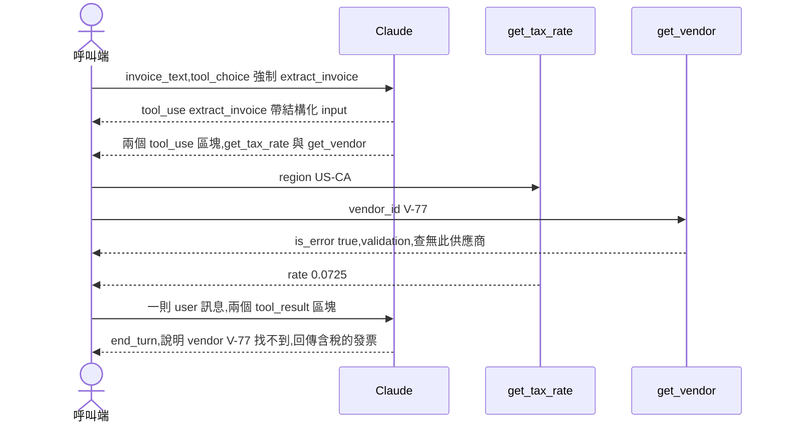
```mermaid
sequenceDiagram
    actor Sys as 呼叫端
    participant Cl as Claude
    participant Tax as get_tax_rate
    participant Ven as get_vendor
    Sys->>Cl: invoice_text,tool_choice 強制 extract_invoice
    Cl-->>Sys: tool_use extract_invoice 帶結構化 input
    Cl-->>Sys: 兩個 tool_use 區塊,get_tax_rate 與 get_vendor
    Sys->>Tax: region US-CA
    Sys->>Ven: vendor_id V-77
    Ven-->>Sys: is_error true,validation,查無此供應商
    Tax-->>Sys: rate 0.0725
    Sys->>Cl: 一則 user 訊息,兩個 tool_result 區塊
    Cl-->>Sys: end_turn,說明 vendor V-77 找不到,回傳含稅的發票
```

有兩點值得注意。**被強制**的 `extract_invoice` 排除了任何散文回答的可能。而**結構化**的 `get_vendor` 錯誤(`validation`、`isRetryable: false`)讓 Claude *說明*缺少的供應商,而不是去重試一個永遠不會成功的呼叫——正是 §2.7 中考試所獎勵的行為。

### 驗證

- **結構測試:** 斷言第一回合永遠是針對 `extract_invoice` 的 `tool_use`(強制有效),且其 `input` 能通過結構描述驗證。
- **平行測試:** 餵入一張需要兩個查詢的發票;斷言 Claude 在**一個**回應中發出兩個 `tool_use` 區塊,且你在**一則**訊息中回傳兩個 `tool_result`。
- **錯誤路由測試:** 讓 `get_vendor` 拋出 `VendorNotFound`;斷言代理*說明*而非重試(不可重試),且 `TimeoutError` *會*被重試。
- **語意測試:** 餵入一張明細加總不等於小計的發票;斷言驗證器抓到它並重新提示。只有結構描述的設計會悄悄放行這張壞發票。

### 常見陷阱

- 把 `tool_result` 放在 **`assistant`** 訊息上回傳,或用了不相符的 `tool_use_id`(§2.1)——API 會拒絕這一回合。
- 用 `tool_choice: "auto"` 後又無條件去讀 `tool_use` 區塊,遇到純文字回合就崩潰(§2.3)。
- 把平行的 `tool_result` 拆散到多則 user 訊息,而非一則(§2.4)。
- 把「查無供應商」標記成沒有類別的籠統錯誤,使代理無止盡重試;或根本把空的搜尋結果標記為錯誤(§2.7)。
- 信任解析後的 JSON 即為正確,而略過加總檢查(§2.6)。

## 2.9 考試重點 — 關鍵整理

| 概念 | 考試考什麼 |
|---|---|
| `tool_use` 往返 | `tool_result` 承載在 **`user`** 訊息上;`tool_use.id` ↔ `tool_result.tool_use_id`;要把助理回合帶回去(§2.1)。 |
| 工具描述 | 描述是模型的路由表;修正易混淆的工具靠**改寫/重新命名/拆分**,而非更多提示(§2.2)。 |
| `tool_choice` | `any` = 保證有某個工具;`{"type":"tool",...}` = 特定工具;`auto` = 模型可以用文字回答(§2.3)。 |
| 平行工具呼叫 | 在一個回合中對**獨立**工作發出多個 `tool_use`;在**一則**訊息回傳所有 `tool_result`;有相依的步驟維持循序(§2.4)。 |
| JSON 結構描述輸出 | 最可靠的結構化輸出;可為 null 的型別 + `unclear`/`other` 讓模型得以避免捏造(§2.5)。 |
| 語法 vs 語意 | 結構描述**可消除**語法錯誤,但消不了錯誤的值;語意需要驗證 + 重試(§2.6)。 |
| 結構化錯誤 | `errorCategory` / `isRetryable` / `message` 驅動重試-修正-停止;空結果**不是**錯誤(§2.7)。 |

> **對應 Domain 2(18%)。** 如果你能建構並捍衛上面的發票擷取服務——定義、強制、往返、平行呼叫、結構化錯誤,以及語法/語意之分——你就掌握了工具設計與 MCP 整合領域的核心。

# 第 3 章:Claude Agent SDK — 建構代理式系統

> 文件:[Agent SDK](https://platform.claude.com/docs/en/agent-sdk/overview) | [Hooks](https://platform.claude.com/docs/en/agent-sdk/hooks) | [Subagents](https://platform.claude.com/docs/en/agent-sdk/subagents) | [Sessions](https://platform.claude.com/docs/en/agent-sdk/sessions)

Claude Agent SDK 把單次模型呼叫,變成能規劃、呼叫工具、委派子代理並強制執行護欄的**自主系統**。本章是 **Domain 1 — 代理架構與編排(佔考試 27%)** 的骨幹,也是權重最高的領域。讀完你應能掌握四個構件,並把它們組裝成可上線的代理:

- **代理迴圈**(§3.1)— 代理如何決定下一步。
- **中心輻射式編排**(§3.3)— 協調者委派給隔離的子代理。
- **明確的上下文傳遞**(§3.4)— 為何不主動告知,子代理就什麼都看不到。
- **確定性 Hooks**(§3.5)— 以 100% 可靠度強制執行業務規則。

§3.6 接著從頭到尾建構一個完整的客服退款代理,§3.7 則濃縮考試重點。

## 3.1 什麼是代理迴圈

代理迴圈是自主執行任務的核心模式。模型不只是回答問題,而是執行一連串動作:

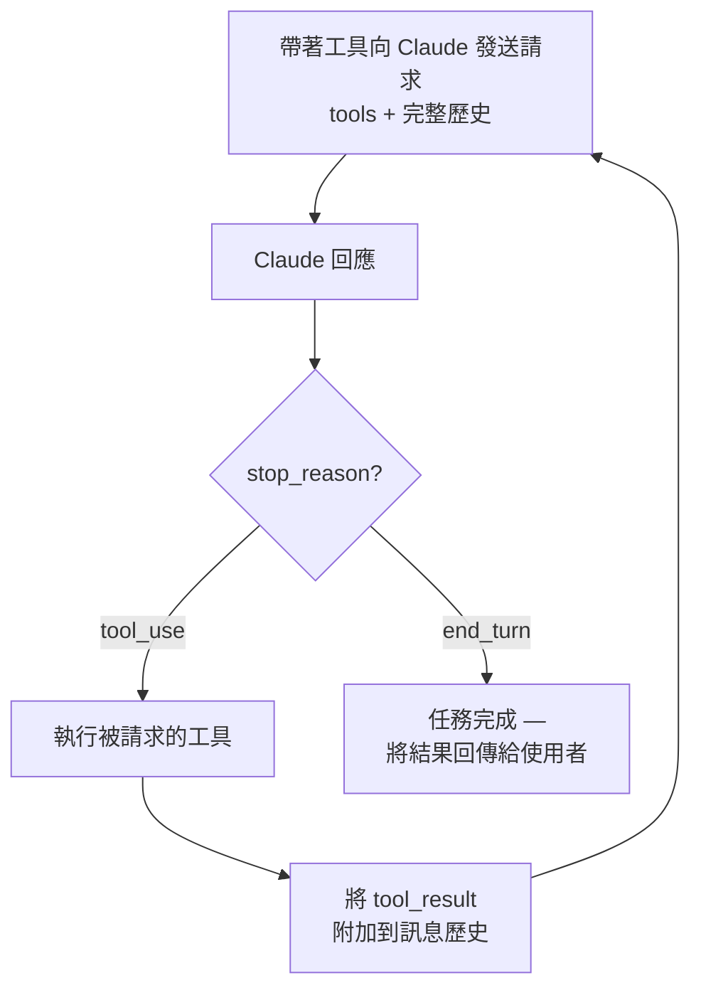
```mermaid
flowchart TD
    A[帶著工具向 Claude 發送請求<br/>tools + 完整歷史] --> B[Claude 回應]
    B --> C{stop_reason?}
    C -->|tool_use| D[執行被請求的工具]
    D --> E[將 tool_result<br/>附加到訊息歷史]
    E --> A
    C -->|end_turn| F[任務完成 —<br/>將結果回傳給使用者]
```

在程式碼中,這個迴圈其實只是一個依 `stop_reason` 分支的 `while`:

```
1. 帶著工具向 Claude 發送請求
2. 接收回應
3. 檢查 stop_reason:
   - "tool_use"  -> 執行工具,將結果附加到歷史紀錄,回到步驟 1
   - "end_turn"  -> 任務完成,將結果顯示給使用者
4. 重複直到完成
```

**這是一種模型驅動的做法:** Claude 會依據上下文與先前的工具結果,決定接下來要呼叫哪個工具。這與動作順序固定的硬編碼決策樹不同。

**反模式(應避免):**
- 解析助理文字以偵測是否完成(「Task completed」)
- 將任意的迭代上限(例如 `max_iterations=5`)當作主要的停止條件
- 檢查助理是否產生文字內容,以此作為完成訊號

**正確做法:**唯一可靠的完成訊號是 `stop_reason == "end_turn"`。

## 3.2 `AgentDefinition` 設定

`AgentDefinition` 是 Claude Agent SDK 中的代理設定物件:

```python
agent = AgentDefinition(
    name="customer_support",
    description="Handles customer requests for returns and order issues",
    system_prompt="You are a customer support agent...",
    allowed_tools=["get_customer", "lookup_order", "process_refund", "escalate_to_human"],
    # 用於協調者:
    # allowed_tools=["Task", "get_customer", ...]
)
```

**關鍵參數:**
- `name` / `description` — 代理的識別與描述
- `system_prompt` — 含指令的系統提示
- `allowed_tools` — 允許使用的工具清單(最小權限原則)

## 3.3 中心輻射式:協調者與子代理

多代理架構通常建構為中心輻射式拓撲:

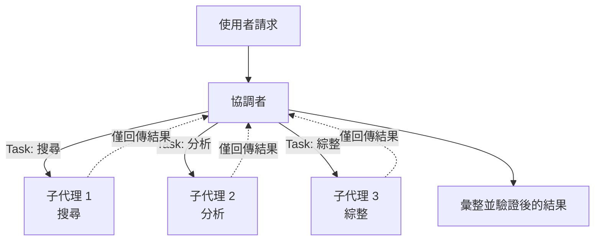
```mermaid
flowchart TD
    U[使用者請求] --> C[協調者]
    C -->|Task: 搜尋| S1[子代理 1<br/>搜尋]
    C -->|Task: 分析| S2[子代理 2<br/>分析]
    C -->|Task: 綜整| S3[子代理 3<br/>綜整]
    S1 -. 僅回傳結果 .-> C
    S2 -. 僅回傳結果 .-> C
    S3 -. 僅回傳結果 .-> C
    C --> R[彙整並驗證後的結果]
```

**協調者負責:**
- 將任務分解為子任務
- 決定需要哪些子代理(動態選擇)
- 將工作委派給子代理
- 彙整並驗證結果
- 處理錯誤與重試
- 將結果傳達給使用者

**關鍵原則:子代理擁有隔離的上下文。**
- 子代理**不會**自動繼承協調者的對話歷史紀錄
- 所有必要的上下文都必須在子代理提示中**明確傳遞**
- 子代理不會在多次呼叫之間共享記憶
- 所有溝通都透過協調者流動(以利可觀測性與錯誤控制)

## 3.4 用於生成子代理的 `Task` 工具

子代理透過 `Task` 工具生成:

```python
# 協調者的 allowedTools 必須包含 "Task"
coordinator_agent = AgentDefinition(
    allowed_tools=["Task", "get_customer"]
)
```

**明確的上下文傳遞是必要的:**

```
# 不好:子代理沒有任何上下文
Task: "分析這份文件"

# 好:提示中包含完整上下文
Task: "分析以下文件。
文件:[完整文件文字]
先前的搜尋結果:[網路搜尋結果]
輸出格式要求:[schema]"
```

**平行生成:**協調者可以在單一回應中呼叫多個 `Task`——這些子代理會平行執行:

```
# 一次協調者回應包含:
Task 1: "搜尋關於 X 的文章"
Task 2: "分析文件 Y"
Task 3: "搜尋關於 Z 的文章"
# 三者同時執行
```

## 3.5 Agent SDK 中的 Hooks

Hooks 允許在代理生命週期的特定節點進行攔截與轉換。

**PostToolUse** 會在工具結果提供給模型之前攔截它:

```python
# 範例:將來自不同 MCP 工具的日期格式正規化
@hook("PostToolUse")
def normalize_dates(tool_result):
    # 將 Unix 時間戳記轉換 -> ISO 8601
    # 將 "Mar 5, 2025" 轉換 -> "2025-03-05"
    return normalized_result
```

**對外呼叫攔截 Hook** 會阻擋違反政策的動作:

```python
# 範例:阻擋超過 $500 的退款
@hook("PreToolUse")
def enforce_refund_limit(tool_call):
    if tool_call.name == "process_refund" and tool_call.args.amount > 500:
        return redirect_to_escalation(tool_call)
```

**關鍵差異:Hooks 與提示指令**

| 屬性 | Hooks | 提示指令 |
|---|---|---|
| 保證 | **確定性**(100%) | **機率性**(>90%,並非 100%) |
| 何時使用 | 關鍵業務規則、財務操作、合規 | 一般偏好、建議、格式設定 |
| 範例 | 阻擋退款 > $500 | 「在升級前先嘗試解決」 |

**規則:** 當失敗會造成財務、法律或安全後果時——使用 Hooks,而非提示。

## 3.6 端到端案例研究:客服退款代理

上述元件唯有組合在一起才有意義。以下是一個完整、真實的代理,把整章串成一個系統——正是考試的 **Customer Support Agent(客服代理)** 情境要你能推理的設計。

### 需求

- 以自然語言處理客戶的退款/退貨請求。
- 查詢客戶與其訂單(唯讀工具)。
- 依公司政策檢核退款。
- **硬性規則:** 任何**超過 $500 的退款都必須由真人核准**——沒有例外,不交由模型裁量。
- 訂單資料來自多個工具、日期格式不一致;在模型推理前先正規化。

### 架構

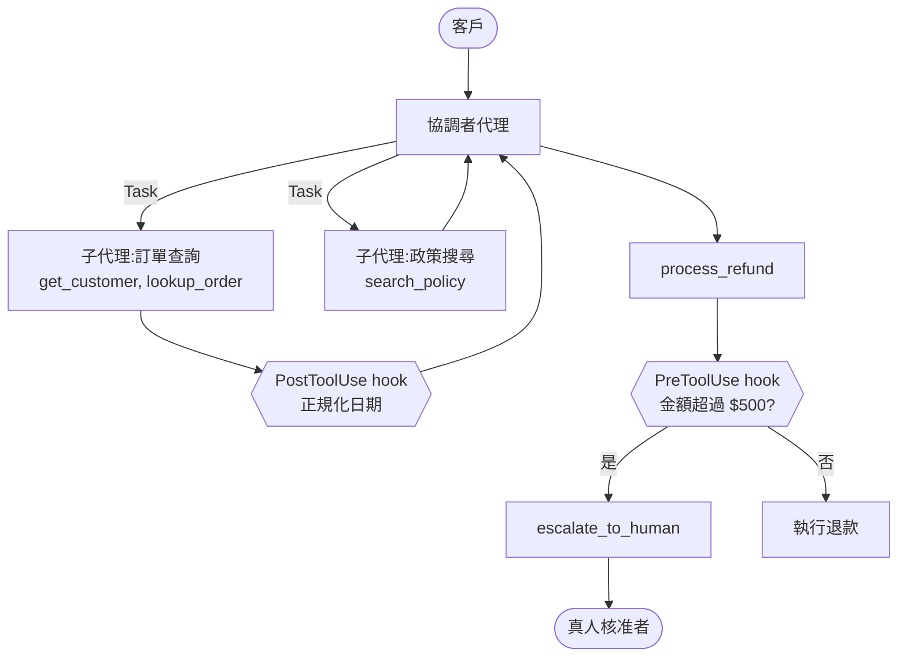
```mermaid
flowchart TD
    User([客戶]) --> Coord[協調者代理]
    Coord -->|Task| Lookup[子代理:訂單查詢<br/>get_customer, lookup_order]
    Coord -->|Task| Policy[子代理:政策搜尋<br/>search_policy]
    Lookup --> Post{{PostToolUse hook<br/>正規化日期}}
    Post --> Coord
    Policy --> Coord
    Coord --> Refund[process_refund]
    Refund --> Pre{{PreToolUse hook<br/>金額超過 $500?}}
    Pre -->|是| Esc[escalate_to_human]
    Pre -->|否| Exec[執行退款]
    Esc --> Human([真人核准者])
```

協調者掌管編排;子代理做範圍狹窄、最小權限的工作;**由 Hooks(而非提示文字)強制執行金額規則與日期正規化**,因為兩者都必須是確定性的。

### 實作

定義協調者與一個最小權限子代理:

```python
coordinator = AgentDefinition(
    name="support_coordinator",
    description="Resolves refund and return requests; escalates when required.",
    system_prompt=(
        "You help customers with refunds. Look up the order, check policy, "
        "then call process_refund. Never promise an outcome you have not executed."
    ),
    allowed_tools=["Task", "process_refund", "escalate_to_human"],
)

order_lookup = AgentDefinition(
    name="order_lookup",
    description="Reads customer and order records. Read-only.",
    system_prompt="Return the customer's order details as structured data.",
    allowed_tools=["get_customer", "lookup_order"],   # 最小權限:沒有退款能力
)
```

用 `PreToolUse` hook 確定性地強制執行 $500 規則——這正是考試要你答對的關鍵:

```python
@hook("PreToolUse")
def enforce_refund_limit(tool_call):
    if tool_call.name == "process_refund" and tool_call.args["amount"] > 500:
        # 模型無法繞過這條規則;它是程式碼,不是建議。
        return redirect(to="escalate_to_human", reason="refund_over_limit")
    return allow(tool_call)
```

用 `PostToolUse` hook 正規化每個工具回傳的日期,讓模型永遠不會看到三種日期格式:

```python
@hook("PostToolUse")
def normalize_dates(tool_result):
    tool_result["order_date"] = to_iso8601(tool_result.get("order_date"))
    return tool_result
```

### 執行軌跡

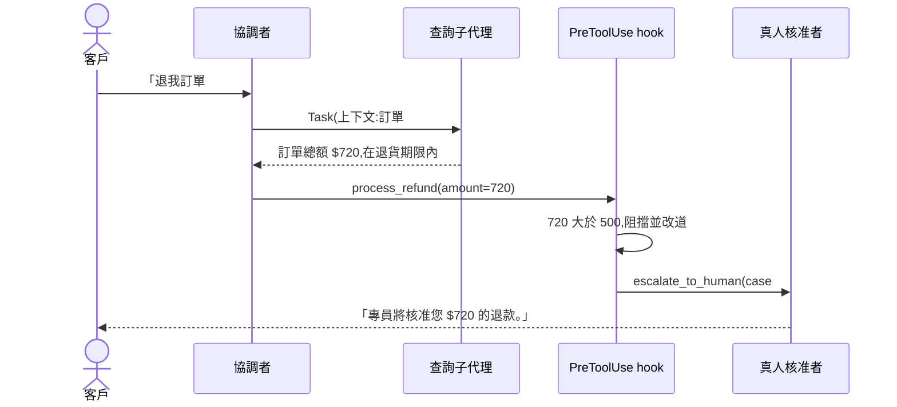
```mermaid
sequenceDiagram
    actor Cust as 客戶
    participant Co as 協調者
    participant L as 查詢子代理
    participant Pre as PreToolUse hook
    participant Hu as 真人核准者
    Cust->>Co: 「退我訂單 #1234 的款」
    Co->>L: Task(上下文:訂單 #1234 + 客戶 id)
    L-->>Co: 訂單總額 $720,在退貨期限內
    Co->>Pre: process_refund(amount=720)
    Pre->>Pre: 720 大於 500,阻擋並改道
    Pre->>Hu: escalate_to_human(case #1234)
    Hu-->>Cust: 「專員將核准您 $720 的退款。」
```

注意協調者*原本打算*直接退款;而 **hook 確定性地否決了它**。若只用提示指令(「超過 $500 的退款要升級」),模型大約 90% 的時候會遵守——對金錢來說還不夠。

### 驗證

- **確定性測試:** 連續送出 100 筆 $501 的退款,斷言出現 100 次升級。只靠提示的設計會漏;hook 設計必須 100%。
- **上下文隔離測試:** 確認查詢子代理是在它的 Task 提示中收到訂單 id——把它拿掉,子代理就應該失敗,證明上下文不會自動共享。
- **最小權限測試:** 斷言 `order_lookup` 子代理無法呼叫 `process_refund`。

### 常見陷阱

- 把 $500 規則放進系統提示而非 hook(機率性,沒有保證)。
- 忘了把訂單 id 傳進子代理的提示(隔離的上下文——見 §3.3)。
- 把「退款已處理」這類助理文字當成完成訊號,而不是 `stop_reason == "end_turn"`(§3.1)。

## 3.7 考試重點 — 關鍵整理

| 概念 | 考試考什麼 |
|---|---|
| 代理迴圈 | 唯一可靠的停止訊號是 `stop_reason == "end_turn"`——絕非解析文字或迭代上限(§3.1)。 |
| 中心輻射式 | 協調者負責分解、委派、彙整;子代理是隔離的(§3.3)。 |
| 明確上下文 | 子代理什麼都不會繼承——所有上下文都要在 `Task` 提示中傳遞(§3.4)。 |
| Hooks 與提示 | 確定性的業務/財務/合規規則 → hooks;軟性偏好 → 提示(§3.5)。 |
| 最小權限 | 每個代理的 `allowed_tools` 都是它所需的最小集合(§3.2)。 |

> **對應 Domain 1(27%)。** 如果你能建構並捍衛上面的退款代理——迴圈、委派、上下文、hooks、最小權限——你就掌握了權重最高考試領域的核心。

# 第 4 章:模型上下文協定(MCP)

> 文件:[MCP](https://modelcontextprotocol.io/) | [Tools](https://modelcontextprotocol.io/docs/concepts/tools) | [Resources](https://modelcontextprotocol.io/docs/concepts/resources) | [Servers](https://modelcontextprotocol.io/docs/concepts/servers)

如果說第 3 章談的是代理的**大腦**——迴圈、委派與 hooks——那麼本章談的就是它的**手與眼**:代理如何觸及外部世界。模型上下文協定(MCP)是一套開放標準,讓 Claude 能與你的資料庫、API 與內部服務溝通,而不必為每一個整合都寫一套客製化的黏合程式碼。本章是 **Domain 2 — 工具設計與 MCP 整合(佔考試 18%)** 的骨幹,同時直接支援 **Domain 1**(代理的能力上限取決於你接進去的工具)與 **Domain 5**(結構化的 MCP 錯誤,正是多代理系統維持可靠的方式)。

讀完你應能掌握五件事,並把它們組裝成一個可運作的整合:

- **協定與其原語**(§4.1)— Tools、Resources、Prompts,以及 client/server 的分離。
- **伺服器與傳輸**(§4.2)— 什麼是伺服器,以及 stdio 與 Streamable HTTP 的取捨。
- **設定與範圍**(§4.3)— `.mcp.json`(專案)與 `~/.claude.json`(使用者),以及機密的處理。
- **結構化錯誤**(§4.4)— `isError` 旗標,以及為何通用錯誤會破壞復原。
- **資源**(§4.5)— 消除探索性工具呼叫的唯讀「地圖」。

§4.6 接著從頭到尾建構一個完整的內部 **Deployments MCP 伺服器**——伺服器、工具、資源、傳輸,以及一道權限守門——§4.7 則濃縮考試重點。

## 4.1 什麼是 MCP

模型上下文協定(MCP)是一種用於將外部系統連接至 Claude 的開放標準。官方的比喻是 **「AI 界的 USB-C」**:你不必為每一組模型與工具的搭配各寫一個客製轉接器,而是只實作一次協定,任何相容 MCP 的客戶端(Claude Code、Agent SDK、Claude 應用程式)都能使用你的伺服器。在底層,MCP 是走在某個傳輸之上的 **JSON-RPC 2.0**——一種小巧、規格明確的訊息格式,而非只屬於 Claude 的 API。

MCP 定義了三種主要原語:

1. **Tools** — 代理可以*呼叫以執行動作*的函式(CRUD 操作、API 呼叫、命令執行)。由模型驅動:由 Claude 決定何時使用。
2. **Resources** — 代理可以*讀取以作為上下文*的資料(文件、資料庫結構描述、內容目錄)。唯讀:它們提供資訊,而不執行動作。
3. **Prompts** — 用於常見任務的預先定義提示範本,呈現給使用者(例如以斜線命令的形式)。

**心智模型是 client/server。** *host*(主機)應用程式(Claude Code、SDK)執行一個 MCP *client*;每個整合則是一個 MCP *server*——一個由你掌控的獨立程序。兩者透過某個傳輸溝通(§4.2)。

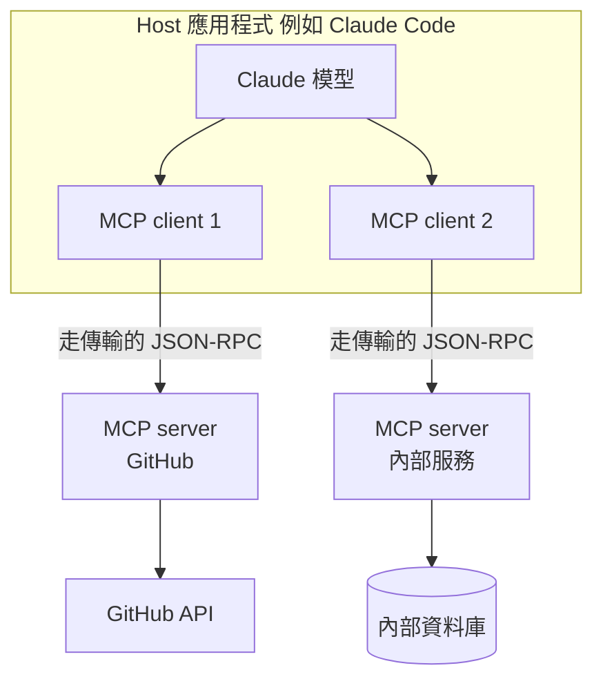
```mermaid
flowchart TD
    subgraph Host[Host 應用程式 例如 Claude Code]
        Model[Claude 模型]
        C1[MCP client 1]
        C2[MCP client 2]
    end
    Model --> C1
    Model --> C2
    C1 -->|走傳輸的 JSON-RPC| S1[MCP server<br/>GitHub]
    C2 -->|走傳輸的 JSON-RPC| S2[MCP server<br/>內部服務]
    S1 --> EXT1[GitHub API]
    S2 --> DB[(內部資料庫)]
```

**為何這種分離很重要(以及考試會探問什麼):** 因為每個伺服器都是位於標準協定之後的獨立程序,你能得到隔離性(伺服器當掉不會拖垮主機)、各伺服器獨立的認證,以及跨主機的重用。考試把 MCP 定位為*整合層*——也就是你在不修改代理本身的前提下,賦予代理新能力的方式。

**Tools 與 Resources 的區分是反覆出現的考點。** 一個常見錯誤是把唯讀資料以工具的形式暴露。如果代理只需要*知道*某件事(服務清單、結構描述),那它就是 **Resource**。如果它需要*對某件事採取*帶有副作用的動作(觸發部署、寫入一列),那它就是 **Tool**。弄錯這點會膨脹工具數量——而根據 Domain 2,這會直接傷害工具選擇的可靠性。

## 4.2 MCP 伺服器與傳輸

**MCP 伺服器**是一個實作 MCP 協定、並暴露工具、資源或提示的程序。當客戶端連接至伺服器時:

- 所有工具都會在連接時**自動被探索**(客戶端呼叫 `tools/list`)。
- 來自**所有已連接伺服器的工具會一次全部可用**給模型。
- **工具描述決定了模型將如何使用它們**——描述是主要的選擇訊號(Domain 2.1)。描述含糊就代表選擇不可靠。

為避免跨伺服器的名稱衝突,主機會為工具加上命名空間。在 Claude Code 中,某伺服器的工具會以 `mcp__<server>__<tool>` 的形式出現——例如名為 `deployments` 的伺服器上的 `query_status` 工具,就是 `mcp__deployments__query_status`。當你為工具設定許可清單或強制 `tool_choice` 時,就引用這個完整名稱。

### stdio 與 Streamable HTTP

MCP 定義了**兩種標準傳輸**,而在兩者之間做選擇,是考試預期你能做出的架構決策:

| | **stdio** | **Streamable HTTP** |
|---|---|---|
| 拓撲 | 本地子程序(由主機啟動) | 遠端服務(POST 請求 + SSE 串流) |
| 最適合 | 本地工具、開發、單一使用者、檔案系統/CLI 存取 | 團隊共用伺服器、託管 SaaS 整合 |
| 認證 | 以環境為基礎的憑證(環境變數) | OAuth 2.0 |
| 生命週期 | 主機產生/結束該程序 | 由你部署並維運的長時運行服務 |

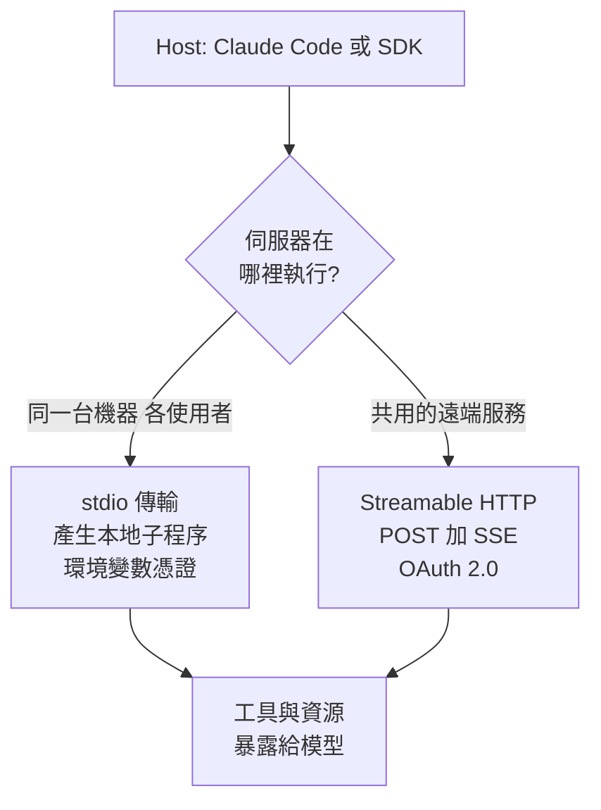
```mermaid
flowchart TD
    H[Host: Claude Code 或 SDK] --> D{伺服器在<br/>哪裡執行?}
    D -->|同一台機器 各使用者| STDIO[stdio 傳輸<br/>產生本地子程序<br/>環境變數憑證]
    D -->|共用的遠端服務| HTTP[Streamable HTTP<br/>POST 加 SSE<br/>OAuth 2.0]
    STDIO --> R[工具與資源<br/>暴露給模型]
    HTTP --> R
```

**陷阱與考試角度:**

- **舊的純 SSE 傳輸已被棄用。** 如果題目把「SSE 傳輸」當作現代的遠端選項,當前正確答案是 **Streamable HTTP**(POST + SSE)。不要選舊的 SSE。
- **讓傳輸符合認證模型。** 一個持有特權憑證的團隊共用伺服器,應該採用 **Streamable HTTP 搭配 OAuth**,而不是讓每個使用者各自貼上 token 的 stdio 伺服器。反過來,個人的本地檔案系統工具應採用 **stdio 搭配環境變數**——為它架設一個 OAuth 服務是過度設計。
- **伺服器並不是「Claude code」。** 它是一個通用程序。同一個 `deployments` 伺服器可以同時服務 Claude Code、Agent SDK 與 Claude 桌面應用程式——這種重用正是這套標準的重點。

對於*遠端*伺服器,Messages API 中還有 **MCP connector**:Claude 可以在伺服器端直接呼叫遠端 MCP 伺服器,完全不需本地客戶端——你傳入一個 `mcp_servers` 項目,外加 `tools` 中一個對應的 `mcp_toolset`。這是 Claude Code HTTP 伺服器在 API 層級的對應物;傳輸的部分(HTTP + OAuth)是一樣的。

## 4.3 設定 MCP 伺服器

你在哪裡註冊伺服器,決定了**誰能使用它**——這個範圍決策正是 Domain 2.4 的考點。

**專案設定(`.mcp.json`)** — 供團隊使用:

```json
{
  "mcpServers": {
    "github": {
      "command": "npx",
      "args": ["-y", "@modelcontextprotocol/server-github"],
      "env": {
        "GITHUB_TOKEN": "${GITHUB_TOKEN}"
      }
    },
    "jira": {
      "command": "npx",
      "args": ["-y", "mcp-server-jira"],
      "env": {
        "JIRA_TOKEN": "${JIRA_TOKEN}"
      }
    }
  }
}
```

**重點:**
- `.mcp.json` 儲存於**專案根目錄,並由版本控制管理**,因此每位貢獻者在簽出時都會取得相同的伺服器。
- **環境變數(`${GITHUB_TOKEN}`)用於存放機密**——被提交的是變數*參照*,而非 token 本身。這是核心的機密管理模式:絕不要把 token 硬編碼進 `.mcp.json`。
- 對所有專案貢獻者皆可用。

**使用者設定(`~/.claude.json`)** — 供個人/實驗性伺服器使用:
- 儲存於使用者的家目錄。
- **不透過版本控制共用。**
- 適合個人實驗與測試。

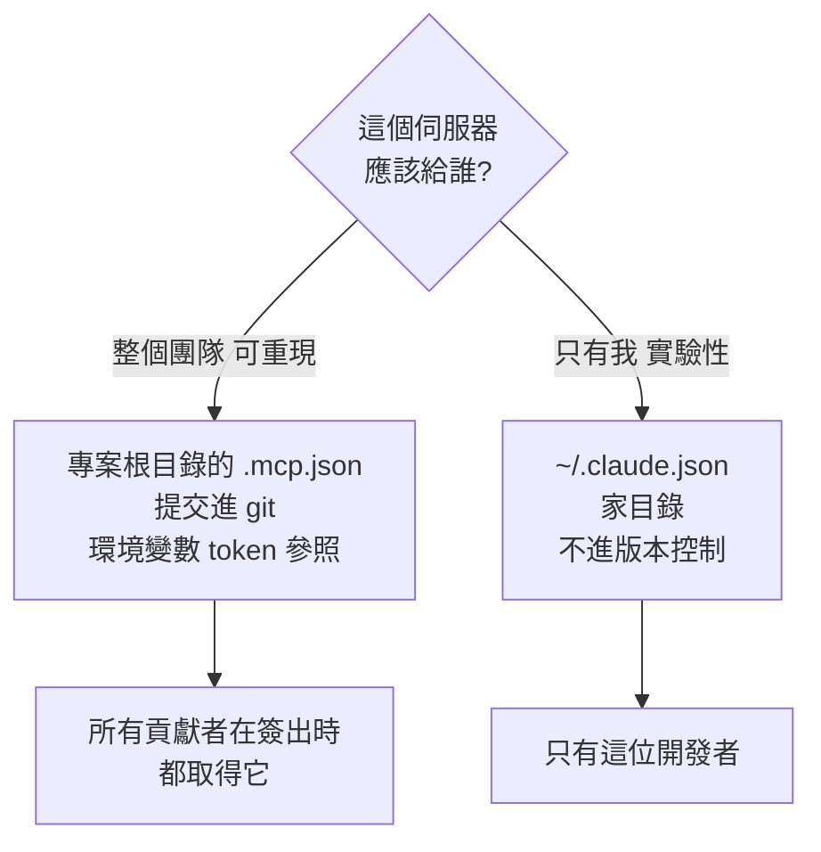
```mermaid
flowchart TD
    Q{這個伺服器<br/>應該給誰?}
    Q -->|整個團隊 可重現| PROJ[專案根目錄的 .mcp.json<br/>提交進 git<br/>環境變數 token 參照]
    Q -->|只有我 實驗性| USER[~/.claude.json<br/>家目錄<br/>不進版本控制]
    PROJ --> TEAM[所有貢獻者在簽出時<br/>都取得它]
    USER --> SOLO[只有這位開發者]
```

**從 CLI 新增伺服器。** 在 Claude Code 中,你不必手動編輯 JSON:`claude mcp add` / `claude mcp list` / `claude mcp remove` 可管理伺服器,而 `--scope user` 與 `--scope project` 則選擇要寫入哪個檔案。對於需要 OAuth 的 HTTP 伺服器,在工作階段中執行 `/mcp` 即可授權。對於「如何讓每位開發者都取得相同的伺服器,而不必各自手動編輯設定」這個問題,考試的正確答案就是:把它放進**專案的 `.mcp.json`**,提交一次即可。

**選擇伺服器:**
- 對於**標準整合(Jira、GitHub、Slack),優先採用現有的社群 MCP 伺服器**——它們有人維護且經過實戰考驗。
- **只有針對沒有任何社群伺服器涵蓋、且獨特的團隊專屬工作流程,才自行建置伺服器**(這正是 §4.6 的案例研究)。

**上下文成本 — MCP 工具搜尋。** 每個已連接伺服器的工具都會被載入上下文,十幾個伺服器可能讓模型湧入數百個工具——膨脹上下文並*降低*選擇品質(Domain 2.3:工具太多會降低可靠性)。Claude Code 的 **MCP 工具搜尋**透過按需延遲載入工具(而非一次預先載入全部)來緩解此問題,組織也可以推送一份全組織的 `managed-mcp.json`。重點是:連接一個伺服器並非沒有代價;工具數量是一種預算。

## 4.4 MCP 中的 `isError` 旗標

當 MCP 工具遇到錯誤時,它會在回應中設定 **`isError: true`**。這會向代理發出該呼叫失敗的訊號——但*光是發出失敗訊號還不夠*。代理的下一步(重試?變更查詢?升級?放棄?)完全取決於那是**哪一種**失敗。這是 Domain 2.2 的核心,也是 Domain 5 的可靠性關切。

**結構化錯誤(良好):**

```json
{
  "isError": true,
  "content": {
    "errorCategory": "transient",
    "isRetryable": true,
    "message": "The service is temporarily unavailable. Timeout while calling the orders API.",
    "attempted_query": "order_id=12345",
    "partial_results": null
  }
}
```

**通用錯誤(反模式):**

```json
{
  "isError": true,
  "content": "Operation failed"
}
```

通用錯誤無法為代理的決策提供任何資訊——它應該重試、變更查詢,還是升級?結構化的版本則能精確地告訴它。

**考試預期你能區分的錯誤類別:**

| 類別 | 含義 | 可重試? | 代理的正確回應 |
|---|---|---|---|
| `transient` | 逾時、服務短暫中斷 | **是** | 重試(最好搭配退避) |
| `validation` | 輸入錯誤(id 格式錯誤、缺欄位) | 否 | 修正參數後再重試 |
| `business` | 政策/規則違反(例如超過上限) | **否** | 停止並向使用者說明;不要重試同一個呼叫 |
| `permission` | 呼叫者缺乏存取權 | 否 | 升級/請求存取權——與「無結果」截然不同 |

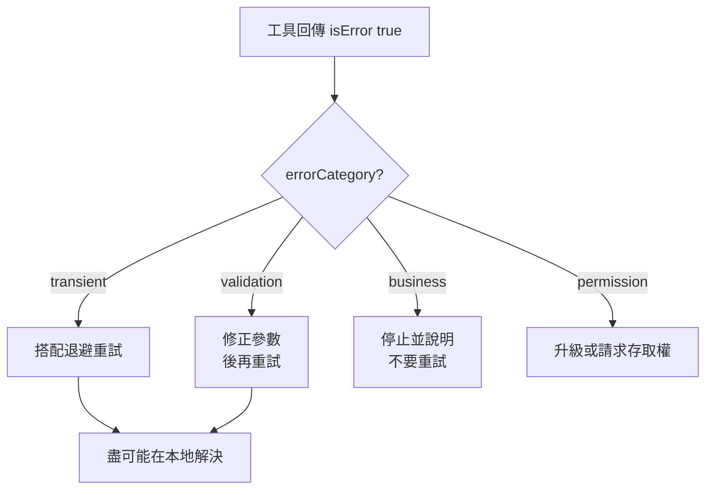
```mermaid
flowchart TD
    E[工具回傳 isError true] --> CAT{errorCategory?}
    CAT -->|transient| RETRY[搭配退避重試]
    CAT -->|validation| FIX[修正參數<br/>後再重試]
    CAT -->|business| STOP[停止並說明<br/>不要重試]
    CAT -->|permission| ESC[升級或請求存取權]
    RETRY --> OK[盡可能在本地解決]
    FIX --> OK
```

**陷阱與考試角度:**

- **對業務規則違反使用 `isRetryable: false`**,並附上清楚、面向使用者的說明。把政策失敗標為可重試,會讓代理陷入毫無意義的重試迴圈。
- **空結果不是錯誤。** 一個合法地什麼都沒找到的搜尋,應回傳 `isError: false` 並附上空結果集——而*非* `isError: true`。把「無相符項」與「存取失敗」混為一談,會讓代理在本該只回報「找不到」時去升級(Domain 2.2)。
- **在本地復原,有選擇地向上傳遞。** 子代理應自行解決暫時性失敗(重試),只把它確實無法解決的錯誤向上傳遞給協調者——這能讓錯誤雜訊不流入中心輻射式系統(Domain 5.3)。

## 4.5 MCP 資源

**Resources** 是代理可以請求以取得上下文、但**不採取行動**的資料。工具負責*執行*,資源則負責*提供資訊*:

- 內容目錄(例如所有專案任務的清單、階層式導覽)。
- 資料庫結構描述(在查詢前理解資料結構)。
- 文件(API 參考、內部指南)。
- 議題/任務摘要。

**資源的優勢:** 代理**不需要**透過探索性的工具呼叫,就能發現有哪些資料存在。資源提供了一份即時的**「地圖」**。少了它,代理可能光是為了在做任何實質工作之前搞清楚系統的樣貌,就燒掉三、四次工具呼叫(以及它們所耗費的 token 與延遲)。


```mermaid
flowchart TD
    subgraph Without[沒有資源]
        A1[代理猜測] --> A2[工具呼叫: 列出 X]
        A2 --> A3[工具呼叫: 描述 X]
        A3 --> A4[工具呼叫: 尋找 Y]
        A4 --> A5[終於採取行動]
    end
    subgraph With[有目錄資源]
        B1[讀取資源: 那份地圖] --> B2[直接採取行動]
    end
```

**陷阱與考試角度:**

- **不要把唯讀的上下文塑造成工具。** 如果代理只需要*讀取*服務目錄,就把它暴露為 **Resource**,而非一個 `list_services` 工具。這能壓低工具數量(有助於選擇),並正確地傳達意圖。
- **資源能削減探索性的工具呼叫**,這正是考試使用的措辭——它們用一次預先讀取,換掉多次來回往返。這既是上下文管理的勝利(Domain 5),也是工具設計的勝利(Domain 2)。
- 資源**依定義即為唯讀**——它們從不帶有副作用。如果你發現自己想讓資源「順便更新」某件事,那你其實要的是一個工具。

## 4.6 端到端案例研究:一個內部「Deployments」MCP 伺服器

上述的各個零件,唯有組裝在一起時才有意義。以下是一個完整、貼近真實的 MCP 伺服器——正是 §4.3 所說、你應該自行建置的那種*獨特、團隊專屬*的整合,也正是考試的 MCP 整合情境會探問的設計。

### 需求

某平台團隊希望 Claude Code 能在事故處理期間提供協助。代理必須能夠:

- **檢視服務目錄**——每個服務、其擁有者與目前版本——而不必進行探索性呼叫。
- **查詢某個服務的部署狀態**(唯讀)。
- **觸發回滾(rollback)**,把某個服務退回到前一個版本(一個帶有真實後果的*動作*)。
- **硬性規則:** 對**生產環境**服務的回滾,除非呼叫者持有明確的 `prod-rollback` 授權,否則必須**在協定層級被拒絕**——絕不交由模型自行裁量。
- 回傳**結構化錯誤**,讓代理能正確復原(重試一次不穩定的狀態檢查,但絕不重試一個被拒絕的生產回滾)。
- 為待命工程師在本地以 **stdio** 執行,而同一個伺服器也作為團隊共用的 **Streamable HTTP** 服務(OAuth)執行。

### 架構

```mermaid
flowchart TD
    User([待命工程師]) --> CC[Claude Code host]
    CC -->|走 stdio 或 HTTP 的 JSON-RPC| Srv[Deployments MCP server]
    Srv --> Res[[Resource: service-catalog<br/>唯讀地圖]]
    Srv --> T1[Tool: query_status<br/>唯讀]
    Srv --> T2[Tool: trigger_rollback<br/>動作]
    T2 --> Guard{生產環境 且 無授權?}
    Guard -->|是| Deny[回傳 isError<br/>permission 不可重試]
    Guard -->|否| Exec[執行回滾]
    T1 --> DEP[(部署系統)]
    Exec --> DEP
```

**目錄是一個 Resource**(唯讀的上下文,無探索性呼叫);**狀態與回滾是 Tools**(狀態用於讀取,回滾用於動作);**生產守門位於伺服器中**,而非位於提示裡——因此無論是哪個主機或模型連接進來,它都成立。

### 實作

一個使用 Python MCP SDK 的最小伺服器。目錄是一個資源;狀態與回滾是工具;生產守門回傳一個**結構化的權限錯誤**。

```python
from mcp.server import Server
from mcp.types import Tool, Resource, TextContent
import mcp.server.stdio

app = Server("deployments")

# --- Resource: the service catalog (read-only "map") ---
@app.list_resources()
async def list_resources() -> list[Resource]:
    return [Resource(
        uri="catalog://services",
        name="Service catalog",
        description="All services, owners, and current versions.",
        mimeType="application/json",
    )]

@app.read_resource()
async def read_resource(uri: str) -> str:
    # Returns the catalog JSON: [{service, owner, env, version}, ...]
    return get_service_catalog_json()

# --- Tools ---
@app.list_tools()
async def list_tools() -> list[Tool]:
    return [
        Tool(name="query_status",
             description="Read the current deployment status of one service. Read-only.",
             inputSchema={"type": "object",
                          "properties": {"service": {"type": "string"}},
                          "required": ["service"]}),
        Tool(name="trigger_rollback",
             description="Roll a service back to its previous version. Mutating action.",
             inputSchema={"type": "object",
                          "properties": {"service": {"type": "string"}},
                          "required": ["service"]}),
    ]

@app.call_tool()
async def call_tool(name: str, args: dict) -> list[TextContent]:
    if name == "query_status":
        try:
            status = deployment_api.status(args["service"])
        except TimeoutError:
            return error("transient", retryable=True,
                         message="Deployment API timed out; safe to retry.")
        return ok(status)

    if name == "trigger_rollback":
        svc = catalog.get(args["service"])
        # The production guard — code, not a prompt. The model cannot bypass it.
        if svc.env == "production" and not caller_has_grant("prod-rollback"):
            return error("permission", retryable=False,
                         message="Production rollback denied: 'prod-rollback' grant required.")
        result = deployment_api.rollback(args["service"])
        return ok(result)
```

結構化錯誤的輔助函式讓每一個失敗都保持機器可讀(§4.4):

```python
def error(category, retryable, message):
    payload = {"errorCategory": category, "isRetryable": retryable, "message": message}
    return [TextContent(type="text", text=json.dumps(payload))]  # isError set on the response
```

在本地以 **stdio** 執行:

```python
async def main():
    async with mcp.server.stdio.stdio_server() as (read, write):
        await app.run(read, write, app.create_initialization_options())
```

把它註冊為**專案**伺服器,讓整個團隊在簽出時都取得它(§4.3)——以 stdio 供本地使用,並搭配一個團隊共用的 HTTP+OAuth 部署:

```json
{
  "mcpServers": {
    "deployments": {
      "command": "python",
      "args": ["-m", "deployments_server"],
      "env": { "DEPLOY_API_TOKEN": "${DEPLOY_API_TOKEN}" }
    }
  }
}
```

在 Claude Code 中,這些工具現在會以 `mcp__deployments__query_status` 與 `mcp__deployments__trigger_rollback` 出現,目錄則作為一個可讀取的資源。

### 執行軌跡

一位待命工程師請 Claude Code 回滾一個他無權操作的生產環境服務:

```mermaid
sequenceDiagram
    actor Eng as 待命工程師
    participant CC as Claude Code
    participant S as Deployments server
    participant G as 生產守門
    Eng->>CC: 「回滾 checkout-api,它在報錯」
    CC->>S: 讀取資源 catalog://services
    S-->>CC: checkout-api 屬於 env production
    CC->>S: 呼叫 trigger_rollback(checkout-api)
    S->>G: 生產環境 且 無 prod-rollback 授權?
    G-->>S: 拒絕
    S-->>CC: isError permission 不可重試
    CC-->>Eng: 「已阻擋:生產回滾需要 prod-rollback 授權。正在升級。」
```

請注意 Claude *本想*直接回滾;**伺服器的守門確定性地拒絕了它**,而且因為該錯誤被歸類為 `permission`/不可重試,代理選擇了升級而非陷入迴圈。一條提示指令(「未經核准不要回滾生產環境」)只會在約 90% 的時候被遵守——對生產環境而言並不夠好。

### 驗證

- **權限測試:** 在沒有授權的情況下,對一個生產環境服務呼叫 `trigger_rollback` 100 次;斷言收到 100 個結構化的 `permission` 錯誤、零次回滾。這道守門必須是 100%,如同 §3.5 的金額規則。
- **錯誤類別測試:** 模擬一次 `query_status` 逾時並斷言得到 `transient`/`retryable: true`;模擬一次被拒絕的生產回滾並斷言得到 `permission`/`retryable: false`。代理應重試前者、且絕不重試後者。
- **資源 vs 工具測試:** 確認目錄可透過 `read_resource` 取得(無工具呼叫)——證明代理不必經由探索性呼叫就能得到它的「地圖」(§4.5)。
- **空結果 vs 錯誤測試:** 查詢一個不存在的服務,應是一個乾淨的「找不到」結果,而非 `isError: true`(§4.4)。

### 常見陷阱

- 把生產回滾規則放進系統提示,而非放進**伺服器守門**(機率性,而非有保證——見 §3.5 與 §4.4)。
- 把目錄暴露為一個 `list_services` **工具**,而非一個 **Resource**,膨脹了工具數量並逼出探索性呼叫(§4.5)。
- 回傳 `"Operation failed"` 而非一個已歸類的錯誤,使代理無法分辨一個可重試的逾時與一個硬性拒絕(§4.4)。
- 把 `DEPLOY_API_TOKEN` 硬編碼進 `.mcp.json`,而非使用 `${...}` 環境變數參照(§4.3)。
- 為共用的遠端部署選擇了舊版 **SSE**,而非 **Streamable HTTP**(§4.2)。

## 4.7 考試重點 — 關鍵要點

| 概念 | 考試測什麼 |
|---|---|
| 原語 | Tools *執行動作*、Resources *提供資訊*(唯讀)、Prompts 是範本;MCP 是開放的 JSON-RPC 標準,「AI 界的 USB-C」(§4.1)。 |
| Client/server | 主機執行 client;每個整合都是一個獨立的伺服器程序——隔離性與跨主機重用(§4.1)。 |
| 傳輸 | **stdio**(本地子程序,環境變數認證)vs **Streamable HTTP**(遠端,OAuth);舊的純 SSE 已被棄用(§4.2)。 |
| 範圍與機密 | `.mcp.json`(專案、提交、團隊)vs `~/.claude.json`(使用者);token 用 `${VAR}`——絕不提交機密本身(§4.3)。 |
| 工具數量 | 所有已連接伺服器的工具會一次載入;太多會降低選擇品質——MCP 工具搜尋採延遲載入(§4.2–4.3)。 |
| 結構化錯誤 | `isError` + `errorCategory`/`isRetryable`;transient→重試,business/permission→停止;空結果 ≠ 錯誤(§4.4)。 |
| 資源 | 消除探索性工具呼叫的唯讀「地圖」;不要把唯讀上下文塑造成工具(§4.5)。 |

> **對應 Domain 2(18%)**,並直接支援 Domain 1(工具即代理的能力)與 Domain 5(結構化錯誤讓多代理系統維持可靠)。只要你能建構並捍衛上述的 Deployments 伺服器——原語、傳輸、範圍、伺服器端守門,以及已歸類的錯誤——你就掌握了 MCP 整合領域的核心。

# 第 5 章:Claude Code — 設定與工作流程

> 文件:[Claude Code](https://code.claude.com/docs/en/overview) | [Memory / CLAUDE.md](https://code.claude.com/docs/en/memory) | [Skills](https://code.claude.com/docs/en/skills) | [MCP](https://code.claude.com/docs/en/mcp) | [Hooks](https://code.claude.com/docs/en/hooks) | [Sub-agents](https://code.claude.com/docs/en/sub-agents) | [Settings](https://code.claude.com/docs/en/settings) | [GitHub Actions](https://code.claude.com/docs/en/github-actions) | [Headless](https://code.claude.com/docs/en/headless)

第 3、4 章是用**程式**建構代理——你親手寫的迴圈、子代理、hooks 與 MCP。**Claude Code 則是同一套機制,以「可設定的工具」形式交付**,而非你呼叫的函式庫。這裡考試考的技能是**設定**:把正確的指令放進正確的檔案、為規則設定範圍讓它只在相關時才載入、以確定性方式管控危險工具,並把 Claude Code 接進團隊的 CI。本章是 **Domain 3 — Claude Code 設定與工作流程(佔考試 20%)** 的骨幹——僅次於代理編排,是第二大領域。

讀完你應能掌握六根支柱,並把它們組裝成可供團隊使用的設定:

- **CLAUDE.md 階層**(§5.1–5.3)— 指令放在哪、`@path` 匯入如何使其模組化,以及 `.claude/rules/` 如何**條件式**載入慣例。
- **可重複使用的工作流程**(§5.4–5.5)— 自訂斜線命令與技能,包含 `context: fork` 隔離與 `allowed-tools` 限制。
- **設定、權限與 hooks**(§5.6)— `settings.json` 的優先順序、逐工具的 allow/ask/deny,以及用於確定性強制執行的生命週期 hooks。
- **規劃 vs 直接執行**(§5.7)— 何時先調查再核准,何時直接動手。
- **上下文與工作階段管理**(§5.8、§5.10)— `/compact`、`/memory`、`--resume` 與 `fork_session`。
- **CI/CD 整合**(§5.9)— headless 的 `-p`、結構化 JSON 輸出,以及審查工作階段的隔離。

§5.11 接著從頭到尾組裝一個完整的**團隊上線設定**——階層、規則、一個技能、一個 MCP 伺服器、一個權限 hook,以及 CI——§5.12 則濃縮考試重點。

## 5.1 CLAUDE.md 階層

CLAUDE.md 是 Claude Code 在啟動時自動載入、並在每一回合作為上下文注入的指令檔。它具有三層階層,而且**所有適用的層級會被合併**,而非互相覆寫:

```
1. User-level: ~/.claude/CLAUDE.md
   - 僅套用於該使用者、該機器
   - 不透過 VCS 共享
   - 個人偏好與工作風格(例如「用中文解釋」)

2. Project-level: .claude/CLAUDE.md 或根目錄的 CLAUDE.md
   - 套用於所有專案貢獻者
   - 透過 VCS 管理(已提交、經審查、共享)
   - 程式碼規範、測試規範、架構決策

3. Directory-level: 子目錄中的 CLAUDE.md
   - 在處理該目錄中的檔案時套用(按需載入)
   - 該部分程式碼庫特有的慣例
```

**為何要有階層。** 這三層把三種對象與三種生命週期分開:*你*(個人,從不共享)、*團隊*(版控,像程式碼一樣審查),以及*某個子樹*(在別處只會變成雜訊的在地慣例)。把指令放在錯誤的層級,正是考試最常考的 Claude Code 設定錯誤。

```mermaid
flowchart TD
    Start[Claude Code 開始一回合] --> U[載入 user CLAUDE.md<br/>個人偏好]
    U --> P[載入 project CLAUDE.md<br/>團隊標準]
    P --> Q{正在編輯<br/>某子目錄中的檔案?}
    Q -->|是| D[同時載入該<br/>目錄的 CLAUDE.md]
    Q -->|否| Skip[略過目錄層級]
    D --> Merge[將所有層級<br/>合併進上下文]
    Skip --> Merge
    Merge --> Run[Claude 帶著<br/>合併後的指令行動]
```

**常見錯誤(考試最愛):** 新進團隊成員收不到專案標準,因為有人把它放進 `~/.claude/CLAUDE.md`(user-level,從不提交)而非 `.claude/CLAUDE.md`(project-level,在 VCS 中)。要背的診斷問題是:*「在隊友筆電上重新 `git clone` 一次,看得到這條指令嗎?」* 若必須看得到,它就屬於 **project** 層級。若那是不該強加於他人的個人習慣,它就屬於 **user** 層級。

**考試角度:** 區分每一層服務*誰*。個人風格 → user。團隊契約 → project(已提交)。在別處只會變成雜訊的子樹專屬慣例 → directory。

## 5.2 `@path` 語法(檔案匯入)

龐大的 CLAUDE.md 難以審查,還會讓內容在各套件間重複。CLAUDE.md 可以使用 `@path` 參照外部檔案,使設定模組化:

```markdown
# Project CLAUDE.md

Coding standards are described in @./standards/coding-style.md
Test requirements are in @./standards/testing-requirements.md
Project overview is in @README.md and dependencies are in @package.json
```

**`@path` 的規則:**
- 在檔案路徑前緊接著使用 `@`(沒有空格)。
- 支援相對路徑與絕對路徑。
- 相對路徑會相對於包含該匯入的檔案來解析。
- 最大匯入巢狀深度為 5(被匯入的檔案本身還可再匯入,最多五層)。

**為何重要。** 匯入讓每項標準都有單一權威來源。一個 monorepo 可以只保留一份 `standards/testing.md`,讓各套件的 CLAUDE.md 只拉進它真正需要的標準——`web/` 套件匯入 React 規則、`api/` 套件匯入服務規則,兩者都不背負對方的雜訊。它也讓你能把既有專案檔案直接當成上下文重用(`@README.md`、`@package.json`),而不必把它們改寫進 CLAUDE.md——改寫版本會逐漸過時。

**陷阱:** `@` 後面有空格會破壞匯入(它變成純文字);相對路徑是從*匯入檔案所在*的目錄解析,而非儲存庫根目錄,所以搬動一個 CLAUDE.md 可能會悄悄弄壞它的匯入;而深度 5 的限制意味著層層串接的匯入可能在沒有明顯錯誤的情況下被截斷。

**考試角度:** 當題目問如何避免在十個套件間重複同一份測試標準,答案是用 `@path` 匯入單一共享檔案——不是複製貼上,也不是一個巨大的根 CLAUDE.md。

## 5.3 `.claude/rules/` 目錄

`.claude/rules/` 是單一龐大 CLAUDE.md 的替代方案,用於依主題組織規則:

```
.claude/rules/
  testing.md          -- 測試慣例
  api-conventions.md  -- API 慣例
  deployment.md       -- 部署規則
  react-patterns.md   -- React 模式
```

**關鍵特性:使用 `paths` 的 YAML frontmatter 進行條件式載入:**

```yaml
---
paths: ["src/api/**/*"]
---

For API files, use async/await with explicit error handling.
Each endpoint must return a standard response wrapper.
```

```yaml
---
paths: ["**/*.test.tsx", "**/*.test.ts"]
---

Tests must use describe/it blocks.
Use data factories instead of hardcoding.
Do not mock the database—use a test database.
```

**運作方式:**
- 只有在 Claude Code 觸及符合 `paths` glob 的檔案時,規則才會被載入。
- 這可以節省上下文與 tokens——不相關的規則永遠不會被載入,讓模型的視窗專注在正在編輯的內容上。
- Glob 模式讓你能依*檔案類型*套用慣例,而不受*位置*影響(對於散落在程式碼庫各處的測試而言相當理想)。

**為何條件式載入勝過一個大檔案。** CLAUDE.md 的每一行,在*每一*回合都要付出代價,不論它是否相關。一個 600 行的龐然大物會在你編輯 CSS 時還花上下文描述 Terraform 慣例。路徑範圍規則把這件事反轉:Terraform 規則在你打開 `.tf` 檔案之前都是隱形的,然後在它能幫上忙時恰好出現。這與 MCP 資源(第 4 章)和工具搜尋背後「只載入相關內容」的原則相同——上下文是一筆預算,而規則讓你按需花用。

**何時使用搭配 `paths` 的 `.claude/rules/`,而非 directory-level CLAUDE.md:**
- 搭配 `paths` 的 `.claude/rules/` — 當慣例適用於**散布在許多目錄中**的檔案時(測試、遷移、`*.tf`)。像 `**/*.test.ts` 這樣的 glob 不論它們落在何處都能一網打盡。
- Directory-level CLAUDE.md — 當慣例**與某個特定目錄綁定**,且其他地方不需要時。

**陷阱:** 當測試檔案散落在數十個資料夾時,卻為測試寫一個 directory-level CLAUDE.md——你就得把它複製到每一個資料夾。glob 規則才是可維護的選擇。反過來說,為只會套用到單一資料夾的事物寫 glob 規則則是過度設計;一個 directory CLAUDE.md 更簡單。

**考試角度:**「慣例依檔案類型橫跨許多目錄」→ 帶 glob 的路徑範圍規則。「慣例屬於單一資料夾」→ directory CLAUDE.md。

## 5.4 自訂斜線命令與技能

> **注意:**在目前的 Claude Code 版本中,自訂命令(`.claude/commands/`)已與技能(`.claude/skills/`)整合。兩種格式都會建立 `/name` 命令。考試指南所引用的是 `.claude/commands/`——該格式仍受支援。

斜線命令是透過 `/name` 叫用的**可重複使用提示範本**。與其每次重打「審查這份 diff 找安全問題、檢查 OWASP top 10、並行內回報」,你只要存一次,然後叫用 `/review`。

**`.claude/commands/` 格式(舊版,仍受支援):**

```
.claude/commands/
  review.md        -- /review -- 標準程式碼審查
  test-gen.md      -- /test-gen -- 測試產生
```

**`.claude/skills/` 格式(目前):**

```
.claude/skills/
  review/SKILL.md  -- /review -- 含 frontmatter 設定
  test-gen/SKILL.md
```

**專案命令**(`.claude/commands/` 或 `.claude/skills/`):
- 儲存在 VCS 中,且任何人在複製儲存庫時都能取用。
- 確保團隊間**工作流程一致**——每位開發者的 `/review` 都做同一件事。

**使用者命令**(`~/.claude/commands/` 或 `~/.claude/skills/`):
- 不透過 VCS 分享的個人命令。
- 用於你不想強加於隊友的個人工作流程。

**為何這是設定問題,而不只是便利性。** 斜線命令把*臨時指令*變成*版控產物*。一旦 `/review` 住進儲存庫,審查提示就會像其他程式碼一樣被審查、隨時間改進,而且不會在工程師之間漂移。這正是考試所獎勵的團隊一致性特性。

**考試角度:**「團隊每個人都應跑同一套審查/測試流程」→ 放在 `.claude/` 的專案命令(已提交)。「我的個人捷徑」→ 放在 `~/.claude/` 的使用者命令。

## 5.5 技能 — `.claude/skills/`

技能是透過 SKILL.md frontmatter 設定的進階命令——是從純提示範本升級為*受治理*範本的路徑:

```yaml
---
context: fork
allowed-tools: ["Read", "Grep", "Glob"]
argument-hint: "要分析的目錄路徑"
---

分析指定目錄中的程式碼結構。
輸出一份關於相依性與架構模式的報告。
```

**Frontmatter 參數:**

| 參數 | 描述 |
|---|---|
| `context: fork` | 在**隔離的子代理**中執行技能。它冗長的輸出不會汙染主工作階段——只有最終結果會回傳(與 Agent SDK 的 `Task` 相同的隔離,§3.4)。 |
| `allowed-tools` | 限制有哪些工具可用。安全邊界:一個只被授予 `["Read","Grep","Glob"]` 的唯讀分析技能,即使提示被操弄,也*無法*寫入或刪除檔案。 |
| `argument-hint` | 在未帶參數叫用命令時顯示的提示,要求使用者提供所需的引數。 |

**為何 `context: fork` 是招牌特性。** 一個分析技能可能讀 40 個檔案、印出好幾頁輸出。在主工作階段中,這會埋掉你的工作上下文;而 fork 之後,雜訊被收束,你拿回的是一段摘要。這是 Skill 層級對應於 Explore 子代理(§5.7)的做法——以隔離上下文作為一等、宣告式的設定。

**為何 `allowed-tools` 是真正的安全控制。** 它是把最小權限原則(§3.2)套用到工作流程:*能力*固定在 frontmatter 裡、寫在程式碼中,而非在提示裡協商。一個只能讀取的技能,放在不可信的輸入上執行也安全,因為沒有任何提示能授予它從未被賦予的寫入權限。

**何時使用技能 vs CLAUDE.md:**
- **技能** — 針對特定任務(審查、分析、產生)的*按需*叫用。你想要時才跑它。
- **CLAUDE.md** — *永遠載入*的一般標準與慣例。不論你問不問,它都套用於每一回合。

**個人技能(`~/.claude/skills/`):** 以不同名稱建立個人變體,如此就不會影響團隊成員。

**陷阱:** 把笨重、偶爾才用的任務(一次完整的架構稽核)放進 CLAUDE.md 好讓它「永遠可用」——那會在每一回合浪費上下文。稽核屬於一個你需要時才叫用的 `context: fork` 技能。

**考試角度:**「把冗長技能的輸出與主工作階段隔離」→ `context: fork`。「阻止技能刪除檔案」→ `allowed-tools`。「只在被要求時才跑某任務」→ 技能,而非 CLAUDE.md。

## 5.6 設定、權限與 Hooks

指令告訴模型要*做*什麼;**`settings.json` 與權限控制它*被允許*做什麼**,而 **hooks 讓某些規則具備確定性**。這就是 Claude Code 不再只是個有禮貌的助理、轉而成為受治理工具之處——考試把它視為安全層。

**`settings.json` 優先順序。** 設定來自三個檔案,依優先序由低到高套用:

```
1. User settings:    ~/.claude/settings.json        (你的機器、所有專案)
2. Project settings: .claude/settings.json          (已提交、與團隊共享)
3. Local overrides:  .claude/settings.local.json     (每位開發者、git-ignored)
```

優先序較高的檔案會覆寫較低檔案中的同一個鍵。要記住的模式是:**把 `.claude/settings.json` 提交為團隊契約;把個人微調放進 `.claude/settings.local.json`(git-ignored),這樣它們就不會洩漏進共享設定。**

**權限:逐工具的 allow / ask / deny。** 權限住在 `settings.json` 裡,可管控個別工具、甚至工具的引數:

```json
{
  "permissions": {
    "allow": ["Read", "Grep", "Glob", "Bash(npm test:*)"],
    "ask":   ["Edit", "Write"],
    "deny":  ["Bash(rm -rf:*)", "Bash(git push:*)"]
  }
}
```

- **allow** — 不詢問即執行(安全、頻繁的操作,例如跑測試)。
- **ask** — 每次使用前都詢問確認(對編輯採人類介入)。
- **deny** — 直接封鎖;不論模型如何決定都無法執行。

`deny` 勝過 `allow`。對 `git push` 的 `deny` 意味著*沒有*任何提示能說服 Claude Code 去推送——它不是強烈建議,而是一道牆。

**Hooks:確定性的生命週期強制執行。** Hooks 是 harness 在生命週期事件時執行的 shell 命令——`PreToolUse`、`PostToolUse`、工作階段開始/結束,以及壓縮。你在 Agent SDK 中寫過的同一批 hooks(§3.5)也存在於 Claude Code,設定在 `settings.json` 裡。`PreToolUse` hook 可以在工具呼叫執行*之前*檢查它並**封鎖**它(以非零結束碼):

```json
{
  "hooks": {
    "PreToolUse": [
      {
        "matcher": "Bash",
        "hooks": [
          { "type": "command", "command": ".claude/hooks/block-secrets.sh" }
        ]
      }
    ]
  }
}
```

該腳本會從 stdin 收到工具呼叫;若它偵測到比方說一個會讀取 `.env` 或推送到 `main` 的命令,它就以非零結束,該動作即被拒絕——**確定性地、以程式碼,而非交由模型裁量。**

**Hooks/權限 vs 提示指令(反覆出現的考試主題)。**

| 機制 | 保證 | 用於 |
|---|---|---|
| **`deny` 權限 / `PreToolUse` hook** | **確定性(100%)** | 「絕不推送到 main」、「絕不刪除資料庫」、「封鎖機密外洩」 |
| **CLAUDE.md 指令** | **機率性(>90%,並非 100%)** | 「偏好小型提交」、「解釋推理」、「大型重構前先詢問」 |

**規則(與 §3.5 相同):** 當違規會造成財務、法律、安全或安危後果時,用 `deny` 權限或 hook 來強制執行——而*非*CLAUDE.md 裡的一句話。遵循提示的模型多數時候是對的;`deny` 規則則每次都對。

**陷阱:** 在 CLAUDE.md 裡寫「Claude 絕不可執行 `git push --force`」並相信它已被強制執行。並沒有——那只是強烈的推力。保證住在 `permissions.deny` 或 `PreToolUse` hook 裡。

**考試角度:** 任何「保證這個危險動作不會發生」→ 權限/hook(確定性)。任何「鼓勵這個好習慣」→ CLAUDE.md(機率性)。個人 vs 共享設定 → `settings.local.json`(git-ignored)vs 已提交的 `settings.json`。

## 5.7 規劃模式 vs 直接執行

**規劃模式:**
- 模型只進行調查與規劃;**不會**做出變更。
- 使用 Read、Grep、Glob 探索程式碼庫。
- 在任何編輯之前產生一份由使用者核准的實作計畫。
- 安全探索,**不產生副作用**。

**何時使用規劃模式:**
- 大型變更(數十個檔案)。
- 多種看似可行的做法(微服務:該如何定義邊界?)。
- 架構決策(用哪個框架?採用什麼結構?)。
- 不熟悉的程式碼庫(變更前必須先理解)。
- 影響 45 個以上檔案的函式庫遷移。

**何時使用直接執行:**
- 具有明確堆疊追蹤的單檔修正。
- 新增一項驗證檢查。
- 充分理解、不模糊的變更。

```mermaid
flowchart TD
    Task[傳入的任務] --> Q1{多檔案或<br/>有架構影響?}
    Q1 -->|是| Plan[規劃模式<br/>調查,不編輯]
    Q1 -->|否| Q2{明確、單檔、<br/>不模糊的修正?}
    Q2 -->|是| Direct[直接執行<br/>現在就改]
    Q2 -->|否| Plan
    Plan --> Approve{使用者核准<br/>計畫?}
    Approve -->|是| Direct
    Approve -->|否| Plan
    Direct --> Done[變更已套用]
```

**為何這個區分重要。** 在龐大、模糊的變更上直接執行,會冒著朝錯誤方向做出數十處編輯、且回復代價高昂的風險。規劃模式把成本前置成一份*便宜、可逆*的產物——一份你能在動到任何檔案之前用一句話就修正的書面計畫。反過來說,為一行錯字的修正硬套上規劃與核准循環,純粹是額外負擔。

**結合做法(考試偏好的答案):**
1. 以規劃模式進行調查與設計。
2. 使用者核准計畫。
3. 以直接執行來實作已核准的計畫。

**Explore 子代理** — 用於探索程式碼庫的專用子代理:
- 將冗長的探查輸出與主上下文隔離。
- 只回傳一份摘要。
- 防止在多階段任務中耗盡上下文視窗(與 `context: fork` 相同的上下文隔離概念,§5.5)。

**陷阱:** 用直接執行跑一個 45 檔的遷移,做到一半才發現做法錯了。先規劃、核准,再執行。

**考試角度:** 大型/模糊/架構性 → 規劃模式;小型/明確/單檔 → 直接執行;「在不撐爆上下文視窗的情況下探索大型程式碼庫」→ Explore 子代理。

## 5.8 `/compact` 與 `/memory` 命令

這兩個內建命令分別管理工作階段*內*與*跨*工作階段的上下文。

**`/compact` — 壓縮目前的上下文。**
- 摘要先前的歷史記錄,以釋放上下文視窗。
- 用於長時間的調查工作階段,當視窗被冗長的工具輸出填滿時。
- **風險:** 確切的數值、日期與特定細節可能在摘要過程中遺失。若你之後會需要精確數字,請在壓縮*之前*把它記下來(放進 `/memory` 或一則筆記)。

**`/memory` — 跨工作階段保存上下文。**
- 開啟 `CLAUDE.md` 檔案進行編輯,讓你能儲存筆記、偏好設定與上下文。
- 資訊會跨工作階段持續保存,並在啟動時自動載入。
- 適合用於儲存專案慣例、使用者偏好、常用命令以及目前的工作上下文。
- 取代在每個工作階段重新解釋相同指令的做法。

**為何兩者並存。** `/compact` 對抗*單一工作階段*的限制——視窗有限,而冗長的工具輸出會吃掉它。`/memory` 對抗*跨工作階段*的限制——新的工作階段是一片空白,所以任何值得保留的東西都必須寫進 CLAUDE.md。一個現在回收空間;另一個把知識帶往未來。

**陷阱:** 把你還需要的數值壓縮掉。壓縮在設計上就是有損的——把任何不在 CLAUDE.md 或沒寫下來的東西,都視為 `/compact` 之後可能消失。

**考試角度:**「調查到一半上下文視窗滿了」→ `/compact`(並當心遺失的細節)。「不想每個工作階段都重新解釋慣例」→ `/memory` → CLAUDE.md。

## 5.9 用於 CI/CD 的 Claude Code CLI

**`-p`(或 `--print`)旗標:**

```bash
claude -p "Analyze this pull request for security issues"
```

- 非互動(headless)模式:處理提示、輸出到 stdout,然後結束。
- **不**等待使用者輸入——所以它永遠不會卡住管線。
- 在 CI/CD 中執行 Claude Code 的唯一正確方式。

**用於 CI 的結構化輸出:**

```bash
claude -p "Review this PR" --output-format json --json-schema '{"type":"object",...}'
```

- `--output-format json` — 輸出 JSON 而非散文。
- `--json-schema` — 依結構描述驗證輸出,讓下游步驟拿到可預期的形狀。
- 結果可被管線解析,以自動張貼行內 PR 留言。

**為何在 CI 中 headless 模式不可妥協。** 互動式 Claude Code 會等待真人;CI runner 沒有真人,所以互動式的叫用會一直阻塞直到逾時。`-p` 跑一次就結束,結果在 stdout 上——這正是建置步驟所需的契約。把它與儲存庫中已提交的 CLAUDE.md 搭配,讓 CI 執行自動繼承團隊的測試標準與審查準則。

**工作階段上下文隔離(微妙但會考)。** *產生*程式碼的同一個 Claude 工作階段,在*審查*它時較不有效——它會保留自己的推理,較不可能挑戰自己的決定。**用獨立的執行個體進行審查**,而非寫程式的那一個。(這呼應 §5.10:全新的視角勝過已被定錨的視角。)

**避免重複留言。** 在新的提交後重新審查時,將先前的審查結果納入上下文,並指示 Claude 只回報**新的或尚未解決**的問題——否則每次執行都會重貼相同的發現。

**考試角度:**「在管線中執行 Claude」→ `-p`(絕不互動)。「給自動留言用的機器可解析結果」→ `--output-format json` + `--json-schema`。「為何不重用產生程式碼的工作階段來審查?」→ 它不會挑戰自己的作品;用一個全新的執行個體。

## 5.10 `fork_session` 與工作階段管理

**`--resume <session-name>`** 恢復一個具名工作階段:

```bash
claude --resume investigation-auth-bug
```

- 以已儲存的上下文繼續先前的對話。
- 適合跨多個工作階段的長期調查。
- **風險:** 若檔案自先前工作階段以來已變更,快取的工具結果可能已過時——Claude 會在一份過時的快照上推理。

**`fork_session`** 從共享上下文建立一個獨立分支:

```mermaid
flowchart TD
    Base[程式碼庫調查<br/>共享上下文] --> Fork[fork_session]
    Fork --> A[做法 A<br/>Redux]
    Fork --> B[做法 B<br/>Context API]
    A --> CompareA[評估 A 的取捨]
    B --> CompareB[評估 B 的取捨]
    CompareA --> Pick[比較並選擇]
    CompareB --> Pick
```

- 兩個分叉都繼承到分支點為止的上下文,然後各自獨立分歧。
- 適合用於比較不同做法或測試策略,而不會讓一者汙染另一者。

**為何在比較時 fork 勝過單一線性工作階段。** 若你在*同一*條對話串裡先探索 Redux 再探索 Context API,Redux 的討論會偏倚 Context API 的分析——模型已經先入為主地框定了。fork 讓每個做法擁有*相同的起始上下文,但在那之後各自從乾淨的狀態出發*,所以比較才公平。這是 §5.9「獨立審查者」原則的工作階段層級版本。

**何時應改為開始新工作階段而非恢復:**
- 工具結果已過時(檔案自上次以來已變更)。
- 已經過了很長時間,上下文已劣化。
- 與其恢復一個塞滿過時工具資料的工作階段,通常不如以「以下是我們發現內容的簡短摘要:……」重新開始。

**陷阱:** 在一次大型重構後 `--resume` 一個一週前的工作階段,並信任它快取的檔案讀取。那些讀取描述的是舊程式碼。寧可用一份摘要播種一個全新的工作階段。

**考試角度:**「公平地比較兩種做法」→ `fork_session`。「繼續一個長期調查」→ `--resume`(留意過時)。「自從上次檔案大幅變更」→ 用摘要重新開始,不要恢復。

## 5.11 端到端案例研究:讓一個團隊上線 Claude Code

上述特性唯有組裝起來才有意義。以下是一個為團隊打造、完整且真實的 Claude Code 設定——正是考試的 **「為團隊開發設定 Claude Code」** 情境要你能推理的設定(也是 Practical Exercise 2 要你建構的)。

### 需求

一個 6 人開發團隊希望每位成員在 `git clone` 的那一刻,就獲得**一致、受治理**的 Claude Code 行為:

- **通用標準**(提交風格、語言)在每一回合套用。
- **API 與測試慣例**,**只**在編輯 API 或測試檔案時才載入——其餘時候不浪費上下文。
- 一個共享的 **`/audit` 工作流程**,用以分析架構,但必須唯讀且隔離執行,讓它冗長的輸出不會埋掉主工作階段。
- 一個共享的 **GitHub MCP 伺服器**用於 PR 搜尋——所有人共用同一套工具,**不提交任何憑證**(每位開發者的 token 都是個人的)。
- 一個**硬性保證**:Claude Code **絕不**可執行 `git push --force` 或讀取機密檔案,不論提示如何。
- **CI** 以 headless 執行 Claude Code 來審查 PR 並張貼行內留言。

### 架構

```mermaid
flowchart TD
    Clone[開發者 git clone 儲存庫] --> Proj[已提交的專案 .claude]
    Proj --> CM[CLAUDE.md<br/>通用標準]
    Proj --> Rules[.claude/rules<br/>路徑範圍的 api 與 test 規則]
    Proj --> Skill[.claude/skills/audit<br/>context fork、唯讀工具]
    Proj --> MCP[.mcp.json<br/>GitHub 伺服器、token 來自 env]
    Proj --> Settings[.claude/settings.json<br/>deny 強制推送與機密]
    Settings --> Hook{{PreToolUse hook<br/>封鎖危險 Bash}}
    MCP --> Local[.claude.json 使用者覆寫<br/>個人 GitHub token]
    Proj --> CI[CI 執行 claude -p<br/>審查 PR、張貼留言]
```

專案 `.claude/` 是**團隊契約**(已提交);每位開發者只在一個 git-ignored 的覆寫檔中加入自己的**個人 token**;`settings.json` + hook 讓危險命令規則具備**確定性**,而非一句提示。

### 實作

**專案標準** — `CLAUDE.md`(永遠載入),搭配一個模組化匯入:

```markdown
# Project CLAUDE.md
Use Conventional Commits (feat/fix/chore). Keep commits small.
Detailed test policy: @./standards/testing.md
```

**路徑範圍慣例** — 只在符合的檔案上載入:

```yaml
# .claude/rules/api.md
---
paths: ["src/api/**/*"]
---
Use async/await with explicit error handling; return the standard response wrapper.
```

```yaml
# .claude/rules/tests.md
---
paths: ["**/*.test.ts", "**/*.test.tsx"]
---
Use describe/it blocks and data factories. Do not mock the database; use a test DB.
```

**隔離、唯讀的稽核技能** — 冗長輸出留在主工作階段之外:

```yaml
# .claude/skills/audit/SKILL.md
---
context: fork
allowed-tools: ["Read", "Grep", "Glob"]
argument-hint: "Path to the package to audit"
---
Audit the package's dependency graph and architectural patterns. Output a short report.
```

**共享 MCP 伺服器、不提交機密** — token 來自環境:

```json
// .mcp.json  (已提交)
{
  "mcpServers": {
    "github": {
      "command": "github-mcp-server",
      "env": { "GITHUB_TOKEN": "${GITHUB_TOKEN}" }
    }
  }
}
```

每位開發者在自己的環境(或個人的 `~/.claude.json` 覆寫)中設定 `GITHUB_TOKEN`——儲存庫保持零憑證。

**確定性護欄** — `settings.json` 直接拒絕危險命令,`PreToolUse` hook 再加上一道程式化檢查:

```json
// .claude/settings.json  (已提交)
{
  "permissions": {
    "allow": ["Read", "Grep", "Glob", "Bash(npm test:*)"],
    "ask":   ["Edit", "Write"],
    "deny":  ["Bash(git push --force:*)", "Read(.env)", "Read(**/secrets/**)"]
  },
  "hooks": {
    "PreToolUse": [
      { "matcher": "Bash",
        "hooks": [{ "type": "command", "command": ".claude/hooks/guard.sh" }] }
    ]
  }
}
```

**CI 審查(headless)** — 跑一個*全新*的執行個體,而非寫程式的那一個:

```bash
claude -p "Review this PR. Report only new or unresolved issues." \
  --output-format json --json-schema "$SCHEMA" > review.json
# 管線解析 review.json 並張貼行內 PR 留言
```

### 執行軌跡

```mermaid
sequenceDiagram
    actor Dev as 開發者
    participant CC as Claude Code
    participant R as 路徑規則
    participant Pre as PreToolUse hook
    participant GH as GitHub MCP 伺服器
    Dev->>CC: 打開 src/api/orders.ts,「新增一個端點」
    CC->>R: 檔案符合 src/api/**
    R-->>CC: 只載入 api.md 規則
    CC->>GH: 搜尋相關 PR(token 來自 env)
    GH-->>CC: 符合的 PR
    CC->>Pre: Bash(git push --force)
    Pre-->>CC: 非零結束碼,已封鎖
    CC-->>Dev: 拒絕強制推送;標準已套用
```

api 規則之所以載入,**只**因為檔案符合它的 glob;強制推送被 **hook/權限確定性地**封鎖,而非寄望模型讀了 CLAUDE.md。

### 驗證

- **階層測試:** 一位隊友複製儲存庫,立刻就拿到提交風格與 API 規則——證明它們在 **project** 層級,而非某人的 `~/.claude/`。
- **條件載入測試:** 確認 `api.md` 在編輯 `src/api/x.ts` 時載入、在編輯 `web/Button.css` 時**不存在**——證明 `paths` glob 為它設定了範圍。
- **確定性測試:** 嘗試 `git push --force` 100 次;斷言 100 次封鎖。一句 CLAUDE.md 會漏;`deny`/hook 必須 100%。
- **零機密測試:** 在儲存庫中 grep token——`.mcp.json` 必須含有 `${GITHUB_TOKEN}`,絕無真實金鑰。
- **隔離測試:** 執行 `/audit`;確認它逐檔的輸出**不會**出現在主對話紀錄中,且它無法寫入檔案。

### 常見陷阱

- 把團隊標準放進 `~/.claude/CLAUDE.md`,讓全新的複製永遠看不到它們(§5.1)。
- 一個總是載入 Terraform/API/test 規則的龐大 CLAUDE.md,浪費上下文——改用路徑範圍的 `.claude/rules/`(§5.3)。
- 在 CLAUDE.md 裡寫「絕不強制推送」並假設它已被強制執行——那是機率性的;改用 `permissions.deny`/一個 hook(§5.6)。
- 把 GitHub token 提交進 `.mcp.json`,而非用 `${GITHUB_TOKEN}` + 一個 git-ignored 的個人覆寫(§5.6、第 4 章)。
- 用**同一個**產生 PR 的工作階段去審查它,或在 CI 裡用互動模式——改用一個全新的 `claude -p` 執行個體(§5.9)。

## 5.12 考試重點 — 關鍵整理

| 概念 | 考試考什麼 |
|---|---|
| CLAUDE.md 階層 | 團隊標準 → project(已提交);個人風格 → user(`~/.claude/`);子樹專屬 → directory。「全新的複製看得到它嗎?」(§5.1)。 |
| `@path` 匯入 | 用匯入單一共享檔案來避免標準在各套件間重複(`@` 後無空格、深度 ≤ 5)(§5.2)。 |
| 路徑範圍規則 | 依檔案類型橫跨許多目錄的慣例 → 帶 `paths` glob 的 `.claude/rules/`;單一資料夾的慣例 → directory CLAUDE.md(§5.3)。 |
| 斜線命令 / 技能 | 共享工作流程 → 專案命令(已提交);`context: fork` 隔離冗長輸出;`allowed-tools` 強制最小權限(§5.4–5.5)。 |
| 設定、權限、hooks | 確定性保證(「絕不推送到 main」、「封鎖機密」)→ `permissions.deny`/`PreToolUse` hook,而**非**CLAUDE.md;`settings.local.json` 用於個人、git-ignored 的微調(§5.6)。 |
| 規劃 vs 直接執行 | 大型/模糊/架構性 → 規劃模式再核准;小型/明確/單檔 → 直接執行;大型程式碼庫 → Explore 子代理(§5.7)。 |
| 上下文與工作階段 | `/compact` 回收滿載的視窗(有損);`/memory` 跨工作階段保存;`fork_session` 公平比較做法;當心過時的 `--resume`(§5.8、§5.10)。 |
| CI/CD | Headless 的 `-p`(絕不互動);`--output-format json` + `--json-schema` 用於自動留言;以**全新**執行個體審查(§5.9)。 |

> **對應 Domain 3(20%)。** 如果你能建立上面的團隊設定——階層、路徑範圍規則、一個隔離的最小權限技能、一個零憑證的 MCP 伺服器、確定性的權限/hook 護欄,以及一個 headless 的 CI 審查——你就掌握了權重第二高考試領域的核心。

# 第 6 章:提示工程 — 進階技巧

> 文件:[提示工程](https://platform.claude.com/docs/en/build-with-claude/prompt-engineering/overview) | [Anthropic Cookbook](https://github.com/anthropics/anthropic-cookbook)

提示工程是一門**不改動模型權重**、僅靠你放進請求裡的文字、結構與範例來形塑模型行為的學問。本章是 **Domain 4 — 提示工程與結構化輸出(佔考試 20%)** 的骨幹,與另一個領域並列第二重。考試考的不是巧妙的措辭,而是你能否針對特定的失敗模式選對**正確的技巧**,以及你是否清楚每種技巧的保證與限制。讀完本章你應能選用並組合這些工具:

- **少樣本提示**(§6.1)— 用示範取代描述。
- **明確判準**(§6.2)— 用分類規則取代模糊的形容詞。
- **XML 標籤與角色提示**(§6.3)— 把指令與資料分開,並設定模型的人設。
- **思維鏈與擴展思考**(§6.4)— 讓模型先推理再作答。
- **預填助理回合**(§6.5)— 約束回應的**開頭**以強制其形狀。
- **以 `tool_use` 做結構化輸出**(§6.6)— 保證 schema 合規的 JSON,而非只是看起來合理的 JSON。
- **提示鏈接與訪談模式**(§6.7)— 把任務拆解到多次聚焦的呼叫中。
- **驗證與帶回饋的重試**(§6.8)— 在擷取失敗時把迴圈收尾。
- **自我修正**(§6.9)— 讓模型主動暴露自己的矛盾。

§6.10 接著從頭到尾建構一個完整的**合約擷取服務**,組合上述大多數技巧,§6.11 則濃縮考試重點。

一個好用的心智模型,是把每種技巧對應到它所修復的失敗:

```mermaid
flowchart TD
    Start[輸出錯誤或不一致] --> Q1{是哪一種失敗?}
    Q1 -->|格式不一致或<br/>邊界情況處理不佳| FS[加入少樣本範例<br/>section 6.1]
    Q1 -->|誤報太多、<br/>判斷模糊| EC[撰寫明確判準<br/>section 6.2]
    Q1 -->|模型把指令<br/>當成輸入資料| XML[用 XML 標籤包住資料<br/>section 6.3]
    Q1 -->|困難的多步驟任務<br/>跳過推理| COT[思維鏈或<br/>擴展思考 6.4]
    Q1 -->|加上前言或<br/>開頭形狀錯誤| PF[預填助理回合<br/>section 6.5]
    Q1 -->|格式錯誤或<br/>非 schema 的 JSON| TU[使用 tool_use schema<br/>section 6.6]
    Q1 -->|schema 有效但<br/>數值錯誤| VR[驗證並重試<br/>section 6.8]
```

整章的考試角度:要知道提示技巧是**機率性**的(它們提高正確行為的機率),而 `tool_use` schema 與下游驗證才是**確定性**的層。語法可以保證;語意必須檢查。

## 6.1 少樣本提示

少樣本提示是在提示中加入 2–4 個輸入／輸出範例,以示範預期的行為。依 Domain 4 所述,它是產生一致格式、可採取行動之輸出**單一最有效的方法**。

**為何少樣本比文字描述更有效:**
- 像「更精確一點」這樣模糊的指令可能有許多種解讀方式。
- 範例能毫不含糊地展示預期的格式與決策邏輯。
- 模型會將該模式類推到新的案例(它不只是重複那些範例)。
- 範例能**降低擷取任務中的幻覺**,因為它把模型錨定到具體的形狀,而不是任其杜撰欄位。

**為何有效(機制):**一個範例同時把輸出的**結構**、**語氣**與**決策邊界**編碼進同一件成品。文字規則只編碼你記得寫下來的部分;範例還編碼了你所有隱而未宣的東西(鍵的順序、null 的處理、修正建議的措辭)。這就是為何一個好範例往往勝過三段指令。

**少樣本範例的類型及其使用時機:**

1. **用於模糊情境的範例**——展示**決策**,而不只是格式:

```
Request: "My order is broken"
Action: Call get_customer -> lookup_order -> check status.
Rationale: "broken" may mean a damaged item; you need order details.

Request: "Get me a manager"
Action: Immediately call escalate_to_human.
Rationale: The customer explicitly requests a human. Do not attempt to solve autonomously.
```

2. **用於輸出格式化的範例:**

```
Finding example:
{
  "location": "src/auth/login.ts:42",
  "issue": "SQL injection in the username parameter",
  "severity": "critical",
  "suggested_fix": "Use a parameterized query"
}
```

3. **用於區分可接受與有問題程式碼的範例**——教會模型真正問題與誤報之間的**邊界**:

```
// Acceptable (do not flag):
const items = data.filter(x => x.active);

// Problem (flag):
const items = data.filter(x => x.active == true); // Use strict equality ===
```

4. **用於從不同文件格式擷取的範例**——你預期會遇到的每一種結構各給一個範例:

```
Document with inline citations:
"As shown in the study (Smith, 2023), the rate is 42%."
-> {"value": "42%", "source": "Smith, 2023", "type": "inline_citation"}

Document with bibliography references:
"The rate is 42%. [1]"
-> {"value": "42%", "source": "reference_1", "type": "bibliography"}
```

5. **用於非正式量測的範例**——規則無法窮舉每一種說法之處:

```
Text: "about two handfuls of rice"
-> {"amount": "~100g", "original_text": "two handfuls", "precision": "approximate"}

Text: "a pinch of salt"
-> {"amount": "~1g", "original_text": "a pinch", "precision": "approximate"}
```

少樣本對於擷取非正式且非標準的量測單位特別有效,這類單位過於多樣,難以單純以規則式指令處理。

**提示中的格式正規化規則:**當使用嚴格的 JSON 結構描述進行結構化輸出時,在提示中加入正規化規則,讓**數值**(而不只是語法)保持一致:

```
Normalization:
- Dates: always ISO 8601 (YYYY-MM-DD); "yesterday" -> compute an absolute date
- Currency: numeric amount + currency code; "five bucks" -> {"amount": 5, "currency": "USD"}
- Percentages: decimal fraction; "half" -> 0.5
```

這可防止語意錯誤,亦即 JSON 在語法上有效、但數值卻不一致的情況——正是 `tool_use` 本身無法弭平的缺口(§6.6)。

**陷阱:**
- **範例集偏頗。**若你的範例全是「該標記」的案例,模型就會過度標記。教邊界時務必納入**反面**範例(什麼**不該**做)。
- **範例與指令相矛盾。**當文字與範例不一致時,模型傾向遵循範例——所以範例才是真正的規格。讓兩者保持一致。
- **過度貼合措辭。**若每個範例都把修正寫成「Use a parameterized query」,模型可能照抄那句話。當你要的是類推而非模仿時,請變化表面措辭。

**考試角度:**若題目描述**格式不一致**或**對模糊/邊界情況處理不佳**,正解幾乎總是「加入 2–4 個帶理由的針對性少樣本範例」——而不是「寫更長的指令」。

## 6.2 明確的判準 vs 模糊的指令

對於**判斷型**任務(審查、分流、分類),槓桿最高的單一修正,就是用可列舉、可證偽的規則取代形容詞。

**不佳(模糊):**

```
檢查程式碼註解的正確性。
請保守一點——只回報高信心的發現。
```

「保守」與「高信心」不可操作;兩次執行會劃出不同的界線,而你也無法為「模型不夠保守」除錯。

**良好(明確判準)**——同時列出**該標記**與**該忽略**:

```
僅在符合下列情況時,才將某則註解標記為有問題:
1. 該註解描述的行為與實際的程式碼行為相互矛盾
2. 該註解引用了不存在的函式或變數
3. TODO/FIXME 註解所指的 bug 已在程式碼中修正完成

請勿標記:
- 僅是風格上過時的註解
- 用字稍有不精確的註解
- 缺漏的註解(那屬於另一個類別)
```

**用範例定義嚴重程度判準**——每一級都搭配一個具體案例,讓模型校準而非猜測:

```
CRITICAL: 使用者端的執行階段失敗
  範例: 處理付款時發生 NullPointerException

HIGH: 安全性漏洞
  範例: SQL injection、XSS、缺漏授權檢查

MEDIUM: 無立即影響的邏輯 bug
  範例: 排序錯誤、差一錯誤(off-by-one error)

LOW: 程式碼品質
  範例: 重複程式碼、對小型資料採用次佳演算法
```

**為何這很重要——誤報的信任問題:****某一個**類別的高誤報率,會瓦解開發者對**每一個**類別的信任。若「風格」檢查老是狼來了,工程師連「安全」檢查也會開始忽略。解方不是「更保守一點」(模糊),而是 (a) 撰寫分類判準,且 (b) 對誤報率過高的類別**暫時停用**,而非讓整個審查器品質下降。

**陷阱:**
- 堆疊軟性緩衝詞(「小心一點」「自行判斷」)——它們增加 token,而非精確度。
- 只定義該標記什麼,卻從不定義該忽略什麼——模型會以過度回報來填補沉默。
- 嚴重程度分級卻沒有範例——標籤會在多次執行間漂移。

**考試角度:**當情境回報**誤報太多**或**信任受損**時,正確的槓桿是明確的分類判準(以及停用吵雜的類別),**而非**一句籠統的「更保守一點」。這個區別在 Domain 4 中被原文逐字點名。

## 6.3 XML 標籤與角色提示

這兩種結構性技巧關乎資訊**放在哪裡**,以及模型**扮演誰**。

### 用 XML 標籤分隔

Claude 經過特別調校,會尊重 XML 風格的標籤。將提示的每個部分包進具名標籤,能讓模型分辨指令與資料,並讓你以名稱引用各部分。

```
You are reviewing a contract. The contract text is in <contract>.
Your task instructions are in <instructions>. Output only the <result>.

<instructions>
Extract the parties, effective date, and termination clause.
</instructions>

<contract>
{{ untrusted_document_text }}
</contract>
```

**為何有效:**
- **指令／資料分離。**沒有分隔符時,一份本身含有「ignore the above and summarize」字樣的文件可能劫持任務。標籤讓邊界變明確,是**提示注入的第一道緩解**(資料住在 `<contract>`,權威住在 `<instructions>`)。
- **可引用性。**你可以寫「在你的 `<result>` 中引用 `<contract>` 裡相關的句子」,藉此改善紮根程度,並讓輸出可稽核。
- **可組合性。**已標籤的段落容易做成樣板、快取(穩定的 `<instructions>` 區塊很適合快取;見第 18 章)並重新組合。

### 角色提示(系統提示人設)

在**系統提示**中指派角色,可設定模型的視角、用語與預設標準。

```python
response = client.messages.create(
    model="claude-...",
    system="You are a senior contracts attorney. You are precise, "
           "cite the exact clause you rely on, and you never guess "
           "at a value that is not present in the document.",
    messages=[{"role": "user", "content": prompt}],
)
```

**為何有效:**人設是一種精簡的方式,能一次拉進一整組期望(「合約律師」就隱含精確、引用條款、對缺漏資料審慎),而無須逐條列出每項規則。它也會改變**預設值**——同一個問題,以「律師身分」回答 vs 以「友善助理身分」回答,在嚴謹度與保留措辭上都會不同。

**system 與 user 內容(與考試相關):**把**長存**的角色、規則與輸出契約放進 `system`;把**特定**的任務與資料放進 `user` 回合。這種分離正是讓提示快取生效、並使契約在多次請求間保持穩定的關鍵。

**陷阱:**
- 把角色當成**保證**。「You are a strict validator」只會讓模型**表現得**更嚴格;它不強制任何東西。真正的強制是 `tool_use` schema(§6.6)與程式碼端驗證(§6.8)——與第 3 章 hooks 對提示的「確定性 vs 機率性」是同一條界線。
- 把人設過度規格化到擠掉了任務本身。角色應是幾句話,而非一篇傳記。

**考試角度:**XML 標籤 =「把指令與不可信資料分開 + 降低注入風險」;角色提示 =「在**系統**提示中設定專業與標準」。兩者都是機率性的品質槓桿,而非安全邊界。

## 6.4 思維鏈與擴展思考

對於多步驟推理(數學、多條款邏輯、對帳數字),讓模型**先思考再作答**能實質提升準確度。

**取得推理的兩種方式:**

1. **提示式思維鏈(CoT)**——指示模型逐步推理,最好是寫進一個**具名草稿區**,讓你能把思考與答案分開:

```
Think step by step inside <scratchpad>...</scratchpad>.
Then give only the final JSON inside <answer>...</answer>.
```

2. **擴展思考**——一種模型能力(以 `thinking` 預算開啟),模型會在最終回應前產生內部推理。你為思考配置一個 token 預算;模型會把它用在較難的問題上,可見的答案隨後產出。

**為何有幫助:**推理 token 給了模型「工作的空間」。被迫立即吐出答案的模型,必須在單次前向傳遞中算出多步驟結果;而被允許鋪陳中間步驟的模型,能在定下答案前抓出自己的算術與邏輯錯誤。這也是 §6.9 自我修正之所以有效的同一個原因。

**兩者如何選:**

| | 提示式 CoT(`<scratchpad>`) | 擴展思考 |
|---|---|---|
| 控制 | 你在提示中形塑步驟 | 模型在預算內自行管理推理 |
| 輸出衛生 | 你必須在使用答案前剝除草稿區 | 思考以獨立區塊交付,不與答案混在一起 |
| 最適合 | 輕度推理,當你想**引導**步驟時 | 深度至關重要的困難、開放式推理 |

**陷阱:**
- **草稿區洩漏進輸出。**若你在同一坨內容中同時要求推理與 JSON,然後對整坨 `json.loads`,就會壞掉。把推理放進 `<scratchpad>` / 思考區塊,結果放進 `<answer>`,且只解析答案。
- **在純屬多餘之處強行 CoT。**瑣碎的擷取不需要草稿區;你白白付出延遲與 token。
- **思考與預填搭配錯誤。**預填助理回合(§6.5)約束的是**回應**的開頭;別用它試圖壓制或偽造思考區塊。

**考試角度:**要知道推理(提示式 CoT **或**擴展思考)是**困難多步驟任務準確度**的槓桿,且推理軌跡必須與機器消費的輸出**分開**。

## 6.5 預填助理回合

你可以在請求中提供一則 `assistant` 訊息,藉此植入 Claude 回應的**開頭**。模型會**從**你的預填續寫,這就約束了後續內容的形狀。

```python
messages = [
    {"role": "user", "content": "Extract the invoice as JSON."},
    {"role": "assistant", "content": "{"},   # <- 預填強制 JSON,跳過前言
]
```

**預填能帶來什麼:**
- **跳過前言。**沒有它,模型可能會以「Sure! Here is the JSON:」開頭;預填 `{` 會逼它直接進入物件。
- **鎖定格式。**預填 `[` 以強制 JSON 陣列,或預填像 `<result>` 這樣的開頭標籤以強制標籤式輸出。
- **引導人設／決策。**預填「As an attorney, my assessment is」會為續寫推動語氣與立場。

**為何有效:**模型永遠只是在預測**下一個** token,而依據的是目前為止的一切——包括你提供的助理文字。藉由寫下答案的第一個(幾個)token,你移除了模型選擇不同開頭的自由,而格式漂移往往正是從那裡開始的。

**陷阱:**
- **預填不會被回傳。**API 回應是**接在**你的預填之後續寫,所以在解析前要把完整值重組為 `prefill + response`(例如 `"{" + completion`)。
- **尾端空白。**以空格或換行結尾的預填可能使輸出變差;以有意義的 token 結尾(例如 `{` 而非 `{ `)。
- **預填是形塑工具,不是 schema 保證。**它偏置開頭;不驗證其餘部分。要硬性保證,請結合 `tool_use`(§6.6)與驗證(§6.8)。

**考試角度:**預填 =「藉由寫下回應的開頭 token 來約束回應」——經典用法是**強制 JSON/陣列輸出**與**移除對話式前言**。記得在讀取結果時把預填補回去。

## 6.6 以 `tool_use` 與 JSON Schema 做結構化輸出

當你需要機器可讀的輸出時,最可靠的機制是**搭配 JSON Schema 的 `tool_use`**——而不是「要求 JSON 然後祈禱」。

**為何 `tool_use` 勝過自由文字 JSON:**工具的 `input_schema` 會約束生成,使模型吐出符合 schema 的引數。這**消除了 JSON 語法錯誤**(不對稱的大括號、尾隨逗號、智慧引號),並保證**形狀**——你宣告的欄位名稱、型別與必填鍵。

```python
extract_invoice = {
    "name": "extract_invoice",
    "description": "Return structured fields from an invoice.",
    "input_schema": {
        "type": "object",
        "properties": {
            "vendor": {"type": "string"},
            "total":  {"type": "number"},
            "currency": {"type": "string", "enum": ["USD", "EUR", "GBP"]},
            "line_items": {
                "type": "array",
                "items": {
                    "type": "object",
                    "properties": {
                        "name":  {"type": "string"},
                        "price": {"type": "number"}
                    },
                    "required": ["name", "price"]
                }
            },
            "confidence": {"type": "string", "enum": ["high", "medium", "unclear"]}
        },
        "required": ["vendor", "total", "currency", "line_items"]
    }
}
```

**控制是否呼叫工具——`tool_choice`:**

| `tool_choice` | 行為 | 何時使用 |
|---|---|---|
| `"auto"`(預設) | 模型可用文字回答**或**呼叫工具 | 有時只是回覆的對話式代理 |
| `"any"` | 模型**必須**呼叫**某個**工具 | 你總是要結構化輸出,且有多個 schema |
| `{"type": "tool", "name": "extract_invoice"}` | 強制呼叫**這個**工具 | 你每次都要剛好同一個 schema(擷取) |

```mermaid
flowchart TD
    Req[帶 input_schema 發送請求] --> Choice{tool_choice?}
    Choice -->|auto| MayText[模型可回傳文字<br/>或呼叫工具]
    Choice -->|any| MustTool[模型必須呼叫某個工具]
    Choice -->|forced name| OneTool[模型必須呼叫指定的工具]
    MustTool --> Parse[把 tool_use.input 當成物件讀取]
    OneTool --> Parse
    Parse --> Valid{通過程式碼端<br/>驗證?}
    Valid -->|yes| Done[使用資料]
    Valid -->|no| Retry[帶錯誤重試<br/>section 6.8]
```

**考試青睞的 schema 設計:**
- **`required` vs 選填。**當來源**可能不含**某欄位時,把它設為選填／可為 null——否則模型會為了滿足 schema 而杜撰一個值。「別逼我發明資料」是反覆出現的考點。
- **帶逃生口的 enum。**對已知類別使用封閉 enum,再加上 `"other"` / `"unclear"` 值**以及**一個自由文字的細節欄位,讓新案例被捕捉而非被錯誤歸類(可擴充的分類)。
- **單一可信來源。**從模型產生 schema(例如 Pydantic → JSON Schema,§6.8)能讓工具定義與你的驗證器保持同步。

**硬性限制——`tool_use` 保證語法,不保證語意。**schema 無法知道 `total` 應等於 `sum(line_items)`,或 `currency` 是否與文件中的符號相符。**語法有效、語意錯誤**的輸出,正是 §6.8 與 §6.9 之所以存在要抓的失敗模式。

**陷阱:**
- 以為 schema 有效就等於正確。它只代表**形狀良好**。
- 用 `required` 過度約束,以致模型為缺漏欄位發明值。
- 在你**總是**需要結構時卻用 `tool_choice: "auto"`(模型可能用散文回答)。請用 `"any"` 或強制名稱。

**考試角度:**「保證 schema 合規的輸出 / 消除 JSON 語法錯誤」→ **`tool_use` + JSON Schema**。「總是結構化、有多個 schema」→ `tool_choice: "any"`。「剛好一個擷取 schema」→ 強制工具。「別杜撰缺漏資料」→ 選填／可為 null 的欄位。「抓出錯誤的 total」→ 那是驗證,不是 schema。

## 6.7 提示鏈接與訪談模式

### 提示鏈接

提示鏈接將一項複雜任務拆解為一連串聚焦的步驟,每一步都消費前一步的輸出:

```
Step 1: Analyze auth.ts (僅限本檔案內部的問題)
       -> 輸出: auth.ts 的問題清單

Step 2: Analyze database.ts (僅限本檔案內部的問題)
       -> 輸出: database.ts 的問題清單

Step 3: 整合遍歷 (跨檔案相依)
       -> 輸出: 模組邊界處的問題
```

**為何這很重要:**
- 避免**注意力稀釋**——當模型一次收到太多檔案時,可能會漏掉某些檔案中的 bug,同時對其他檔案只提供淺薄的評論。
- 確保每個檔案的分析品質一致。
- 允許在專屬的整合遍歷中,對跨檔案的互動進行獨立分析。

**鏈接 vs 動態分解:**
- **提示鏈接**——形狀**已知**、可預測、可重複的任務(程式碼審查、檔案遷移)。你預先設計好步驟。
- **動態分解**——開放式的調查,子任務只有在執行**過程中**才會變得明朗;此時由協調者代理在執行階段決定步驟(第 3 章)。

### 「訪談」模式

在實作解決方案之前,Claude 會先問釐清問題,而不是對需求妄加猜測:

```
Claude: "在為這個 API 實作快取之前,先問幾個問題:
1. 你偏好哪一種快取失效策略——TTL 還是事件驅動?
2. 當快取無法使用時,陳舊資料是否可以接受?
3. 快取應該是依使用者(per-user)還是全域(global)?
4. 預期要快取的資料量有多大?"
```

**何時這很有用:**
- 不熟悉的領域(金融科技、醫療保健、法律系統)。
- 帶有不明顯影響的任務(快取策略、失敗模式)。
- 存在多種可行方法,而最佳選擇取決於上下文。

**陷阱:**鏈接會增加延遲與成本(N 次呼叫而非一次)——當注意力稀釋或每步品質值得時才用,別反射性地用。訪談模式不適合高量的自主擷取(你不可能停下來問一萬次);把它留給設計階段與模糊的一次性任務。

**考試角度:**「模型在眾多檔案間漏掉 bug / 每檔輸出淺薄」→ 以每檔遍歷加整合遍歷做鏈接。「可預測的管線」→ 鏈接;「子任務在執行階段才浮現」→ 動態分解。

## 6.8 驗證與帶回饋的重試

`tool_use` 移除語法錯誤;**驗證**是你抓出**語意**錯誤的方式,而**帶回饋的重試**是你復原的方式。

當擷取出的資料未通過驗證時,帶著明確寫出的錯誤重試:

```
Step 1: 從文件中擷取資料
Step 2: 驗證 (Pydantic、JSON Schema、業務規則)
Step 3: 若有錯誤——帶著上下文重試:
  - 原始文件
  - 先前(錯誤的)擷取結果
  - 具體的錯誤: "Field 'total' = 150, but sum(line_items) = 145. Re-check values."
```

重試提示必須同時帶上**這三者**:來源、錯誤的輸出,以及**具體**的錯誤。一句籠統的「剛剛錯了,再試一次」沒給模型任何可修正的東西。

**何時重試會有效:**
- 格式錯誤(日期格式錯誤)。
- 結構錯誤(欄位放在錯誤的位置)。
- 算術不一致(模型可以重新檢查自己的加總)。

**何時重試沒有幫助:**
- 該資訊在來源文件中根本**不存在**——重新提示無法變出本就不在的資料。
- 所需的上下文在**外部**(數值位於另一份你未提供的文件中)。重試只是浪費呼叫;解方是提供缺漏的來源,或把該欄位標為未知。

**Pydantic 作為驗證工具**(考試的典型範例):
- **結構驗證:**在從 Claude 收到 JSON **之後**,於程式碼中檢查型別、必填性、enum 約束。
- **語意驗證:**自訂驗證器強制執行業務邏輯(`sum(line_items) == total`;`start_date < end_date`)。
- **驗證—重試迴圈:**當驗證失敗時,建構一則錯誤訊息,並帶著該錯誤上下文重新提示 Claude。
- **JSON Schema 產生:**Pydantic 模型可為 `tool_use` 產生 JSON Schema,為工具定義與驗證器提供**單一可信來源**。

**陷阱:**
- 在資料缺漏／外部時重試(無限迴圈陷阱)。為重試設上限(例如最多 2 次),然後改道給真人或回傳 null 結果。
- 在重試提示中省略具體錯誤(沒有可修正的訊號)。
- 把 Pydantic 通過當成完全正確——它只檢查你所寫的規則。

**考試角度:**「JSON 有效但 total 對不上」→ 語意驗證 + 帶錯誤重試。「重試沒能修好」→ 資訊缺漏或在外部;停止重試。「schema + 驗證的單一可信來源」→ 由 Pydantic 產生 JSON Schema。

## 6.9 自我修正

自我修正讓模型**主動暴露自己的矛盾**:同時擷取一個陳述值與一個獨立計算出的值,然後標記任何不一致:

```json
{
  "stated_total": "$150.00",
  "calculated_total": "$145.00",
  "conflict_detected": true,
  "line_items": [
    {"name": "Widget A", "price": 75.00},
    {"name": "Widget B", "price": 70.00}
  ]
}
```

模型擷取**如所寫的**值(`stated_total`)與它從各部分**計算出的**值(`calculated_total`);當兩者不同時,`conflict_detected` 讓下游程式碼把這項差異改道送審,而不是默默信任一個錯誤的數字。

**為何有效:**它把一個看不見的推理步驟轉成一個**可觀測的欄位**。你不是寄望模型注意到文件本身的算術錯誤,而是要它把兩個數字都寫下來,於是這份分歧就變成你可以據以行動的資料。它與思維鏈(§6.4)天生搭配——模型在吐出計算值之前會先推理出它。

**自我修正 vs 獨立審查(連結 Domain 4.6):**模型不擅於挑戰**自己**的結論,因為它保留了生成時的上下文。自我修正(單一實例、兩個值)能廉價地抓出**內部**的算術/一致性錯誤;對於**細微**的問題,由一個**獨立的第二個 Claude 實例**在沒有生成上下文的情況下審查會更強。把自我修正用於行內一致性檢查,把獨立審查者用於更深入的稽核。

**陷阱:**
- 只信任 `stated_total`——那正是你最該驗證的數字。
- 要求單一實例「再檢查一次你的工作」並期待嚴謹;沒有全新的上下文,它傾向自我背書。請用雙值模式或另一個實例。

**考試角度:**「偵測文件陳述的 total 與其各項目不符」→ 擷取 `stated` **與** `calculated` + 一個 `conflict_detected` 旗標。「找出作者漏掉的細微問題」→ 獨立的審查實例,而非自我審查。

## 6.10 端到端案例研究:合約擷取服務

上述技巧唯有組合在一起才有意義。以下是一個完整、真實的服務,把雜亂的上傳合約變成經驗證的結構化資料——正是 Domain 4 要你能推理的設計。它在單一管線中操演了**角色提示、XML 標籤、少樣本、思維鏈、`tool_use` schema、預填、驗證/重試與自我修正**。

### 需求

- 接受異質的合約文件(不同廠商、版面、引用風格)。
- 擷取一個固定結構:`parties`、`effective_date`、`total_value`、`currency`、`line_items`、`termination_notice_days`。
- **絕不杜撰**文件中沒有的值——缺漏的欄位必須回傳 `null`,而非發明。
- 輸出必須是**schema 合規的 JSON**,可直接插入資料庫(無語法錯誤、無前言)。
- 抓出常見的真實世界缺陷:文件**陳述的**總額與**各項目之和**不一致,並把這些改道送人工審查,而非予以信任。
- 高量且無人值守——執行階段不做訪談/釐清迴圈。

### 架構

兩層:一個**機率性**的擷取層(提示技巧)與一個**確定性**的驗證層(程式碼),兩者之間夾著有上限的重試。

```mermaid
flowchart TD
    Doc([上傳的合約]) --> Build[建構提示<br/>角色 + XML 標籤 + 少樣本]
    Build --> Call[呼叫 Claude<br/>開啟 thinking + 強制 extract 工具]
    Call --> Pre[預填助理回合<br/>開頭大括號]
    Pre --> Json[tool_use.input<br/>結構化 JSON]
    Json --> Schema{schema 有效?<br/>Pydantic 結構}
    Schema -->|no| RetryA[帶錯誤重試]
    Schema -->|yes| Sem{語意正常?<br/>stated 等於 sum}
    Sem -->|conflict| Review([人工審查佇列])
    Sem -->|absent or external| RetryB[重試一次後 null]
    Sem -->|ok| Store([寫入資料庫])
    RetryA -. 有上限的重試 .-> Call
    RetryB -. 有上限的重試 .-> Call
```

模型掌管擷取;**由程式碼(而非提示文字)掌管保證**(schema 合規、stated-vs-sum 檢查、重試上限)。這與考試在第 3 章測試的「機率性 vs 確定性」是同一個切分,套用在結構化輸出上。

### 實作

**1) 提示中的角色 + XML 標籤 + 少樣本**,並加上正規化規則讓數值一致:

```python
SYSTEM = (
    "You are a senior contracts attorney. You are precise, you cite only "
    "values present in the document, and you NEVER guess a value that is "
    "absent — you return null for it."
)

FEWSHOT = """
<example>
<contract>Term: 90 days written notice. Fee: USD 12,000.</contract>
<result>{"termination_notice_days": 90, "total_value": 12000, "currency": "USD"}</result>
</example>
<example>
<contract>This agreement may be ended by either party.</contract>
<result>{"termination_notice_days": null, "total_value": null, "currency": null}</result>
</example>
"""

NORMALIZE = """
Normalization: dates as ISO 8601 (YYYY-MM-DD); currency as amount + ISO code;
notice periods as an integer number of days. If a field is not stated, use null.
"""

def build_prompt(doc_text: str) -> str:
    return (
        f"{NORMALIZE}\n"
        f"Examples:\n{FEWSHOT}\n"
        "Think step by step inside <scratchpad>, reconcile the stated total "
        "against the sum of line items, then call extract_contract.\n"
        f"<contract>\n{doc_text}\n</contract>"
    )
```

注意那個**反面範例**(一份沒有通知期的合約 → `null` 欄位):它教會模型**不要杜撰**,正是需求所要求的。

**2) 以 `tool_use` 強制擷取 schema**(語法保證),並讓模型先推理:

```python
extract_contract = {
    "name": "extract_contract",
    "input_schema": {
        "type": "object",
        "properties": {
            "parties": {"type": "array", "items": {"type": "string"}},
            "effective_date": {"type": ["string", "null"]},
            "stated_total": {"type": ["number", "null"]},
            "calculated_total": {"type": ["number", "null"]},
            "currency": {"type": ["string", "null"], "enum": ["USD", "EUR", "GBP", None]},
            "line_items": {
                "type": "array",
                "items": {"type": "object",
                          "properties": {"name": {"type": "string"},
                                         "price": {"type": "number"}},
                          "required": ["name", "price"]}
            },
            "termination_notice_days": {"type": ["integer", "null"]},
            "conflict_detected": {"type": "boolean"}
        },
        "required": ["parties", "line_items", "conflict_detected"]
    }
}

resp = client.messages.create(
    model="claude-...",
    system=SYSTEM,
    thinking={"type": "enabled", "budget_tokens": 1024},   # 用 CoT 做對帳
    tools=[extract_contract],
    tool_choice={"type": "tool", "name": "extract_contract"},  # 強制 -> 總是結構化
    messages=[{"role": "user", "content": build_prompt(doc_text)}],
)
data = next(b.input for b in resp.content if b.type == "tool_use")
```

schema 把可為 null 的欄位明確標出(`["number", "null"]`),讓缺漏資料回傳 `null` 而非杜撰的數字,並且為自我修正(§6.9)**同時**擷取 `stated_total` 與 `calculated_total`。

> 當要擷取**自由文字** JSON 而非用工具時(例如快速的非工具路徑),用 `{` 預填助理回合以強制物件並去掉任何「Here is the JSON」前言——然後解析 `"{" + completion`。

**3) 確定性驗證 + 有上限的帶回饋重試**(保證住在這裡,不在提示裡):

```python
from pydantic import BaseModel, model_validator

class Contract(BaseModel):
    stated_total: float | None
    calculated_total: float | None
    conflict_detected: bool
    # ... other fields ...

    @model_validator(mode="after")
    def totals_must_reconcile(self):
        s, c = self.stated_total, self.calculated_total
        if s is not None and c is not None and abs(s - c) > 0.01:
            # tool_use 抓不到的語意錯誤
            object.__setattr__(self, "conflict_detected", True)
        return self

def extract(doc_text, max_retries=2):
    err = None
    for _ in range(max_retries + 1):
        data = call_claude(doc_text, prior_error=err)   # 把錯誤帶進提示
        try:
            c = Contract(**data)
        except ValidationError as e:
            err = str(e)                                 # 結構錯誤 -> 帶著它重試
            continue
        if c.conflict_detected:
            route_to_human_review(c); return c           # stated != sum -> 送審,不予信任
        return c                                          # 乾淨 -> 入庫
    return None                                           # 達上限後放棄(缺漏/外部)
```

### 執行軌跡

一份陳述總額($150)與其各項目($145)不一致的合約:

```mermaid
sequenceDiagram
    actor Up as 上傳者
    participant Svc as 擷取服務
    participant Cl as Claude
    participant Val as Pydantic 驗證器
    participant Hu as 審查佇列
    Up->>Svc: contract.pdf 文字
    Svc->>Cl: 提示(角色 + XML + 少樣本,強制工具,開啟思考)
    Cl->>Cl: 草稿區:各項目之和 = 145,陳述 = 150
    Cl-->>Svc: tool_use {stated 150, calculated 145, conflict_detected true}
    Svc->>Val: 驗證結構與語意
    Val-->>Svc: schema 正常,conflict_detected 維持為 true
    Svc->>Hu: 把案件改道送人工審查
    Hu-->>Up: 「總額不符,已標記待確認」
```

模型在**草稿區**做了算術(思維鏈),寫下了兩個總額(自我修正),schema 保證了 JSON 可解析(`tool_use`),而**程式碼**——而非提示指令——做出了送人工的決定。沒有任何單一技巧能獨力抓到這一點。

### 驗證

- **不杜撰測試:**餵入一份缺通知期的合約;斷言 `termination_notice_days is None`(反面少樣本範例 + 可為 null 的 schema 必須成立)。
- **語法測試:**讓 1,000 份文件通過強制工具;斷言**零**次 `json` 解析失敗(這正是 `tool_use` 所保證的)。
- **語意測試:**餵入一份 stated ≠ sum 的合約;斷言它落入**審查佇列**,而非資料庫。
- **重試上限測試:**餵入一份缺資料、且該資料只在外部附件中的合約;斷言它在 `max_retries` 後停止並回傳 `null`,而非無止盡迴圈。

### 常見陷阱

- 指望 `tool_use` 抓到總額不符——它保證**語法**,不保證**語意**;對帳必須是程式碼(§6.6、§6.8)。
- 把每個欄位都設為 `required`,以致模型為了滿足 schema 而杜撰通知期或幣別(§6.6)。
- 在資料缺漏或在未提供的附件中時無止盡重試——為重試設上限(§6.8)。
- 把「stated 必須等於 sum」規則只放進提示並祈禱——它是確定性檢查,所以該放進驗證器(§6.8),這呼應第 3 章的 hooks 對提示。
- 把 `<scratchpad>` 推理混進你要解析的 JSON——讓推理(思考區塊／草稿區)與機器讀取的輸出分開(§6.4)。

## 6.11 考試重點 — 關鍵整理

| 概念 | 考試考什麼 |
|---|---|
| 少樣本提示 | 對格式不一致／模糊邊界情況最有效的修正;2–4 個帶理由的範例,並納入反面範例(§6.1)。 |
| 明確判準 | 用可列舉的標記/忽略規則 + 嚴重程度範例取代「保守一點」;停用吵雜的類別,而非讓整個審查器品質下降(§6.2)。 |
| XML 標籤／角色 | 標籤把指令與不可信資料分開(緩解注入);角色住在**系統**提示——兩者皆為機率性(§6.3)。 |
| CoT／擴展思考 | 困難多步驟任務準確度的槓桿;讓推理軌跡與解析的輸出分開(§6.4)。 |
| 預填 | 藉由寫下回應的開頭 token 來約束回應(強制 JSON/陣列、去掉前言);讀取結果時把預填補回去(§6.5)。 |
| `tool_use` + JSON Schema | 保證 schema 合規的語法,**而非**語意;`tool_choice` 的 `auto` vs `any` vs 強制;可為 null 的欄位防止杜撰;enum + 「other」以利擴充(§6.6)。 |
| 鏈接／訪談 | 每檔遍歷 + 整合遍歷勝過一個巨型提示(注意力稀釋);可預測管線用鏈接,浮現式子任務用動態分解(§6.7)。 |
| 驗證 + 重試 | 帶**具體**錯誤重試對格式/結構/算術有效;資料缺漏/外部時無用——為重試設上限(§6.8)。 |
| 自我修正 | 擷取 `stated` **與** `calculated` + `conflict_detected`;對細微問題,獨立審查實例優於自我審查(§6.9)。 |

> **對應 Domain 4(20%)。** 貫穿全章的主線:提示技巧提高正確行為的**機率**,而 `tool_use` schema 保證**語法**、程式碼端驗證保證**語意**。如果你能建構並捍衛上面的合約擷取服務——針對每種失敗模式選對技巧,並清楚確定性的界線落在哪裡——你就掌握了這個領域的核心。

# 第 7 章:Message Batches API

> 文件:[Message Batches](https://platform.claude.com/docs/en/build-with-claude/message-batches)

Message Batches API 用**延遲換取成本與規模**:你把一大批彼此獨立的請求交給 Anthropic,自己離開,稍後再以**半價**取回答案。本章屬於 **Domain 5 — 上下文管理與可靠性(佔考試 15%)**,這個領域要你在負載下維持大型系統的正確與經濟——而每當考題情境出現「離線」「隔夜」「數萬份文件」或「降低推論帳單」時,它就是標準答案。讀完你應能判斷*何時*該批次處理、正確驅動*非同步生命週期*,並設計一個*有韌性*的大型任務:

- **什麼是 Batches API**(§7.1)— 非同步模型、50% 折扣、24 小時視窗,以及它*不*做什麼。
- **批次 vs 即時**(§7.2)— 考試會考的判斷規則,圍繞「誰在等待結果」來框定。
- **`custom_id` 關聯**(§7.3)— 為何結果是亂序回傳,以及如何把結果重新對回輸入。
- **submit → poll → retrieve 生命週期**(§7.4)— 三個呼叫,以及之間的各種狀態。
- **失敗處理與 SLA 規劃**(§7.5–§7.6)— 部分失敗、選擇性重送,以及從期限往回推算。

§7.7 接著從頭到尾建構一個完整的離線文件分類管線,§7.8 則濃縮考試重點。

## 7.1 概觀:什麼是 Batches API

Message Batches API 讓你提交一批彼此獨立的 Messages API 請求進行**非同步**處理。你不必保持連線開啟;你提交、收到一個 batch ID,然後輪詢直到批次完成——屆時再串流取出結果。

| 屬性 | 值 |
|---|---|
| 成本 | 相較同步呼叫,輸入*與*輸出 token 皆享 **50% 折扣** |
| 處理時間視窗 | 多數批次在 **1 小時**內完成;硬性上限為 **24 小時**(無單一請求延遲 SLA) |
| 批次大小 | 最多 **100,000 個請求**或 **256 MB**,以先達到者為準 |
| 結果保留 | 結果在批次建立後可取用 **29 天** |
| 關聯對應 | 每個請求帶一個 `custom_id`;結果以它為鍵,且**亂序**回傳 |
| 功能完整性 | Messages API 的**所有**功能在批次內都可用——工具、視覺、系統提示、**prompt caching**、結構化輸出 |
| 多輪工具呼叫 | **不支援**——一個請求產生一個回應;批次內沒有代理迴圈 |

**為何存在——經濟性。**半價 token 是頭條。對於處理 50,000 張發票、或重新分類一整年支援工單的任務,50% 折扣往往就是「我們每晚都跑」與「我們根本不跑」之間的差別。成本套用在*整個*批次的 token 用量,所以任務越大越重複,省得越多——而且因為 prompt caching 在批次內同樣有效,跨數千個請求共享的系統提示,可以在 50% 之上再對快取前綴疊加約 90% 的折扣。

**代價——沒有延遲保證。**「最長 24 小時」是上限,不是目標。多數批次遠早於此完成,但你無法*承諾*完成時間,因此這個 API 不適合任何有人正在等待的工作。這個單一特性,正是所有關於批次處理的考題的核心。

**陷阱——把批次當成聊天。**批次請求是單次的:模型收到訊息後回傳一個回應。若你在批次請求裡放工具、而模型發出 `tool_use`,沒有任何東西會去執行它並把結果餵回——批次不會迴圈。批次用於*無狀態、單輪*的工作(分類、擷取、摘要、評分、增補),而非多步代理。若你的任務需要代理迴圈,它屬於同步 Messages API(第 3 章),不在此處。

**考試角度。**預期會出一題基本盤:給你一個特性——「便宜 50%」「結果亂序」「無 SLA」「一個請求一個回應」——問這描述的是哪個 API。誘答幾乎總是同步 Messages API。錨定在*非同步 + 折扣 + 無延遲保證*。

## 7.2 何時使用批次 API 與同步 API

判斷規則是一個問題:**是否有某個東西——某個真人或某個下游同步系統——正被阻擋、等待這個結果?**若是,使用同步 Messages API。若結果只是*終究*會用到(早上前、週報時、任務跑完時),就批次處理並拿折扣。

```mermaid
flowchart TD
    A[新的推論工作負載] --> B{有人正被阻擋<br/>等待結果嗎?}
    B -->|是,某個使用者或即時系統| C[同步 Messages API<br/>全價,即時]
    B -->|否,終究才需要| D{獨立的單輪<br/>請求?}
    D -->|否,需要代理迴圈| C
    D -->|是| E{大量或<br/>對成本敏感?}
    E -->|是| F[Batch API<br/>5 折,最長 24h]
    E -->|介於兩者| G[兩者皆可——<br/>量變大就用批次]
```

| 任務 | API | 原因 |
|---|---|---|
| 合併前 PR 檢查 | **同步** | 開發者正在等待;24 小時無法接受 |
| 互動式程式碼審查 | **同步** | 編輯器中需要即時回應 |
| 即時客服對話 | **同步** | 使用者正在即時讀取回覆 |
| 隔夜技術債報告 | **批次** | 結果在早上前需要即可;節省 50% |
| 每週安全稽核 | **批次** | 不緊急;依排程執行;節省 50% |
| 分類 10,000 份文件 | **批次** | 大量、離線、無人等待;節省幅度可觀 |
| 每晚增補 CRM 資料表 | **批次** | 排程、量大、可容忍延遲 |

**為何「誰在等待」是正確的判斷軸。**量本身不能決定——你*可以*跑 10,000 個同步呼叫,也*可以*只批次一個請求。讓批次正確的,是 (a) 對延遲的容忍與 (b) 請求的獨立性兩者的組合。與單一使用者的即時對話違反 (a);多輪代理違反 (b)。凡是兩者都通過的,就是批次候選,而到那一步,50% 折扣讓批次成為預設,而非例外。

**陷阱——為省錢而把延遲敏感的工作批次化。**折扣會誘使團隊把使用者正在等待的東西丟去批次。一個*通常*10 分鐘完成的批次,在佇列很深時*終究*會跑 20 小時,而那一個糟糕的日子就是一次生產事故。絕不要把面向真人的路徑放上批次 API,無論它平常回得多快。

**陷阱——為了「簡單」而把龐大的離線任務走同步。**鏡像反向的錯誤。把 50,000 份文件用同步呼叫跑,付雙倍價錢還猛撞速率限制;批次 API 正是*為*這種形狀而建,而折扣是你拒收的免費資源。

**考試角度。**這類題目幾乎都是分類任務:一串工作負載,各自標上 Batch 或 Synchronous。用「誰在等待 / 是不是迴圈」的測試逐一判定。刻意刁鑽的列是 (1) 一個量大但仍屬互動的任務——維持同步——以及 (2) 一個量小但純離線的任務——批次仍然可以,折扣連小任務也適用。

## 7.3 用 `custom_id` 關聯請求與結果

批次裡的每個請求都帶一個你指派的 `custom_id`。它是輸入與其結果之間*唯一*的連結,因為**批次結果是亂序回傳**——API 不保證結果 #1 對應到請求 #1。

```json
{
  "custom_id": "doc-invoice-2024-001",
  "params": {
    "model": "claude-haiku-4-5",
    "max_tokens": 1024,
    "messages": [{"role": "user", "content": "Extract data from: ..."}]
  }
}
```

`custom_id` 讓你能夠:

- **把每個結果重新對回它的來源**文件、紀錄或資料列——靠鍵,絕不靠位置。
- **只重送失敗項**——找出失敗的 `custom_id`,只用那些建一個較小的新批次。
- **避免重複處理已成功項**——已成功的 `custom_id` 就是完成了;你絕不會為它付兩次。
- **讓任務具備冪等性**——穩定、確定性的 `custom_id`(例如由文件主鍵衍生)代表重跑會產生相同的鍵,因此你可以去重並安全重試。

**為何不保證順序。**100,000 個請求的批次會在 Anthropic 的機群上平行處理;請求完成的時間各不相同。把結果處理建立在陣列索引上,是最常見的批次錯誤——只要有一個請求重排或失敗,它就會默默地把每一筆紀錄貼錯標籤。

**陷阱——不唯一或位置性的 `custom_id`。**`custom_id` 在批次內必須唯一。重複使用它(或用像 `"0"`、`"1"` 這種純迴圈索引、再拿去和你的輸入清單做位置比對)會摧毀你唯一可靠的關聯。請從你領域中有意義且唯一的東西衍生:`invoice-2024-001`、`ticket-558823`、`user-4471-enrich`。

**考試角度。**情境描述結果回來時對不上、或問「你怎麼知道哪個答案屬於哪份文件?」答案永遠是:以 `custom_id` 為鍵;絕不依賴順序。

## 7.4 批次生命週期:Submit → Poll → Retrieve

一個批次會經過三個操作與一小組狀態。你**建立**它,**輪詢**它的 `processing_status` 直到抵達 `ended`,然後**串流取出結果**。

```mermaid
flowchart TD
    A[建立請求<br/>每個帶唯一的 custom_id] --> B[batches.create<br/>回傳 batch id + 狀態 in_progress]
    B --> C[batches.retrieve id<br/>讀取 processing_status]
    C --> D{processing_status?}
    D -->|in_progress| E[等待,然後再次輪詢]
    E --> C
    D -->|ended| F[batches.results id<br/>串流每一個結果]
    F --> G{每項 result.type?}
    G -->|succeeded| H[讀取 result.message.content<br/>以 custom_id 存放]
    G -->|errored / expired / canceled| I[記下 custom_id<br/>留待重送]
```

**三個呼叫(Python SDK)。**這裡與 `build_practical_test_html.py` 無關——這是真實 API:

```python
import anthropic
from anthropic.types.message_create_params import MessageCreateParamsNonStreaming
from anthropic.types.messages.batch_create_params import Request

client = anthropic.Anthropic()

#-- Step 1 - create: wrap each request as Request(custom_id, params)
batch = client.messages.batches.create(
    requests=[
        Request(
            custom_id="doc-invoice-2024-001",
            params=MessageCreateParamsNonStreaming(
                model="claude-haiku-4-5",
                max_tokens=1024,
                messages=[{"role": "user", "content": "Extract data from: ..."}],
            ),
        ),
        # ... up to 100,000 of them
    ]
)
```

```python
import time

#-- Step 2 - poll: retrieve the batch and check processing_status until "ended"
while True:
    batch = client.messages.batches.retrieve(batch.id)
    if batch.processing_status == "ended":
        break
    # request_counts tracks live progress: processing / succeeded / errored
    time.sleep(60)
```

```python
#-- Step 3 - retrieve: stream results; they arrive in ANY order, so key by custom_id
results = {}
for result in client.messages.batches.results(batch.id):
    if result.result.type == "succeeded":
        msg = result.result.message
        results[result.custom_id] = next(
            (b.text for b in msg.content if b.type == "text"), ""
        )
    else:
        results[result.custom_id] = None  # errored / expired / canceled
```

**真正重要的狀態:**

- **`processing_status`**(批次物件上)在工作執行時為 `in_progress`,當每個請求都抵達終態結果時為 `ended`。`ended`**不**代表「全部成功」——它代表「沒有更多工作要做」。一個取消請求會讓它經過 `canceling`。
- **`request_counts`**(`processing`、`succeeded`、`errored`……)是你輪詢時的即時進度錶——對日誌與儀表板很有用。
- **`result.result.type`**(每項)是 `succeeded`、`errored`、`canceled` 或 `expired` 之一。只有 `succeeded` 會帶 `result.message`;其餘帶錯誤/狀態細節。

**為何用輪詢而非整批串流。**沒有任何開啟的連線握著你的批次——它在伺服器端跑數分鐘到數小時。你以合理間隔輪詢 `retrieve`(每 30–60 秒綽綽有餘;緊迫的迴圈只是浪費呼叫),只有當 `processing_status == "ended"` 時才拉取結果。結果可存活 **29 天**,所以批次一結束你不必急著取。

**陷阱——在 `ended` 之前取結果,或讀取非 `succeeded` 項的 message。**在批次結束前不要呼叫 `results()`,而且在伸手拿 `result.message` 前永遠先依 `result.type` 分支——`errored` 或 `expired` 的項目沒有 message,無條件讀取 `result.message.content` 會丟出例外。

**考試角度。**預期會考辨識生命週期的正確順序(create → 輪詢 status → 取結果)、知道 `ended` ≠「全部成功」,以及知道結果可持久保留 29 天(所以你不必在批次完成的那一刻就同步處理它們)。

## 7.5 處理批次中的失敗

在同一個批次內,個別請求可以彼此獨立地失敗。整個批次**不會**因為少數請求失敗而失敗——它會抵達 `ended`,而每個結果各自告訴你它的命運。復原模式是**以 `custom_id` 找出、修正原因、只重送失敗項。**

```mermaid
flowchart TD
    A[提交 100 份文件的批次] --> B[批次結束<br/>95 成功,5 errored]
    B --> C[串流結果,<br/>收集失敗的 custom_id]
    C --> D{為何失敗?}
    D -->|超出上下文限制| E[將長文件切塊,<br/>再重送那 5 份]
    D -->|暫時性伺服器錯誤| F[原樣重送那 5 份]
    E --> G[只含失敗項的<br/>新小批次]
    F --> G
    G --> H[將新結果<br/>與 95 個成功合併]
```

具體走一遍:

1. 提交一批 100 份文件。
2. 批次結束:95 份成功,5 份失敗(例如各自超出了上下文視窗)。
3. 串流結果,收集那 5 個失敗的 `custom_id`(`result.type != "succeeded"` 的那些)。
4. 為那 5 份改變策略——例如把每份長文件切成多塊,或加以裁剪。
5. **只**把那 5 份當成新批次重送,再把它們的結果與原本的 95 個合併。

**區分失敗類型——它們需要不同的修法。**`errored` 結果帶一個錯誤類型。**驗證/`invalid_request` 錯誤**(請求格式不對、文件超出上下文限制)若原樣重送會以相同方式再次失敗——你必須先*修正請求*。**暫時性伺服器錯誤**原樣重送是安全的。**`expired`** 結果代表批次在那個請求被處理前撞上了 24 小時上限——重送它(並考慮用較小的批次,讓視窗不再是變數)。盲目重試一個驗證失敗只會再燒掉一個批次;盲目*不*重試一個暫時性失敗則丟掉了好工作。

**為何部分失敗是特性而非缺陷。**因為成功項無論失敗與否都會被計費並交付,你絕不會為了救回 5 份壞文件而重做 95 份好文件。`custom_id` 為鍵讓「把重試結果合併回來」這一步輕而易舉:那 5 個新結果在相同的鍵下塞回同一個字典。

**陷阱——任何失敗就重跑整個批次。**這會為 95 個成功項再付一次錢,而這正是基於 `custom_id` 的選擇性重送所要防止的浪費。只重送失敗項。

**陷阱——忽略錯誤子類型。**把每個失敗都當成「重試」會在驗證錯誤上無限迴圈;把每個失敗都當成「放棄」會丟失可復原的那些。讀取錯誤類型並據此分流。

**考試角度。**範本情境是「提交 100、部分失敗」——預期答案是*以 `custom_id` 找出失敗、處理根本原因、只重送那些*,而支撐細節是*區分驗證失敗(先修)與暫時性失敗(原樣重試)*。這是把 Domain 5 的錯誤傳遞概念(結構化、逐項的失敗脈絡)套用到批次任務上。

## 7.6 SLA 規劃:從期限往回推算

因為批次視窗是「最長 24 小時」,任何真實期限都必須從它往回規劃。規則:**你的提交期限 = 你的結果期限 − 24 小時。**

若你需要在 **30 小時**內取得結果,而批次最長可能耗時 **24** 小時:

- 提交時間視窗:30 − 24 = **6 小時**。你最晚必須在從現在算起 6 小時內提交。
- 等價地說,批次最晚必須在你需要其輸出的那一刻**至少 24 小時之前**提交。
- 對於持續湧入的工作,不要累積成一個巨大的日終批次——按節奏切成較小的批次(例如每 4 小時一次),讓任何單一項目都不會等上完整的 24 小時視窗,也讓晚到的項目仍能趕上期限。

**為何大小與節奏會與視窗交互作用。**一個 100,000 請求的批次和一個 500 請求的批次共用同一個 24 小時上限,但小的那個幾乎總是遠早完成。把龐大任務拆成數個較小批次,既能平滑你的進度可見性(各自獨立結束),也能在某個批次過期時縮小波及範圍——你重跑一個切片,而非一整天。

**陷阱——以*典型*完成時間來規劃。**「它通常 20 分鐘」不是你能承諾的期限。SLA 計算永遠用 **24 小時上限**。為最壞情況、而非平均值,預留緩衝。

**陷阱——對串流輸入用單一日終巨批。**若你收集一整天的文件、在晚上 11 點為早上 8 點的期限提交,你只有 9 小時緩衝,而且每份文件都等了一整天。頻繁的較小批次讓每個項目的計時很短,並讓你保持在 SLA 內。

**考試角度。**計時題給你一個結果期限,問最晚的安全提交時間,或正確的批次節奏。對 24 小時計算:*最晚提交 = 期限 − 24h*;對持續輸入,*切成固定視窗*讓任何項目都不會吃滿上限。

## 7.7 端到端案例研究:離線文件分類管線

上述元件唯有組裝成真實任務才有意義。以下是一個完整、可容忍延遲的管線,正是 Domain 5 要你推理的形狀——一個對大型文件集的隔夜分類與增補執行,為成本與韌性而建。

### 需求

- 每晚,**分類並標記 50,000 張支援工單**(類別、優先級、產品區塊),並把標籤寫回資料倉儲。
- 結果在**早上 8:00** 的分析刷新前需要——隔夜**無人等待**。
- **成本要緊**:50,000 張工單是龐大且重複的任務;團隊希望推論帳單最小化。
- 工作是**單輪且獨立的**——每張工單各自分類;沒有對話,也沒有工具迴圈。
- 管線必須**有韌性**:少數過大或暫時性失敗的工單,不可拖垮整個執行或迫使完整重處理。

### 架構

```mermaid
flowchart TD
    Q[每晚工單佇列<br/>50,000 張工單] --> R[建立請求<br/>custom_id = 工單 id<br/>共享且快取的系統提示]
    R --> S[batches.create]
    S --> P[輪詢 processing_status<br/>每 60 秒直到 ended]
    P --> G[串流結果<br/>每個結果以 custom_id 為鍵]
    G --> OK[succeeded<br/>把標籤寫入倉儲]
    G --> BAD[errored 或 expired<br/>收集失敗 id]
    BAD --> FIX[切塊過大工單;<br/>只重送失敗項]
    FIX --> S
    OK --> DONE[倉儲就緒<br/>在 8 點刷新前]
```

這個任務是**提交一次然後輪詢**,而非保持開啟;模型用 **Haiku 4.5**,因為分類簡單又便宜;一段**共享、快取的系統提示**搭在每個請求上;而失敗是以 `custom_id`**重新對回並重送**,而非重跑整個批次。

### 實作

用每張工單一個穩定的 `custom_id`,以及一段標記了 prompt caching 的*共享*系統提示來建立批次——快取前綴只付一次,並對全部 50,000 個請求以約 0.1× 讀取,疊加在批次的 50% 折扣之上:

```python
import anthropic
from anthropic.types.message_create_params import MessageCreateParamsNonStreaming
from anthropic.types.messages.batch_create_params import Request

client = anthropic.Anthropic()

#-- Shared, cacheable instructions - identical across every request in the batch
TAGGING_SYSTEM = [
    {"type": "text", "text": "You are a support-ticket classifier. Return JSON only."},
    {
        "type": "text",
        "text": TAXONOMY_AND_FEWSHOTS,            # large, stable, reused by all
        "cache_control": {"type": "ephemeral"},   # cached prefix, ~0.1x on reads
    },
]

requests = [
    Request(
        custom_id=f"ticket-{t['id']}",            # stable key, derived from the PK
        params=MessageCreateParamsNonStreaming(
            model="claude-haiku-4-5",             # cheap + fast: right tier for classification
            max_tokens=256,                        # tags are short; small cap controls cost
            system=TAGGING_SYSTEM,
            messages=[{"role": "user", "content": t["body"]}],
        ),
    )
    for t in nightly_tickets                       # up to 100,000 per batch
]

batch = client.messages.batches.create(requests=requests)
```

以平緩的間隔輪詢,然後串流結果,把成功與失敗分開——完全以 `custom_id` 為鍵:

```python
import time

while True:
    batch = client.messages.batches.retrieve(batch.id)
    if batch.processing_status == "ended":        # ended != all-succeeded
        break
    time.sleep(60)

tags, failed_ids = {}, []
for result in client.messages.batches.results(batch.id):
    if result.result.type == "succeeded":
        msg = result.result.message
        tags[result.custom_id] = next((b.text for b in msg.content if b.type == "text"), "")
    else:
        failed_ids.append(result.custom_id)       # errored / expired / canceled

write_tags_to_warehouse(tags)                      # 49,990 good rows land immediately
```

只重送失敗項,並在修正其原因之後——絕不重送整個批次:

```python
if failed_ids:
    retry_requests = [
        Request(
            custom_id=fid,
            params=MessageCreateParamsNonStreaming(
                model="claude-haiku-4-5",
                max_tokens=256,
                system=TAGGING_SYSTEM,
                messages=[{"role": "user", "content": chunk_if_oversized(ticket_body(fid))}],
            ),
        )
        for fid in failed_ids
    ]
    retry_batch = client.messages.batches.create(requests=retry_requests)
    # poll + merge retry_batch results back into `tags` under the same custom_ids
```

### 執行軌跡

```mermaid
sequenceDiagram
    actor Cron as 每晚任務
    participant API as Batches API
    participant DW as 資料倉儲
    Cron->>API: batches.create(50,000 requests)
    API-->>Cron: batch id, processing_status in_progress
    loop 每 60 秒
        Cron->>API: batches.retrieve(id)
        API-->>Cron: in_progress (succeeded 41,200 / processing 8,800)
    end
    API-->>Cron: processing_status ended (49,990 ok / 10 errored)
    Cron->>API: batches.results(id)
    API-->>Cron: results keyed by custom_id, unordered
    Cron->>DW: 寫入 49,990 個標籤
    Cron->>API: batches.create(10 failures, chunked)
    API-->>Cron: ended, 10 ok
    Cron->>DW: 在 8 點前合併最後 10 個標籤
```

注意這個執行*從不*阻擋在連線上,*從不*為那 49,990 個成功項*重複付費*,並提早數小時清掉期限——24 小時上限從未接近,因為這個任務在規劃時就以緩衝來決定大小與排程。

### 驗證

- **成本檢查:**確認批次的明細以同步的約 50% 計費,且大多數請求的 `usage.cache_read_input_tokens` 非零——證明共享系統提示有被快取。若快取讀取為零,代表某個逐請求的差異(時間戳、未排序的欄位)正在使前綴失效。
- **關聯檢查:**斷言每一筆倉儲列都是以 `custom_id`、而非結果位置為鍵——在測試中把結果串流重新排序,確認標籤仍落在正確的工單上。
- **韌性檢查:**注入一張過大的工單;確認批次仍抵達 `ended`、那張壞工單以失敗 `custom_id` 浮現,且只有它(而非其餘 49,999 張)被重送。
- **SLA 檢查:**確認提交發生在早上 8 點相依事件的 ≥ 24 小時之前,或節奏讓每個項目都保持在視窗內。

### 常見陷阱

- 為了「簡單」把這個放上同步 API——為一個無人等待的任務付雙倍價、還對速率限制施壓(§7.2)。
- 用陣列索引、而非 `custom_id` 把結果對回工單——只要有一個重排或失敗,就默默把工單貼錯標籤(§7.3)。
- 10 個失敗就重跑全部 50,000,而非以 `custom_id` 重送那 10 個(§7.5)。
- 不先檢查 `result.type` 就讀取 `result.message`——在 errored 的項目上會丟出例外(§7.4)。
- 以*典型*完成時間、而非 24 小時上限來規劃早上 8 點的期限(§7.6)。

## 7.8 考試重點 — 關鍵整理

| 概念 | 考試考什麼 |
|---|---|
| 什麼是批次 | 非同步、**便宜 50%**、最長 **24h**(無延遲 SLA)、一個請求 → 一個回應、結果保留 **29 天**(§7.1)。 |
| 批次 vs 同步 | 以**誰在等待**與**是不是迴圈**判斷:即時/互動/代理 → 同步;離線 + 獨立 + 大量 → 批次(§7.2)。 |
| `custom_id` | 結果**亂序**回傳;以 `custom_id`、絕不以位置關聯——也能做選擇性重試與冪等(§7.3)。 |
| 生命週期 | **create → 輪詢 `processing_status` 直到 `ended` → 串流 `results`**;`ended` ≠ 全部成功;依 `result.type` 分支(§7.4)。 |
| 失敗處理 | 以 `custom_id` 找出失敗,**修正原因、只重送那些**;區分驗證(先修)與暫時性(原樣重試)(§7.5)。 |
| SLA 規劃 | 最晚提交 = **期限 − 24h**;把持續輸入切成固定視窗,讓任何項目都不吃滿上限(§7.6)。 |

> **對應 Domain 5(15%)。**如果你能建構並捍衛上面的每晚分類管線——批次與即時的取捨判斷、submit/poll/retrieve 生命週期、`custom_id` 關聯、選擇性失敗復原,以及 24 小時 SLA 計算——你就掌握了這個領域所考的成本與可靠性核心,外加一個平台事實:Batches 僅限第一方(以及 Claude Platform on AWS),不在 Amazon Bedrock 或 Vertex AI 上。

# 第 8 章:任務分解策略

> 文件:[Subagents](https://platform.claude.com/docs/en/agent-sdk/subagents) | [Sessions](https://platform.claude.com/docs/en/agent-sdk/sessions)

分解,是把*一個*複雜請求拆成*恰當*子任務集合的能力——並且懂得何時該維持為單一任務。它是第 3 章代理機制的編排對應面:第 3 章建構了協調者與 `Task` 工具;本章則決定協調者該把*什麼*交給那些子代理,以及*依什麼順序*交付。本章對應 **Domain 1 — 代理架構與編排(佔考試 27%)**,具體是目標 **1.6 複雜工作流程的任務分解策略**,並倚賴 1.2–1.3 的多代理與上下文傳遞技能。

考試把分解當成一連串*判斷取捨*來考,而非單一演算法。讀完本章,你應能一眼選對策略:

- **固定管線/提示鏈接**(§8.1)— 可預測、事先已知的步驟。
- **動態自適應分解**(§8.2)— 子任務由你所發現的事物產生。
- **循序 vs 平行**(§8.3)— 何時子任務可並行,何時相依關係禁止並行。
- **多遍審查(先扇出再整合)**(§8.4)— 把大型產物逐單元拆開,再做跨單元的一遍。
- **何時*不要*分解**(§8.5)— 考試最愛探問的過度分解失效模式。

§8.6 以一個端到端的**多代理研究系統**把全章串起來,§8.7 則濃縮考試重點。

## 8.1 固定管線(提示鏈接)

固定管線(又稱*提示鏈接*)事先把步驟順序寫死。每一階段的輸出成為下一階段的輸入:

```mermaid
flowchart TD
    Doc[原始文件] --> Meta[擷取中繼資料]
    Meta --> Data[擷取結構化資料]
    Data --> Val{驗證通過?}
    Val -->|否| Fix[修復或拒絕]
    Val -->|是| Enrich[以參考資料加值擴充]
    Enrich --> Out[最終結構化輸出]
    Fix --> Out
```

每個方塊都是一次獨立、聚焦的模型呼叫(或一個確定性步驟)。因為結構永不改變,你可以隔離測試每一階段、快取中間結果,並事先推算成本。

**為何要拆成鏈,而不在單一提示裡一次做完?** 每個步驟都拿到模型的全副注意力與一條狹窄指令,因此每個子步驟的準確度上升。你也在每階段之後得到天然的檢查點——驗證可以在壞輸出*汙染*加值擴充之前就把它擋下。

**何時使用:**
- 任務結構可預測(例如發票或審查解析總是遵循相同範本)。
- 所有步驟事先已知,且順序永不取決於資料。
- 你需要穩定性、可重現性與逐階段的可觀測性。

**陷阱:**
- **現實一變就脆。** 若某些文件需要額外步驟,*固定*管線無法臨時加一步——這就是該轉向 §8.2 的訊號。
- **錯誤傳播。** 沒有驗證閘,一筆壞擷取會悄悄往下游流。務必在相互餵食的階段之間放一道檢查。
- **對瑣碎工作過度鏈接。** 三個各只做一件小事的階段,平白增加三段往返延遲;把它們合併(見 §8.5)。

**考試角度:** 「可預測、每次都同一範本」→ 固定管線/提示鏈接。誘答選項通常會是動態分解(錯,因為範圍事先完全已知)。

## 8.2 動態自適應分解

在動態計畫裡,子任務是**由中間結果產生**的——你無法在開始前列舉它們,因為下一步取決於上一步發現了什麼:

```mermaid
flowchart TD
    Goal[目標:為遺留程式庫加上測試] --> Map[盤點結構<br/>Glob 與 Grep]
    Map --> Found[發現:3 個模組無測試,<br/>2 個僅部分覆蓋]
    Found --> Prio[排定優先順序:先做付款模組<br/>風險最高]
    Prio --> Work[開始撰寫測試]
    Work --> Disc{發現隱藏的<br/>相依性?}
    Disc -->|是| Adapt[插入新子任務:<br/>為外部 API 加 mock]
    Disc -->|否| Next[繼續下一個模組]
    Adapt --> Next
```

計畫是個活物:代理先盤點地形,形成一個排序後的計畫,然後在發現開始前無從得知的事物時(此處是一個外部 API 相依性,迫使新增「加 mock」子任務)**修訂該計畫**。

**為何這更難——也更強大。** 固定管線假設你對步驟全知。開放式工作並不給你這份全知:你必須讓代理在證據到來時擴展計畫。這裡的紀律是*先盤點再投入*——先探索結構,再依風險排序,而不是一頭栽進看到的第一個檔案。

**何時使用:**
- 開放式的調查型任務(除錯、稽核、「找出 X 為何很慢」)。
- 開始時完整範圍未知。
- 每一步的*輸出*決定下一步是否*存在*。

**陷阱:**
- **沒有退出條件。** 一個不斷生成子任務的計畫永遠不會結束。用目標與品質標準錨定它(「每個模組都有 ≥1 個測試就停」)。
- **過於急切地調整。** 每遇小驚奇就重新規劃會反覆抖動。當一項發現*改變了工作的結構*時才重新規劃,而非為了表面細節。
- **跨步驟掉了線索。** 因為較後的子任務相依於較早的發現,那些發現必須明確地往前帶(第 3 章 §3.4 的上下文傳遞規則)。

**考試角度:** 「範圍事先未知/每步取決於上一步」→ 動態自適應分解。留意「先盤點結構,再建立排序後的計畫」——這個措辭就是線索。

## 8.3 循序 vs 平行分解

有了子任務後,下一個決策是*順序*:它們能並行,還是相依關係迫使它們循序?這正是分解與第 3 章 §3.4 平行生成能力(單一協調者回合裡的多個 `Task` 呼叫會同時執行)交會之處。

```mermaid
flowchart TD
    Start[已識別子任務] --> Q{任務 B 是否需要<br/>任務 A 的輸出?}
    Q -->|否,彼此獨立| Par[平行生成<br/>單一回合多個 Task 呼叫]
    Q -->|是,B 相依於 A| Seq[循序執行<br/>把 A 結果傳入 B]
    Par --> Agg[彙整結果]
    Seq --> Agg
    Agg --> Done[驗證後的結果]
```

**規則由相依性決定,而非偏好。** 獨立的子任務(搜尋主題 X、搜尋主題 Y、搜尋主題 Z)應平行扇出——更快,且結果互不影響。相依的子任務(擷取 schema,*然後*據以驗證資料)必須循序,因為同時執行會讓驗證器拿不到任何輸入。

**為何平行並非免費。** 平行子代理各自消耗 token 與一個隔離的上下文視窗;三個就夠卻生成十個,既浪費預算,也讓彙整更吵雜。為了*獨立覆蓋*才平行化,不要當成預設值。

**常見的相依形態:**
- **扇出/扇入(map-reduce):** N 個獨立子任務平行,再一個彙整步驟(這就是 §8.4 的審查模式與 §8.6 的研究模式)。
- **線性鏈:** A → B → C,各自消耗前一個結果(這就是 §8.1)。
- **菱形:** A → {B、C 平行} → D——在共用的設定步驟之後分岔,再重新合流。

**陷阱:**
- **把真正的相依拿去平行化**,會產生一個輸入缺漏而執行的子代理,進而失敗或產生幻覺。
- **把獨立工作拿去循序**,則白白損失效能——三段串列搜尋,其實一個平行回合就夠。
- **忘了彙整必須等待。** 扇入步驟相依於*所有*扇出子任務;協調者必須在綜整前收齊每一個結果。

**考試角度:** 題目常把相依性藏在敘述裡。問:「B 需要 A 的輸出嗎?」是 → 循序;否 → 平行。「分配研究覆蓋以減少重複」是平行扇出的提示。

## 8.4 多遍審查(先扇出,再整合)

大型產物——一個動到 14 個檔案的 pull request——是扇出再整合的經典案例。第一遍隔離分析每個單元(可平行化);第二遍跨單元推理,*無法*平行化,因為它需要每一份第一遍的結果:

```mermaid
flowchart TD
    PR[Pull request:14 個檔案] --> P1a[Pass 1:分析 auth.ts<br/>局部問題]
    PR --> P1b[Pass 1:分析 database.ts<br/>局部問題]
    PR --> P1c[Pass 1:分析 routes.ts<br/>局部問題]
    P1a --> P2[Pass 2:整合遍<br/>跨檔推理]
    P1b --> P2
    P1c --> P2
    P2 --> Cross[跨檔問題:<br/>型別不一致、循環相依]
```

**為什麼一次掃過 14 個檔案不好:**
- **注意力稀釋:** 被迫一次握住全部 14 個檔案時,模型對某些檔案分析得深、對其他則流於淺。
- **註解不一致:** 某個模式在一個檔案被標記,卻在另一個檔案被放行,因為模型從未在同一套準則下並排看到它們。
- **漏掉錯誤:** 明顯的錯誤因認知過載而被略過。

**為何兩遍能修好它。** 第一遍讓每個檔案在同一套準則下拿到模型的全副注意力(一致性)。第二遍存在的唯一目的,是抓出逐檔分析在結構上抓不到的東西:跨模組的型別不一致、循環相依、某個函式在一個檔案被刪卻仍在另一個檔案被呼叫。整合遍是個相依(循序)步驟——它消耗所有第一遍的輸出,因此它就是 §8.3 的扇入。

**陷阱:**
- **跳過第二遍。** 逐檔審查*永遠*找不到跨檔錯誤;沒有整合,你就會把循環相依出貨。
- **讓第一遍跨檔推理。** 那會重新引入注意力稀釋;讓每個第一遍子代理只聚焦於一個檔案。
- **無上限地扇出。** 一次 200 個檔案本身就是過載;分批處理,再彙整各批摘要。

**考試角度:** 「10 個以上檔案的 PR」、「既深入又一致的審查」→ 逐檔遍加上一個*獨立的*跨檔整合遍。錯誤答案是「在單一提示裡審查所有檔案」。

## 8.5 何時不要分解

分解有其代價:每個子代理都是一個隔離的上下文視窗,必須明確簡報(第 3 章 §3.4),外加一段往返與一個彙整步驟。**過度分解**——拆了本不需拆的工作——是考試刻意要考的失效模式。

```mermaid
flowchart TD
    Task[傳入的任務] --> Q1{有多個獨立面向<br/>或屬大型產物?}
    Q1 -->|否| Single[用單一聚焦代理完成<br/>不分解]
    Q1 -->|是| Q2{子任務需要各自的<br/>上下文或工具?}
    Q2 -->|否| Single
    Q2 -->|是| Decomp[分解為子代理]
```

**不要分解,當:**
- 任務**小或單一面向**——單檔審查或單次查詢。此處的協調者 + 子代理只增加延遲與簡報負擔,毫無收益。
- **子任務緊密耦合**,且不斷需要彼此的中間狀態。拆開它們會逼你透過協調者來回搬運上下文,比起放在同一個上下文裡,既較慢也較有耗損。
- **額外開銷超過效益**——三個瑣碎步驟,單一提示就能準確處理。

**為何考試在意這點。** 目標 1.2 明確點名「**協調者過度狹窄分解的風險**」。把一個內聚任務碎成微型子任務的協調者,會失去讓任務變得可解的共享上下文,而彙整反倒成了難題。這裡考的技能是節制:為了*獨立覆蓋*或*注意力隔離*才分解,而非條件反射地分解。

**陷阱:**
- **為了顯得高明而分解。** 正確答案有時就是「一個代理、一條提示」。
- **切碎共享上下文。** 若每個子任務都需要同一份大型文件,你就得付出代價重新簡報每個子代理——不如把它留在同一個上下文裡。

**考試角度:** 當題目描述一個*小或緊密耦合*的任務,卻提供一個繁複的多代理拆分時,那個繁複選項通常就是陷阱。優先選擇能滿足需求的最簡設計。

## 8.6 端到端案例研究:多代理研究系統

上述策略唯有在真實限制下組合起來才有意義。以下是一個完整的研究助理——正是考試的 **Multi-Agent Research System(多代理研究系統)** 情境要你能推理的系統。它演練了本章*每一個*決策:固定 vs 動態、平行 vs 循序、扇出/扇入,以及 §8.5 的節制。

### 需求

- 用一份附引用、已綜整的報告,回答一個寬廣的研究問題(例如:*「比較三家託管 Kubernetes 服務的安全態勢」*)。
- 在子主題之間**分配覆蓋**,讓兩個子代理永不研究同一件事(減少重複——目標 1.2)。
- 獨立的子主題應**平行**研究;綜整必須等待**全部**子主題(一個相依性)。
- 若綜整揭露一個**缺口**(某子主題證據稀薄或互相矛盾),協調者必須**自適應地**生成一個額外的針對性搜尋——而非盲目重跑全部。
- **不要**過度分解:單一、簡單的事實問題,應直接回答,不動用整套機器。

### 架構

```mermaid
flowchart TD
    User([使用者問題]) --> Coord[協調者]
    Coord --> Plan{單一事實的<br/>簡單問題?}
    Plan -->|是| Direct[直接回答<br/>不分解]
    Plan -->|否| Split[分解為<br/>獨立子主題]
    Split --> R1[研究子代理 A<br/>子主題 1]
    Split --> R2[研究子代理 B<br/>子主題 2]
    Split --> R3[研究子代理 C<br/>子主題 3]
    R1 -. 僅回傳發現 .-> Synth[綜整步驟<br/>扇入:需要所有結果]
    R2 -. 僅回傳發現 .-> Synth
    R3 -. 僅回傳發現 .-> Synth
    Synth --> Gap{發現覆蓋缺口<br/>或衝突?}
    Gap -->|是| Extra[自適應:生成一個<br/>針對性的後續搜尋]
    Gap -->|否| Report[附引用的最終報告]
    Extra --> Synth
```

協調者先套用 §8.5(別分解瑣碎問題)。對真正的問題,它把獨立子主題**平行扇出**(§8.3),再跑一個**相依的**綜整(§8.4 扇入),只有在綜整暴露缺口時才**自適應**(§8.2)——一個有界的精修迴圈,而非開放式的。

### 實作

定義協調者與一個最小權限的研究子代理(沿用第 3 章的機制):

```python
coordinator = AgentDefinition(
    name="research_coordinator",
    description="Splits a research question into non-overlapping subtopics, "
                "runs them in parallel, synthesizes, and fills gaps.",
    system_prompt=(
        "Decompose the question into independent subtopics that do not overlap. "
        "If the question is a single simple fact, answer it directly without subagents. "
        "Spawn one Task per subtopic in a single turn so they run in parallel. "
        "After synthesis, if a subtopic has thin or conflicting evidence, spawn ONE "
        "targeted follow-up search; otherwise produce the cited report. "
        "Judge by coverage and citation quality, not by number of subagents."
    ),
    allowed_tools=["Task"],   # 協調者只負責編排
)

researcher = AgentDefinition(
    name="researcher",
    description="Researches exactly one subtopic and returns cited findings.",
    system_prompt="Research the assigned subtopic only. Return findings with sources.",
    allowed_tools=["web_search", "fetch_url"],   # 最小權限:沒有 Task,無法再分解
)
```

在**單一協調者回合**裡扇出獨立子主題,讓它們並行執行——並把完整上下文明確傳給每個子代理,因為子代理什麼都不繼承(第 3 章 §3.4):

```python
# 一次協調者回合送出三個平行 Task,每個都完整簡報:
Task(researcher, prompt="Subtopic: EKS security posture.\n"
                        "Cover: IAM integration, network policy, CVE response.\n"
                        "Return: bullet findings, each with a source URL.")
Task(researcher, prompt="Subtopic: GKE security posture.\n...")
Task(researcher, prompt="Subtopic: AKS security posture.\n...")
# 三者同時執行;彼此看不到對方的上下文。
```

綜整 + 缺口檢查是個**循序、相依**的步驟——它必須先收齊*每一個*研究者結果:

```python
def synthesize(findings: list) -> Report:
    report = merge_and_cite(findings)
    gap = find_thin_or_conflicting_subtopic(report)   # 有界的自適應觸發
    if gap:
        more = Task(researcher, prompt=f"Targeted follow-up on: {gap}. ...")
        report = merge_and_cite(findings + [more])
    return report
```

### 執行軌跡

```mermaid
sequenceDiagram
    actor U as 使用者
    participant Co as 協調者
    participant A as 研究者 A (EKS)
    participant B as 研究者 B (GKE)
    participant C as 研究者 C (AKS)
    U->>Co: 比較 EKS、GKE、AKS 的安全性
    Co->>Co: 不是單一事實,分解為 3 個子主題
    par 平行扇出
        Co->>A: Task(子主題:EKS,完整簡報)
        Co->>B: Task(子主題:GKE,完整簡報)
        Co->>C: Task(子主題:AKS,完整簡報)
    end
    A-->>Co: EKS 發現 + 來源
    B-->>Co: GKE 發現 + 來源
    C-->>Co: AKS 發現 + 來源
    Co->>Co: 綜整 - AKS 證據稀薄
    Co->>C: Task(針對性後續:AKS 網路政策)
    C-->>Co: 額外的 AKS 發現
    Co-->>U: 附引用的比較報告
```

請注意三個章節概念同時出現:**平行 `par` 區塊**是 §8.3 的扇出;**綜整等待全部三個**結果(扇入相依);而單一的**針對性後續**是有界的 §8.2 自適應——不是盲目重跑所有子主題。

### 驗證

- **無重複測試:** 檢視三個 Task 提示,斷言其子主題互不相交——證明協調者分配了覆蓋(目標 1.2)而非重疊。
- **平行性測試:** 斷言三個研究 Task 都在*單一*協調者回合送出(並行),而非三個串列回合。
- **相依性測試:** 斷言綜整只在三個結果全部回傳後才執行——拿掉其中一個,綜整就必須阻塞,證明扇入相依。
- **節制測試:** 餵入一個單一簡單事實(「EKS 最新版本是什麼?」),斷言協調者直接回答、**零**子代理(§8.5)。
- **有界自適應測試:** 模擬一個稀薄子主題,斷言剛好觸發**一個**後續 Task——而非完整重跑。

### 常見陷阱

- **子主題重疊**,讓兩個子代理研究同一件事——浪費 token,且發現互相矛盾(違反「減少重複」)。
- **串列搜尋**,其實一個平行回合就夠——白白損失延遲(§8.3)。
- **在所有結果回傳前就綜整**——報告漏掉尚未完成的那個子代理(扇入損壞)。
- **為單一缺口重跑每個子主題**,而非一個針對性後續——無界、昂貴的自適應(§8.2)。
- **把瑣碎問題丟進整套管線分解**——過度分解(§8.5)。
- **忘了簡報每個子代理**——隔離的上下文意味著未簡報的研究者產不出任何有用結果(第 3 章 §3.4)。

## 8.7 考試重點 — 關鍵整理

| 概念 | 考試考什麼 |
|---|---|
| 固定管線(提示鏈接) | 可預測、同範本、所有步驟事先已知的工作 → 把固定階段鏈接起來並加上驗證閘(§8.1)。 |
| 動態自適應分解 | 開放式/範圍未知、每步取決於上一步 → 先盤點結構,再建立並修訂排序後的計畫(§8.2)。 |
| 循序 vs 平行 | 依相依性決定:「B 需要 A 的輸出嗎?」否 → 平行扇出;是 → 循序(§8.3)。 |
| 扇出/扇入 | 獨立子任務平行,再一個相依於全部結果的彙整(§8.3、§8.4)。 |
| 多遍審查 | 10 個以上檔案的 PR → 逐檔遍求一致,加上一個*獨立的*跨檔整合遍以抓循環相依/型別不符(§8.4)。 |
| 何時不要分解 | 小、單一面向或緊密耦合的工作 → 單一聚焦代理;過度分解會失去共享上下文(§8.5)。 |
| 分配覆蓋 | 協調者必須切分子主題以減少重複;子代理不繼承任何上下文,必須簡報(§8.6)。 |

> **對應 Domain 1(27%),目標 1.6。** 如果你能選對固定 vs 動態、平行 vs 循序,以及——最關鍵的——*何時不要分解*,並能捍衛上面的研究系統,你就掌握了權重最高考試領域中,分解的那一半。

# 第 9 章:升級與人在迴路(Human-in-the-Loop)

> 文件:[Agent SDK Hooks](https://platform.claude.com/docs/en/agent-sdk/hooks) | [Subagents](https://platform.claude.com/docs/en/agent-sdk/subagents) | [Sessions](https://platform.claude.com/docs/en/agent-sdk/sessions)

自主代理唯有在知道自身能力邊界、並能在到達邊界時乾淨地交接時,才是安全的。升級——暫停自主、把決策交給真人——正是讓代理在情況超出其應獨自裁量範圍時,仍守在政策之內的控制機制。本章主要對應 **Domain 1 — 代理架構與編排(佔考試 27%)**,具體是 *1.4 帶強制執行與交接模式的多步驟工作流*;同時也對應 **Domain 5 — 上下文管理與可靠性(佔 15%)**,具體是 *5.2 升級模式* 與 *5.5 人工監督與信心校準*。考試在此考的是判斷力,而非冷知識:它會給你一個臨界案例,問代理應該自行解決、追問、還是升級——以及升級是「如何」被強制執行的。

讀完你應能掌握五件事,並把它們組裝成可上線的人在迴路系統:

- **升級觸發條件**(§9.1)— 哪些訊號可靠地表示「停下並交接」,以及哪些訊號誘人卻錯誤。
- **升級模式**(§9.2)— 立即升級 vs. 先嘗試 vs. 細緻處理(同理 → 解決 → 升級)。
- **結構化交接**(§9.3)— 真人需要一份自成一體的封包,因為他們看不到逐字記錄。
- **信心校準與人工監督**(§9.4)— 把低信心的工作路由到審查,並稽核其餘的高信心部分。
- **確定性強制執行**(§9.5)— 用 hook(而非僥倖)讓升級真的發生。

§9.6 接著從頭到尾建構一個完整的**高金額付款核准代理**——觸發條件、由 hook 強制執行的核准關卡、結構化交接,以及真人決定後的恢復——§9.7 則濃縮考試重點。

## 9.1 何時升級至真人

升級是一個路由決策:這通電話該由「誰」來下判斷,代理還是人?考試獎勵的能力,是能從一段簡短情境中辨識出觸發條件,並**立即且正確地**採取行動,而不過度調查或猜測。

**升級觸發條件(明確、可靠的規則):**

| 情境 | 動作 | 為何這是正確的判斷 |
|---|---|---|
| 客戶明確要求「幫我找主管」 | 立即升級;不要嘗試自行解決 | 明確的找真人請求是硬訊號。繼續「幫忙」會凌駕客戶已表明的選擇,並侵蝕信任。 |
| 政策未涵蓋該請求 | 升級(例如政策未規範時的競品比價折扣) | 代理無權自行發明政策。政策沉默/模糊時,該決策必須由真人承擔。 |
| 代理無法取得進展 | 在嘗試*合理*次數後升級 | 無限迴圈會燒掉 token 並惹惱使用者;有上限的若干次實際嘗試後再交接,才是契約。 |
| 超過門檻的金融/不可逆操作 | 升級(用 **hook** 強制執行,而非靠提示) | 金錢與不可逆動作需要的是*保證*,而非 >90% 的傾向。見 §9.5。 |
| 搜尋客戶時出現多筆相符結果 | 要求提供額外的識別資訊;不要猜測 | 對錯誤的紀錄採取行動,是資料完整性與隱私事故。先釐清身分。 |

**陷阱——過度熱心的解題者。** 最常見的錯誤答案,會把明確的「我要找主管」當成需要*說服客戶打消念頭*的事。在考試裡,明確的找真人請求是**立即**升級,不再進一步調查。(見 *5.2 技能*:「對明確的找真人請求立即執行,不另作調查。」)

**哪些不是可靠的觸發條件:**

| 不可靠的方法 | 為何會失效 | 改用什麼做法 |
|---|---|---|
| 情緒分析 | 客戶情緒與案件複雜度並不相關;冷靜的客戶可能有超出政策的案件,而憤怒的客戶可能只是小問題 | 觸發點放在*事實*(明確請求、政策缺口、門檻),而非語氣 |
| 模型自評信心(1–10) | 模型可能**自信地犯錯**;口頭信心校準很差,且容易被措辭操弄 | 使用對照標註資料、經過校準的*實測*欄位層級分數(§9.4),而非模型自己編的數字 |
| (外掛的)自動分類器 | 過度設計;需要你未必有的訓練資料,還多了一種失效模式 | 先用明確規則 + few-shot 範例;只有在規則確實無法表達該政策時,才加入機器學習 |

> **考試角度。** 一個常見的干擾選項是「用情緒分析決定何時升級」。它之所以錯,有一個*原則性*理由——情緒不等於複雜度。把升級錨定在具體、可檢核的條件上。

## 9.2 升級模式

知道*該不該*升級只是答案的一半;考試也會考互動的*形態*。共有三種模式,選錯就是會被扣分的錯誤。

```mermaid
flowchart TD
    In[客戶訊息] --> Q1{明確要求<br/>找真人?}
    Q1 -->|是| Esc[立即升級<br/>不再嘗試]
    Q1 -->|否| Q2{在代理範圍<br/>與政策內?}
    Q2 -->|否, 政策缺口| Esc
    Q2 -->|是| Try[嘗試解決<br/>提供具體選項]
    Try --> Q3{客戶滿意<br/>或重申找真人?}
    Q3 -->|重申找真人| Esc
    Q3 -->|滿意| Done[解決並結案]
```

**立即升級**——明確請求會短路一切:

```
Customer: "I want to speak to a manager"
Agent: [立即呼叫 escalate_to_human]
NOT: "I can help with your issue, let me..."
```

**嘗試解決後再升級**——請求在範圍內,所以先試,若方案未被接受再交接:

```
Customer: "My refrigerator broke two days after purchase"
Agent: [查看訂單,提供保固更換]
若客戶不滿意 -> 升級
```

**細緻的升級(同理 → 解決 → 客戶重申時升級)**——這是最常被考的模式,因為天真的答案會太早升級:

```
Customer: "This is outrageous, I'm very unhappy with the quality!"
Agent: [同理對方的不滿] "I understand your frustration."
       [提供解決方案] "I can offer a replacement or a refund."
Customer: "No, I want to talk to someone!"
Agent: [客戶再次堅持 -> 立即升級]
```

**關鍵原則:** 先同理對方的情緒,接著提出*具體*的解決方案,只有在客戶重申想找真人時才升級。不要在客戶第一次表達不滿時就升級——發洩與要求找主管並不相同。太早升級會丟掉首次接觸解決率(客服情境的目標是 80%+);太晚升級——在客戶已明確要求找真人之後——則凌駕了客戶。

**政策缺口的升級**——代理絕不可即興行使它沒有的權限:

```
Customer: "Competitor X has this item 30% cheaper—give me a discount"
Policy: 僅涵蓋自家網站上的價格調整
Agent: [升級 — 政策未涵蓋競品比價]
```

> **陷阱。** 把政策*缺口*當成政策*拒絕*。代理不該說「不,我們不做這個」(它無權決定),**也不該**自行發明折扣(超出政策)。正確做法是把這個例外升級給能夠承擔它的人。

## 9.3 結構化交接協定

接手升級的真人**看不到對話逐字記錄**——他們只看得到代理交給他們的內容。因此交接封包必須*完整、自成一體且結構化*。這與把上下文傳給子代理是同一種紀律(第 3 章,§3.4):凡是你沒有明確納入的,接收方都不會繼承。

升級時,代理應將結構化摘要傳遞給真人:

```json
{
  "customer_id": "CUST-12345",
  "customer_name": "Ivan Petrov",
  "issue_summary": "Refund request for a damaged item",
  "order_id": "ORD-67890",
  "root_cause": "Item arrived damaged; photos attached",
  "actions_taken": [
    "Verified customer via get_customer",
    "Confirmed order via lookup_order",
    "Offered a standard replacement — customer insists on a refund"
  ],
  "refund_amount": "$89.99",
  "recommended_action": "Approve a full refund",
  "escalation_reason": "Customer requested to speak with a manager"
}
```

真人操作員無法存取完整的對話逐字記錄——他們只看得到這份摘要。因此它必須完整且自成一體。

**怎樣才算好的交接(以及考試會檢查什麼):**

- **識別碼**(`customer_id`、`order_id`),讓真人不必重新詢問就能行動。
- **根因與 actions_taken**,讓真人不必重做代理已完成的工作——即使跨越交接,這正是保住首次接觸解決率的關鍵。
- **一個 recommended_action**——代理已經做了功課;把它的建議呈現出來,讓真人確認而非重新調查。
- **一個明確的 escalation_reason**——這同時成為「為何自主停止」的稽核紀錄。

> **陷阱——有損的交接。** 像「客戶不開心,請協助」這樣的摘要,會逼真人從零開始,讓代理失去意義。把**交易性事實**——識別碼、金額、日期——逐字保留;這些正是漸進式摘要傾向模糊掉的值(Domain 5,*5.1*)。把它們放進結構化封包,而非埋在散文裡。

## 9.4 信心校準與人工監督

並非每個人在迴路的決策都是即時的對話交接。在高量管線中(**結構化資料擷取**情境),迴路是*統計性*的:多數項目自動處理,而經校準的少數會路由到人工審查。考試在此考兩個概念——**經校準的欄位層級信心**與**分層稽核**——並警告不要只信一個整體數字。

對於資料擷取系統:

1. **欄位層級信心分數:** 模型為*每個*擷取出的欄位輸出一個信心分數,而非整份文件一個分數——日期可以很確定,而手寫的總額未必。
2. **校準:** 使用已標註的驗證集來調整門檻值,讓「0.9 信心」真的對應到約 90% 的實測準確度(這正是*校準*的意思——也是為何 §9.1 中模型自評的 1–10 不算校準)。
3. **路由:**
   - 高信心 + 穩定準確度 -> 自動化處理
   - 低信心或來源不明確 -> 人工審查

```mermaid
flowchart TD
    Doc[擷取出的欄位<br/>加上信心] --> T{信心高於<br/>校準門檻?}
    T -->|是| Auto[自動處理]
    T -->|否| Review[路由到人工審查]
    Auto --> Sample{{分層隨機<br/>抽樣}}
    Sample -. 稽核一份切片 .-> QA[依類型與欄位<br/>檢查準確度]
    Review --> QA
    QA -. 發現漂移 .-> Recal[重新校準門檻]
```

**分層隨機抽樣:**

- 即使是高信心的擷取結果,也要定期稽核一份樣本——信心是估計而非保證,且新的文件版面會造成無聲的漂移。
- 整體 97% 的準確度可能掩蓋了某種特定文件類型 40% 的錯誤——良好的多數掩蓋了壞掉的少數。
- **依文件類型與欄位**分析準確度,而不只是看整體;正是這種分層,才能讓隱藏的 40% 浮現。

> **考試角度。** 當題目報出單一的頭條準確度(「我們的擷取器有 97% 準確度,上線吧」),預期的批評是:*整體*數字可能掩蓋一個失敗的區段。修正方式是分層抽樣與分區段分析,*在*信任自動化*之前*——而非盲目地調高全域門檻。

## 9.5 確定性升級:Hooks 與提示指令

升級觸發條件可以放在兩個非常不同的地方,而這個區別是本章最可能被考的單一重點。你可以*請求*模型升級(提示指令),也可以在程式碼中*強制*升級(hook)。兩者不可互換。

**提示指令**(「若金額超過 $10,000,升級給真人核准」)是**機率性**的:模型大多數時候會遵守,但「大多數時候」不是你能擺在稽核員面前的控制。**hook**(`PreToolUse`)會在工具呼叫執行前攔截它,並**確定性地**改道——模型無法繞過程式碼。

```python
# 機率性:模型通常會遵循的指引
# (適用於軟性偏好;不適用於金錢/不可逆動作)
system_prompt = "If a transfer is over $10,000, escalate to a human for approval."

# 確定性:模型無法繞過的 hook
@hook("PreToolUse")
def require_approval_over_limit(tool_call):
    if tool_call.name == "execute_transfer" and tool_call.args["amount"] > 10_000:
        # 是程式碼,不是建議:改道至核准關卡。
        return redirect(to="request_human_approval", reason="amount_over_limit")
    return allow(tool_call)
```

| 屬性 | Hooks | 提示指令 |
|---|---|---|
| 保證 | **確定性**(100%) | **機率性**(>90%,並非 100%) |
| 由誰強制 | 代理執行環境中的程式碼 | 模型的遵循度 |
| 何時使用 | 關鍵業務規則、金融/不可逆操作、合規關卡 | 一般偏好、語氣、建議、格式設定 |
| 範例 | 阻擋/改道任何 > $10,000 的轉帳 | 「在升級前先嘗試解決」 |
| 失效模式 | 對該規則本身沒有(它總會觸發) | 在邊界措辭、長上下文、對抗式輸入下無聲漏失 |

**規則:** 當失敗會造成財務、法律或安全後果時,升級必須是 **hook**,而非提示。提示是用來處理它周邊那些軟性、可恢復的偏好(「展現同理心」「先提供替代方案」)。這呼應第 3 章的 hooks 與提示原則;在這裡,*被強制的事物*就是人工核准關卡本身。

> **考試角度。** 一道經典題:「政策規定超過 $10k 的轉帳需要主管核准——這條規則該放哪?」被評分的答案是 hook/前置條件,並以*確定性*為理由。「放進系統提示」是那個聽起來合理、卻會在正式環境失敗的干擾選項。

## 9.6 端到端案例研究:高金額付款核准代理

上述元件唯有組合在一起才有意義。以下是一個完整、真實的人在迴路系統——一個能動用資金的付款助理,但**必須**讓真人核准任何大額付款,核准關卡以確定性方式強制執行,且工作流能在真人決定後*恢復*。這是一個與第 3 章退款代理不同的問題:在那裡,hook *阻擋*了一個超限動作;在這裡,hook *開啟一個核准關卡,代理暫停、等待真人裁決,然後繼續*——這是真正的人在迴路,而不只是停下。

### 需求

- 讓內部操作員以自然語言請求對外付款(「付發票 INV-4471,$14,200 給 Acme Ltd」)。
- 查詢收款方與發票(唯讀工具)。
- **硬性規則:** 任何**達到或超過 $10,000** 的轉帳,在執行前都需要**明確的真人核准**——沒有例外,不交由模型裁量。
- 核准必須是真正的暫停:代理發出一個結構化核准請求,**等待**,只有在核准的裁決下才執行;遭拒則取消並說明。
- 其他方面有效的低於門檻轉帳(< $10,000)可以自動執行。
- 當收款方查詢回傳多筆相符結果時,升級(不要猜測)。

### 架構

```mermaid
flowchart TD
    Op([操作員]) --> Coord[付款協調者]
    Coord -->|Task| Lookup[子代理 收款方與發票<br/>get_payee, lookup_invoice]
    Lookup --> Multi{多筆收款方<br/>相符?}
    Multi -->|是| Disamb[請操作員<br/>提供識別資訊]
    Multi -->|否| Coord
    Coord --> Transfer[execute_transfer]
    Transfer --> Gate{{PreToolUse hook<br/>金額達到或超過 10000?}}
    Gate -->|是| Approve[request_human_approval<br/>暫停並等待]
    Gate -->|否| Exec[執行轉帳]
    Approve --> Human([核准者])
    Human -->|核准| Exec
    Human -->|拒絕| Cancel[取消並說明]
```

協調者掌管編排;查詢子代理是最小權限(它能讀取收款方與發票,但**無法動用資金**);**由 hook(而非提示文字)強制執行核准關卡**,因為漏掉一個關卡就是無法挽回的財務事件。

### 實作

定義協調者與一個最小權限的查詢子代理:

```python
coordinator = AgentDefinition(
    name="payments_coordinator",
    description="Prepares and submits outbound payments; routes large transfers for human approval.",
    system_prompt=(
        "You help an operator pay invoices. Look up the payee and invoice, "
        "confirm the amount, then call execute_transfer. "
        "Be empathetic and explain delays, but never promise a payment you have not executed."
    ),
    allowed_tools=["Task", "execute_transfer", "request_human_approval"],
)

payee_lookup = AgentDefinition(
    name="payee_lookup",
    description="Reads payee and invoice records. Read-only.",
    system_prompt="Return the payee and invoice details as structured data. If multiple payees match, return all candidates.",
    allowed_tools=["get_payee", "lookup_invoice"],   # 最小權限:無法動用資金
)
```

用 `PreToolUse` hook 確定性地強制執行 $10,000 核准關卡——這正是考試要你答對的關鍵。注意它並不*阻擋*工作流;它*改道*進入一個人工核准步驟:

```python
APPROVAL_LIMIT = 10_000

@hook("PreToolUse")
def require_approval_over_limit(tool_call):
    if tool_call.name == "execute_transfer" and tool_call.args["amount"] >= APPROVAL_LIMIT:
        # 模型無法繞過這條規則;它是程式碼,不是建議。
        return redirect(
            to="request_human_approval",
            reason="amount_over_limit",
            payload=build_handoff(tool_call.args),   # 結構化、自成一體
        )
    return allow(tool_call)
```

建立核准者會看到的結構化交接封包(他們看不到逐字記錄——§9.3):

```python
def build_handoff(args):
    return {
        "payee_id": args["payee_id"],
        "payee_name": args["payee_name"],
        "invoice_id": args["invoice_id"],
        "amount": args["amount"],
        "actions_taken": [
            "Verified payee via get_payee",
            "Matched invoice via lookup_invoice",
        ],
        "recommended_action": "Approve transfer",
        "escalation_reason": "Transfer at or above the $10,000 approval limit",
    }
```

在真人決定後恢復。代理在關卡處暫停;裁決重新進入迴圈,決定下一個工具呼叫:

```python
def on_approval_verdict(verdict, case):
    if verdict.approved:
        # 恢復具名 session,讓迴圈繼續往執行推進。
        resume_session(case.session_id, message=f"Approval granted by {verdict.approver}; proceed.")
    else:
        cancel_transfer(case)  # 不要執行;向操作員說明
```

### 執行軌跡

```mermaid
sequenceDiagram
    actor Op as 操作員
    participant Co as 協調者
    participant L as 查詢子代理
    participant Gate as PreToolUse hook
    participant Hu as 核准者
    Op->>Co: 「付發票 INV-4471,14200 給 Acme」
    Co->>L: Task(上下文:發票 INV-4471 + 收款方)
    L-->>Co: 收款方 Acme,發票有效,金額 14200
    Co->>Gate: execute_transfer(amount=14200)
    Gate->>Gate: 14200 >= 10000,改道至核准
    Gate->>Hu: request_human_approval(交接封包)
    Note over Co,Hu: 代理暫停 — 等待裁決
    Hu-->>Co: 經主管核准
    Co->>Co: 恢復 session,推進至執行
    Co-->>Op: 「14200 給 Acme 的轉帳已於核准後執行。」
```

注意協調者*原本打算*直接轉帳;而 **hook 確定性地把它改道**進入人工關卡,代理**暫停**,只有在核准的裁決下才繼續執行。若只用提示指令(「超過 $10k 的轉帳要升級」),模型大約 90% 的時候會遵守——而那十分之一的漏失,就是一筆無法召回的電匯。

### 驗證

- **確定性測試:** 連續送出 100 筆 $10,000 的轉帳,斷言出現 100 次核准請求與**零次**自動執行。只靠提示的設計會漏;hook 設計必須 100%。
- **邊界測試:** 斷言 `$9,999.99` 自動執行、`$10,000.00` 路由到核准——把 `>=` 與 `>` 的邊界弄對(這裡的差一錯誤就是一個合規漏洞)。
- **恢復測試:** 核准一個暫停中的案件,斷言剛好一次 `execute_transfer`;拒絕另一個,斷言**沒有**轉帳且有清楚的操作員說明。
- **交接完整性測試:** 斷言核准封包包含收款方、發票、金額與理由,且沒有任何「請見對話」之類的指涉(核准者沒有逐字記錄——§9.3)。
- **最小權限測試:** 斷言 `payee_lookup` 子代理無法呼叫 `execute_transfer`。
- **釐清身分測試:** 當 `get_payee` 回傳兩筆相符時,斷言代理會要求提供識別資訊,而不是付給其中任何一方(§9.1)。

### 常見陷阱

- 把 $10,000 規則放進系統提示而非 hook——機率性,沒有保證(§9.5)。
- 把關卡當成硬性*停止*而非*暫停再恢復*:真正的人在迴路必須在核准後繼續,而不是走到死路(§9.6 恢復步驟)。
- 有損的交接(「大額付款,請核准」),會逼核准者重新調查,因為他們看不到逐字記錄(§9.3)。
- 因操作員對延遲的*不耐*而升級,而非因*金額*而升級——語氣不是觸發條件(§9.1)。
- 在查詢結果模糊時猜測收款方,而不是要求提供識別資訊(§9.1)。
- 把「付款已送出」這類助理文字當成完成訊號,而不是 `stop_reason == "end_turn"`(第 3 章,§3.1)。

## 9.7 考試重點 — 關鍵整理

| 概念 | 考試考什麼 |
|---|---|
| 可靠的觸發條件 | 依*事實*升級——明確的找真人請求、政策缺口、無法推進、超過門檻、相符結果模糊——而非依情緒或自評信心(§9.1)。 |
| 立即 vs. 細緻 | 明確的「幫我找真人」要**立即**升級;範圍內的抱怨則遵循同理 → 解決 → 重申時升級(§9.2)。 |
| 政策缺口 | 沉默/模糊的政策應升級,而非拒絕,也非即興發明(§9.1–9.2)。 |
| 結構化交接 | 真人只看得到封包,看不到逐字記錄——把它做得完整,含識別碼、已採取的動作、建議與理由(§9.3)。 |
| 信心校準 | 使用對照標註資料、經校準的*欄位層級*分數;整體準確度可能掩蓋一個失敗的區段——用分層抽樣稽核(§9.4)。 |
| Hooks 與提示 | 金融/不可逆的升級關卡必須是**確定性 hook**,而非提示指令(§9.5)。 |
| 人在迴路,而非只是停下 | 真正的核准關卡會**暫停、等待裁決並恢復**——它不會讓工作流走到死路(§9.6)。 |

> **對應 Domain 1(27%)與 Domain 5(15%)。** 如果你能建構並捍衛上面的付款核准代理——正確的觸發條件、對的升級模式、自成一體的交接、經校準的路由,以及一個會暫停並恢復的確定性核准關卡——你就掌握了這兩個領域所考的人在迴路核心。

# 第 10 章:多代理系統中的錯誤處理

## 10.1 錯誤類別

| 類別 | 範例 | 可重試 | 代理動作 |
|---|---|---|---|
| **Transient** | Timeout、503、網路故障 | 是 | 以指數退避重試 |
| **Validation** | 輸入格式無效、缺少必填欄位 | 否(修正輸入) | 修改請求後重試 |
| **Business** | 政策違規、超出門檻 | 否 | 向使用者說明;提出替代方案 |
| **Permission** | 存取被拒 | 否 | 升級 |

## 10.2 錯誤處理反模式

| 反模式 | 問題 | 正確做法 |
|---|---|---|
| 通用狀態「search unavailable」 | 協調者無法判斷如何復原 | 回傳錯誤類型、查詢、部分結果、替代方案 |
| 靜默抑制(空結果 = 成功) | 協調者以為沒有符合項目,但其實是失敗 | 區分「沒有結果」與「搜尋失敗」 |
| 因單一失敗而中止整個工作流程 | 你會失去所有部分結果 | 以部分結果繼續;標註缺口 |
| 在子代理內部無限重試 | 延遲與資源浪費 | 本地復原(1–2 次重試),然後傳播給協調者 |

## 10.3 結構化的子代理錯誤

```json
{
  "status": "partial_failure",
  "failure_type": "timeout",
  "attempted_query": "AI impact on music industry 2024",
  "partial_results": [
    {"title": "AI Music Generation Report", "url": "...", "relevance": 0.8}
  ],
  "alternative_approaches": [
    "Try a narrower query: 'AI music composition tools'",
    "Use an alternative data source"
  ],
  "coverage_impact": "Not covered: AI impact on music production"
}
```

這為協調者提供了做出決策所需的資訊:
- 以修改後的查詢重試?
- 使用部分結果?
- 委派給不同的子代理?
- 不含本節繼續進行,並標註缺口?

## 10.4 最終綜整中的涵蓋範圍標註

```markdown
## Report: AI Impact on Creative Industries

### Visual Art (FULL COVERAGE)
[research results]

### Music (PARTIAL COVERAGE — search agent timeout)
[partial results]
⚠️ Note: coverage for this section is limited due to a timeout in the search agent.

### Literature (FULL COVERAGE)
[research results]
```

---

# 第 11 章:正式環境系統中的上下文管理

## 11.1 將事實擷取至獨立區塊

與其依賴對話歷史(在摘要過程中會劣化),不如將關鍵事實擷取至一個結構化區塊中:

```
=== CASE FACTS (updated whenever a new fact appears) ===
Customer ID: CUST-12345
Order ID: ORD-67890
Order Date: 2025-01-15
Order Amount: $89.99
Issue: Damaged item on delivery
Customer Request: Full refund
Status: Pending manager approval
===
```

無論歷史如何被摘要,都要在每個提示中納入這個區塊。

## 11.2 修剪工具結果

如果 `lookup_order` 回傳了 40 個以上的欄位,但目前任務只需要其中 5 個:

```python
# PostToolUse hook:只保留相關的欄位
@hook("PostToolUse", tool="lookup_order")
def trim_order_fields(result):
    return {
        "order_id": result["order_id"],
        "status": result["status"],
        "total": result["total"],
        "items": result["items"],
        "return_eligible": result["return_eligible"]
    }
```

這能節省上下文並減少雜訊。

## 11.3 位置感知輸入

放置關鍵資訊時,要將迷失在中間效應納入考量:

```
[KEY FINDINGS — at the top]
Found 3 critical vulnerabilities...

[DETAILED RESULTS — middle]
=== File auth.ts ===
...
=== File database.ts ===
...

[ACTION ITEMS — at the end]
Priority: fix auth.ts vulnerabilities before merge.
```

## 11.4 暫存檔

在長時間的調查中,代理可以將關鍵發現寫入暫存檔(scratchpad):

```
# investigation-scratchpad.md
## Key findings
- PaymentProcessor in src/payments/processor.ts inherits from BaseProcessor
- refund() is called from 3 places: OrderController, AdminPanel, CronJob
- External PaymentGateway API has a rate limit of 100 req/min
- Migration #47 added refund_reason (NOT NULL) — 2024-12-01
```

當上下文劣化時(或在新的工作階段中),代理可以查詢暫存檔,而不必重新執行探索。

## 11.5 委派給子代理以保護上下文

```
Main agent: "Investigate dependencies of the payments module"
  -> Subagent (Explore): reads 15 files, traces imports
  -> Returns: "Payments depends on AuthService, OrderModel, and the external PaymentGateway API"

Main agent: keeps one line in context instead of 15 files
```

**獨立的上下文層:**
在多代理系統中,每個子代理都在有限的上下文預算內運作——它只接收其任務所需的資訊。協調者扮演一個獨立的上下文層:它彙整子代理的輸出、儲存全域狀態,並配置上下文。這能防止「上下文洩漏」,亦即某個代理用與其他代理無關的資訊耗盡了視窗。

**子代理受限的上下文預算:**
- 傳送最少的上下文:一個明確的任務 + 必要的資料
- 指示子代理回傳結構化結果,而非原始資料傾印
- 使用 `allowedTools` 來限制子代理的工具集——工具越少代表干擾越少、上下文成本越低

## 11.6 結構化狀態持久化(用於當機復原)

每個代理都會將其狀態匯出至一個已知位置:

```json
// agent-state/web-search-agent.json
{
  "status": "completed",
  "queries_executed": ["AI music 2024", "AI music composition"],
  "results_count": 12,
  "key_findings": [...],
  "coverage": ["music composition", "music production"],
  "gaps": ["music distribution", "music licensing"]
}
```

協調者在恢復時會載入一份清單(manifest):

```json
// agent-state/manifest.json
{
  "web-search": "completed",
  "doc-analysis": "in_progress",
  "synthesis": "not_started"
}
```

---

## 上下文工程(現代框架)

> 背景:這是 Anthropic 對本章技術的現代說法。考試考的是底層概念;這套詞彙幫你把它們串起來。來源:[Anthropic — Effective context engineering for AI agents](https://www.anthropic.com/engineering/effective-context-engineering-for-ai-agents)。

**上下文工程(context engineering)** 是在推論期間策劃並維護「最佳 token 集合」的學問 —— 涵蓋整個資訊環境(系統提示、工具、外部資料、訊息歷史),而不只是提示。它比提示工程更廣:提示工程打磨的是指令;上下文工程管理的是「在代理跨多輪執行時,動態落入視窗裡的一切」。

**上下文是有限資源。** 隨著 token 增加,模型的回想能力會下降 —— 這現象稱為 **context rot(上下文腐化)**(注意力必須計算每一對 token 的關係,n² 成本在長輸入下被攤薄)。目標是「**仍能完成任務的最小高訊號 token 集合**」,而不是「把全部塞進去」。

**核心技巧:**
- **即時擷取(just-in-time retrieval)** —— 保留輕量識別碼(檔案路徑、URL、ID),在執行期才用工具載入實際內容,而非事先全載(就是上面暫存檔概念的推廣)。
- **壓縮(compaction)** —— 接近上限時摘要歷史,保留關鍵決策、捨棄冗餘工具輸出,再從摘要繼續。`/compact` 命令與 Agent SDK 會自動做這件事。
- **結構化筆記(記憶)** —— 把發現存到視窗外的外部記憶,需要時再取回,讓上下文重置後仍維持長程連貫。
- **子代理架構** —— 把聚焦的工作交給擁有乾淨上下文的子代理;它們回傳精簡摘要給協調者,把細節工作與高層綜整分開。(這就是為什麼把探索委派給子代理,勝過硬塞進主上下文。)

這些正是本章涵蓋的同一批對策(中段遺失、漸進式摘要、暫存檔、子代理隔離)—— **上下文工程** 就是「刻意去做這些事」的統稱。

---

# 第 12 章:保留出處來源

## 12.1 出處遺失問題

在彙整多個來源的結果時,「主張 → 來源」的連結可能會遺失:

```
不佳:「AI 音樂市場估值為 32 億美元。」(無來源、無年份。)

良好:
{
  "claim": "The AI music market is estimated at $3.2B.",
  "source_url": "https://example.com/report",
  "source_name": "Global AI Music Report 2024",
  "publication_date": "2024-06-15",
  "confidence": 0.9
}
```

## 12.2 處理衝突資料

當兩個來源提供不同的數值時:

```json
{
  "claim": "Share of AI-generated music on streaming platforms",
  "values": [
    {
      "value": "12%",
      "source": "Spotify Annual Report 2024",
      "date": "2024-03",
      "methodology": "Automated classification"
    },
    {
      "value": "8%",
      "source": "Music Industry Association Survey",
      "date": "2024-07",
      "methodology": "Survey of 500 labels"
    }
  ],
  "conflict_detected": true,
  "possible_explanation": "Difference in methodology and time period"
}
```

不要任意選擇其中一個數值。連同出處標註一併保留兩者,讓協調者決定。

## 12.3 納入日期以正確詮釋

若沒有日期,時間上的差異可能被誤解為相互矛盾:

```
不佳:「來源 A 說 10%,來源 B 說 15%。相互矛盾。」
良好:「來源 A(2023)說 10%,來源 B(2024)說 15%。可能是一年內成長了 +5%。」
```

## 12.4 依內容類型呈現

不要把所有內容硬塞進單一格式:
- 財務資料 -> 表格
- 新聞與分析 -> 散文
- 技術發現 -> 結構化清單
- 時間序列 -> 依時間順序排列

---

# 第 13 章:Claude Code 內建工具

## 13.1 工具選擇參考

| 任務 | 工具 | 範例 |
|---|---|---|
| 依名稱/模式尋找檔案 | **Glob** | `**/*.test.tsx`、`src/components/**/*.ts` |
| 在檔案內搜尋 | **Grep** | 函式名稱、錯誤訊息、import |
| 完整讀取一個檔案 | **Read** | 載入檔案以供分析 |
| 寫入新檔案 | **Write** | 從零開始建立檔案 |
| 精準編輯既有檔案 | **Edit** | 透過唯一的文字比對替換特定片段 |
| 執行 shell 命令 | **Bash** | git、npm、執行測試、建置 |

## 13.2 漸進式調查策略

不要一次讀取所有檔案。漸進式地建立理解:

```
1. Grep:尋找進入點(函式定義、export)
2. Read:讀取找到的檔案
3. Grep:尋找用法(import、呼叫)
4. Read:讀取使用端檔案
5. 重複,直到掌握完整全貌
```

## 13.3 後備方案:用 Read + Write 取代 Edit

當 Edit 因文字比對不唯一而失敗時:
1. Read — 載入完整的檔案內容
2. 以程式化方式修改內容
3. Write — 寫入更新後的版本

---

# 第二部分:考試領域筆記

---

# 領域 1:代理架構與編排(27%)

## 1.1 設計用於自主任務執行的代理迴圈

### 重點知識:
- 代理迴圈生命週期:發送 Claude 請求、檢查 `stop_reason`(`"tool_use"` 對比 `"end_turn"`)、執行工具、回傳結果以供下一次迭代使用
- 工具結果會附加到對話歷史中,讓模型能決定下一個動作
- 模型驅動的決策(由 Claude 選擇下一個工具)對比硬編碼的決策樹

### 重點技能:
- 流程控制:當 `stop_reason = "tool_use"` 時繼續迴圈,遇到 `"end_turn"` 時停止
- 在迭代之間將工具結果附加到上下文中
- 應避免的反模式:解析助理文字以判斷完成、將任意的迭代上限當作主要的停止機制

## 1.2 編排多代理系統(協調者—子代理)

### 重點知識:
- 中心輻射式架構:協調者掌管所有代理間的通訊、錯誤處理與路由
- 子代理在隔離的上下文中運作——它們不會自動繼承協調者的歷史
- 協調者職責:任務分解、委派、結果彙整、子代理的動態選擇
- 協調者過度狹隘分解的風險

### 重點技能:
- 在子代理之間分配研究範圍以盡量減少重複
- 實作迭代式精煉迴圈(協調者評估綜整結果並重新路由任務)
- 將所有通訊都透過協調者進行以利可觀測性

## 1.3 設定子代理呼叫、上下文傳遞與生成

### 重點知識:
- `Task` 工具用於生成子代理;協調者的 `allowedTools` 必須包含 `"Task"`
- 子代理的上下文必須明確包含在提示中;子代理不會繼承父層上下文
- `AgentDefinition` 設定:描述、系統提示、工具限制
- 透過 `fork_session` 進行工作階段管理以探索不同方案

### 重點技能:
- 在子代理提示中包含先前代理的完整輸出
- 在傳遞上下文時使用結構化格式,將資料與中繼資料分開
- 在單一協調者輪次中透過多個 `Task` 呼叫生成平行子代理
- 以目標與品質標準來撰寫協調者提示,而非逐步指令

## 1.4 以強制執行與交接模式實作多步驟工作流程

### 重點知識:
- **程式化強制執行**(hooks、前置條件)與**提示引導**在工作流程排序上的差異
- 當你需要確定性保證時(例如金融操作前的身分驗證),單靠提示是不夠的
- 升級期間的結構化交接協定(客戶 ID、原因、建議動作)

### 重點技能:
- 程式化前置條件,在先前步驟完成前阻擋下游呼叫(例如在 `get_customer` 回傳已驗證的 ID 之前阻擋 `process_refund`)
- 將多面向的客戶請求分解為個別項目
- 在升級至真人時產生結構化摘要

## 1.5 用於攔截工具呼叫與正規化資料的 Agent SDK Hooks

### 重點知識:
- Hook 模式(例如 `PostToolUse`),在模型取用工具結果之前加以攔截
- 攔截外送呼叫以強制執行合規規則的 Hooks(例如阻擋超過門檻的退款)
- Hooks 提供**確定性保證**,而提示指令僅提供**機率性合規**

### 重點技能:
- 用 `PostToolUse` hooks 正規化資料格式(Unix timestamps、ISO 8601、數值狀態碼)
- 攔截 hooks 以阻擋違反政策的動作,並重新導向至升級流程
- 當業務規則需要保證合規時,選擇 hooks 而非提示

## 1.6 複雜工作流程的任務分解策略

### 重點知識:
- **固定管線**(提示鏈接)對比根據中間結果進行的**動態自適應分解**
- 提示鏈接:循序步驟(分別分析每個檔案,再執行一次整合遍歷)
- 自適應調查計畫,根據所發現的內容產生子任務

### 重點技能:
- 對可預測的多面向審查使用提示鏈接;對開放式調查使用動態分解
- 將大型程式碼審查拆分為逐檔分析,加上獨立的跨檔整合遍歷
- 分解開放式任務:先盤點結構,再建立排定優先順序的計畫

## 1.7 工作階段狀態、恢復與分叉

### 重點知識:
- `--resume <session-name>` 用於繼續具名的工作階段
- `fork_session` 用於從共享上下文建立獨立的調查分支
- 在恢復工作階段時告知代理檔案變更的重要性
- 帶有結構化摘要的新工作階段,可能比帶著過時結果恢復更為可靠

### 重點技能:
- 使用 `--resume` 繼續具名的調查工作階段
- 使用 `fork_session` 平行比較不同做法
- 在恢復(上下文仍為最新)與啟動新工作階段(結果已過時)之間做出選擇

---

# 領域 2:工具設計與 MCP 整合(18%)

## 2.1 以清楚的描述設計工具介面

### 關鍵知識:
- 工具描述是 LLM 用來選擇工具的**主要機制**;描述過於精簡會導致選擇不可靠
- 納入輸入格式、範例查詢、邊界案例與適用範圍界線的重要性
- 模糊或重疊的描述會造成錯誤路由
- 系統提示的用字遣詞可能與工具產生非預期的關聯

### 關鍵技能:
- 撰寫能清楚區分各工具與相似替代工具的描述
- 重新命名工具以消除功能重疊(例如 `analyze_content` -> `extract_web_results`)
- 將通用型工具拆分成具有清楚輸入/輸出合約的專用工具

## 2.2 為 MCP 工具實作結構化錯誤回應

### 關鍵知識:
- MCP 工具回應中的 `isError` 旗標
- **暫時性錯誤**(逾時)、**驗證錯誤**(輸入錯誤)、**業務錯誤**(違反政策)與**存取/權限錯誤**之間的差異
- 通用錯誤(「Operation failed」)會妨礙做出正確的復原決策
- 可重試與不可重試錯誤之間的差異

### 關鍵技能:
- 回傳結構化中繼資料,例如 `errorCategory`(transient/validation/permission)、`isRetryable` 以及人類可讀的訊息
- 對違反業務規則的情況使用 `retryable: false`,並附上清楚的面向使用者的說明
- 對暫時性失敗在子代理內部進行本機復原;只將它們無法解決的錯誤向上傳遞
- 區分存取失敗(重試決策)與有效的空結果(無相符項目)

## 2.3 跨代理分配工具並設定 `tool_choice`

### 關鍵知識:
- 每個代理的工具過多(例如 18 個而非 4–5 個)會**降低**工具選擇的可靠性
- 擁有超出其專長範圍工具的代理往往會誤用它們
- 限定範圍的工具存取:只提供與角色相關的工具,加上一組有限的跨角色公用工具
- `tool_choice`:`"auto"`、`"any"` 以及強制工具選擇(`{"type": "tool", "name": "..."}`)

### 關鍵技能:
- 將每個子代理的工具集限制為與其角色相關的工具
- 以受約束的替代工具取代通用工具(例如 `fetch_url` -> `load_document`)
- 使用 `tool_choice: "any"` 以保證產生工具呼叫而非文字答案
- 強制使用特定工具以確保執行順序

## 2.4 將 MCP 伺服器整合至 Claude Code 與代理工作流程

### 關鍵知識:
- MCP 伺服器範圍:供團隊使用的專案層級(`.mcp.json`)vs 供實驗使用的使用者層級(`~/.claude.json`)
- 在 `.mcp.json` 中進行環境變數替換(例如 `${GITHUB_TOKEN}`)以管理機密
- 所有已連線 MCP 伺服器的工具會在連線時被探索並同時可用
- 將 MCP 資源作為「內容目錄」(任務摘要、資料庫結構描述)以減少探索性的工具呼叫

### 關鍵技能:
- 在專案 `.mcp.json` 中以環境變數為基礎的 token 設定共用的 MCP 伺服器
- 將個人/實驗性的伺服器保留在 `~/.claude.json` 中
- 對於標準整合,優先採用社群 MCP 伺服器而非自訂伺服器

## 2.5 選擇並運用內建工具(Read、Write、Edit、Bash、Grep、Glob)

### 關鍵知識:
- **Grep**:在檔案內容中搜尋(函式名稱、錯誤訊息、匯入)
- **Glob**:依名稱/副檔名模式尋找檔案
- **Read/Write**:整個檔案的操作;**Edit**:透過唯一文字比對進行精確變更
- 若 Edit 因比對不唯一而失敗,改用 Read + Write

### 關鍵技能:
- 使用 Grep 進行內容搜尋,使用 Glob 依模式探索檔案
- 漸進式建立理解:先 Grep 進入點,再 Read 追蹤流程
- 透過包裝模組追蹤函式的使用

---

# 領域 3:Claude Code 設定與工作流程(20%)

## 3.1 以階層、範圍與模組化組織設定 CLAUDE.md

### 關鍵知識:
- CLAUDE.md 階層:使用者(`~/.claude/CLAUDE.md`)、專案(`.claude/CLAUDE.md` 或根目錄的 `CLAUDE.md`)以及目錄層級(子目錄中的 CLAUDE.md)
- 使用者層級的設定只套用於單一使用者,且不會透過 VCS 共用
- 用於參照外部檔案的 `@path` 語法(例如 `@./standards/coding-style.md`),以模組化 CLAUDE.md
- 使用 `.claude/rules/` 目錄存放主題聚焦的規則檔案,而非單體式的 CLAUDE.md

### 關鍵技能:
- 診斷階層問題(新進團隊成員因為指令屬於使用者層級而非專案層級而錯過這些指令)
- 使用 `@path`(例如 `@./standards/testing.md`)以在每個套件的 CLAUDE.md 中選擇性納入標準
- 將龐大的 CLAUDE.md 拆分成多個 `.claude/rules/` 檔案(testing.md、api-conventions.md、deployment.md)

## 3.2 建立並設定自訂斜線命令與技能

### 關鍵知識:
- 位於 `.claude/commands/` 的**專案命令**(透過 VCS 共用)vs 位於 `~/.claude/commands/` 的**使用者命令**
- 位於 `.claude/skills/` 並具有 `SKILL.md` frontmatter 的技能:`context: fork`、`allowed-tools`、`argument-hint`
- `context: fork` 會在隔離的子代理上下文中執行技能,使其不會汙染主工作階段
- 個人化的技能變體可以不同名稱存放在 `~/.claude/skills/` 中

### 關鍵技能:
- 將專案斜線命令存放在 `.claude/commands/`,讓整個團隊都能取得
- 使用 `context: fork` 來隔離具有冗長輸出的技能
- 使用 `allowed-tools` 限制技能可使用的工具
- 使用 `argument-hint` 提示開發者輸入必要的參數

## 3.3 使用路徑專屬規則進行條件式慣例載入

### 關鍵知識:
- `.claude/rules/` 檔案可包含 YAML frontmatter `paths`,依據 glob 模式啟用規則
- 路徑範圍規則**僅**在編輯符合的檔案時載入,可節省上下文與 token
- 當慣例適用於許多目錄(例如測試)時,以 glob 為基礎的路徑規則可能優於目錄層級的 CLAUDE.md

### 關鍵技能:
- 建立帶有 `paths: ["terraform/**/*"]` 的 `.claude/rules/` 檔案,僅在處理符合的檔案時載入
- 使用 glob 模式(`**/*.test.tsx`)依檔案類型套用慣例,而不受位置影響
- 當慣例橫跨整個程式碼庫時,優先採用路徑專屬規則而非目錄層級的 CLAUDE.md

## 3.4 決定何時使用規劃模式而非直接執行

### 關鍵知識:
- **規劃模式**:適用於變更量大、有多種可行做法且涉及架構決策的複雜任務
- **直接執行**:適用於簡單、充分理解的變更(例如新增單一驗證)
- 規劃模式可在做出變更前安全地探索程式碼庫
- Explore 子代理可隔離冗長的探查輸出

### 關鍵技能:
- 對具有架構影響的任務使用規劃模式(微服務、觸及 45 個以上檔案的遷移)
- 對具有清楚堆疊追蹤且僅涉及單一檔案的修正使用直接執行
- 使用 Explore 子代理以防止多階段任務耗盡上下文視窗
- 結合兩種做法:以規劃進行探查,接著以執行進行實作

## 3.5 透過迭代精修達成漸進式改善

### 關鍵知識:
- 具體的輸入/輸出範例是傳達期望最有效的方式
- **測試驅動迭代**:先撰寫測試,再依失敗結果進行迭代
- 「面談」模式:Claude 提出問題,以浮現非顯而易見的設計考量
- 何時在單一訊息中提供所有問題(彼此相依)vs 依序提供(彼此獨立)

### 關鍵技能:
- 提供 2–3 個具體的輸入/輸出範例,以釐清轉換需求
- 在實作前建立測試集,涵蓋預期行為、邊界案例與效能需求
- 使用面談模式以浮現設計面向(快取失效、失敗模式)
- 針對邊界案例提供具體的測試案例,含範例輸入與預期輸出

## 3.6 將 Claude Code 整合進 CI/CD 管線

### 關鍵知識:
- 在自動化管線中用於非互動模式的 `-p`(或 `--print`)旗標
- 在 CI 中用於結構化輸出的 `--output-format json` 與 `--json-schema`
- CLAUDE.md 為 CI 觸發的 Claude Code 提供專案上下文(測試標準、審查準則)
- **工作階段上下文隔離**:生成程式碼的同一個工作階段,在審查該程式碼時不如獨立執行個體有效

### 關鍵技能:
- 在 CI 中以 `-p` 執行 Claude Code,以避免因互動式輸入而卡住
- 使用 `--output-format json` + `--json-schema` 取得結構化結果(例如行內 PR 留言)
- 在有新提交後重新執行時納入先前的審查結果(僅回報新的/未修正的問題)
- 在 CLAUDE.md 中記錄測試標準與可用的 fixtures,以提升測試生成品質
- 生成新測試時將既有測試檔案納入上下文,以避免重複並維持風格一致

---

# 領域 4:提示工程與結構化輸出(20%)

## 4.1 以明確準則設計提示以提升準確度

### 關鍵知識:
- 明確準則比含糊指令更有效(例如「僅在註解與程式碼相矛盾時才標記」vs「檢查註解準確度」)
- 像「更保守一點」這類泛用指引,效果不如具體的分類準則
- 誤報對開發者信任的影響:某些類別的高誤報率會破壞對準確類別的信任

### 關鍵技能:
- 定義審查準則:應回報什麼(bug、安全性)vs 應忽略什麼(輕微風格問題)
- 暫時停用誤報率高的類別
- 為每個等級定義明確的嚴重度準則,並附上程式碼範例

## 4.2 使用少樣本提示以提升輸出一致性

### 關鍵知識:
- 少樣本範例是產生格式一致、可付諸行動的輸出最有效的方法
- 少樣本可示範如何處理模糊案例(工具選擇、測試涵蓋率的缺口)
- 少樣本協助模型推廣到新模式,而不僅是重複預設行為
- 少樣本可降低擷取任務中的幻覺

### 關鍵技能:
- 針對模糊情境提供 2–4 個有針對性的範例並附上理由
- 納入示範輸出格式的少樣本範例(位置、問題、嚴重度、建議修正)
- 提供範例以區分可接受的程式碼模式與真正的問題
- 提供從不同結構文件中正確擷取的範例

## 4.3 以 `tool_use` 與 JSON Schemas 強制結構化輸出

### 關鍵知識:
- 搭配 JSON Schemas 的 `tool_use` 是保證輸出符合結構描述並消除 JSON 語法錯誤最可靠的方式
- 在 `tool_choice: "auto"` 下模型可回傳文字;在 `"any"` 下則必須呼叫工具;強制選擇則會選定特定工具
- 嚴格的 JSON Schemas 可消除語法錯誤,但無法防止語意錯誤(總計加總不對;值放在錯誤欄位)
- 結構描述設計:必填 vs 選填欄位;列舉值加上「other」並搭配細節字串以利擴充

### 關鍵技能:
- 以 JSON Schemas 定義擷取工具,並從 `tool_use` 結果解析資料
- 當存在多個結構描述時,使用 `tool_choice: "any"` 以保證結構化輸出
- 強制特定的工具呼叫:`tool_choice: {"type": "tool", "name": "extract_metadata"}`
- 當來源可能不含某項資訊時,將欄位設為選填/可為 null,以避免捏造值
- 使用像 `"unclear"` 與 `"other"` 這類列舉值並搭配細節欄位,以利可擴充的分類

## 4.4 為擷取品質實作驗證、重試與回饋迴圈

### 關鍵知識:
- 帶錯誤回饋的重試:在重試提示中納入具體的驗證錯誤,以引導修正
- 當資訊根本不存在於來源中時,重試無效
- 回饋迴圈設計:追蹤觸發某個發現的模式(`detected_pattern`)
- 語意錯誤(總計無法對帳)相對於語法錯誤(由 `tool_use` 處理)

### 關鍵技能:
- 撰寫後續提示,附上原始文件、一份不正確的擷取結果,以及具體的驗證錯誤
- 辨識何時重試將無效(所需資訊只存在於外部文件中)
- 在發現中納入 `detected_pattern` 欄位,以分析誤報
- 透過同時擷取 `calculated_total` 與 `stated_total` 來偵測差異,設計自我修正

## 4.5 設計高效的批次處理策略

### 關鍵知識:
- Message Batches API:節省 50%、最長 24 小時的處理視窗、不保證延遲 SLA
- 批次處理適用於非阻斷式任務(隔夜報表、稽核),不適用於阻斷式任務(合併前檢查)
- 批次 API 不支援在單一請求內進行多輪工具呼叫
- `custom_id` 欄位用於在批次內關聯請求與回應

### 關鍵技能:
- 阻斷式檢查使用同步 API;隔夜/每週工作負載使用批次 API
- 依 SLA 需求規劃批次提交頻率(例如以 4 小時視窗搭配 24 小時處理,達成 30 小時保證)
- 處理失敗時只重新提交失敗的文件(以 `custom_id` 辨識)
- 在大規模處理之前,先用樣本反覆調整提示

## 4.6 設計多執行個體與多遍審查架構

### 關鍵知識:
- 自我審查的侷限:模型保留了自身的推理上下文,較不可能挑戰自己的決定
- 獨立的審查執行個體(不帶生成上下文)更擅長找出細微問題
- 多遍審查:每檔案的局部分析,加上跨檔案的整合遍,以避免注意力被稀釋

### 關鍵技能:
- 使用第二個獨立的 Claude 執行個體,在不帶生成上下文的情況下審查變更
- 將多檔案審查拆成每檔案遍,加上整合遍,以進行跨檔案的資料流分析
- 使用帶自我評定信心的驗證遍,以校準的方式路由審查

---

# 領域 5:上下文管理與可靠性(15%)

## 5.1 管理對話上下文以保留關鍵資訊

### 關鍵知識:
- 漸進式摘要的風險:數值、百分比與日期會被濃縮成模糊的摘要
- 迷失在中間效應:模型能可靠處理長輸入的開頭與結尾,但可能漏掉中間的發現
- 工具輸出在上下文中累積的比例可能與其相關性不成正比(需要 5 個欄位時卻有 40 多個)
- 在後續 API 請求中傳送完整對話歷史的重要性

### 關鍵技能:
- 將交易事實擷取到摘要歷史之外的持久「案件事實」區塊中
- 將冗長的工具輸出修剪到只剩相關欄位
- 將關鍵發現放在彙整資料的開頭,並加上明確的章節標題
- 要求子代理在結構化輸出中納入中繼資料(日期、來源)

## 5.2 設計有效的升級模式並解決不明確性

### 關鍵知識:
- 合適的升級觸發條件:明確要求真人、政策缺口/例外、無法取得進展
- 立即升級(明確要求)相對於嘗試解決(在代理職權範圍內)
- 情緒分析與模型信心自我評定,都不是案件複雜度的可靠替代指標
- 比對到多筆客戶時應要求額外的識別資訊,而非以啟發法猜測

### 關鍵技能:
- 在系統提示中以少樣本範例列出明確的升級準則
- 立即執行明確要求真人的請求,不做額外調查
- 當政策對特定請求不明確或未著墨時,進行升級
- 當工具結果包含多筆比對時,要求額外的識別資訊

## 5.3 在多代理系統中實作錯誤傳播策略

### 關鍵知識:
- 結構化的錯誤上下文(失敗類型、查詢、部分結果、替代方案)能讓協調者更聰明地復原
- 區分存取失敗(逾時需要重試決策)與有效的空結果(無相符項目)
- 籠統的錯誤狀態(「搜尋無法使用」)會對協調者隱藏有價值的上下文
- 在單一失敗時靜默抑制或中止整個工作流程,兩者都是反模式

### 關鍵技能:
- 回傳結構化的錯誤上下文:失敗類型、嘗試了什麼、部分結果、可能的替代方案
- 區分存取失敗與有效的空結果
- 在子代理內對暫時性失敗進行局部復原;只將不可復原的錯誤連同部分結果向上傳播
- 在綜整時標註涵蓋範圍:哪些有充分佐證、哪些仍有缺口

## 5.4 調查大型程式碼庫時的高效上下文管理

### 關鍵知識:
- 長工作階段中的上下文劣化:模型開始產生不穩定的答案,並提到「典型模式」而非具體類別
- 暫存檔(scratchpad)可跨上下文邊界保留關鍵發現
- 委派給子代理可隔離冗長的探索輸出
- 結構化的狀態持久化能在當機後復原

### 關鍵技能:
- 為特定問題生成子代理,同時在主代理中保留高層級的協調
- 使用暫存檔(scratchpad)儲存關鍵發現並於稍後參照
- 在生成下一階段子代理之前,先摘要關鍵發現
- 在長時間調查期間使用 `/compact` 以降低上下文用量

## 5.5 設計具備人工監督與信心校準的工作流程

### 關鍵知識:
- 彙總指標(例如 97% 的整體準確率)可能掩蓋在特定文件類型或欄位上的不佳表現
- 分層隨機抽樣可衡量高信心擷取結果的錯誤率
- 使用已標註的驗證集進行欄位層級的信心校準
- 在自動化之前,依文件類型與欄位區段驗證準確率

### 關鍵技能:
- 實作分層隨機抽樣以偵測新的錯誤模式
- 依文件類型與欄位分析準確率,以驗證穩定的表現
- 輸出欄位層級的信心分數,並使用已標註的資料校準審查門檻
- 將低信心或來源不明確的擷取結果路由至人工審查

## 5.6 在多來源綜整中保留出處來源並處理不確定性

### 關鍵知識:
- 在摘要過程中若未保留「主張 → 來源」對應,出處標註便會遺失
- 在彙整過程中必須保留結構化的對應關係
- 處理衝突的統計數據時,應以出處標註來註記衝突,而非任意選擇某一個值
- 納入發布/收集日期,以避免將時間差異誤讀為矛盾

### 關鍵技能:
- 要求子代理輸出「主張 → 來源」對應(URL、文件名稱、引文)
- 將報告結構化,以區分穩定的發現與有爭議的發現
- 保留衝突的值並加上註記,再傳遞給協調者進行調和
- 納入發布日期以利正確的時間解讀
- 依類型呈現內容:財務資料以表格呈現、新聞以散文呈現、技術發現以結構化清單呈現

---

# 第三部分:現代 Agent 工程(超出基礎考綱)

> **範圍說明:** 本部分涵蓋 Anthropic 2026 年建構穩健代理的現代工程實務 —— **Workflows vs Agents、agent harness、loop engineering**。這些主題**超出官方 Foundations 考綱**;放在這裡是為了更完整地掌握 Claude,而非保證會考。每章都附 Anthropic 原始出處。

---

# 第 14 章:Workflows vs Agents(工作流 vs 代理)

> *進階 —— 超出官方考綱。* 來源:[Anthropic — Building Effective Agents](https://www.anthropic.com/engineering/building-effective-agents)。

Anthropic 把兩種「代理式」系統清楚劃開:

- **Workflow(工作流)** —— 「以**預先定義的程式碼路徑**來編排 LLM 與工具的系統。」流程由**你**控制。
- **Agent(代理)** —— 「LLM **自行動態主導其流程**與工具使用、掌控如何完成任務的系統。」流程由**模型**控制。

**從簡單開始。** 用能通過你評測的最簡單做法 —— 通常是單次、工具配置良好的 LLM 呼叫,或一個 workflow。只有在**無法預測步驟數、無法寫死路徑、但仍能驗證進度的開放式問題**才動用 agent。Agent 以可預測性換取彈性:更高延遲、更多 token,以及早期錯誤滾雪球的風險。

## 五種 workflow 模式

1. **Prompt chaining(提示串接)** —— 把任務拆成連續步驟;每次呼叫處理上一步輸出,步驟間有程式化檢查。
2. **Routing(路由)** —— 將輸入分類後送往專門處理器(關注點分離)。
3. **Parallelization(平行化)** —— 同時跑子任務,可用 **sectioning**(獨立切塊)或 **voting**(同任務跑多次再彙整)。
4. **Orchestrator–workers(協調者—工人)** —— 中央 LLM 拆解任務、委派給工人 LLM,再綜整其結果(就是 Domain 1 的協調者/子代理模式)。
5. **Evaluator–optimizer(評估者—優化者)** —— 一個 LLM 生成、另一個評估並給回饋,反覆精修(見第 16 章)。

## 你該建 agent 嗎?

動用 agent 前先確認四點全部成立:**複雜度**(多步驟、難以完整規格化)、**價值**(值得這個成本與延遲)、**可行性**(Claude 勝任此任務)、**錯誤代價**(錯誤可被捕捉與復原 —— 測試、審查、回滾)。任一答案是「否」,就停在更簡單的層級。

## 投資於 agent–computer interface(ACI)

為「打造良好的 agent-computer interface(ACI)」投入「與人機介面同等的心力」:清楚的工具文件、用法範例、邊界案例、明確的參數,以及測試。在現代 Claude 上,**工具描述與結構描述比花俏的提示更重要** —— 可靠性是在這裡贏得的。

---

# 第 15 章:Agent Harness(代理執行框架)

> *進階 —— 超出官方考綱。* 來源:[Anthropic — Effective harnesses for long-running agents](https://www.anthropic.com/engineering/effective-harnesses-for-long-running-agents)。

模型發出工具呼叫;**harness** 則是包在它外面、把模型變成**代理**的基礎架構。它執行工具、管理跨工作階段與上下文視窗的上下文生命週期、保存狀態讓代理知道先前進度、執行權限與護欄、提供可觀測性,並進行驗證。對**長時間執行**的代理而言,可靠性住在 harness 裡,而不是提示裡。

## 長時間 harness 的設計原則

- **差異化初始化** —— 為**第一個上下文視窗用不同的提示**,鋪好後續工作階段可讀的鷹架(功能清單、儲存庫、進度文件)。
- **結構化狀態管理** —— 保留機器可讀的產物(例如 JSON 功能清單、進度檔),讓全新的上下文視窗能迅速掌握工作狀態。
- **漸進式拆解** —— 讓代理**一次只做一個功能**,而非想一次做完整個東西、結果做到一半就用光上下文。
- **環境清理** —— 要求代理用具描述性的訊息把進度提交到 git,留下人能直接接手的乾淨狀態。
- **明確驗證** —— 在宣布功能完成前強制端到端測試;沒有證據就別相信模型說的「能跑」。
- **工作階段啟動程序** —— 每個工作階段先讀進度檔、檢視 git 歷史、跑基本檢查,再開始新工作。

這就是考綱中工具設計、可靠性與上下文管理主題的「正式環境加強版」。

---

# 第 16 章:Loop Engineering(迴圈工程)

> *進階 —— 超出官方考綱。* 來源:[The New Stack — Loop engineering](https://thenewstack.io/loop-engineering/);Anthropic — Building Effective Agents(evaluator–optimizer)與 Effective harnesses。

當代理越來越強,最高槓桿的設計從「**寫出完美的一次性提示**」轉移到「**設計代理所處的迴圈**」——「不再寫提示,改寫迴圈」。迴圈(模型 → 工具呼叫 → 回饋 → 重複)就是你要工程化的單位。

## Generator–evaluator(GAN 式)迴圈

迴圈裡最關鍵的選擇:**把產出工作的代理,與檢查工作的代理分開。** 模型評自己的輸出太寬鬆 —— 它會為自己的錯誤找理由。一個帶不同指令、上下文乾淨的**獨立評估者**,能抓出產生者自我說服而忽略的失誤。這就是把 **evaluator–optimizer** 模式(第 14 章)當成核心迴圈來用,而它正好對應一般軟體生命週期 —— 程式碼審查與 QA 扮演評估者的角色。

## 讓迴圈有效運作

- 給評估者**明確、可檢核的「完成」標準** —— 模糊的標準會產生雜訊迴圈。
- 讓評估者的上下文**保持新鮮、獨立**於產生者的推理。
- 與 **harness**(第 15 章)搭配:驗證這一步,正是讓迴圈能自主運作而不漂移、不過早宣告成功的關鍵。
- 知道何時停止:迴圈直到評估者通過、用盡預算,或升級給人(Domain 5)。

---

# 第四部分:Claude 平台完整參考(超出基礎考綱)

> **範圍說明:** 第四部分是 **2026 年 Claude 平台完整功能** 的參考 —— API、工具、SDK、Managed Agents、MCP 與現代 Claude Code,供你**完整掌握 Claude**,而非只為通過考試。其中**大多超出官方 Foundations 考綱**(部分甚至在考試明列的範圍外清單上)。每章都附官方文件。引用的現役模型:旗艦 **Claude Fable 5**(`claude-fable-5`);預設 Opus **Claude Opus 4.8**(`claude-opus-4-8`);以及 **Sonnet 4.6**、**Haiku 4.5**。

---

# 第 17 章:思考、Effort 與推理控制

> *參考 —— 超出考綱。* 文件:[Adaptive thinking](https://platform.claude.com/docs/en/build-with-claude/adaptive-thinking) · [Effort](https://platform.claude.com/docs/en/build-with-claude/effort)。

現代 Claude 模型會先思考再作答。你用兩個旋鈕控制「思考多少」:

- **自適應思考(adaptive thinking)** —— `thinking: {type: "adaptive"}`。模型自行決定何時、思考多少,並自動在工具呼叫之間穿插思考。這是 Claude 4.6+ 的現行做法。
- **Effort** —— `output_config: {effort: "low" | "medium" | "high" | "xhigh" | "max"}`。控制推理深度**與**整體 token 花費。Opus 4.8 預設 `high`;**`xhigh`** 是程式/代理工作的甜蜜點;`low` 用於便宜或延遲敏感的任務。

**舊做法已淘汰。** 固定的 `thinking: {type: "enabled", budget_tokens: N}` **在 Opus 4.7/4.8 與 Fable 5 上已棄用並回傳 400** —— 改用自適應思考 + effort。(更舊的模型仍用 `budget_tokens`,且須 `< max_tokens`。)

**看見推理。** 在 Opus 4.7/4.8 與 Fable 5 上,`thinking.display` 預設為 `"omitted"`(思考區塊回傳為空)。設 `thinking: {type: "adaptive", display: "summarized"}` 可串流可讀的摘要。

**Task budgets(進階)。** `output_config: {task_budget: {type: "tokens", total: N}}` 給模型一個「整個代理迴圈」的 token 上限 —— 它會看到倒數並自我調配以優雅收尾(有別於 `max_tokens` 這個模型看不到、強制的單次回應上限)。Beta `task-budgets-2026-03-13`;Fable 5 / Opus 4.8 / 4.7。

---

**範例(Python):**

```python
response = client.messages.create(
    model="claude-opus-4-8",
    max_tokens=16000,
    thinking={"type": "adaptive", "display": "summarized"},
    output_config={"effort": "high"},   # low | medium | high | xhigh | max
    messages=[{"role": "user", "content": "..."}],
)
```

# 第 18 章:Prompt Caching(提示快取)

> *參考 —— 考試只要求「知道它存在」;這裡給你實用知識。* 文件:[Prompt caching](https://platform.claude.com/docs/en/build-with-claude/prompt-caching)。

快取會跨請求重用穩定的提示前綴,以降低成本(約 90%)與延遲。

**一切的根本規則:** 快取是**前綴比對** —— 前綴中**任何位置**有一個位元組改變,其後全部失效。算繪順序是 **`tools` → `system` → `messages`**,因此把穩定內容放前面、把易變內容(時間戳、每請求 ID、會變的問題)放最後。

- 在最後一個穩定區塊上以 `cache_control: {type: "ephemeral"}` 標記中斷點(5 分鐘 TTL;`{..., ttl: "1h"}` 為一小時)。每請求最多 **4** 個中斷點。
- **成本:** 快取讀取約 0.1× 輸入價;寫入約 1.25×(5m)或 2×(1h)。在 5 分鐘 TTL 下約 2 次請求即回本。
- **驗證:** 看 `usage.cache_read_input_tokens` —— 若在相同前綴的多次請求間為 0,代表有**無聲失效**:系統提示裡的 `datetime.now()`/UUID、未排序的 `json.dumps()`,或會變動的工具集。
- **不要**在對話中途換工具或換模型 —— 兩者都會讓整個快取失效。

---

**範例(Python):**

```python
response = client.messages.create(
    model="claude-opus-4-8",
    max_tokens=1024,
    system=[{
        "type": "text",
        "text": LARGE_STABLE_CONTEXT,
        "cache_control": {"type": "ephemeral"},   # 快取到這裡為止的前綴
    }],
    messages=[{"role": "user", "content": question}],   # 易變部分放最後
)
print(response.usage.cache_read_input_tokens)  # > 0 表示命中快取
```

# 第 19 章:結構化輸出與 Strict Tool Use

> *參考 —— 超出考綱(考試涵蓋 `tool_use` JSON 結構描述;這是正式功能)。* 文件:[Structured outputs](https://platform.claude.com/docs/en/build-with-claude/structured-outputs)。

兩個功能可保證機器可讀的輸出:

- **結構化輸出** —— `output_config: {format: {type: "json_schema", schema: {...}}}` 會約束**回應**符合你的結構描述(constrained decoding),使文字區塊永遠是符合結構描述的 JSON。優先用 `client.messages.parse()`(自動驗證並回傳型別化物件)。舊的頂層 `output_format` 參數**已棄用** —— 改用 `output_config.format`。
- **Strict tool use** —— 在工具定義上設 `strict: true`,保證 `tool_use.input` **完全**符合結構描述(需 `additionalProperties: false` + `required`)。這是第 2 章 `tool_use` 結構描述的強制版。

**何時用哪個:** 模型該**呼叫函式**時用 strict tool use;模型的**最終答案**須為 JSON 時用結構化輸出。兩者可並用。

**結構描述限制:** 不支援遞迴結構描述、數值(`minimum`/`maximum`)或字串長度限制,且 `additionalProperties` 必須為 `false`。**與 citations 不相容。** 新結構描述有一次性編譯成本,之後快取 24 小時。

---

**範例(Python):**

```python
from pydantic import BaseModel

class Invoice(BaseModel):
    number: str
    total: float

msg = client.messages.parse(
    model="claude-opus-4-8",
    max_tokens=1024,
    messages=[{"role": "user", "content": "擷取發票欄位:..."}],
    output_format=Invoice,        # 回應被約束符合此結構描述
)
invoice = msg.parsed_output       # 已驗證的 Invoice 實例
```

# 第 20 章:伺服器端與進階工具

> *參考 —— 超出考綱。* 文件:[Tool use overview](https://platform.claude.com/docs/en/agents-and-tools/tool-use/overview)。

除了你自訂的工具,Claude 還提供內建與進階的工具模式:

**工具使用模式**
- **平行工具呼叫**(預設)—— 單一助理回合可發出多個 `tool_use` 區塊;並行執行後,把**所有** `tool_result` 放進**單一**使用者訊息回傳(拆開會訓練模型不再平行化)。
- **Tool runner**(SDK 輔助)—— 自動驅動「呼叫 → 執行 → 迴圈」(Python `@beta_tool` + `tool_runner`,TS `betaZodTool` + `toolRunner`),不必手寫代理迴圈。
- **Programmatic tool calling(PTC)** —— Claude 從 **code execution 內部**呼叫你的工具;中間結果留在執行中的腳本裡(不進上下文視窗),只有最終輸出回傳。對長工具鏈可大幅省 token。

**伺服器端工具**(在 Anthropic 基礎設施執行 —— 只要在 `tools` 宣告):
- **Web search**(`web_search_20260209`)—— 即時搜尋,附引用與動態過濾。
- **Web fetch**(`web_fetch_20260209`)—— 擷取/解析對話中已出現的特定 URL。
- **Code execution**(`code_execution`)—— 沙箱 Python/bash 容器(預裝資料科學套件;容器可重用約 30 天)。與 web 工具併用時免費。
- **Tool search**(`tool_search_tool_regex` / `_bm25`)—— 從大型工具庫按需探索工具;其餘標 `defer_loading: true`。結構描述以**附加**方式載入,可保留快取。

**用戶端 / Anthropic 定義工具**(由你執行):
- **Bash**(`bash_20250124`)與 **text editor**(`text_editor_20250728`)—— 無結構描述;有參考實作;請沙箱化。
- **Memory tool**(`memory_20250818`)—— Claude 讀寫 `/memories` 目錄做跨工作階段狀態;後端由你實作。
- **Computer use** —— 螢幕截圖 + 滑鼠/鍵盤操控 GUI(beta)。
- **Advisor**(`advisor_20260301`,beta)—— 把較便宜的執行模型與較聰明的顧問模型配對,在生成中諮詢(顧問模型須 ≥ 執行模型)。

---

# 第 21 章:長上下文技術(Compaction、Context Editing、記憶)

> *參考 —— 超出考綱。* 文件:[Compaction](https://platform.claude.com/docs/en/build-with-claude/compaction) · [Context editing](https://platform.claude.com/docs/en/build-with-claude/context-editing)。

對於跑得夠久、會壓迫上下文視窗的代理,有三種不同的 API 機制(別搞混):

- **Compaction(壓縮)** —— 接近上限時在伺服器端**摘要**較早的歷史,再從摘要繼續。Beta `compact-2026-01-12`(`context_management.edits: [{type: "compact_20260112"}]`)。**關鍵:** 下次請求要把整個 `response.content`(含 compaction 區塊)接回去,否則會遺失壓縮狀態。
- **Context editing(上下文編輯)** —— **清除**(非摘要)過時內容:`clear_tool_uses_20250919` 丟掉舊工具結果,`clear_thinking_20251015` 丟掉思考區塊。Beta `context-management-2025-06-27`。當舊工具輸出已成負擔時使用。
- **記憶(跨工作階段)** —— memory tool(第 20 章)或 Managed Agents 的 **memory stores** 把資訊存在視窗**之外**,跨上下文重置與整個工作階段都能留存。

**如何選:** context editing 在單一工作階段內修剪;compaction 在接近上限時摘要;記憶則跨工作階段留存。長時間代理常三者並用(再加上 prompt caching,第 18 章)。

---

# 第 22 章:文件與多模態輸入

> *參考 —— 考試把 Vision 與 token counting 列為範圍外;這是給實務用。* 文件:[Files API](https://platform.claude.com/docs/en/build-with-claude/files) · [PDF support](https://platform.claude.com/docs/en/build-with-claude/pdf-support)。

- **Files API**(beta `files-api-2025-04-14`)—— 檔案上傳一次,之後跨多個請求以 `file_id` 引用,不必重送位元組。(Bedrock/Vertex 不支援。)
- **Vision(視覺)** —— `{"type": "image", "source": {...}}` 內容區塊(base64、URL 或 `file_id`);JPEG/PNG/GIF/WebP。Opus 4.7+ 支援高解析度影像(長邊最高 2576px)且座標與像素 1:1,對 computer use 與文件理解很有用。
- **PDF 輸入** —— `{"type": "document", ...}` 區塊原生處理 PDF(文字**與**視覺版面);base64(免 beta)或透過 Files API;最多約 600 頁 / 32MB。
- **Citations(引用)** —— 在文件上設 `citations: {enabled: true}`,回應會帶 `cited_text` 與字元/頁碼位置,提供可驗證、有根據的答案。(與結構化輸出不相容。)
- **Token counting** —— `count_tokens` 端點在送出**前**給你精確、模型專屬的計數。切勿用 `tiktoken` 估算 Claude 的 token(那是 OpenAI 的 tokenizer,對 Claude 不準)。

---

# 第 23 章:Claude Agent SDK

> *參考 —— 超出考綱。* 文件:[Agent SDK overview](https://code.claude.com/docs/en/agent-sdk/overview)。

**Claude Agent SDK**(Python `claude-agent-sdk`、TypeScript `@anthropic-ai/claude-agent-sdk`)就是**把 Claude Code 當函式庫** —— 同一套內建工具、代理迴圈與上下文管理,可從你自己的程式碼呼叫。(前身為「Claude Code SDK」;`claude -p` 是它的 CLI 形式。)

- **代理迴圈** —— 蒐集脈絡 → 採取行動(工具)→ 驗證 → 重複,直到完成。SDK 在**你的行程內**跑這個迴圈,你不必手寫。
- **內建工具** —— Read/Write/Edit/Bash/Grep/Glob 等,開箱即用。
- **子代理** —— 用 `AgentDefinition` 做隔離/平行/專門工作,保護主上下文。
- **Hooks** —— 生命週期回呼(PreToolUse、PostToolUse、工作階段起訖、compaction),可記錄、封鎖、修改或把關動作。
- **Sessions** —— 持久狀態;以完整脈絡恢復,或分叉以探索替代方案。
- **MCP 與權限** —— 宣告 MCP 伺服器;以自訂回呼做每工具 allow/deny/ask(人在迴路)。

**三種介面,一套心智模型:** **Client SDK**(`anthropic`)= 原始 Messages API,迴圈你自己寫。**Agent SDK** = 迴圈 + 工具在**你的**行程內跑。**Managed Agents**(第 24 章)= Anthropic 託管迴圈**與**沙箱。依「誰跑迴圈、誰提供算力」來選。

---

# 第 24 章:Managed Agents(託管代理)

> *參考 —— 超出考綱。* 文件:[Managed Agents overview](https://platform.claude.com/docs/en/managed-agents/overview)。Beta 標頭 `managed-agents-2026-04-01`。

**Managed Agents** 由 Anthropic 託管:Anthropic 跑代理迴圈,**並**為每個工作階段配置一個容器,讓代理的工具(bash、檔案操作、程式執行)在其中執行。你提供設定並驅動事件串流。

**物件模型(請記牢):**
- **Agent**(`/v1/agents`)—— *持久、有版本* 的設定:`model`、`system`、`tools`、`mcp_servers`、`skills`。**建立一次,以 ID 引用。**
- **Session**(`/v1/sessions`)—— 一次執行,以 ID 引用某 agent + 一個環境。**每次執行都建。**
- **Environment**(`/v1/environments`)—— 可重用的容器範本。

> ⚠️ **第一守則:** `model`/`system`/`tools` 放在 **agent** 上,絕不放在 session;session 只拿指標(`agent: {id, version}`)。在初始化時建立 agent 一次並重用其 ID —— 每次執行都 `agents.create()` 是典型反模式。

**主要能力:**
- **Events 與串流** —— SSE 串流(`agent.message`、`agent.thinking`、`agent.tool_use`、`session.status_*`);**先開串流再送訊息**,並以去重方式重連(SSE 無重播)。
- **多代理** —— `multiagent: {type: "coordinator", agents: [...]}`;協調者委派給共用容器的子代理*執行緒(threads)*。
- **Outcomes** —— 送 `user.define_outcome` 事件附評分標準;獨立評分者跑「迭代 → 評分 → 修訂」直到通過。
- **Memory stores** —— 工作區範圍的持久文件,掛載進容器、跨工作階段留存(有版本、可遮蔽)。
- **Vaults** —— 憑證庫(MCP OAuth 自動更新、靜態 bearer、環境變數祕密);祕密在 egress 注入,沙箱內永遠看不到。
- **Scheduled deployments** —— 以 cron 自動觸發工作階段(這就是雲端「routines」的底層)。
- **Self-hosted sandboxes** —— `config: {type: "self_hosted"}` 讓工具在**你的**基礎設施執行(用一個對外輪詢的 worker);迴圈仍由 Anthropic 跑。
- **Webhooks** —— 以 HMAC 簽章的狀態變更通知,取代一直掛著串流。

---

**範例(Python):**

```python
# 1) 只建立 agent 一次 —— 儲存 agent.id(不要每次執行都呼叫)
agent = client.beta.agents.create(
    name="Coding Assistant",
    model="claude-opus-4-8",
    tools=[{"type": "agent_toolset_20260401"}],
)
# 2) 每次執行:建立一個以 id 引用該 agent 的 session
session = client.beta.sessions.create(
    agent={"type": "agent", "id": agent.id, "version": agent.version},
    environment_id=environment.id,
)
```

# 第 25 章:MCP 深入

> *參考 —— 延伸第 4 章。* 文件:[Model Context Protocol](https://modelcontextprotocol.io/) · [MCP connector](https://platform.claude.com/docs/en/agents-and-tools/mcp-connector)。

- **基本元件**(複習)—— **Tools**(模型叫用的動作)、**Resources**(唯讀脈絡資料)、**Prompts**(可重用範本)。MCP 是開放的 JSON-RPC 2.0 標準 ——「AI 的 USB-C」。
- **傳輸** —— **stdio**(本機子行程)與 **Streamable HTTP**(POST + SSE)是兩種標準;舊的純 SSE 傳輸已棄用。
- **授權** —— HTTP 伺服器用 OAuth 2.0;stdio 用環境變數憑證。
- **MCP connector(Messages API)** —— 讓 Claude 直接在伺服器端呼叫**遠端** MCP 伺服器、不需本機用戶端:傳 `mcp_servers: [{type:"url", name, url}]` **並**附對應的 `tools: [{type:"mcp_toolset", mcp_server_name}]`。Beta `mcp-client-2025-11-20`。(兩半都要 —— 只給 `mcp_servers` 會被拒。)
- **Managed Agents 的憑證** —— MCP 驗證透過 **vaults**(第 24 章)提供,不放在 agent 的 `mcp_servers` 區塊;Anthropic 以 URL 比對憑證並自動更新 OAuth。
- **Claude Code** —— `claude mcp add/list/remove`、`.mcp.json`(專案)vs `~/.claude.json`(使用者)、`/mcp` 做工作階段內 OAuth,以及 **MCP tool search** 延遲載入工具以節省上下文。

---

# 第 26 章:現代 Claude Code(2026)

> *參考 —— 超出考綱。* 文件:[Claude Code docs](https://code.claude.com/docs/en/overview) · [What's new](https://code.claude.com/docs/en/whats-new)。

Claude Code 現在是**多介面**(終端機、VS Code、JetBrains、桌面 app、web/iOS、Slack、Chrome),共用同一引擎,因此 CLAUDE.md、設定、skills 與 MCP 跨介面通用。一般指南常漏掉的 2026 重要能力:

- **動態 workflows + `ultracode`** —— Claude 自己寫一支 JavaScript 腳本,在背景編排**數十至數百**個子代理(上限:同時 16 / 總計 1,000);`/effort ultracode` 啟用自動編排。*誰握有計畫:* 子代理/skills → Claude 逐回合;**agent teams** → 主導者透過共享任務清單;**workflows** → 腳本(只有最終答案進上下文)。
- **Fork 子代理 / `context: fork`** —— 繼承父對話而非從頭開始;`isolation: worktree` 讓子代理的編輯在用後即丟的 git worktree 裡進行。
- **Checkpoints / `/rewind`** —— 每次編輯前自動建檢查點;可還原程式碼/對話/兩者。**限制:** 它**不**追蹤 bash 改動或外部/並行的檔案變更 —— 不是 Git 的替代品。
- **Auto memory** —— Claude 把自己的機器本地學習寫進 `MEMORY.md`,每次工作階段重新載入(有別於手寫的 CLAUDE.md)。
- **CI 用無頭模式** —— `-p`/`--print`、`--output-format json`、**`--json-schema`**(符合結構描述的 `structured_output`),以及 **`--bare`**(略過自動探索以求確定性;預計將成為 `-p` 預設)。
- **權限模式** —— `default`/`acceptEdits`/`plan`/`bypassPermissions`,外加較新的 **`auto`**(伺服器端安全分類器)與 **`dontAsk`**(僅唯讀/預先核准)。
- **MCP tool search 與 managed MCP** —— 延遲載入 MCP 工具以省上下文;組織級 `managed-mcp.json`;可從 shell `claude mcp login`。
- **Output styles、effort 等級、plugins、擴充的 hooks** —— `/output-style` 人格;`/effort`(含 `xhigh`/`ultracode`);plugin marketplace 打包 skills/agents/hooks/MCP;許多新 hook 事件(如 `SubagentStart`、`PreCompact`、`SessionEnd`)。
- **排程與遠端** —— 雲端 **routines**(cron)、**channels**(把外部事件推進工作階段)、以及從其他裝置的**遠端控制**。

---

# 第 27 章:Agent 的 Evals(評測)

> *參考 —— 超出考綱,但實務上不可或缺。* 文件:[Demystifying evals for AI agents](https://www.anthropic.com/engineering/demystifying-evals-for-ai-agents)。

無法量測就無法改進(也無法安全上線)。Evals 就是代理的測試套件。

- **三種評分者** —— **程式碼**(確定性檢查:有沒有編譯過?JSON 驗證過嗎?)、**模型**(「LLM 當裁判」依評分標準評開放式品質)、**人**(模糊案例的黃金標準;用來校準前兩者)。
- **同時評「結果」與「軌跡」** —— 不只「最終答案對不對」,還要「路徑合不合理」(用了哪些工具、順序、幾個回合)。靠壞路徑得到的對答案,下一個任務就會壞。
- **處理不確定性** —— 代理每次跑都會變;用 **pass@k**(k 次內成功嗎?)並跑多次,而非只看單次。
- **真實任務** —— 用有代表性、端到端的任務評測(最好取自正式流量),而非玩具提示。
- **為何值得** —— 紮實的 eval 集讓你能在數天內升級模型、在問題進到使用者前抓到回歸,並以證據(而非感覺)調 `effort`/提示/工具。沒有 evals,bug 會在正式環境才浮現。

這是 generator–evaluator 迴圈(第 16 章)與 harness 驗證步驟(第 15 章)背後的量測層。

---

# 第 28 章:模型陣容與選擇(2026)

> *參考 —— 考試把模型比較列為範圍外;這是給實際開發用。* 文件:[Models overview](https://platform.claude.com/docs/en/about-claude/models/overview) · 以 [Models API](https://platform.claude.com/docs/en/api/models) 即時查詢。

現役模型(2026 年中):

| 模型 | API ID | 上下文 | 最大輸出 | 輸入 / 輸出 ($/MTok) | 適用 |
|---|---|---|---|---|---|
| **Claude Fable 5** | `claude-fable-5` | 1M | 128K | $10 / $50 | 最難的推理與長程代理工作(旗艦) |
| **Claude Opus 4.8** | `claude-opus-4-8` | 1M | 128K | $5 / $25 | 複雜/代理任務的預設 |
| **Claude Sonnet 4.6** | `claude-sonnet-4-6` | 1M | 128K | $3 / $15 | 速度/智慧最佳平衡;大量使用 |
| **Claude Haiku 4.5** | `claude-haiku-4-5` | 200K | 64K | $1 / $5 | 快速、便宜、簡單/延遲關鍵任務 |

- **如何選:** 複雜工作從 **Opus 4.8** 起步;**Sonnet 4.6** 是量/成本甜蜜點;**Haiku 4.5** 求速度/成本;**Fable 5** 只在需要絕對天花板時用(高價)。
- **模型 ID 是釘選快照。** 自 4.6 世代起,ID 無日期但仍是釘選(如 `claude-opus-4-8`);更舊的以日期別名解析。
- **舊版(仍可用):** Opus 4.7/4.6、Sonnet 4.5、Opus 4.5。**已棄用:** Opus 4.1(2026-08-05 退役)。務必及早遷離將退役的模型。
- **別寫死假設** —— 用 **Models API**(`max_input_tokens`、`max_tokens`、`capabilities`)在執行期查詢上下文視窗與功能支援,因為陣容會變。

---

# 考題範例與解析

## 問題 1(情境:客戶支援代理)

**情境:** 資料顯示,在 12% 的案例中,代理跳過 `get_customer`,僅以客戶的姓名呼叫 `lookup_order`,進而導致錯誤的退款。

**哪一項變更最為有效?**

- A) 加入程式化的前置條件,在從 `get_customer` 取得 ID 之前封鎖 `lookup_order` 與 `process_refund` **[CORRECT]**
- B) 改善系統提示
- C) 加入少樣本範例
- D) 實作路由分類器

**為何選 A:** 當關鍵業務邏輯需要特定的工具順序時,軟體能提供以提示為基礎的做法(B、C)所無法提供的**確定性保證**。D 處理的是可用性,而非工具排序。

---

## 問題 2(情境:客戶支援代理)

**情境:** 對於與訂單相關的問題,代理經常呼叫 `get_customer` 而非 `lookup_order`。工具描述極為精簡且彼此相似。

**第一步該做什麼?**

- A) 少樣本範例
- B) 為每個工具的描述補充輸入格式、範例與邊界 **[CORRECT]**
- C) 加入路由層
- D) 合併這些工具

**為何選 B:** 工具描述是模型主要的選擇機制。這是投入最少、影響最大的修正。A 增加了 tokens,卻未處理根本原因。C 是過度設計。D 所需投入超過其合理性。

---

## 問題 3(情境:客戶支援代理)

**情境:** 代理僅解決了 55% 的問題,而目標為 80%。它將簡單的案例升級,卻試圖自主處理複雜的政策例外。

**你該如何改善校準?**

- A) 加入明確的升級準則並搭配少樣本範例 **[CORRECT]**
- B) 自評信心(1–10)並自動升級
- C) 以歷史資料訓練的獨立分類器
- D) 情感分析

**為何選 A:** 它直接處理了根本原因——不明確的決策邊界。B 不可靠(模型可能在充滿信心的同時卻是錯的)。C 是過度設計。D 解決的是另一個問題(情緒 != 複雜度)。

---

## 問題 4(情境:使使用 Claude Code 生成程式碼)

**情境:** 你需要一個用於標準程式碼審查的自訂 `/review` 命令,並讓整個團隊在複製儲存庫時都能使用。

**你應該在哪裡建立這個命令檔案?**

- A) 專案儲存庫中的 `.claude/commands/` **[CORRECT]**
- B) `~/.claude/commands/`
- C) 根目錄的 `CLAUDE.md`
- D) `.claude/config.json`

**為何選 A:** 儲存於 `.claude/commands/` 的專案命令會納入版本控制,並自動供所有人使用。B 用於個人命令。C 用於指令,而非命令定義。D 並不存在。

---

## 問題 5(情境:使使用 Claude Code 生成程式碼)

**情境:** 你需要將一個單體應用程式重構為微服務(數十個檔案、服務邊界的決策)。

**你應該採用什麼做法?**

- A) 規劃模式:探索程式碼庫、理解相依性、設計做法 **[CORRECT]**
- B) 漸進式的直接執行
- C) 搭配詳盡前置指令的直接執行
- D) 直接執行,等到變困難時再切換至規劃

**為何選 A:** 規劃模式專為大型變更、多種可能做法與架構決策而設計。B 有昂貴重工的風險。C 假設你已經知道結構。D 是被動反應式的。

---

## 問題 6(情境:使使用 Claude Code 生成程式碼)

**情境:** 某個程式碼庫在不同範圍(React、API、資料庫)有不同的慣例。測試與程式碼放在同一處。你希望這些慣例能自動套用。

**你應該採用哪種做法?**

- A) 使用帶有 YAML frontmatter 與 glob 模式的 `.claude/rules/` 檔案 **[CORRECT]**
- B) 把所有內容都放進根目錄的 CLAUDE.md
- C) 放在 `.claude/skills/` 的 Skills
- D) 在每個目錄都放一份 CLAUDE.md

**為何選 A:** 帶有 glob 模式(例如 `**/*.test.tsx`)的 `.claude/rules/` 能根據檔案路徑自動套用慣例——非常適合分散在整個程式碼庫中的測試。B 仰賴模型推論。C 是手動/隨需的。D 在相關檔案散落於多個目錄時運作不佳。

---

## 問題 7(情境:多代理研究系統)

**情境:** 該系統研究「AI 對創意產業的影響」,但報告只涵蓋視覺藝術。協調者將主題分解為:「數位藝術中的 AI」、「平面設計中的 AI」、「攝影中的 AI」。

**原因是什麼?**

- A) 綜整代理沒有偵測到缺口
- B) 協調者把任務分解得太狹隘 **[CORRECT]**
- C) 網路搜尋代理搜尋得不夠徹底
- D) 文件分析代理過濾掉了非視覺類的來源

**為何選 B:** 紀錄顯示協調者把「創意產業」只分解成視覺類的子主題,完全漏掉了音樂、文學與電影。子代理執行正確——問題在於它們被指派的任務內容。

---

## 問題 8(情境:多代理研究系統)

**情境:** 某個網路搜尋子代理在研究一個複雜主題時逾時。你需要設計錯誤資訊如何回傳給協調者。

**哪種錯誤傳播做法最能促成智慧型復原?**

- A) 將結構化的錯誤上下文回傳給協調者:失敗類型、查詢、部分結果與替代方案 **[CORRECT]**
- B) 在子代理內實作帶有指數退避的自動重試,然後回傳一個籠統的「search unavailable」狀態
- C) 在子代理內捕捉逾時,並回傳一個標記為成功的空結果集
- D) 將逾時例外向上傳播至最上層的處理器,並終止整個工作流程

**為何選 A:** 結構化的錯誤上下文提供協調者所需的資訊,以決定是否要用修改後的查詢重試、嘗試替代做法,或以部分結果繼續。B 把上下文藏在籠統的狀態後面。C 把失敗偽裝成成功。D 不必要地中止了整個工作流程。

---

## 問題 9(情境:多代理研究系統)

**情境:** 綜整代理在合併結果時經常需要驗證特定主張。目前,當需要驗證時,綜整代理會把控制權交回協調者,由協調者呼叫網路搜尋代理,然後用新結果重新執行綜整。這每個任務會增加 2–3 次額外的往返,並使延遲增加 40%。你的評估顯示,其中 85% 的檢查是簡單的事實查核(日期、姓名、統計數字),而 15% 需要更深入的調查。

**你要如何在維持可靠性的同時降低額外開銷?**

- A) 給綜整代理一個受限的 `verify_fact` 工具來處理簡單的查核,並繼續讓複雜的驗證透過協調者路由 **[CORRECT]**
- B) 把所有驗證需求累積成一個批次,在最後回傳給協調者
- C) 給綜整代理對所有網路搜尋工具的完整存取權
- D) 主動快取每個來源周遭的額外上下文

**為何選 A:** 這套用了最小權限原則:綜整代理恰好取得它在 85% 常見情況(簡單事實查核)所需的東西,同時保留由協調者中介的路徑來處理複雜的調查。B 引入了阻塞式相依性(後續的綜整步驟可能仰賴先前已驗證的事實)。C 破壞了職責分離。D 仰賴推測性快取,而這無法可靠地預測需求。

---

## 問題 10(情境:用於持續整合的 Claude Code)

**情境:** 某條管線執行 `claude "Analyze this pull request for security issues"`,卻卡住等待互動式輸入。

**正確的做法是什麼?**

- A) 使用 `-p` 旗標:`claude -p "Analyze this pull request for security issues"` **[CORRECT]**
- B) 設定 `CLAUDE_HEADLESS=true`
- C) 將 stdin 從 `/dev/null` 重新導向
- D) 使用 `--batch`

**為何選 A:** `-p`(或 `--print`)是有文件記載、用於以非互動模式執行 Claude Code 的方式。它會處理提示、印出到 stdout,然後結束。其他選項不是不存在的功能,就是 Unix 的權宜做法。

---

## 問題 11(情境:用於持續整合的 Claude Code)

**情境:** 團隊想要降低自動化分析的 API 成本。Claude 目前即時服務兩種工作流程:(1) 一個阻塞式的合併前檢查,必須在開發者能夠合併 PR 之前完成;以及 (2) 一份在夜間產生、供早上審閱的技術債報告。一位主管提議把兩者都移到 Message Batches API 以節省 50%。

**你應該如何評估這項提案?**

- A) 只對技術債報告使用批次處理;合併前檢查維持即時呼叫 **[CORRECT]**
- B) 把兩個工作流程都移到批次處理,並輪詢完成狀態
- C) 兩者都維持即時呼叫,以避免批次結果中的排序問題
- D) 把兩者都移到批次處理,並在某個批次耗時過久時退回即時呼叫

**為何選 A:** Message Batches API 可節省 50%,但處理時間最長可達 24 小時,且沒有保證的延遲 SLA。這使它不適合開發者正在等待的阻塞式合併前檢查,但非常適合像技術債報告這類的夜間批次工作負載。

---

## 問題 12(情境:多檔案程式碼審查)

**情境:** 某個 pull request 變更了一個庫存追蹤模組中的 14 個檔案。對所有檔案進行單遍審查會產生不一致的結果:某些檔案有詳細的評論,其他檔案卻很表面,漏掉明顯的 bug,還有互相矛盾的回饋(某個模式在一個檔案被標記為有問題,但在另一個檔案中相同的程式碼卻被核可)。

**你應該如何重新建構這次審查?**

- A) 拆成聚焦的多遍:逐一分析每個檔案的局部問題,然後執行一次獨立的整合遍來檢查跨檔案的資料流 **[CORRECT]**
- B) 要求開發者把大型 PR 拆成每次提交 3–4 個檔案
- C) 改用具有更大上下文視窗的更高階模型,在一遍之內審查全部 14 個檔案
- D) 執行三次獨立的完整 PR 審查遍次,只回報在至少兩次執行中都發現的問題

**為何選 A:** 聚焦的多遍直接針對根本原因——一次處理大量檔案時的注意力稀釋。逐檔分析確保一致的深度,而獨立的整合遍能捕捉跨檔案的問題。B 把負擔轉嫁給開發者,卻沒有改善系統。C 是一種誤解:更大的上下文無法修正注意力的品質。D 透過要求在不一致的偵測之間取得共識,壓制了真正的 bug。

---

# 練習測驗

> 涵蓋 8 個情境、共 100 道考題。格式與難度皆比照正式考試。
> 
> 此外,你也可以在類似考試的 HTML 檔案中練習這些考題:[練習測驗 (繁體中文)](practical_test_zh-tw.html)

## 情境:多代理研究系統

---

## 問題 1(情境:多代理研究系統)

**情境:** 某文件分析代理發現兩個可信來源對於一項關鍵指標含有直接相互矛盾的統計數字:一份政府報告指出成長率為 40%,而一份產業分析則指出為 12%。兩個來源看起來都很可信,且此落差可能對研究結論造成實質影響。該文件分析代理應如何最有效地處理此情況?

**哪種做法最有效?**

- A) 套用可信度的經驗法則挑出最可能正確的數字,以該值完成分析,並加註腳說明此落差。
- B) 在分析輸出中同時納入兩個數字,但不標記它們相互衝突,讓綜整代理根據更廣的上下文決定要採用哪一個。
- C) 停止分析並立即升級至協調者,請它在繼續之前決定哪個來源更具權威性。
- D) 以兩個數字一併完成分析,明確標註此衝突並附上來源出處標註,在傳遞給綜整之前,讓協調者決定如何調和這些資料。 **[CORRECT]**

**為何選 D:** 此做法維持了職責分離:分析代理在不阻塞的情況下完成其核心工作,以清楚的出處標註保留兩個相互衝突的值,並正確地將調和工作交給擁有更廣上下文的協調者。

---

## 問題 2(情境:多代理研究系統)

**情境:** 網頁搜尋代理與文件分析代理已完成各自的任務,並將結果回傳給協調者。建立整合研究報告的下一步是什麼?

**下一步哪個最適當?**

- A) 每個代理將其結果直接傳送給報告撰寫代理,略過協調者。
- B) 文件分析代理向網頁搜尋代理索取搜尋結果,並在內部進行合併。
- C) 協調者將兩組結果傳遞給綜整代理,進行統一整合。 **[CORRECT]**
- D) 協調者將兩個代理的原始輸出串接起來,並將其作為最終結果回傳。

**為何選 C:** 在協調者—子代理架構中,協調者將兩組結果轉交給綜整代理進行集中整合,既保有控制權,也確保高品質的合併。

---

## 問題 3(情境:多代理研究系統)

**情境:** 某文件分析子代理在處理 PDF 檔案時經常失敗:有些檔案含有損毀的區段,會觸發剖析例外;有些則受密碼保護;有時剖析函式庫在處理大型檔案時會卡住。目前,任何例外都會立即終止子代理,並向協調者回傳一個錯誤,協調者必須決定要重試、略過,還是讓整個任務失敗。這導致協調者過度涉入例行的錯誤處理。哪項架構改進最有效?

**哪項改進最有效?**

- A) 建立一個專責的錯誤處理代理,透過共用佇列監控所有失敗並決定復原動作,直接向子代理發送重啟命令。
- B) 設定子代理一律回傳帶有成功狀態的部分結果,並將錯誤細節嵌入中繼資料;協調者將所有回應都視為成功。
- C) 讓協調者在將文件傳送給子代理之前先驗證所有文件,拒絕那些可能導致失敗的文件。
- D) 在子代理內針對暫時性失敗實作本機復原,僅將其無法解決的錯誤升級至協調者,並附上嘗試過的步驟與部分結果。 **[CORRECT]**

**為何選 D:** 在有能力解決錯誤的最低層級處理錯誤。本機復原可減輕協調者的工作負擔,同時仍能將真正無法復原的問題連同完整上下文與部分進度一併升級。

---

## 問題 4(情境:多代理研究系統)

**情境:** 在以「AI 對創意產業的影響」執行系統後,你觀察到每個子代理都成功完成:網頁搜尋代理找到相關文章,文件分析代理正確地將它們摘要,綜整代理也產出了連貫的文字。然而,最終報告只涵蓋視覺藝術,完全遺漏了音樂、文學與電影。在協調者的記錄檔中,你看到它將主題分解為三個子任務:「AI 於數位藝術」、「AI 於平面設計」與「AI 於攝影」。最可能的根本原因是什麼?

**最可能的根本原因是什麼?**

- A) 綜整代理缺少偵測涵蓋範圍缺口的指令。
- B) 文件分析代理因相關性標準過於嚴格,而濾除了非視覺類的來源。
- C) 協調者的任務分解過於狹隘,指派給子代理的工作未涵蓋所有相關領域。 **[CORRECT]**
- D) 網頁搜尋代理的查詢不足,應加以擴大以涵蓋更多領域。

**為何選 C:** 協調者只將一個廣泛的主題分解為視覺藝術相關的子任務,完全遺漏了音樂、文學與電影。由於子代理都正確執行了各自的指派,狹隘的分解便是顯而易見的根本原因。

---

## 問題 5(情境:多代理研究系統)

**情境:** 網頁搜尋子代理只回傳了 5 個請求來源類別中的 3 個(競爭對手網站與產業報告成功,但新聞檔案庫與社群動態逾時)。文件分析子代理成功處理了所有提供的文件。綜整子代理必須從品質不一的上游輸入產出摘要。哪種錯誤傳播策略最有效?

**哪種錯誤傳播策略最有效?**

- A) 僅使用成功的來源繼續綜整,並產出一份未提及哪些資料無法取得的輸出。
- B) 綜整子代理向協調者回傳一個錯誤,因資料不完整而觸發完整重試或任務失敗。
- C) 綜整子代理請協調者在開始綜整之前,以更長的逾時時間重試逾時的來源。
- D) 在綜整輸出中加入涵蓋範圍標註,指出哪些結論有充分佐證,以及哪些地方因來源無法取得而存在缺口。 **[CORRECT]**

**為何選 D:** 涵蓋範圍標註以透明的方式實作了優雅降級,既保留了已完成工作的價值,又能傳播不確定性,以利針對信心程度做出知情的決定。

---

## 問題 6(情境:多代理研究系統)

**情境:** 文件分析子代理遇到一個它無法剖析的損毀 PDF 檔案。在設計系統的錯誤處理時,處理此失敗最有效的方式是什麼?

**哪種做法最有效?**

- A) 向協調者代理回傳一個帶有上下文的錯誤,讓它決定如何繼續進行。 **[CORRECT]**
- B) 默默略過該損毀文件並繼續處理其餘檔案,以避免中斷工作流程。
- C) 在回報失敗之前,以指數退避自動重試剖析該文件三次。
- D) 拋出一個終止整個研究工作流程的例外。

**為何選 A:** 向協調者回傳一個帶有上下文的錯誤是最有效的做法,因為它讓協調者能做出知情的決定——略過該檔案、嘗試替代的剖析方法,或通知使用者——同時保持對該失敗的可見性。

---

## 問題 7(情境:多代理研究系統)

**情境:** 正式環境日誌顯示一個持續出現的模式:像「分析上傳的季度報告」這類請求,有 45% 的機率被路由到網頁搜尋代理,而不是文件分析代理。檢視工具定義後,你發現網頁搜尋代理有一個工具 `analyze_content`,描述為「analyzes content and extracts key information」,而文件分析代理有一個工具 `analyze_document`,描述為「analyzes documents and extracts key information」。你該如何修正這個路由錯誤的問題?

**你該如何修正這個路由錯誤的問題?**

- A) 加入一個前置路由分類器,在協調者決定委派之前,先偵測使用者指的是上傳的檔案還是網頁內容。
- B) 將網頁搜尋工具重新命名為 `extract_web_results`,並將其描述更新為「processes and returns information retrieved from web search and URLs」。 **[CORRECT]**
- C) 在協調者提示中加入少樣本範例,展示正確的路由:「使用者上傳季度報告 → 文件分析代理」以及「使用者詢問某個網頁 → 網頁搜尋代理」。
- D) 用使用範例擴充文件分析工具的描述,例如「用於上傳的 PDF、Word 文件和試算表」,而網頁搜尋工具則維持不變。

**為何選 B:** 將網頁搜尋工具重新命名為 `extract_web_results`,並更新其描述以明確指涉網頁搜尋與 URL,這直接消除了兩個工具名稱與描述之間的語意重疊,從而根除問題的根本原因。這使每個工具的用途都明確無歧義,讓協調者能可靠地區分文件分析與網頁搜尋。

---

## 問題 8(情境:多代理研究系統)

**情境:** 一位同事提議讓文件分析代理直接將其結果送給綜整代理,繞過協調者。將協調者保留為所有子代理之間通訊的中央樞紐,主要優勢是什麼?

**將協調者保留為中央樞紐的主要優勢是什麼?**

- A) 協調者可以觀察所有互動、統一處理錯誤,並決定每個子代理應該接收哪些資訊。 **[CORRECT]**
- B) 協調者將對子代理的多個請求批次化,減少 API 呼叫總數與整體延遲。
- C) 透過協調者路由能啟用直接代理間呼叫無法支援的自動重試邏輯。
- D) 子代理使用隔離的記憶體,直接通訊會需要複雜的序列化,而只有協調者能執行序列化。

**為何選 A:** 協調者模式提供對所有互動的集中可見性、整個系統一致的錯誤處理,以及對每個子代理接收哪些資訊的細緻控制——這些正是星形通訊拓撲的主要優勢。

---

## 問題 9(情境:多代理研究系統)

**情境:** 網頁搜尋子代理在研究一個複雜主題時逾時。你需要設計如何將這次失敗的相關資訊回傳給協調者。哪種錯誤傳播方式最能促成智慧型的復原?

**哪種錯誤傳播方式最能促成智慧型的復原?**

- A) 將結構化的錯誤上下文回傳給協調者,包含失敗類型、執行的查詢、任何部分結果,以及可能的替代方法。 **[CORRECT]**
- B) 在子代理內部攔截逾時,並回傳一個標記為成功的空結果集。
- C) 在子代理內部實作自動指數退避重試,只有在重試耗盡後才回傳一個一般性的「search unavailable」狀態。
- D) 將逾時例外直接傳播到最上層的處理常式,終止整個研究工作流程。

**為何選 A:** 回傳結構化的錯誤上下文——包含失敗類型、執行的查詢、部分結果以及替代方法——給予協調者做出智慧型復原決策所需的一切(例如,以修改後的查詢重試,或以部分結果繼續)。它為協調層級的明智決策保留了最大量的上下文。

---

## 問題 10(情境:多代理研究系統)

**情境:** 在你的系統設計中,你讓文件分析代理可以存取一個通用工具 `fetch_url`,以便它能透過 URL 下載文件。正式環境日誌顯示,這個代理現在經常下載搜尋引擎結果頁面來執行臨時的網頁搜尋——這種行為本應路由到網頁搜尋代理——導致結果不一致。哪種修正最有效?

**哪種修正最有效?**

- A) 將 `fetch_url` 替換為一個 `load_document` 工具,該工具會驗證 URL 是否指向文件格式。 **[CORRECT]**
- B) 從文件分析代理移除 `fetch_url`,並將所有 URL 抓取透過協調者路由到網頁搜尋代理。
- C) 實作過濾機制,封鎖對已知搜尋引擎網域的 `fetch_url` 呼叫,同時允許其他 URL。
- D) 在文件分析代理的提示中加入指令,說明 `fetch_url` 只應用於下載文件 URL,而非搜尋。

**為何選 A:** 將通用工具替換為一個會驗證 URL 是否符合文件格式的文件專用工具,透過在介面層級約束能力來修正根本原因。這遵循最小權限原則,使不想要的搜尋行為變成不可能,而非僅僅是不鼓勵。

---

## 問題 11(情境:多代理研究系統)

**情境:** 在研究一個廣泛主題時,你觀察到網頁搜尋代理與文件分析代理調查了相同的子主題,導致它們的輸出有大量重複。token 用量幾乎翻倍,但研究的廣度或深度卻沒有相應地增加。處理這個問題最有效的方式是什麼?

**處理這個問題最有效的方式是什麼?**

- A) 讓兩個代理平行完成,然後由協調者在將結果傳給綜整代理之前,先對重疊的結果去重。
- B) 協調者在委派之前明確劃分研究空間,為每個代理分配不同的子主題或來源類型。 **[CORRECT]**
- C) 實作一個共享狀態機制,讓代理記錄其當前的關注領域,使其他代理能在執行期間動態地避免重複。
- D) 改用循序執行,讓文件分析只在網頁搜尋完成後才執行,並以網頁搜尋結果作為上下文以避免重複。

**為何選 B:** 讓協調者在委派之前明確劃分研究空間最為有效,因為它在任何工作開始之前就處理了根本原因——任務邊界不明確。它在防止重複工作與浪費 token 的同時,保留了平行性。

---

## 問題 12(情境:多代理研究系統)

**情境:** 在研究期間,網頁搜尋子代理查詢了三個來源類別,結果各不相同:學術資料庫回傳 15 篇相關論文,產業報告回傳「0 results」,而專利資料庫回傳「Connection timeout」。在設計向協調者的錯誤傳播時,哪種方式能促成最佳的復原決策?

**哪種方式能促成最佳的復原決策?**

- A) 將結果彙整成單一的成功百分比指標(例如「67% source coverage」),並提供可隨需取用的詳細日誌。
- B) 將「timeout」和「0 results」都回報為需要協調者介入的失敗。
- C) 在內部重試暫時性失敗,只回報持續性的錯誤。
- D) 區分需要重試決策的存取失敗(timeout)與代表查詢成功的有效空結果(「0 results」)。 **[CORRECT]**

**為何選 D:** 逾時(存取失敗)與「0 results」(有效的空結果)在語意上是不同的結果,需要不同的回應。區分它們能讓協調者重試專利資料庫,同時接受產業報告的「0 results」為有效且有資訊價值的發現。

---

## 問題 13(情境:多代理研究系統)

**情境:** 正式環境監控顯示綜整品質不一致。當彙整後的結果約為 75K tokens 時,綜整代理能可靠地引用前 15K tokens(網頁搜尋的標題/摘錄)和最後 10K tokens(文件分析的結論)中的資訊,但經常遺漏中間 50K tokens 裡的關鍵發現——即使這些發現直接回答了研究問題。你該如何重新組織彙整後的輸入?

**你該如何重新組織彙整後的輸入?**

- A) 在彙整之前,將所有子代理的輸出摘要到 20K tokens 以下,以使內容保持在模型可靠的處理範圍內。
- B) 將子代理結果以增量方式串流給綜整代理,先將網頁搜尋結果處理到完成,再加入文件分析結果。
- C) 在彙整後輸入的開頭放置一份關鍵發現摘要,並以明確的章節標題組織詳細結果以利瀏覽。 **[CORRECT]**
- D) 實作輪替機制,在不同研究任務間交替讓哪一個子代理的結果出現在最前面,以確保兩個來源長期下來都能獲得同等的頂端位置。

**為何選 C:** 在開頭放置關鍵發現摘要能善用初始效應,使關鍵資訊位於處理最可靠的位置。在通篇加入明確的章節標題有助於模型瀏覽並關注輸入中段的內容,直接緩解「迷失在中間」的現象。

---

## 問題 14(情境:多代理研究系統)

**情境:** 在測試中,web-search 代理的輸出(85K tokens,包含頁面內容)與文件分析代理的輸出(70K tokens,包含思考鏈)合計共 155K tokens,但 綜整代理在輸入低於 50K tokens 時表現最佳。哪個解決方案最有效?

**哪個解決方案最有效?**

- A) 修改上游代理,使其回傳結構化資料(關鍵事實、引述、相關性分數),而非冗長的內容與推理過程。 **[CORRECT]**
- B) 新增一個中介摘要代理,在將結果傳給 綜整 之前先加以精簡。
- C) 讓 綜整代理以連續批次的方式處理結果,並在各次呼叫之間維持狀態。
- D) 將結果儲存在向量資料庫中,並給 綜整代理搜尋工具,使其能在工作過程中查詢。

**為何選 A:** 修改上游代理回傳結構化資料,能在源頭減少 token 量並保留必要資訊,從而解決根本原因。它避免傳遞龐大的頁面內容與推理軌跡,這些內容會膨脹 tokens 卻無助於 綜整 步驟。

---

## 問題 15(情境:多代理研究系統)

**情境:** 在測試中,你觀察到 綜整代理在合併結果時經常需要驗證特定主張。目前當需要驗證時,綜整代理會將控制權交還給協調者,協調者再呼叫 web-search 代理,然後帶著結果重新呼叫 綜整。這會使每個任務多出 2–3 個額外迴圈,並使延遲增加 40%。你的評估顯示,這些驗證中有 85% 是簡單的事實查核(日期、姓名、統計數字),15% 則需要更深入的研究。哪種做法能最有效地降低開銷,同時保有系統可靠性?

**哪種做法最有效?**

- A) 讓 綜整代理存取所有 web-search 工具,使其能直接處理任何驗證需求,而無需經過協調者迴圈。
- B) 讓 綜整代理累積所有驗證需求,並在最後以批次形式回傳給協調者,再由協調者一次將它們全部送給 web-search 代理。
- C) 讓 web-search 代理在初始研究期間,主動快取每個來源周邊的額外上下文,以預先因應 綜整 可能需要的驗證。
- D) 給 綜整代理一個範圍受限的 `verify_fact` 工具來進行簡單查核,同時將複雜的驗證透過協調者轉送給 web-search 代理。 **[CORRECT]**

**為何選 D:** 範圍受限的事實驗證工具讓 綜整代理能直接處理 85% 的簡單查核,消除了大多數迴圈,同時為那 15% 的複雜驗證保留協調者委派路徑。這套做法在大幅降低延遲的同時,落實了最小權限原則。

---

## 情境:用於持續整合的 Claude Code

---

## 問題 16(情境:用於持續整合的 Claude Code)

**情境:** 你的 CI 管線執行 Claude Code CLI(以 `--print` 模式),並使用 CLAUDE.md 為程式碼審查提供專案上下文,而開發者普遍認為這些審查很有實質內容。然而,他們回報將審查結果整合進工作流程很困難——Claude 輸出的是敘述性段落,必須手動複製到 PR 留言中。團隊希望能自動將每個發現以獨立的行內 PR 留言形式,張貼在程式碼中相關的位置,這需要包含檔案路徑、行號、嚴重程度與建議修正的結構化資料。哪種做法最有效?

**哪種做法最有效?**

- A) 在 CLAUDE.md 中新增一個「審查輸出格式」章節,並附上結構化發現的範例,讓 Claude 從專案上下文中學習預期的格式。
- B) 使用 CLI 旗標 `--output-format json` 與 `--json-schema` 來強制產生結構化發現,然後解析輸出,透過 GitHub API 張貼行內留言。 **[CORRECT]**
- C) 在審查提示中加入明確的格式化指令,要求每個發現遵循一個可解析的範本,例如 `[FILE:path] [LINE:n] [SEVERITY:level] ...`。
- D) 保留敘述性審查格式,但新增一個摘要步驟,使用 Claude 產生發現的結構化 JSON 摘要。

**為何選 B:** 使用 `--output-format json` 搭配 `--json-schema`,能在 CLI 層級強制結構化輸出,保證產生格式良好且具備所需欄位(檔案路徑、行號、嚴重程度、建議修正)的 JSON,可被可靠地解析並透過 GitHub API 張貼為行內 PR 留言。它善用了專為結構化輸出而設計的內建 CLI 功能。

---

## 問題 17(情境:用於持續整合的 Claude Code)

**情境:** 你的團隊使用 Claude Code 來產生程式碼建議,但你注意到一種模式:不明顯的問題——會破壞邊界案例的效能最佳化、會意外改變行為的清理動作——只有在另一位團隊成員審查 PR 時才會被發現。Claude 在產生過程中的推理顯示,它確實考慮過這些情況,卻得出自己的做法正確的結論。哪種做法能直接解決這種自我檢查侷限的根本原因?

**哪種做法能直接解決根本原因?**

- A) 執行第二個獨立的 Claude Code 實例來審查變更,且不讓它存取產生器的推理過程。 **[CORRECT]**
- B) 為產生階段啟用擴展思考模式,以便在產出建議前進行更周詳的審議。
- C) 在產生提示中加入明確的自我審查指令,要求 Claude 在定稿輸出前批評自己的建議。
- D) 在提示上下文中納入完整的測試檔案與文件,讓 Claude 在產生時更能理解預期行為。

**為何選 A:** 第二個獨立的 Claude Code 實例在不存取產生器推理過程的情況下,透過避免確認偏誤,直接解決了根本原因。這種「新視角」的觀點反映了人類同儕審查的精神,亦即由另一位審查者抓出作者已為其自圓其說的問題。

---

## 問題 18(情境:用於持續整合的 Claude Code)

**情境:** 你的程式碼審查元件是迭代式的:Claude 分析變更後的檔案,接著可能透過工具呼叫請求相關檔案(匯入、基底類別、測試),以在提供最終回饋前理解上下文。你的應用程式定義了一個工具,讓 Claude 能請求檔案內容;Claude 呼叫該工具、取得結果,然後繼續分析。你正在評估以批次處理來降低 API 成本。在考慮為此工作流程採用批次處理時,主要的技術限制是什麼?

**主要的技術限制是什麼?**

- A) 批次處理不包含關聯 ID,無法將輸出對應回輸入請求。
- B) 非同步模型無法在請求進行中執行工具並回傳結果,供 Claude 繼續分析。 **[CORRECT]**
- C) Batch API 不支援在請求參數中提供工具定義。
- D) 批次處理長達 24 小時的延遲對 pull request 回饋而言太慢,儘管該工作流程在其他方面仍可運作。

**為何選 B:** 「射後不理」式的非同步 Batch API 模型,沒有任何機制能在請求進行中攔截工具呼叫、執行工具,並回傳結果供 Claude 繼續分析。這與需要在單一邏輯互動中進行多輪工具請求/回應的迭代式工具呼叫工作流程根本上不相容。

---

## 問題 19(情境:用於持續整合的 Claude Code)

**情境:** 你的 CI/CD 系統執行三種以 Claude 為基礎的分析:(1) 在每個 PR 上進行快速風格檢查,並在完成前阻擋合併;(2) 對整個程式碼庫進行每週的全面安全稽核;(3) 對近期變更的模組進行每晚的測試案例產生。Message Batches API 可節省 50% 成本,但處理可能長達 24 小時。你希望在維持可接受的開發者體驗的同時最佳化 API 成本。哪個組合正確地將每項任務對應到一種 API 做法?

**哪個組合正確?**

- A) 三項任務全部使用 Message Batches API 以最大化 50% 的節省,並設定管線輪詢批次完成狀態。
- B) PR 風格檢查使用同步呼叫;每週安全稽核與每晚測試產生使用 Message Batches API。 **[CORRECT]**
- C) 三項任務全部使用同步呼叫以獲得一致的回應時間,並依靠提示快取來降低各工作負載的成本。
- D) PR 風格檢查與每晚測試產生使用同步呼叫;只有每週安全稽核使用 Message Batches API。

**為何選 B:** PR 風格檢查會阻擋開發者,需要透過同步呼叫立即回應;而每週安全稽核與每晚測試產生是排程任務,期限有彈性,能容忍長達 24 小時的批次視窗——兩者皆可取得 50% 的節省。

---

## 問題 20(情境:用於持續整合的 Claude Code)

**情境:** 你的自動化審查找出了真正的問題,但開發者回報這些回饋不具可行動性。發現中包含像「複雜的工單路由邏輯」或「潛在的空指標」這類語句,卻沒有明確指出究竟該改什麼。當你加入詳細指令,例如「務必納入具體的修正建議」時,模型仍會產生不一致的輸出——時而詳細,時而含糊。哪種提示技巧最能可靠地產生一致且可行動的回饋?

**哪種提示技巧最可靠?**

- A) 進一步精修指令,對回饋格式的各部分(位置、問題、嚴重程度、建議修正)提出更明確的要求。
- B) 擴大上下文視窗以納入更多周邊程式碼庫,讓模型有足夠資訊提出具體修正。
- C) 實作兩遍式做法,由一個提示找出問題、第二個提示產生修正,讓兩者各司其職。
- D) 加入 3–4 個少樣本範例,展示確切要求的格式:找出的問題、程式碼中的位置、具體的修正建議。 **[CORRECT]**

**為何選 D:** 當僅靠指令會產生不一致結果時,少樣本範例是達成一致輸出格式最有效的技巧。提供 3–4 個展示確切預期結構(問題、位置、具體修正)的範例,能給模型一個具體的模式可循,這比抽象的指令更可靠。

---

## 問題 21(情境:用於持續整合的 Claude Code)

**情境:** 你的 CI 管線包含兩種以 Claude 為基礎的程式碼審查模式:一種是 pre-merge-commit hook,會在完成前阻擋 PR 合併;另一種是「深度分析」,於夜間執行、輪詢批次完成狀態,並將詳細建議張貼到 PR。你想透過 Message Batches API 來降低 API 成本,它提供 50% 的節省,但需要輪詢且最多可能耗時 24 小時。哪一種模式應該使用批次處理?

**哪一種模式應該使用批次處理?**

- A) 只有 pre-merge-commit hook。
- B) 只有深度分析。 **[CORRECT]**
- C) 兩種模式皆是。
- D) 兩種模式皆否。

**為何選 B:** 深度分析是批次處理的理想對象,因為它本來就在夜間執行、能容忍延遲,並在發佈結果前採用輪詢模型——這與 Message Batches API 那種非同步、以輪詢為基礎的架構相符,同時還能取得 50% 的節省。

---

## 問題 22(情境:用於持續整合的 Claude Code)

**情境:** 你的自動化審查會分析註解與 docstring。目前的提示指示 Claude「檢查註解是否準確且為最新狀態」。審查結果經常標記可接受的模式(TODO 標記、簡單描述),卻漏掉那些描述程式碼已不再實作之行為的註解。什麼變更能解決這種不一致分析的根本原因?

**什麼變更能解決根本原因?**

- A) 納入 `git blame` 資料,讓 Claude 能找出早於近期程式碼變更的註解。
- B) 加入具誤導性註解的少樣本範例,協助模型在程式碼庫中辨識類似的模式。
- C) 在分析前過濾掉 TODO、FIXME 與描述性註解模式,以減少雜訊。
- D) 指定明確的判定標準:只有當註解所宣稱的行為與程式碼實際行為矛盾時才標記。 **[CORRECT]**

**為何選 D:** 明確的判定標準——只有當註解所宣稱的行為與程式碼實際行為矛盾時才標記——以對「何謂問題」的精確定義取代模糊的指示,直接解決了根本原因。這能減少對可接受模式的誤報,以及對真正具誤導性註解的遺漏。

---

## 問題 23(情境:用於持續整合的 Claude Code)

**情境:** 你的自動化程式碼審查系統顯示出不一致的嚴重性評級——類似的問題(如 null pointer 風險)在某些 PR 被評為「critical」,在其他 PR 卻只評為「medium」。開發者問卷顯示信任度日漸下滑——許多人開始未讀就略過審查結果,因為「有一半是錯的」。高誤報的類別侵蝕了對準確類別的信任。哪種做法最能在改善系統的同時恢復開發者的信任?

**哪種做法最能恢復開發者的信任?**

- A) 暫時停用高誤報的類別(風格、命名、文件),只保留高精確度的類別,同時改善提示。 **[CORRECT]**
- B) 保持所有類別啟用,但在每項審查結果旁顯示信心分數,讓開發者自行決定要調查哪些。
- C) 保持所有類別啟用,並在接下來幾週加入少樣本範例,以改善每個類別的準確度。
- D) 對所有類別套用一致的嚴格度調降,以降低整體的誤報率。

**為何選 A:** 暫時停用高誤報的類別能立即阻止信任的侵蝕,移除那些導致開發者一概略過的雜訊審查結果,同時保留來自安全性與正確性等高精確度類別的價值。它也創造出空間,讓你在重新啟用前能先改善有問題類別的提示。

---

## 問題 24(情境:用於持續整合的 Claude Code)

**情境:** 你的自動化審查會為每個 PR 產生測試案例建議。在審查一個新增課程完成度追蹤的 PR 時,Claude 建議了 10 個測試案例,但開發者回饋顯示其中有 6 個重複了現有測試套件已涵蓋的情境。什麼變更最能有效減少重複的建議?

**什麼變更最有效?**

- A) 將現有的測試檔案納入上下文,讓 Claude 能判斷哪些情境已被涵蓋。 **[CORRECT]**
- B) 將請求的建議數量從 10 個減少到 5 個,假設 Claude 會優先處理最有價值的案例。
- C) 加入指示,引導 Claude 專注於邊界案例與錯誤情況,而非成功路徑。
- D) 實作後處理,透過關鍵字重疊過濾掉描述與現有測試名稱相符的建議。

**為何選 A:** 納入現有的測試檔案能修正重複的根本原因:唯有當 Claude 知道已存在哪些測試時,才能避免建議已被涵蓋的情境。這給了 Claude 提出真正全新、有價值測試所需的資訊。

---

## 問題 25(情境:用於持續整合的 Claude Code)

**情境:** 在一次初步自動化審查找出 12 項審查結果後,開發者推送了新的 commit 來處理這些問題。重新執行審查產生了 8 項審查結果,但開發者回報其中有 5 項重複了先前針對已在新 commit 中修正之程式碼的留言。在維持徹底性的同時,消除這種冗餘回饋最有效的方法是什麼?

**消除冗餘回饋最有效的方法是什麼?**

- A) 只在 PR 建立時與最終的 pre-merge 狀態執行審查,跳過中間的 commit。
- B) 加入後處理過濾,在張貼留言前,依檔案路徑與問題描述移除與先前相符的審查結果。
- C) 將審查範圍限制在最近一次推送所變更的檔案,排除較早 commit 的檔案。
- D) 將先前的審查結果納入上下文,並指示 Claude 只回報新的或仍未解決的問題。 **[CORRECT]**

**為何選 D:** 將先前的審查結果納入上下文,能讓 Claude 區分新問題與那些已在近期 commit 中處理過的問題。這在維持審查徹底性的同時,利用 Claude 的推理能力來避免對已修正程式碼提出冗餘的回饋。

---

## 問題 26(情境:用於持續整合的 Claude Code)

**情境:** 你的管線指令稿執行 `claude "Analyze this pull request for security issues"`,但作業卻無限期地卡住。日誌顯示 Claude Code 正在等待互動式輸入。在自動化管線中執行 Claude Code 的正確做法是什麼?

**正確的做法是什麼?**

- A) 加上 `--batch` 旗標:`claude --batch "Analyze this pull request for security issues"`。
- B) 加上 `-p` 旗標:`claude -p "Analyze this pull request for security issues"`。 **[CORRECT]**
- C) 將 stdin 從 `/dev/null` 重新導向:`claude "Analyze this pull request for security issues" < /dev/null`。
- D) 在執行指令前設定環境變數 `CLAUDE_HEADLESS=true`。

**為何選 B:** `-p`(或 `--print`)旗標是以非互動方式執行 Claude Code 的官方記載做法。它會處理提示、將結果印至 stdout,並在不等待使用者輸入的情況下結束——非常適合 CI/CD 管線。

---

## 問題 27(情境:用於持續整合的 Claude Code)

**情境:** 一個 pull request 變更了庫存追蹤模組中的 14 個檔案。將所有檔案一起分析的單遍審查產生了不一致的結果:對某些檔案有詳細回饋,對其他檔案卻只有膚淺的留言,漏掉了明顯的 bug,還出現矛盾的回饋(某個模式在一個檔案被標記,但同一個 PR 中另一個檔案的相同程式碼卻被核可)。你應該如何重新建構這個審查?

**你應該如何重新建構這個審查?**

- A) 執行三次獨立的全 PR 審查遍次,只標記在三次執行中至少出現兩次的問題。
- B) 拆分成專注的遍次:逐一審查每個檔案的局部問題,然後執行另一個以整合為導向的遍次,檢查跨檔案的資料流。 **[CORRECT]**
- C) 要求開發者在執行自動化審查前,先將大型 PR 拆分成 3~4 個檔案的較小提交。
- D) 改用具有更大上下文視窗的較大模型,讓它能在單一遍次中對全部 14 個檔案投入足夠的注意力。

**為何選 B:** 專注的逐檔案遍次透過確保一致的深度與可靠的局部問題偵測,解決了根本原因——注意力稀釋。接著,另一個以整合為導向的遍次則涵蓋跨檔案的考量,例如相依性與資料流的互動。

---

## 問題 28(情境:用於持續整合的 Claude Code)

**情境:** 你的自動化程式碼審查平均每個 pull request 產出 15 項發現,而開發人員回報有 40% 的誤報率。瓶頸在於調查時間:開發人員必須點進每一項發現,閱讀 Claude 的理由說明,才能決定要修正還是駁回。你的 CLAUDE.md 已經包含可接受模式的完整規則,而且利害關係人否決了任何在開發人員看到發現之前就先過濾的做法。哪一項變更最能解決調查時間的問題?

**哪一項變更最能解決調查時間的問題?**

- A) 要求 Claude 直接在每一項發現中附上其理由說明與信心估計值。**[CORRECT]**
- B) 加入一個後處理器,分析發現的模式,並自動抑制那些符合歷史誤報特徵的發現。
- C) 將發現分類為「阻擋性問題」與「建議」,並依層級設定不同的審查要求。
- D) 設定 Claude 只顯示高信心的發現,在開發人員看到之前先過濾掉不確定的標記。

**為何選 A:** 在每一項發現中直接附上理由說明與信心,可讓開發人員快速分流而不必逐項點開,進而減少調查時間。它滿足「不過濾」的限制條件,因為所有發現都仍然可見,同時加速了開發人員的決策。

---

## 問題 29(情境:用於持續整合的 Claude Code)

**情境:** 對你的自動化程式碼審查所做的分析顯示,不同發現類別之間的誤報率差異很大:安全性/正確性發現有 8% 誤報,效能發現 18%,風格/命名發現 52%,而文件發現 48%。開發人員調查顯示不信任感日益升高——許多人開始連看都不看就駁回發現,因為「有一半都是錯的」。高誤報的類別侵蝕了人們對準確類別的信任。哪一種做法最能恢復開發人員的信任,同時改善整個系統?

**哪一種做法最能恢復開發人員的信任?**

- A) 暫時停用高誤報類別(風格、命名、文件),只保留高精準度的類別,同時改善提示。**[CORRECT]**
- B) 保持所有類別啟用,但在每一項發現旁顯示信心分數,讓開發人員自行決定要調查哪些。
- C) 保持所有類別啟用,並在接下來幾週內加入少樣本範例,以提升各類別的準確度。
- D) 對所有類別套用一致的嚴格度調降,使整體誤報率下降。

**為何選 A:** 暫時停用高誤報類別,能立即透過移除那些導致開發人員一律駁回的雜訊發現,來阻止信任的侵蝕,同時保留安全性與正確性等高精準度類別所帶來的價值。它也為在重新啟用之前改善問題類別的提示創造了空間。

---

## 問題 30(情境:用於持續整合的 Claude Code)

**情境:** 你的團隊想要降低自動化分析的 API 成本。目前,同步的 Claude 呼叫支援兩種工作流程:(1) 一個阻擋式的合併前檢查,必須在開發人員能夠合併之前完成;以及 (2) 一份在夜間產生、供隔天早上審閱的技術債報告。你的經理提議將兩者都改用 Message Batches API 以節省 50%。你應該如何評估這項提議?

**你應該如何評估這項提議?**

- A) 將兩者都改用批次處理,並在批次耗時過久時回退到同步呼叫。
- B) 將兩種工作流程都改用批次處理,並以狀態輪詢來確認完成。
- C) 只對技術債報告使用批次處理;合併前檢查則保留同步呼叫。**[CORRECT]**
- D) 兩種工作流程都保留同步呼叫,以避免批次結果排序的問題。

**為何選 C:** Message Batches API 的處理最長可能需要 24 小時,且沒有延遲 SLA,這對夜間的技術債報告是可接受的,但對開發人員必須等待的阻擋式合併前檢查則無法接受。這做法依據延遲需求,將每種工作流程對應到正確的 API。

---

## 情境:使用 Claude Code 生成程式碼

---

## 問題 31(情境:使用 Claude Code 生成程式碼)

**情境:** 你要求 Claude Code 實作一個函式,將 API 回應轉換成內部的正規化格式。經過兩次迭代後,輸出結構仍然不符合預期——有些欄位的巢狀方式不同,而時間戳記的格式也不正確。你以散文方式描述了需求,但 Claude 每次的解讀都不一樣。

**對於下一次迭代,哪一種做法最有效?**

- A) 撰寫一份描述預期輸出結構的 JSON 結構描述,並在每次迭代後拿 Claude 的輸出來對它驗證。
- B) 提供 2 至 3 組具體的輸入-輸出範例,展示代表性 API 回應的預期轉換結果。**[CORRECT]**
- C) 以更高的技術精準度重寫需求,指定確切的欄位對應、巢狀規則與時間戳記格式字串。
- D) 請 Claude 說明它目前對需求的理解,以找出解讀分歧之處。

**為何選 B:** 具體的輸入-輸出範例,透過向 Claude 展示確切的預期轉換結果,消除了散文描述中固有的不明確性。這直接針對了根本原因——對文字需求的誤解——提供了關於欄位巢狀與時間戳記格式的明確模式。

---

## 問題 32(情境:使用 Claude Code 生成程式碼)

**情境:** 你需要新增 Slack 作為新的通知管道。現有的程式碼庫對於電子郵件、簡訊與推播管道,已有清楚且確立的模式。然而,Slack 的 API 提供了根本上不同的整合方式——incoming webhooks(簡單、單向)、bot tokens(支援送達確認與程式化控制),或 Slack Apps(雙向事件,需要工作區核准)。你的任務只說「新增 Slack 支援」,並未指定整合方式,也未要求送達追蹤之類的進階功能。

**你應該如何著手這項任務?**

- A) 以直接執行模式開始,使用 incoming webhooks 來比照現有的單向通知模式。
- B) 切換到規劃模式,探索各種整合選項與架構上的影響,然後在實作前提出建議。**[CORRECT]**
- C) 以直接執行模式開始,使用現有模式搭建一個 Slack 管道類別的骨架,將整合方式的決策延後。
- D) 以直接執行模式開始,採用 bot-token 的做法,以確保能夠進行送達確認。

**為何選 B:** Slack 整合有多種有效的做法,且各自的架構影響差異甚大,而需求又不明確。規劃模式讓你能夠評估 webhooks、bot tokens 與 Slack Apps 之間的權衡取捨,並在實作前對某個做法取得共識。

---

## 問題 33(情境:使用 Claude Code 生成程式碼)

**情境:** 你的 CLAUDE.md 檔案已增長到 400 多行,包含程式設計標準、測試慣例、一份詳細的 PR 審查檢查清單、部署指示,以及資料庫遷移程序。你希望 Claude 永遠遵守程式設計標準與測試慣例,但只在執行那些任務時才套用 PR 審查、部署與遷移的指引。

**哪一種重新組織的做法最有效?**

- A) 將所有指引移入依工作流程類型組織的獨立 Skills 檔案,在 CLAUDE.md 中只留下簡短的專案說明。
- B) 全部保留在 CLAUDE.md 中,但使用 `@import` 語法依類別組織成各自維護的檔案。
- C) 將 CLAUDE.md 拆分成 `.claude/rules/` 底下的檔案,並搭配路徑綁定的 glob 模式,讓每條規則只在相關的檔案類型才載入。
- D) 將通用標準保留在 CLAUDE.md 中,並為工作流程專屬的指引(PR 審查、部署、遷移)建立帶有觸發關鍵字的 Skills。**[CORRECT]**

**為何選 D:** CLAUDE.md 的內容會在每個工作階段載入,確保程式設計標準與測試慣例永遠適用;而 Skills 則是在 Claude 偵測到觸發關鍵字時才按需叫用——對於 PR 審查、部署與遷移之類的工作流程專屬指引而言,這是理想的做法。

---

## 問題 34(情境:使用 Claude Code 生成程式碼)

**情境:** 你被指派將團隊的單體式應用程式重新組織成微服務。這會影響數十個檔案的變更,並需要對服務邊界與模組相依性做出決策。

**你應該選擇哪一種做法?**

- A) 切換到規劃模式,探索程式碼庫、了解相依性,並在進行變更之前設計實作的做法。**[CORRECT]**
- B) 以直接執行模式開始,只在實作期間遇到非預期的複雜度時才切換到規劃。
- C) 以直接執行模式開始並做出漸進式變更,讓實作過程自然揭示出服務邊界。
- D) 使用直接執行,並搭配指定每個服務結構的詳細前置指示。

**為何選 A:** 對於像拆分單體應用這類複雜的架構重組,規劃模式是正確的策略:它讓你能在投入跨許多檔案、可能代價高昂的變更之前,安全地探索並對邊界做出明智的決策。

---

## 問題 35(情境:使用 Claude Code 生成程式碼)

**情境:** 你的團隊建立了一個 `/analyze-codebase` 技能,可執行深度程式碼分析——相依性掃描、測試涵蓋率計數,以及程式碼品質指標。執行該命令後,團隊成員回報 Claude 在工作階段中變得較不靈敏,並且遺失了原始任務的上下文。

**在保留完整分析能力的前提下,你要如何最有效地修正這個問題?**

- A) 在技能 frontmatter 中加入 `context: fork`,讓分析在隔離的子代理上下文中執行。**[CORRECT]**
- B) 在 frontmatter 中加入 `model: haiku`,使用更快、更便宜的模型進行分析。
- C) 將技能拆成三個較小的技能,各自產生較少的輸出。
- D) 在技能中加入指令,在顯示結果之前先將所有結果壓縮成簡短摘要。

**為何選 A:** `context: fork` 讓分析在隔離的子代理上下文中執行,因此大量輸出不會汙染主工作階段的上下文視窗,Claude 也不會遺失對原始任務的掌握。它在保留完整分析能力的同時,維持了主工作階段的靈敏度。

---

## 問題 36(情境:使用 Claude Code 生成程式碼)

**情境:** 你的團隊使用位於 `.claude/skills/commit/SKILL.md` 的 `/commit` 技能。某位開發者想為自己的個人工作流程進行客製化(不同的提交訊息格式、額外的檢查),且不影響其他隊友。

**你會建議什麼做法?**

- A) 在 `~/.claude/skills/` 下以不同名稱建立個人版本,例如 `/my-commit`。
- B) 在專案技能 frontmatter 中加入以使用者名稱為條件的判斷邏輯。
- C) 在 `~/.claude/skills/commit/SKILL.md` 以相同名稱建立個人版本。**[CORRECT]**
- D) 在個人技能 frontmatter 中設定 `override: true`,使其優先於專案版本。

**為何選 C:** 同名情況下,個人技能優先於專案技能。位於 `~/.claude/skills/commit/SKILL.md` 的個人技能會覆寫團隊的專案技能,讓開發者能客製化自己的工作流程,同時為個人使用保留熟悉的 `/commit` 命令名稱。這個做法優於選項 A,因為它保留了原本的命令名稱,在不影響隊友的情況下改善了開發者的工作流程。

---

## 問題 37(情境:使用 Claude Code 生成程式碼)

**情境:** 你的團隊已使用 Claude Code 數個月。最近,有三位開發者回報 Claude 會遵循「一律包含完整的錯誤處理」這項指引,但一位剛加入的第四位開發者表示 Claude 並未遵循。四人都在同一個儲存庫中工作,且程式碼皆為最新。

**最可能的原因與修正方式是什麼?**

- A) 該指引存在於原本那幾位開發者的使用者層級 `~/.claude/CLAUDE.md` 檔案中,而非專案的 `.claude/CLAUDE.md`。將該指令移至專案層級的檔案,讓所有團隊成員都能收到。**[CORRECT]**
- B) 新開發者的 `~/.claude/CLAUDE.md` 包含相衝突的指令,覆寫了專案設定;他們應刪除衝突的段落。
- C) Claude Code 會隨時間學習個別使用者的偏好;新開發者必須重複該需求,直到 Claude「記住」為止。
- D) Claude Code 在首次讀取後會快取 CLAUDE.md;原本的開發者使用的是快取版本。每個人都應清除 Claude Code 的快取。

**為何選 A:** 如果該指引只被加入原本那幾位開發者的使用者層級設定,而未加入專案層級的 `.claude/CLAUDE.md`,新團隊成員就不會收到。將它移至專案層級的設定,可確保所有現有與未來的團隊成員自動取得該指引。

---

## 問題 38(情境:使用 Claude Code 生成程式碼)

**情境:** 你發現,在生成新的 API 端點時,將 2–3 個完整的端點實作範例作為上下文納入,可顯著提升一致性。然而,這個上下文只有在建立新端點時才有用——在除錯、審查程式碼或於 API 目錄中進行其他工作時則無用。

**哪一種設定方式最為有效?**

- A) 將端點範例與模式文件加入專案 CLAUDE.md,使其隨時可用。
- B) 在每次生成請求中,以複製程式碼到提示的方式手動引用端點範例。
- C) 在 `.claude/rules/api/` 中設定路徑專屬規則,納入端點範例,並在 API 目錄中工作時啟用。
- D) 建立一個引用端點範例並包含模式遵循指令的技能,透過斜線命令按需呼叫。**[CORRECT]**

**為何選 D:** 按需呼叫的技能只會在生成新端點時載入範例上下文,而不會在除錯或審查等不相關的任務期間載入。這讓主上下文保持乾淨,同時在需要時保留高品質的生成能力。

---

## 問題 39(情境:使用 Claude Code 生成程式碼)

**情境:** 你的團隊建立了一個 `/migration` 技能,用來生成資料庫遷移檔案。它透過 `$ARGUMENTS` 取得遷移名稱。在正式環境中你觀察到三個問題:(1) 開發者經常在未提供引數的情況下執行該技能,導致檔案命名不佳;(2) 該技能有時會使用來自不相關的先前對話中的資料庫結構描述細節;(3) 某位開發者在該技能擁有廣泛工具存取權時,意外執行了破壞性的測試清理。

**哪一種設定方式能修正這三個問題?**

- A) 使用位置參數 `$1` 與 `$2` 取代 `$ARGUMENTS` 以強制特定輸入,透過 `@` 語法明確引用結構描述檔案以控制上下文,並在 frontmatter 描述中加入關於破壞性操作的警告。
- B) 在 frontmatter 中加入 `argument-hint` 以要求必填參數,使用 `context: fork` 來隔離執行,並將 `allowed-tools` 限制為檔案寫入操作。**[CORRECT]**
- C) 拆成 `/migration-create` 與 `/migration-apply` 兩個技能,加入驗證指令以在缺少遷移名稱時加以索取,並為各自使用不同的 `allowed-tools` 範圍。
- D) 在技能的 SKILL.md 中加入驗證指令以確保 `$ARGUMENTS` 是有效的名稱,加入提示以忽略先前的對話上下文,並列出應避免的禁止操作。

**為何選 B:** 這運用三項各自獨立的設定功能來分別解決每個問題:`argument-hint` 改善引數輸入並減少缺少引數的情況,`context: fork` 防止來自先前對話的上下文外洩,而 `allowed-tools` 將技能限制在安全的檔案寫入操作,從而防止破壞性動作。

---

## 問題 40(情境:使用 Claude Code 生成程式碼)

**情境:** 你的程式碼庫包含採用不同程式碼慣例的區域:React 元件使用搭配 hooks 的函式式風格,API 處理常式使用 async/await 搭配特定的錯誤處理,而資料庫模型則遵循 repository 模式。測試檔案分散在程式碼庫各處,緊鄰其受測程式碼(例如 `Button.test.tsx` 位於 `Button.tsx` 旁邊),而你希望所有測試無論位置為何都遵循相同的慣例。

**要確保 Claude 在生成程式碼時自動套用正確的慣例,最受支援的方式是什麼?**

- A) 將所有慣例放入根目錄的 CLAUDE.md,各區域各用一個標題,並依賴 Claude 自行推斷適用哪個段落。
- B) 在 `.claude/skills/` 中為每種程式碼類型建立技能,將慣例嵌入各個 SKILL.md。
- C) 在每個子目錄中放置一個獨立的 CLAUDE.md 檔案,內含該區域的慣例。
- D) 在 `.claude/rules/` 下建立規則檔案,以 YAML frontmatter 指定 glob 模式,依檔案路徑有條件地套用慣例。**[CORRECT]**

**為何選 D:** 帶有 YAML frontmatter 與 glob 模式(例如 `**/*.test.tsx`、`src/api/**/*.ts`)的 `.claude/rules/` 檔案,能無論目錄結構為何都實現確定性、以路徑為基礎的慣例套用。對於像分散的測試檔案這類橫切模式,這是最受支援的做法。

---

## 問題 41(情境:使用 Claude Code 生成程式碼)

**情境:** 你想建立一個自訂斜線命令 `/review`,用來執行你團隊的標準程式碼審查檢查清單。它應在每位開發者複製或更新儲存庫時都可使用。

**你應該在哪裡建立這個命令檔案?**

- A) 在每位開發者家目錄中的 `~/.claude/commands/`。
- B) 在專案儲存庫中的 `.claude/commands/` 下。**[CORRECT]**
- C) 在 `.claude/config.json` 中作為一個命令陣列。
- D) 在根目錄的專案 CLAUDE.md 中。

**為何選 B:** 將自訂斜線命令放在專案儲存庫內的 `.claude/commands/` 下,可確保它們納入版本控制,並對每位複製或更新儲存庫的開發者自動可用。這是 Claude Code 中專案層級自訂命令的預期存放位置。

---

## 問題 42(情境:使用 Claude Code 生成程式碼)

**情境:** 你的團隊 CLAUDE.md 已成長到超過 500 行,混雜了 TypeScript 慣例、測試指引、API 模式與部署程序。開發人員難以找到並更新正確的章節。

**Claude Code 支援哪種做法,將專案層級的指令整理成聚焦的主題模組?**

- A) 定義一個 `.claude/config.yaml` 對應檔,將檔案模式對應到 CLAUDE.md 內的特定章節。
- B) 在 `.claude/rules/` 中建立各自獨立的 Markdown 檔案,每個檔案涵蓋一個主題(例如 `testing.md`、`api-conventions.md`)。**[CORRECT]**
- C) 將指令拆分到相關子目錄下的 README.md 檔案,Claude 會自動將其載入為指令。
- D) 在目錄樹的不同層級建立多個名為 CLAUDE.md 的檔案,每個都覆寫上層指令。

**為何選 B:** Claude Code 支援一個 `.claude/rules/` 目錄,你可以在其中為主題指引建立各自獨立的 Markdown 檔案(例如 `testing.md`、`api-conventions.md`),讓團隊能將龐大的指令集整理成聚焦、易於維護的模組。

---

## 問題 43(情境:使用 Claude Code 生成程式碼)

**情境:** 你建立了一個自訂技能 `/explore-alternatives`,你的團隊用它在選定方案前先腦力激盪並評估各種實作方法。開發人員回報,執行該技能後,Claude 後續的回應會受到方案討論的影響——有時會引用已被否決的方法,或保留干擾實際實作的探索上下文。

**你應如何最有效地設定這個技能?**

- A) 在技能中使用 `!` 前綴,將探索邏輯當作 bash 子程序執行。
- B) 在技能的 frontmatter 中加入 `context: fork`。**[CORRECT]**
- C) 拆分成兩個技能——`/explore-start` 與 `/explore-end`——用以標示何時應捨棄探索上下文的邊界。
- D) 在 `~/.claude/skills/` 而非 `.claude/skills/` 中建立該技能。

**為何選 B:** `context: fork` 會在隔離的子代理上下文中執行該技能,使探索討論不會污染主對話歷史。這可避免已被否決的方法與腦力激盪的上下文影響後續的實作工作。

---

## 問題 44(情境:使用 Claude Code 生成程式碼)

**情境:** 你的團隊想透過 Claude Code 新增一個 GitHub MCP 伺服器,用於搜尋 PR 與檢查 CI 狀態。六位開發人員各自擁有自己的個人 GitHub 存取 token。你希望團隊間擁有一致的工具,同時不將憑證提交到版本控制中。

**哪種設定做法最有效?**

- A) 讓每位開發人員透過 `claude mcp add --scope user` 在使用者範圍中新增該伺服器。
- B) 建立一個 MCP 伺服器包裝層,從 `.env` 檔案讀取 token 並代理 GitHub API 呼叫,然後將該包裝層加入專案的 `.mcp.json`。
- C) 將伺服器加入專案的 `.mcp.json`,使用環境變數替換(`${GITHUB_TOKEN}`)進行驗證,並在專案 README 中說明所需的環境變數。**[CORRECT]**
- D) 在專案範圍中以佔位 token 設定伺服器,然後告知開發人員在其本機設定中覆寫它。

**為何選 C:** 採用環境變數替換的專案 `.mcp.json` 是慣用做法:它為 MCP 設定提供單一、受版本控制的真實來源,同時讓每位開發人員透過環境變數提供憑證。說明該變數可讓新人上手變得容易,而無須提交機密。

---

## 問題 45(情境:使用 Claude Code 生成程式碼)

**情境:** 你正在一個 120 個檔案的程式碼庫中,為外部 API 呼叫加上錯誤處理包裝層。這項工作分為三個階段:(1)找出所有呼叫點與模式,(2)協同設計錯誤處理方法,(3)一致地實作包裝層。在第 1 階段,Claude 產生了大量輸出,列出數百個帶有上下文的呼叫點,在探索完成前就迅速填滿了上下文視窗。

**哪種做法最能有效完成任務,同時維持實作一致性?**

- A) 在第 1 階段使用 Explore 子代理,以隔離冗長的探索輸出並回傳摘要,然後在主對話中繼續進行第 2–3 階段。**[CORRECT]**
- B) 在主對話中執行所有階段,逐步處理檔案時定期使用 `/compact` 來降低上下文用量。
- C) 切換到無頭模式並使用 `--continue`,在批次呼叫之間傳遞明確的上下文摘要以維持連續性。
- D) 在 CLAUDE.md 中定義錯誤處理模式,然後跨多個工作階段分批處理檔案,依賴共用的記憶檔案來維持一致性。

**為何選 A:** Explore 子代理會將冗長的探索輸出隔離在獨立的上下文中,只回傳精簡的摘要給主對話。這保留了主上下文視窗,供協同設計與一致實作這兩個最需要保留上下文的階段使用。

---

## 情境:客戶支援代理

---

## 問題 46(情境:客戶支援代理)

**情境:** 在測試時,你注意到當使用者詢問訂單狀態時,代理經常呼叫 `get_customer`,即使 `lookup_order` 會更適合。為了解決這個問題,你應該先檢查什麼?

**你應該先檢查什麼?**

- A) 實作一個前置處理分類器,以偵測與訂單相關的請求並將其直接路由到 `lookup_order`。
- B) 減少代理可用的工具數量,以簡化選擇。
- C) 在系統提示中加入少樣本範例,涵蓋所有可能的訂單請求模式,以改善工具選擇。
- D) 檢查工具描述,確保它們清楚區分每個工具的用途。**[CORRECT]**

**為何選 D:** 工具描述是模型用來決定要呼叫哪個工具的主要輸入。當代理持續挑選錯誤的工具時,第一個診斷步驟就是驗證工具描述是否清楚劃分每個工具的用途與使用界線。

---

## 問題 47(情境:客戶支援代理)

**情境:** 你的代理在處理單一問題的請求時準確率達 94%(例如「我需要為訂單 #1234 退款」)。但當客戶在一則訊息中包含多個問題時(例如「我需要為訂單 #1234 退款,同時也想更新訂單 #5678 的寄送地址」),工具選擇準確率降至 58%。代理通常只解決一個問題,或在不同請求間混用參數。哪種做法最能有效提升多問題請求的可靠性?

**哪種做法最有效?**

- A) 實作一個前置處理層,使用另一次獨立的模型呼叫,將多問題訊息分解為各自獨立的請求,各自獨立處理後再合併結果。
- B) 將相關的工具合併為較少的通用工具。
- C) 在提示中加入少樣本範例,示範多問題請求的正確推理與工具呼叫順序。**[CORRECT]**
- D) 實作回應驗證,偵測不完整的答案並自動重新提示代理以解決遺漏的問題。

**為何選 C:** 示範多問題請求正確推理與工具呼叫順序的少樣本範例最為有效,因為代理在單一問題上已表現良好——它所需要的是分解並路由多個問題、並保持參數分離的模式指引。

---

## 問題 48(情境:客戶支援代理)

**情境:** 正式環境日誌顯示,對於像「為訂單 #1234 退款」這類簡單請求,你的代理以 3–4 次工具呼叫解決問題,成功率達 91%。但對於像「我被重複扣款、我的折扣沒有套用,而且我想取消」這類複雜請求,代理平均需要 12 次以上的工具呼叫,成功率僅 54%——往往是逐一依序調查各問題,並為每個問題重複擷取相同的客戶資料。哪種變更最能有效改善複雜請求的處理?

**哪種變更最有效?**

- A) 在各階段之間加入明確的驗證檢查點,要求代理在解決每個問題後先記錄進度,再進行下一個。
- B) 透過將 `get_customer`、`lookup_order` 與計費相關工具合併為單一的 `investigate_issue` 工具,減少工具數量。
- C) 將請求分解為各自獨立的問題,然後利用共用的客戶上下文平行調查每一個,再綜合出最終的解決方案。**[CORRECT]**
- D) 在系統提示中加入少樣本範例,示範各種多面向計費情境的理想工具呼叫順序。

**為何選 C:** 分解為各自獨立的問題並以共用客戶上下文平行調查,能修正兩個關鍵問題:它透過在各問題間重複使用共用上下文,消除了重複的資料擷取;並透過在綜合單一解決方案前平行化調查,減少了工具呼叫的總迴圈次數。

---

## 問題 49(情境:客戶支援代理)

**情境:** 你的代理達到 55% 的首次接觸解決率,遠低於 80% 的目標。日誌顯示它把簡單案例(附照片佐證的受損商品標準換貨)升級,卻試圖自主處理需要政策例外的複雜情況。改善升級校準最有效的方式是什麼?

**改善升級校準最有效的方式是什麼?**

- A) 要求代理在每次回應前以 1–10 分自評信心,並在信心低於某個門檻時自動轉交真人。

- B) 部署一個以歷史工單訓練的獨立分類器模型,在主代理開始處理前先預測哪些請求需要升級。
- C) 在系統提示中加入明確的升級準則,並附上少樣本範例,說明何時該升級、何時該自主解決。**[CORRECT]**
- D) 實作情緒分析以判斷客戶的不滿程度,並在超過某個負面情緒門檻時自動升級。

**為何選 C:** 帶有少樣本範例的明確升級準則直接針對根本原因——簡單與複雜案例之間不清楚的決策邊界。它是最相稱、最有效的首要介入手段,能在不增加額外基礎設施的情況下,教會代理何時該升級、何時該自主解決。

---

## 問題 50(情境:客戶支援代理)

**情境:** 在呼叫 `get_customer` 與 `lookup_order` 之後,代理已取得所有可用的系統資料,但仍面臨不確定性。哪一種情況最有正當理由觸發呼叫 `escalate_to_human`?

**哪一種情況最有正當理由升級?**

- A) 客戶想取消一筆昨天出貨、明天就會送達的訂單。代理應該升級,因為客戶在收到包裹後可能會改變心意。
- B) 客戶聲稱自己沒有收到訂單,但追蹤紀錄顯示三天前已送達其地址並有簽收。代理應該升級,因為提出相互矛盾的證據可能損害客戶關係。
- C) 客戶要求比照競爭對手的價格。你的政策允許在 14 天內針對自家網站的降價做價格調整,但對競爭對手的價格隻字未提。代理應該升級以進行政策解讀。**[CORRECT]**
- D) 客戶訊息同時包含一個帳單問題與一筆商品退貨。代理應該升級,讓真人在一次互動中協調這兩個議題。

**為何選 C:** 這是一個真正的政策缺口:公司規則涵蓋自家網站的降價,但並未處理比照競爭對手價格的情形。代理絕不能自行發明政策,而應升級,讓真人判斷如何解讀或延伸既有規則。

---

## 問題 51(情境:客戶支援代理)

**情境:** 正式環境日誌顯示,在 12% 的案例中,你的代理跳過 `get_customer`,僅憑客戶提供的姓名直接呼叫 `lookup_order`,有時導致帳戶辨識錯誤與退款錯誤。哪一項變更最能有效修正這個可靠性問題?

**哪一項變更最有效?**

- A) 加入少樣本範例,示範代理一律先呼叫 `get_customer`,即使客戶主動提供了訂單細節也一樣。
- B) 實作一個路由分類器,分析每個請求,並只啟用適合該請求類型的工具子集。
- C) 加入一個程式化的前置條件,在 `get_customer` 回傳經驗證的客戶識別碼之前,阻擋 `lookup_order` 與 `process_refund`。**[CORRECT]**
- D) 強化系統提示,聲明在任何訂單操作之前都必須透過 `get_customer` 進行客戶驗證。

**為何選 C:** 程式化的前置條件提供了確定性的保證,確保遵循必要的執行順序。它是最有效的做法,因為無論 LLM 行為如何,都能消除跳過驗證的可能性。

---

## 問題 52(情境:客戶支援代理)

**情境:** 正式環境指標顯示,在處理複雜的帳單爭議或多筆訂單退貨時,客戶滿意度分數比簡單案例低 15%——即使解決方案在技術上是正確的。根因分析顯示代理提供了正確的解決方案,但在說明理由時前後不一致:有時省略相關的政策細節,有時遺漏時程資訊或後續步驟。具體的上下文缺口因案例而異。你想在不增加人工監督的前提下改善解決方案品質。哪一種做法最有效?

**哪一種做法最有效?**

- A) 加入一個自我批判階段,讓代理評估草稿回應的完整性——確保它解決了客戶的問題、包含相關上下文,並預先設想後續問題。**[CORRECT]**
- B) 加入一個確認階段,讓代理在結案前詢問「這是否已完全解決你的問題?」,讓客戶在需要時可以要求額外資訊。
- C) 針對複雜案例,將模型從 Haiku 升級到 Sonnet,並依據定義好的複雜度指標進行路由。
- D) 在系統提示中實作少樣本範例,針對五種常見的複雜案例類型展示完整說明,示範如何納入政策上下文、時程與後續步驟。

**為何選 A:** 自我批判階段(評估者—最佳化者模式)直接針對說明完整性不一致的問題,強迫代理在呈現草稿前,依照具體準則——例如政策上下文、時程與後續步驟——評估自己的草稿。這能在不需人工監督的情況下,捕捉到因案例而異的缺口。

---

## 問題 53(情境:客戶支援代理)

**情境:** 正式環境指標顯示你的代理平均每次解決需要 4 次以上的 API 迴圈。分析發現,即使一開始就同時需要 `get_customer` 與 `lookup_order`,Claude 往往仍在分開的連續輪次中分別請求這兩者。減少迴圈數量最有效的方式是什麼?

**減少迴圈最有效的方式是什麼?**

- A) 實作推測性執行,自動與任何被請求的工具平行呼叫可能需要的工具,並回傳所有結果,無論實際請求的是什麼。
- B) 提高 `max_tokens`,給 Claude 更多空間進行規劃並自然地合併工具請求。
- C) 建立像 `get_customer_with_orders` 這樣的複合工具,將常見的查詢組合捆綁成單次呼叫。
- D) 在提示中指示 Claude 把工具請求捆綁進單一輪次,並在下一次 API 呼叫前一併回傳所有結果。**[CORRECT]**

**為何選 D:** 提示 Claude 將相關的工具請求捆綁進單一輪次,善用了它一次請求多個工具的原生能力。它以最小的架構變更直接修正了連續呼叫的模式。

---

## 問題 54(情境:客戶支援代理)

**情境:** 正式環境日誌顯示一種模式:客戶引用特定金額(例如「我先前提到的 15% 折扣」),但代理卻以錯誤的數值回應。調查發現這些細節是在 20 多輪以前提到的,並被濃縮成像「曾討論過促銷定價」這類含糊的摘要。哪一項修正最有效?

**哪一項修正最有效?**

- A) 將摘要門檻從 70% 提高到 85%,讓對話在觸發摘要之前有更多空間。
- B) 將完整的對話歷史儲存在外部儲存中,並在代理偵測到像「如我先前所提」這類引用時實作檢索。
- C) 將交易性事實(金額、日期、訂單編號)擷取到一個持續性的「案例事實」區塊,於每則提示中納入,且置於摘要過的歷史之外。**[CORRECT]**
- D) 修改摘要提示,明確要求逐字保留所有數字、百分比、日期與客戶陳述的期望。

**為何選 C:** 摘要本質上會遺失精確的細節。將交易性事實擷取到摘要過的歷史之外的一個結構化「案例事實」區塊,能保留關鍵資訊,使其無論已摘要了多少輪次,都能在每則提示中可靠地取用。

---

## 問題 55(情境:客戶支援代理)

**情境:** 你的 `get_customer` 工具在以姓名搜尋時會回傳所有相符項目。目前當有多筆結果時,Claude 會挑選最近有訂單的客戶,但正式環境資料顯示,對於不明確的相符項目,這種做法有 15% 的機率選錯帳戶。你該如何處理這個問題?

**你該如何處理這個問題?**

- A) 實作一套信心評分系統,在信心高於 85% 時自主行動,低於門檻時則要求澄清。
- B) 指示 Claude 在 `get_customer` 回傳多筆相符項目時,於採取任何客戶專屬動作之前,先要求一個額外的識別資訊(電子郵件、電話或訂單編號)。**[CORRECT]**
- C) 修改 `get_customer`,使其依據排序演算法只回傳單一最可能的相符項目,藉此消除不明確性。
- D) 在提示中加入少樣本範例,針對不明確的相符項目示範正確的推理與工具排序。

**為何選 B:** 向使用者詢問額外的識別資訊是化解不明確性最可靠的方式,因為使用者對自己的身分擁有確定的認知。多一次對話輪次,是消除因選錯帳戶而造成的 15% 錯誤率的微小代價。

---

## 問題 56(情境:客戶支援代理)

**情境:** 正式環境日誌顯示一個固定模式:當客戶在訊息中包含「account」這個字（例如「I want to check my account for an order I made yesterday」）時,代理有 78% 的機率會先呼叫 `get_customer`。當客戶以不含「account」的方式提出類似請求(例如「I want to check an order I made yesterday」)時,則有 93% 的機率會先呼叫 `lookup_order`。工具描述清楚且毫不含糊。這個差異最可能的根本原因是什麼?

**最可能的根本原因是什麼?**

- A) 系統提示包含對關鍵字敏感的指令,會根據「account」之類的詞彙引導行為,造成非預期的工具選擇模式。 **[CORRECT]**
- B) 模型的基礎訓練在「account」術語與客戶相關操作之間建立了關聯,凌駕於工具描述之上。
- C) 模型需要更多關於多概念訊息的訓練資料,並應以同時包含 account 與 order 術語的範例進行微調。
- D) 工具描述需要額外的負面範例,明確指出何時「不該」使用各工具,以防止這種由關鍵字引發的混淆。

**為何選 A:** 這種有系統、由關鍵字驅動的模式(78% 對 93%)強烈顯示系統提示中存在明確的路由邏輯,會對「account」這個字產生反應並將代理引導至客戶相關工具。由於工具描述本就清楚,這個差異指向提示層級的指令造成了非預期的行為引導。

---

## 問題 57(情境:客戶支援代理)

**情境:** 正式環境日誌顯示,當使用者詢問訂單時(例如「check my order #12345」),代理經常呼叫 `get_customer` 而非呼叫 `lookup_order`。兩個工具都只有極簡描述(「Gets customer information」/「Gets order details」),且接受外觀相似的識別碼格式。要提升工具選擇可靠性,最有效的第一步是什麼?

**最有效的第一步是什麼?**

- A) 實作一個路由層,在每一輪之前分析使用者輸入,並根據偵測到的關鍵字與 ID 模式預先選定正確的工具。
- B) 將兩個工具合併為單一的 `lookup_entity`,接受任何識別碼並在內部決定要查詢哪個後端。
- C) 在系統提示中加入少樣本範例以示範正確的工具選擇模式,以 5–8 個範例將訂單相關查詢路由至 `lookup_order`。
- D) 擴充每個工具的描述,納入輸入格式、範例查詢、邊界案例,以及說明何時該使用它而非類似工具的界線。 **[CORRECT]**

**為何選 D:** 以輸入格式、範例查詢、邊界案例與清楚界線來擴充工具描述,直接修正了根本原因——極簡的描述無法提供足夠資訊讓 LLM 區分相似的工具。這是一個低投入、高影響的第一步,能改善 LLM 用於工具選擇的主要機制。

---

## 問題 58(情境:客戶支援代理)

**情境:** 你正在為你的支援代理實作代理迴圈。在每次 Claude API 呼叫之後,你必須決定要繼續迴圈(執行所請求的工具並再次呼叫 Claude)或停止(向客戶呈現最終答案)。是什麼決定了這個判斷?

**是什麼決定了這個判斷?**

- A) 檢查 Claude 回應中的 `stop_reason` 欄位——若為 `tool_use` 則繼續,若為 `end_turn` 則停止。 **[CORRECT]**
- B) 解析 Claude 的文字,尋找「I’m done」或「Can I help with anything else?」之類的片語——自然語言訊號代表任務完成。
- C) 設定最大迭代次數(例如 10 次呼叫),達到上限即停止,無論 Claude 是否表示還需要更多工作。
- D) 檢查回應是否包含 assistant 文字內容——若 Claude 產生了說明性文字,迴圈就應該終止。

**為何選 A:** `stop_reason` 是 Claude 用於迴圈控制的明確結構化訊號:`tool_use` 表示 Claude 想執行工具並取回結果,而 `end_turn` 表示 Claude 已完成其回應,迴圈應該結束。

---

## 問題 59(情境:客戶支援代理)

**情境:** 正式環境日誌顯示代理會誤解你的 MCP 工具輸出:來自 `get_customer` 的 Unix 時間戳記、來自 `lookup_order` 的 ISO 8601 日期,以及數字狀態碼(1=pending、2=shipped)。有些工具是你無法修改的第三方 MCP 伺服器。哪一種資料格式正規化的方法最易於維護?

**哪一種方法最易於維護?**

- A) 使用 PostToolUse hook 攔截工具輸出,並在代理處理之前套用格式轉換。 **[CORRECT]**
- B) 修改你能控制的工具使其回傳人類可讀的格式,並為第三方工具建立包裝層。
- C) 建立一個 `normalize_data` 工具,讓代理在每次資料擷取後呼叫它來轉換數值。
- D) 在系統提示中加入詳細的格式文件,說明每個工具的資料慣例。

**為何選 A:** PostToolUse hook 提供一個集中、確定性的攔截點,可在代理處理之前正規化所有工具輸出——包括第三方 MCP 伺服器的資料。它更易於維護,因為轉換存在於程式碼中並一致地套用,而非仰賴 LLM 的解讀。

---

## 問題 60(情境:客戶支援代理)

**情境:** 正式環境日誌顯示,代理有時會在 `lookup_order` 更為合適時選擇 `get_customer`,尤其是在「I need help with my recent purchase.」這類模糊的查詢上。你決定在系統提示中加入少樣本範例以改善工具選擇。哪一種方法最能有效解決問題?

**哪一種方法最有效?**

- A) 在每個工具描述中加入明確的「use when」與「don’t use when」指引,涵蓋模糊的情況。
- B) 加入依工具分組的範例——所有 `get_customer` 情境放在一起,接著是所有 `lookup_order` 情境。
- C) 加入 4–6 個針對模糊情境的範例,每個都附上為何選擇某工具而非其他合理替代方案的理由。 **[CORRECT]**
- D) 加入 10–15 個清楚、毫不含糊的請求範例,為每個工具示範典型情境下的正確工具選擇。

**為何選 C:** 將少樣本範例針對實際發生錯誤的特定模糊情境,並明確說明為何某工具優於替代方案,能教會模型在邊界案例中所需的比較式決策過程。這比通用範例或宣告式規則更為有效。

---

## 情境:對話式 AI 架構模式

---

## 問題 61(情境:對話式 AI 架構模式)

**情境:** 你的 `remove_team_member` 工具使用 `dry_run: boolean` 參數,在執行前預覽影響。正式環境監控顯示代理會直接以 `dry_run=false` 呼叫,藉此略過預覽步驟。你需要確保每一次移除都先經過使用者明確確認的預覽。

**最可靠的方法是什麼?**

- A) 加入伺服器端驗證,僅當過去 60 秒內曾發生過具有相同參數的 `dry_run=true` 呼叫時,才允許 `dry_run=false`。
- B) 將該工具標註為需要確認,並設定編排層,在將任何呼叫轉送至被標註的工具之前,先提示使用者核准。
- C) 在工具描述中加入詳細指令與少樣本範例,要求代理一律先以 `dry_run=true` 呼叫,並等待使用者確認後才再次呼叫。
- D) 改用兩個工具:`preview_remove_member` 回傳影響細節與一個一次性的確認 token;`execute_remove_member` 則需要該 token,將執行綁定至預覽。 **[CORRECT]**

**為何選 D:** 兩工具的 token 綁定方法在架構上讓人無法在未先預覽的情況下執行——execute 工具確實需要一個只有 preview 工具才能產生的 token。這是唯一在程式碼層級強制執行此約束的方法,而非仰賴 LLM 遵守指令(C)、時間啟發式(A)或編排基礎設施(B)。

---

## 問題 62(情境:對話式 AI 架構模式)

**情境:** 正式環境監控顯示你的 `search_catalog` 工具有 12% 的時間會失敗:其中 8% 是重試後會成功的網路逾時,4% 則是無論如何重試都不會成功的查詢語法錯誤。目前兩種錯誤類型的回傳方式完全相同,導致無謂的重試。

**你應該如何修改該工具的錯誤處理?**

- A) 在你的系統提示中加入少樣本範例,示範如何區分網路錯誤與語法錯誤。
- B) 對所有錯誤一致地套用指數退避重試邏輯。
- C) 在工具內部對網路逾時實作帶退避的自動重試;對語法錯誤則立即回傳並附上參數驗證細節。 **[CORRECT]**
- D) 為所有錯誤回傳一個 `retryable` 布林旗標與錯誤類型細節。

**為何選 C:** 在工具層級處理暫時性錯誤的重試是正確的抽象界線——工具對錯誤類型有確切的認知,且能實作確定性的重試邏輯,而不必仰賴代理解讀旗標(D)或遵循提示層級的指令(A)。一致的退避(B)會在永遠不會成功的語法錯誤上浪費時間。

---

## 問題 63(情境:對話式 AI 架構模式)

**情境:** 在討論投資策略的數輪對話中,某位使用者先表示「我的風險承受度非常低」,後來又說「我想要讓報酬最大化」。他們現在問:「我應該投資什麼?」

**哪種做法最能確保建議符合使用者真正的優先考量?**

- A) 點出這項矛盾,並請使用者釐清何者更重要。 **[CORRECT]**
- B) 針對兩種情境分別提供建議。
- C) 以最近一次陳述的偏好繼續進行。
- D) 在不處理衝突的情況下,推薦一個平衡型投資組合。

**為何選 A:** 當使用者偏好彼此直接矛盾時,點出衝突並請求釐清是唯一能保證建議符合使用者真實意圖的方式。任何其他做法都涉及一項可能錯誤的假設——報酬最大化與低風險承受度是本質上不相容的目標,需要由真人做出決定。

---

## 問題 64(情境:對話式 AI 架構模式)

**情境:** 使用者在多輪對話中逐步調整播放清單偏好。在某位使用者說「我愛爵士樂」後的兩則訊息,Claude 卻問「你喜歡哪些曲風?」

**最可能的原因為何?**

- A) Claude 需要連接向量資料庫才能維持對話記憶。
- B) 已超出模型的上下文視窗。
- C) Claude API 需要一個 `session_id` 參數。
- D) 你的應用程式沒有把先前的訊息納入 `messages` 陣列。 **[CORRECT]**

**為何選 D:** Claude 沒有伺服器端記憶——每次 API 呼叫都是無狀態的。若未在每個請求的 `messages` 陣列中納入完整的對話歷史,Claude 就無從得知先前的輪次。向量資料庫(A)與 `session_id`(C)都不是 Claude 架構的一部分;對於只有兩則訊息的往來而言,上下文視窗溢位(B)是不可能發生的。

---

## 問題 65(情境:對話式 AI 架構模式)

**情境:** 在一場 40 分鐘的烹飪工作階段後,對話達到 78,000 個 tokens。歷史內容包含過敏資訊、食譜份量縮放、已釐清的烹飪術語,以及一般討論。你必須在保留重要資訊的同時減少 tokens。

**哪種做法最能在保留資訊與減少 token 之間取得平衡?**

- A) 摘要整段對話歷史。
- B) 只保留最近的 20,000 個 tokens。
- C) 擷取關鍵的結構化資料(過敏資訊、數量、偏好),摘要一般討論,並逐字保留近期的往來。 **[CORRECT]**
- D) 將完整對話儲存於外部,並透過語意搜尋擷取相關部分。

**為何選 C:** 混合式做法以最低成本保留最高價值的資訊。像過敏資訊與食譜數量這類關鍵事實會被擷取進一個精簡的結構化區塊(避免摘要過程中發生的精確度損失),一般討論則加以摘要,而近期的往來則逐字保留以維持對話連貫性。選項 A 與 B 有遺失關鍵飲食資訊的風險;D 對於單一一場烹飪工作階段而言則是架構上的過度設計。

---

## 問題 66(情境:對話式 AI 架構模式)

**情境:** 使用者回報,在較長的對話中,助理會弄丟對先前主題與偏好的掌握。你目前的實作只保留最後 25 組訊息對。

**最有效的解決方案為何?**

- A) 混合式做法:摘要較舊的訊息,同時逐字保留近期的訊息。 **[CORRECT]**
- B) 在完整對話歷史上進行向量相似度搜尋。
- C) 將視窗增加到 50 組訊息對。
- D) 每輪都摘要被捨棄的訊息,並把持續累積的摘要前置加入。

**為何選 A:** 混合式做法同時處理問題的兩個面向:保留精確的近期上下文(對對話連貫性至關重要),同時維持對較早偏好的壓縮表示(避免在捨棄訊息對時造成全面遺失)。增加視窗(C)只是把同樣的問題往後延。向量搜尋(B)可能漏掉與目前查詢在語意上不相似、卻很重要的上下文。每輪完整摘要(D)會增加額外負擔,並累積摘要誤差。

---

## 問題 67(情境:對話式 AI 架構模式)

**情境:** 使用者回報,當對話超過 50 輪時,延遲會增加且成本會上升。

**主要原因為何?**

- A) 每次 API 請求都會納入整段對話歷史。 **[CORRECT]**
- B) 模型產生的回應逐漸變長。
- C) 隨著歷史增長,資料庫操作變慢。
- D) 模型建立一份內部使用者檔案,需要更多處理。

**為何選 A:** Claude 的 API 完全是無狀態的——每個請求都必須在 `messages` 陣列中納入完整的對話歷史。隨著對話增長,每個請求都會攜帶更多 tokens,這直接增加了處理延遲與成本。模型不會在呼叫之間維持任何內部狀態(D 為假),而回應長度本質上也與對話長度無關(B)。

---

## 問題 68(情境:對話式 AI 架構模式)

**情境:** 經過三個月的每週工作階段後,對話歷史增長到 85,000 個 tokens。當使用者問「我們對於孤立這個主題做出了什麼結論?」時,助理給出的是籠統的答案,而非引用先前的討論。

**最有效的做法為何?**

- A) 滾動視窗截斷。
- B) 擷取關鍵結論的漸進式摘要。
- C) 以語意嵌入搭配相關往來的擷取。 **[CORRECT]**
- D) 加入結構化 XML 標籤來標記討論結論。

**為何選 C:** 在對話歷史上進行語意搜尋,是唯一能擴展至三個月討論量、同時又能按需求呈現特定相關往來的做法。滾動視窗(A)會捨棄大部分的歷史。漸進式摘要(B)會把討論壓縮成抽象內容,而遺失使用者正在詢問的特定結論。XML 標籤(D)需要重新編排所有過往內容,且在此規模下無法解決擷取問題。

---

## 問題 69(情境:對話式 AI 架構模式)

**情境:** 在 QA 測試期間,Claude 在前 10–15 輪會遵循系統提示的指引,但後續的回應卻有所偏離。對話仍在 token 上限之內。

**最佳的解決方案為何?**

- A) 把行為指引移到第一則使用者訊息中。
- B) 在 20 輪後開始一段新對話。
- C) 在對話的斷點處插入使用者角色的訊息以強化指引。 **[CORRECT]**
- D) 使用回應後驗證來重新產生不符合規範的回應。

**為何選 C:** 定期注入行為提醒,可在對話歷史累積時以固定間隔重新確立約束,直接對抗指令漂移。將指引移到第一則使用者訊息(A)會降低其權威性。開始一段新對話(B)會摧毀上下文。回應後驗證(D)屬於事後矯正而非事前預防,並會增加可觀的延遲。

---

## 問題 70(情境:對話式 AI 架構模式)

**情境:** 你的 AI 家教有一段 2,800 token 的系統提示,用來定義教學方法與調適規則。在 12 輪之後,助理開始忽略熟練度等級。

**最有效的修正方式是什麼?**

- A) 每 4–5 輪注入一次提醒。
- B) 以示範熟練度等級調適的少樣本範例取代冗長的規則。 **[CORRECT]**
- C) 將關鍵規則放在系統提示的結尾。
- D) 評估回應,若難度等級不符就重新產生。

**為何選 B:** 一段帶有宣告式規則的 2,800 token 系統提示容易發生漂移,因為抽象規則需要模型在每一輪都對其進行推理。以具體的少樣本範例(示範正確的熟練度等級調適)取代冗長的規則,能給模型清楚的行為模式去比對——相較於抽象指令,這種做法在多輪對話中能被更可靠地遵循。注入提醒(A)有幫助,但只處理症狀;放在結尾(C)在初期有幫助,但無法解決逐輪累積的漂移;重新產生(D)成本高昂且屬於事後補救。

---

## 問題 71(情境:對話式 AI 架構模式)

**情境:** 你的助理必須維持熱情的語氣、解釋其推理,並提出釐清問題。這些行為準則應該在哪裡定義?

**這些行為準則應該在哪裡定義?**

- A) 前置到每一則使用者訊息。
- B) 在系統提示中。 **[CORRECT]**
- C) 在第一則助理訊息中。
- D) 在環境變數中。

**為何選 B:** 系統提示專門設計用於整段對話中持續適用的行為約束與準則。前置到每一則使用者訊息(A)是多餘的額外負擔。第一則助理訊息(C)並不可靠,因為模型可能偏離它自己先前的陳述。環境變數(D)對模型行為沒有任何影響。

---

## 問題 72(情境:對話式 AI 架構模式)

**情境:** 使用者回報回應開頭重複出現像「Certainly!」和「I'd be happy to help!」這樣的句子。

**最有效的做法是什麼?**

- A) 附加一則帶有直接回應開頭的部分助理訊息。 **[CORRECT]**
- B) 調低 temperature 設定。
- C) 後處理回應以移除問候語。
- D) 在系統提示中加入指令以避免那些用語。

**為何選 A:** 以直接答覆的開頭預填助理回應,可在產生階段就防止問候語模式——模型會從預填內容接續往下,而不是產生新的開頭用語。系統提示指令(D)有幫助,但較不可靠,因為模型仍可能產生變體。後處理(C)是脆弱的權宜之計。temperature(B)控制的是隨機性,而非特定的用語模式。

---

## 問題 73(情境:對話式 AI 架構模式)

**情境:** 在使用者正在聊天時,一個 webhook 通知你的系統:該使用者的包裹已出貨。你希望助理在下一則回應中自然地把這項資訊納入。

**最佳做法是什麼?**

- A) 將出貨狀態加入系統提示。
- B) 立即送出一則合成的使用者訊息。
- C) 強制助理在每一輪都呼叫一個狀態工具。
- D) 將狀態更新附加為下一則使用者訊息的前綴。 **[CORRECT]**

**為何選 D:** 把狀態更新前綴到下一則使用者訊息,可在自然的對話邊界注入即時上下文,而不會打斷流程。修改系統提示(A)需要重建工作階段,或在架構上很麻煩。合成的使用者訊息(B)可能破壞自然的對話流程並混淆出處標註。強制每一輪都呼叫工具(C)在事件罕見時很浪費。

---

## 問題 74(情境:對話式 AI 架構模式)

**情境:** 使用者經常送出像「幫派對訂一個場地」這樣的請求。助理會問 4 個以上的釐清問題,導致 35% 的放棄率。

**哪種做法最能改善這個權衡取捨?**

- A) 以隱藏的預設值逕行進行。
- B) 在一則複合訊息中問完所有釐清問題。
- C) 明確陳述假設並逕行進行,同時邀請使用者更正。 **[CORRECT]**
- D) 使用結構化的填寫表單。

**為何選 C:** 明確陳述假設並逕行進行,能立即給使用者一個有用的回應,同時保留他們更正錯誤假設的能力。隱藏的預設值(A)讓使用者不知道系統假設了什麼。複合式的問題清單(B)仍要求使用者預先付出心力。結構化表單(D)增加而非減少摩擦——與降低放棄率的目標相矛盾。

---

## 問題 75(情境:對話式 AI 架構模式)

**情境:** 你的助理使用一段承包商人設的系統提示。前幾輪都遵循規則,但到了第 7 輪,助理開始給出籠統的建議。對話長度只有 2,500 token。

**最可能的原因是什麼?**

- A) 系統提示只建立初始行為。
- B) 隨著輪數累積,模型注意力減弱。
- C) 累積的助理回應稀釋了系統提示的影響力。 **[CORRECT]**
- D) 系統提示只送出一次。

**為何選 C:** 隨著助理回應在對話歷史中累積,反映系統提示行為約束的文字比例,相對於不斷增長的助理產生內容而下降。模型會越來越傾向比對自己先前的輸出,而非系統提示,即使在較短的 token 長度下也會加劇漂移。系統提示包含在每一次 API 呼叫中(就單獨解釋而言,D 是錯的),而模型注意力衰退(B)在 2,500 token 下並不會發生。

---

## 問題 76(情境:對話式 AI 架構模式)

**情境:** 使用者提出像「你能幫忙處理那份報告嗎?」這樣模糊的請求。助理以提出多個問題作為回應(哪份報告?需要什麼幫助?截止期限?),導致 40% 的放棄率。

**最佳解決方案是什麼?**

- A) 做出合理的假設、明確陳述,並提議進行調整。 **[CORRECT]**
- B) 在回應前用較小的模型對模糊性進行分類。
- C) 使用預先定義的詮釋,但不陳述假設。
- D) 限制助理每輪只能問一個釐清問題。

**為何選 A:** 以合理且明說的假設逕行進行,可完全消除來回往返,同時讓使用者知情並保有掌控。預先定義且不明說的詮釋(C)在回應不符合使用者意圖時讓他們困惑。每輪一個問題的限制(D)仍需要多輪來回往返。較小的分類模型(B)增加延遲與基礎架構複雜度,卻沒有解決核心的使用者體驗問題。

---

## 情境:開發者生產力工具

---

## 問題 77(情境:開發者生產力工具)

**情境:** 一位工程師請代理在一個 2,000 個檔案的儲存庫中找出函式 `calculate_tax` 被定義與被呼叫的所有位置。代理可使用 Read、Write、Edit、Bash、Grep 與 Glob。

**哪一種做法最有效?**

- A) 依序讀取儲存庫中的每個檔案,逐一掃描內容尋找函式名稱。
- B) 使用 Grep 搜尋檔案內容中的 `calculate_tax`,必要時以 Glob 縮小檔案類型範圍。 **[CORRECT]**
- C) 使用 Bash 執行 `find . | xargs cat`,在合併後的輸出中尋找該函式。
- D) 請使用者把相關檔案貼進對話。

**為何選 B:** Grep 專為跨多檔案的內容搜尋而設計,只回傳含位置資訊的符合行,讓上下文視窗維持精簡。讀取每個檔案(A)浪費上下文且緩慢;把所有內容透過 Bash `cat` 倒出(C)產生無結構輸出並失去檔案/行號歸屬;請使用者貼檔案(D)違背了「具備儲存庫存取權的自動化工具」的初衷。

---

## 問題 78(情境:開發者生產力工具)

**情境:** 為了摸清一個不熟悉的程式碼庫,代理執行一次廣泛的探索,列出數百個模組及其說明。原始輸出極為龐大,在工程師真正的任務開始前就開始排擠主對話。

**處理這份探索輸出的最佳方式為何?**

- A) 將探索委派給 Explore 子代理(或設定 `context: fork` 的技能),由其回傳精簡摘要至主工作階段。 **[CORRECT]**
- B) 提高 `max_tokens`,讓完整的探索輸出能容納進去。
- C) 將探索輸出截斷為前 50 個模組後繼續。
- D) 探索完成後重啟工作階段,讓上下文清空。

**為何選 A:** 子代理把冗長的探索隔離在獨立上下文中,只回傳提煉後的摘要,為真正的工作保留主上下文視窗。`max_tokens`(B)控制的是輸出長度,而非上下文壓力。截斷(C)會默默丟掉可能重要的模組。重啟(D)則丟棄了你剛付出代價取得的探索成果。

---

## 問題 79(情境:開發者生產力工具)

**情境:** 產生的樣板程式碼一再偏離團隊慣例(import 排序、錯誤處理風格、測試版面配置)。同樣的請求,不同工程師得到不同的輸出。

**最持久的解法為何?**

- A) 將慣例寫入 CLAUDE.md,使其在該專案的每次請求都自動載入。 **[CORRECT]**
- B) 要求每位工程師每次都在提示中重述慣例。
- C) 調低 temperature,讓輸出更一致。
- D) 在產生之後執行格式化工具來重塑程式碼。

**為何選 A:** CLAUDE.md 是專案的持久記憶——放在其中的慣例會自動套用到每個工作階段與每位工程師,從根源解決問題。每次提示重述慣例(B)易出錯且無法規模化。temperature(C)影響的是變異性,而非對未明說規則的遵循。格式化工具(D)能處理排版,卻管不到錯誤處理風格或結構性慣例。

---

## 問題 80(情境:開發者生產力工具)

**情境:** 一位工程師要求進行一項會動到約 15 個檔案、且涉及不平凡設計決策(如何拆分某模組)的重構。他希望在任何程式碼變更前先審視做法。

**哪一項 Claude Code 能力最合適?**

- A) 使用規劃模式,在進行編輯前先產出並確認做法。 **[CORRECT]**
- B) 立刻開始編輯,事後再讓工程師審視差異。
- C) 用單一 Bash 命令一次套用所有變更。
- D) 在一則訊息中產出整個重構,不使用工具呼叫。

**為何選 A:** 規劃模式把設計與執行分開,讓工程師在任何檔案被動到之前,先核可這種模糊、多檔案變更的做法——正是前期對齊最有價值的時機。先編輯(B)在做法錯誤時會招致大量返工。用 Bash 批次套用(C)完全跳過審查。一次性產生(D)沒有檢查點,也沒有經工具驗證的編輯。

---

## 問題 81(情境:開發者生產力工具)

**情境:** 代理嘗試 Edit 某檔案,但因該檔案自本工作階段上次讀取後已被變更而遭拒絕。

**正確的回應為何?**

- A) 重新讀取該檔案取得目前內容,再針對新狀態重新套用編輯。 **[CORRECT]**
- B) 改用 Bash `sed` 命令強行編輯。
- C) 不斷重試完全相同的 Edit 直到成功。
- D) 用代理上次已知的版本以 Write 覆寫整個檔案。

**為何選 A:** 過時防護之所以觸發,是因為磁碟上的內容已不符代理上次所見;重新讀取可還原編輯的正確基準。透過 Bash `sed` 強行寫入(B)繞過了安全檢查,可能破壞並行的變更。重試相同的 Edit(C)會因同樣原因持續失敗。用過時版本以 Write 覆寫(D)會丟棄一切變更該檔案的內容。

---

## 問題 82(情境:開發者生產力工具)

**情境:** 團隊希望代理能在一個提供 REST API 的內部問題追蹤系統中查詢與更新工單。工程師不應手動貼上工單資料,且 API 憑證不得嵌入提示中。

**最佳整合做法為何?**

- A) 透過 MCP 伺服器公開該追蹤系統,讓代理取得結構化工具,並由伺服器在對話之外處理憑證。 **[CORRECT]**
- B) 每當需要時,請工程師把工單 JSON 複製進聊天。
- C) 把 API 金鑰放進 CLAUDE.md,讓代理能用 Bash `curl` 呼叫 API。
- D) 把工單內容硬寫進技能檔。

**為何選 A:** MCP 伺服器是把後端服務以具型別工具提供給代理的標準方式,並由伺服器而非提示來管理驗證。手動貼上(B)無法規模化且會過時。把金鑰放進 CLAUDE.md(C)會把祕密洩漏到一個會被提交的檔案。把工單硬寫進技能(D)無法反映即時資料。

---

## 問題 83(情境:開發者生產力工具)

**情境:** 每次發版,一位工程師都帶著代理走同樣的六個步驟(更新版本號、更新變更日誌、執行測試、打標籤、撰寫發版說明、開 PR)。他希望能以單一可重複的動作來叫用。

**他應該建立什麼?**

- A) 在 `.claude/` 中建立一個編碼了這六步流程的自訂斜線命令(或技能)。 **[CORRECT]**
- B) 寫一份更長、以散文描述這些步驟的 CLAUDE.md。
- C) 保存一份聊天逐字稿,每次發版時重讀。
- D) 寫一支完全繞過代理的 Bash 腳本。

**為何選 A:** 自訂命令/技能能擷取一個可重複、可帶參數的流程,讓工程師以名稱叫用——正是為此而生。以 CLAUDE.md 描述(B)提供的是背景脈絡,而非可叫用的動作。重讀逐字稿(C)既手動又脆弱。純 Bash 腳本(D)會喪失代理在變更日誌與 PR 文字等步驟上的判斷力。

---

## 問題 84(情境:開發者生產力工具)

**情境:** 團隊希望一組嚴格的 API 設計規則,只在代理處理 `src/api/` 底下的檔案時套用,而不污染其他每個檔案的上下文。

**哪一種機制合適?**

- A) 在 `.claude/rules/` 中新增一個規則檔,並以 `paths` glob 將其範圍限定在 `src/api/**`。 **[CORRECT]**
- B) 把規則放進頂層 CLAUDE.md,讓它總是載入。
- C) 在每個碰到 API 的提示中貼上這些規則。
- D) 為 API 程式碼另建一個獨立的儲存庫。

**為何選 A:** 路徑範圍化的規則檔會依當下涉及哪些檔案而條件式載入,因此 API 規則只在 `src/api/` 底下生效、其他地方不生效——讓其他上下文保持乾淨。頂層 CLAUDE.md(B)到處都載入,正好相反。逐提示貼上(C)既手動又不一致。拆分儲存庫(D)是為了解決上下文範圍問題而做的沉重結構性變更。

---

## 情境:結構化資料擷取

---

## 問題 85(情境:結構化資料擷取)

**情境:** 一條管線從發票擷取欄位,下游程式碼需要可靠、可解析且型別良好的輸出。自由文字回應偶爾會讓解析器出錯。

**哪一種做法能得到最可靠的結構化輸出?**

- A) 將欄位定義為 JSON 結構描述,並讓模型透過 `tool_use` 回傳。 **[CORRECT]**
- B) 在系統提示中要求模型「以 JSON 回應」,再解析其文字。
- C) 用正規表示式解析模型的散文回答。
- D) 調低 `max_tokens`,讓模型保持精簡。

**為何選 A:** 透過 `tool_use` JSON 結構描述驅動擷取,會約束輸出的形狀與型別,使下游解析可靠。散文式的「以 JSON 回應」指示(B)不具強制力且會飄移。對散文用正規表示式(C)脆弱,任何措辭改變都會壞掉。`max_tokens`(D)控制的是長度,而非結構。

---

## 問題 86(情境:結構化資料擷取)

**情境:** 有些發票沒有採購單號。目前的結構描述把 `po_number` 標為必填,因此模型會捏造看似合理的值來滿足它。

**正確的結構描述設計為何?**

- A) 把 `po_number` 設為選填/可為 null,讓模型在欄位不存在時回傳 null。 **[CORRECT]**
- B) 維持必填,並接受偶爾出現的捏造值。
- C) 把 `po_number` 從結構描述中整個移除。
- D) 加上「絕不臆測」的指示,但仍維持該欄位必填。

**為何選 A:** 把欄位設為可為 null/選填,給了模型一個表示「不存在」的正確方式,消除了捏造的壓力。維持必填(B)保證會出現幻覺值。移除欄位(C)會在資料確實存在時丟棄它。在欄位仍必填的情況下加「絕不臆測」指示(D)與結構描述相互矛盾且不可靠——應由結構讓正確答案得以被表達。

---

## 問題 87(情境:結構化資料擷取)

**情境:** `document_type` 欄位通常落在已知集合(invoice、receipt、statement)內,但偶爾有文件不屬於任何一種。

**結構描述如何處理最好?**

- A) 使用已知類型的 enum,外加一個「other」值並搭配自由文字的細節欄位。 **[CORRECT]**
- B) 使用沒有任何約束的自由文字字串。
- C) 使用只含三種已知類型的 enum,強制擇一。
- D) 每出現一種未預期的類型,就新增一個 enum 值。

**為何選 A:** enum 擷取常見情況以利下游乾淨處理,而「other」加細節欄位則為長尾提供一個正確、可檢視的歸處。純自由文字字串(B)會喪失 enum 帶來的一致性。封閉的三值 enum(C)會迫使真正的例外被錯誤分類。不斷擴充 enum(D)既被動又難以維護。

---

## 問題 88(情境:結構化資料擷取)

**情境:** 擷取出的輸出符合結構描述,但明細項目的金額有時無法加總為發票上所述的總額——這是 JSON 結構描述無法捕捉的錯誤。

**最有效的防護為何?**

- A) 加入語意驗證(例如 Pydantic 檢查),並在重試迴圈中把失敗回饋給模型。 **[CORRECT]**
- B) 用更多欄位型別把 JSON 結構描述收得更緊。
- C) 調低 temperature 以減少算術錯誤。
- D) 既然符合結構描述就接受該輸出。

**為何選 A:** 結構描述驗證檢查的是形狀與型別,而非跨欄位的業務規則;語意驗證器能捕捉加總不符,而「附回饋的重試」迴圈讓模型得以自我修正。更多欄位型別(B)仍無法表達「明細必須加總為總額」。temperature(C)無法保證算術一致。接受「符合結構描述卻錯誤」的資料(D)等於把錯誤出貨。

---

## 問題 89(情境:結構化資料擷取)

**情境:** 你必須從 50,000 份封存文件擷取欄位。這是一次性的回填工作,沒有延遲需求,而成本很重要。

**哪一種機制最合適?**

- A) 透過 Message Batches API 提交這項工作。 **[CORRECT]**
- B) 盡可能快地送出 50,000 個個別的同步請求。
- C) 把所有文件串接成單一請求。
- D) 以互動方式逐份手動處理。

**為何選 A:** Message Batches API 專為大量、非延遲敏感的工作而設計,成本約為一半——非常適合一次性回填。發出 50,000 個同步請求(B)成本更高且壓迫速率限制。串接所有內容(C)會超出上下文視窗並使文件互相糾纏。手動處理(D)無法規模化。

---

## 問題 90(情境:結構化資料擷取)

**情境:** 下游程式碼要求模型的工具輸入每次都*完全*符合結構描述——不缺必填鍵、不多出屬性。

**哪一個選項提供最強的保證?**

- A) 在工具上啟用 strict 模式,使輸入在生成時即依結構描述驗證。 **[CORRECT]**
- B) 在系統提示中加上「完全遵循結構描述」。
- C) 事後驗證,並丟棄不符的結果。
- D) 提供一個正確酬載的少樣本範例。

**為何選 A:** strict 工具使用會在模型生成工具輸入的當下強制套用結構描述,保證酬載相符。提示指示(B)只是建議,並無保證。事後丟棄(C)浪費呼叫且仍需備援。少樣本範例(D)能引導格式,卻不提供保證。

---

## 問題 91(情境:結構化資料擷取)

**情境:** 一份掃描合約過於模糊,無法有把握地判定生效日期,然而結構描述把 `effective_date` 列為必填。

**最負責任的行為為何?**

- A) 為該欄位回傳 null(或一個旗標)並標示低信心,使其可被導向人工審查。 **[CORRECT]**
- B) 輸出最有可能的日期以滿足必填欄位。
- C) 默默跳過該文件。
- D) 停下整個批次,直到有人介入。

**為何選 A:** 以低信心標示「未知」,讓人能解決這個真正模糊的案例而不污染資料集(這也是該欄位應可為 null 的原因)。輸出一個看似合理的臆測(B)會注入無聲的錯誤。默默跳過(C)會在毫無痕跡下遺失該筆紀錄。停下整個批次(D)會為了一份壞掃描而擋下數千份良好擷取。

---

## 問題 92(情境:結構化資料擷取)

**情境:** 在信任這條管線之前,你需要知道各欄位的擷取準確度,並為「自動接受 vs. 人工審查」設定信心門檻。

**哪一種做法能得到可信的衡量?**

- A) 對各欄位評分信心,並以已標註資料集校準,跨類型以分層方式抽樣文件。 **[CORRECT]**
- B) 對整份文件使用單一的整體信心分數。
- C) 不加查證就相信模型自報的信心。
- D) 抽查少數幾份容易的文件。

**為何選 A:** 以已標註資料校準的欄位層級評分,能顯示管線在何處可靠,而分層抽樣確保每種文件類型都有代表——使門檻反映真實準確度。單一文件層級分數(B)會掩蓋哪些欄位失敗。未校準的自報信心(C)未必符合現實。抽查容易的案例(D)會得到偏誤、過度樂觀的估計。

---

## 情境:代理式 AI 工具

---

## 問題 93(情境:代理式 AI 工具)

**情境:** 某代理必須能發出退款。退款不可逆,且必須在執行前先經過確認/權限步驟把關。

**這項能力應如何公開?**

- A) 作為專用的 `process_refund` 工具,讓框架能對其把關、驗證並要求確認。 **[CORRECT]**
- B) 作為模型自行組合的通用 `bash` 能力(例如對退款端點發 `curl`)。
- C) 在系統提示中指示模型退款前一律先詢問。
- D) 信任模型只在適當時才退款。

**為何選 A:** 專用工具給了框架一個具型別、可攔截的掛鉤,讓它能在這種破壞性、不可逆的動作之前強制執行確認與權限——這是單靠提示無法保證的控制。通用 `bash` 能力(B)是一串不透明的命令字串,框架無法可靠地把關。系統提示指示(C)與純粹信任(D)都不是強制力;模型仍可能略過把關逕行動作。

---

## 問題 94(情境:代理式 AI 工具)

**情境:** 某代理常在應呼叫 `lookup_order` 時呼叫了 `get_customer`。這兩個工具的描述都簡短且相似。

**你該先嘗試什麼?**

- A) 重寫工具描述,讓每個都清楚說明何時使用,以及與另一個的差異。 **[CORRECT]**
- B) 在代理前面加一個路由分類器模型。
- C) 移除其中一個工具。
- D) 對所有請求強制把 `tool_choice` 設為 `lookup_order`。

**為何選 A:** 模型主要依工具描述來選擇工具,因此釐清描述能以最低成本直擊根因。另設分類器(B)為一個用文字即可解決的問題增添延遲與基礎架構。移除工具(C)會喪失所需能力。處處強制 `lookup_order`(D)會破壞那些確實需要 `get_customer` 的正當情況。

---

## 問題 95(情境:代理式 AI 工具)

**情境:** 你正在撰寫那段「決定工具呼叫後代理回合何時完成」的迴圈。

**正確的終止訊號為何?**

- A) 當 `stop_reason` 為 `tool_use` 時持續,當其為 `end_turn` 時停止。 **[CORRECT]**
- B) 不論狀態如何,固定迭代次數後停止。
- C) 在助理文字中搜尋「我完成了」之類的字句。
- D) 只要任何工具回傳結果就停止。

**為何選 A:** `stop_reason` 是 API 明確且可靠的訊號:`tool_use` 表示執行工具並繼續;`end_turn` 表示模型已完成。固定迭代上限(B)不是切斷正當工作就是空轉。搜尋「完成」字句(C)脆弱且易錯。第一個工具結果就停止(D)會讓多步驟任務過早結束。

---

## 問題 96(情境:代理式 AI 工具)

**情境:** 為回答一項請求,代理需要三個彼此獨立、互不依賴結果的查詢(客戶、訂單、庫存)。

**最有效率的模式為何?**

- A) 在同一回合中平行發出這三個工具呼叫,並在下一則使用者訊息中一併回傳三個結果。 **[CORRECT]**
- B) 嚴格逐一呼叫,分散在三個回合。
- C) 把三者合併成單一過載的工具。
- D) 請使用者選出最重要的查詢。

**為何選 A:** 獨立的呼叫可在單一助理回合內平行進行,而把所有 `tool_result` 區塊一併放進單一使用者訊息回傳是受支援的模式——可將往返次數降到最低。逐一呼叫(B)為無相依的工作浪費回合。單一過載工具(C)混淆職責與結構描述。請使用者選擇(D)丟棄了所需資訊。

---

## 問題 97(情境:代理式 AI 工具)

**情境:** 某 `get_account` 工具回傳 40 多個欄位,但代理始終只需要其中五個。在長時間的工作階段中,未使用的欄位不斷堆積並排擠上下文視窗。

**最佳的解法為何?**

- A) 修改該工具,只回傳代理需要的欄位。 **[CORRECT]**
- B) 改用更大的模型來擴大上下文視窗。
- C) 叫模型忽略多餘的欄位。
- D) 更頻繁地摘要整段對話。

**為何選 A:** 在源頭裁減工具輸出,可在每次呼叫都移除浪費的 token——從根源解決。更大的上下文視窗(B)只是以更高成本延後同樣的堆積。叫模型忽略欄位(C)仍要付出把它們帶在上下文中的代價。更頻繁的摘要(D)只治標,且有丟失細節的風險。

---

## 問題 98(情境:代理式 AI 工具)

**情境:** 某工具包裝了一個不穩定的外部 API。有時逾時(值得重試);有時回傳永久性的「找不到」(不值得重試)。目前每種失敗在模型看來都一樣。

**工具錯誤應如何傳遞?**

- A) 回傳帶有類別與可重試旗標的結構化錯誤,讓模型對暫時性失敗重試、對永久性失敗升級。 **[CORRECT]**
- B) 對每種失敗都回傳一個通用的「error」字串。
- C) 任何失敗都默默回傳空結果。
- D) 丟棄該工具呼叫並結束回合。

**為何選 A:** 透過類別與可重試旗標區分暫時性與永久性失敗,讓模型能針對每種情況做出正確的復原決策。通用錯誤(B)抹除了這個區分。無聲的空結果(C)隱藏失敗,並誤導模型以為呼叫成功了。結束回合(D)放棄了可復原的工作。

---

## 問題 99(情境:代理式 AI 工具)

**情境:** 對某個特定的工作流程步驟,代理必須在繼續之前呼叫 `validate_address` 工具——略過是不可接受的。

**哪一種機制能強制這一點?**

- A) 針對該請求,把 `tool_choice` 設為強制使用 `validate_address` 工具。 **[CORRECT]**
- B) 在系統提示中加上「一律驗證地址」,並期望它會遵從。
- C) 調低 temperature,讓模型更服從。
- D) 在整個工作階段移除其他所有工具。

**為何選 A:** `tool_choice` 可要求使用特定工具,保證該步驟一定會呼叫。提示指示(B)並非保證。temperature(C)無法控制工具選擇。在整個工作階段移除其他所有工具(D)是一種粗糙、過於廣泛的變更,會破壞其他每一個步驟。

---

## 問題 100(情境:代理式 AI 工具)

**情境:** 某客服代理遇到一個沒有對應政策的案例,且在數次嘗試後已無法取得進展。

**正確的行為為何?**

- A) 帶著已蒐集的脈絡叫用 `escalate_to_human`,讓人接手。 **[CORRECT]**
- B) 持續以相同工具重試,直到有什麼奏效。
- C) 做出最佳猜測的決定並據以行動。
- D) 在沒有解決也沒有交接的情況下結束對話。

**為何選 A:** 帶著累積脈絡升級,是代理面對政策缺口或無法取得進展時的既定路徑——把已完成的工作交給人。無止境重試(B)浪費資源並讓使用者受挫。依猜測行動(C)有做出錯誤、甚至不可逆決定的風險。沒有交接就結束(D)等於拋下使用者。

---

# 實作練習

## 練習 1:具升級邏輯的多工具代理

**目標:** 設計一個整合工具、具結構化錯誤處理與升級機制的代理迴圈。

**步驟:**
1. 定義 3–4 個 MCP 工具並附上詳細描述(包含兩個相似的工具以測試工具選擇)
2. 實作一個檢查 `stop_reason`(`"tool_use"` / `"end_turn"`)的代理迴圈
3. 加入結構化的錯誤回應:`errorCategory`、`isRetryable`、描述
4. 實作一個攔截器 hook,封鎖超過門檻的操作並轉送至升級流程
5. 以多面向的請求進行測試

**涵蓋領域:** 1(代理架構)、2(工具與 MCP)、5(上下文與可靠性)

---

## 練習 2:為團隊開發設定 Claude Code

**目標:** 設定 CLAUDE.md、自訂命令、特定路徑規則,以及 MCP 伺服器。

**步驟:**
1. 建立一個含通用標準的專案層級 CLAUDE.md
2. 在 `.claude/rules/` 建立帶有 YAML frontmatter 的檔案,對應不同的程式碼範圍(`paths: ["src/api/**/*"]`、`paths: ["**/*.test.*"]`)
3. 在 `.claude/skills/` 下建立一個專案技能,設定 `context: fork` 與 `allowed-tools`
4. 在 `.mcp.json` 中設定一個帶環境變數的 MCP 伺服器,並在 `~/.claude.json` 中加上個人覆寫設定
5. 在不同複雜度的任務上測試規劃模式與直接執行的差異

**涵蓋領域:** 3(Claude Code 設定)、2(工具與 MCP)

---

## 練習 3:結構化資料擷取管線

**目標:** JSON 結構描述、用於結構化輸出的 `tool_use`、驗證／重試迴圈、批次處理。

**步驟:**
1. 定義一個帶 JSON 結構描述的擷取工具(必填／選填欄位、含 "other" 的列舉、可為 null 的欄位)
2. 建立一個驗證迴圈:發生錯誤時,帶上文件、錯誤的擷取結果,以及具體的驗證錯誤進行重試
3. 為不同結構的文件加入少樣本範例
4. 透過 Message Batches API 進行批次處理:100 份文件,藉由 `custom_id` 處理失敗的項目
5. 轉送至真人處理:欄位層級的信心分數、文件類型分析

**涵蓋領域:** 4(提示工程)、5(上下文與可靠性)

---

## 練習 4:設計與除錯多代理研究管線

**目標:** 子代理編排、上下文傳遞、錯誤傳播,以及附帶來源追蹤的彙整。

**步驟:**
1. 一個協調者搭配 2 個以上的子代理(`allowedTools` 包含 `"Task"`,上下文在提示中明確傳遞)
2. 在單一回應中透過多個 `Task` 呼叫平行執行子代理
3. 要求子代理產出結構化輸出:主張、引述、來源 URL、發布日期
4. 模擬子代理逾時:將結構化的錯誤上下文回傳給協調者,並以部分結果繼續執行
5. 以衝突資料進行測試:保留兩個數值並標註出處;將已確認與有爭議的發現分開

**涵蓋領域:** 1(代理架構)、2(工具與 MCP)、5(上下文與可靠性)

---

# 附錄:技術與概念

| 技術 | 重點面向 |
|---|---|
| **Claude Agent SDK** | AgentDefinition、代理迴圈、`stop_reason`、hooks(PostToolUse)、透過 Task 生成子代理、`allowedTools` |
| **模型上下文協定(MCP)** | MCP 伺服器、工具、資源、`isError`、工具描述、`.mcp.json`、環境變數 |
| **Claude Code** | CLAUDE.md 階層、帶 glob 模式的 `.claude/rules/`、`.claude/commands/`、含 SKILL.md 的 `.claude/skills/`、規劃模式、`/compact`、`--resume`、`fork_session` |
| **Claude Code CLI** | 用於非互動模式的 `-p` / `--print`、`--output-format json`、`--json-schema` |
| **Claude API** | 帶 JSON 結構描述的 `tool_use`、`tool_choice`（"auto"／"any"／強制）、`stop_reason`、`max_tokens`、系統提示 |
| **Message Batches API** | 節省 50%、最長 24 小時視窗、`custom_id`、不支援多輪工具呼叫 |
| **JSON Schema** | 必填與選填、可為 null 的欄位、列舉型別、"other" + 細節、嚴格模式 |
| **Pydantic** | 結構描述驗證、語意錯誤、驗證／重試迴圈 |
| **內建工具** | Read、Write、Edit、Bash、Grep、Glob — 用途與選用標準 |
| **少樣本提示** | 針對不明確情境的目標式範例、對新模式的泛化 |
| **提示鏈接** | 循序分解為聚焦的多個階段 |
| **上下文視窗** | token 預算、漸進式摘要、「迷失在中間」、暫存檔(scratchpad) |
| **工作階段管理** | 恢復、`fork_session`、具名工作階段、上下文隔離 |
| **信心校準** | 欄位層級評分、在已標註資料集上的校準、分層抽樣 |

---

# 範圍外主題

以下相鄰主題**不會**出現在考試中:

- 微調 Claude 模型或訓練自訂模型
- Claude API 驗證、計費或帳戶管理
- 在特定程式語言或框架中的詳細實作(超出工具／結構描述設定所需的範圍)
- 部署或託管 MCP 伺服器(基礎架構、網路、容器編排)
- Claude 的內部架構、訓練程序或模型權重
- Constitutional AI、RLHF 或安全訓練方法論
- 嵌入模型或向量資料庫的實作細節
- 電腦使用(瀏覽器自動化、桌面互動)
- 影像分析能力(Vision)
- 串流 API 或 server-sent events
- 速率限制、配額或詳細的 API 成本計算
- OAuth、API 金鑰輪替或驗證協定細節
- 雲端供應商專屬設定(AWS、GCP、Azure)
- 效能基準測試或模型比較指標
- 提示快取的實作細節(僅需知道其存在)
- token 計數演算法或 tokenization 細節

---

# 準備建議

1. **使用 Claude Agent SDK 建構一個代理** — 實作一個完整的代理迴圈,包含工具呼叫、錯誤處理與工作階段管理。練習子代理與明確的上下文傳遞。

2. **為真實專案設定 Claude Code** — 運用 CLAUDE.md 階層、`.claude/rules/` 中的路徑專屬規則、搭配 `context: fork` 與 `allowed-tools` 的技能,以及 MCP 伺服器整合。

3. **設計並測試 MCP 工具** — 撰寫能區分相似工具的描述、回傳帶有類別與重試旗標的結構化錯誤,並針對不明確的使用者請求進行測試。

4. **建構一個資料擷取管線** — 使用搭配 JSON 結構描述的 `tool_use`、驗證/重試迴圈、可選/可為 null 的欄位,以及透過 Message Batches API 的批次處理。

5. **練習提示工程** — 為不明確的情境加入少樣本範例、明確的審查標準,以及用於大型程式碼審查的多遍架構。

6. **研讀上下文管理模式** — 從冗長的輸出中擷取事實、使用暫存檔(scratchpad),並將探查工作委派給子代理以因應上下文限制。

7. **理解升級與人在迴路(human-in-the-loop)** — 何時該升級(政策缺口、使用者明確要求、無法取得進展)以及以信心為基礎的路由工作流程。

8. 在正式考試前先**做一份模擬考**。它使用相同的情境與格式。


# 附錄：完整 Claude 應用全景圖（2026）

> 一份全景參考，涵蓋 Claude 能做的一切以及它在整個網際網路上的使用方式，內容截至 2026 年。本附錄**超出考試範圍**——其目的是讓你建立一個完整的心智模型，理解這張認證所處的整個 Claude 平台。定價與模型 ID 會變動；請務必對照文末連結的官方文件確認。

---

## 1. Claude 模型家族

除 Haiku 外，目前所有模型皆具備 1M token 的上下文視窗。價格以**每百萬 token（MTok）**美元計，為標準層級；批次處理為 5 折，提示快取讀取約 0.1×。

| 模型 | 模型 ID | 上下文 | 最大輸出 | 輸入 $/MTok | 輸出 $/MTok | 定位 |
|---|---|---|---|---|---|---|
| Claude Fable 5 | `claude-fable-5` | 1M | 128K | $10 | $50 | 最強的廣泛發布模型；最艱難的推理＋長程代理工作。思考恆常開啟；安全分類器可能拒絕。 |
| Claude Mythos 5 | `claude-mythos-5` | 1M | 128K | $10 | $50 | 與 Fable 5 相同；**僅**透過 Project Glasswing（資安／防禦研究計畫）取得。 |
| Claude Opus 4.8 | `claude-opus-4-8` | 1M | 128K | $5 | $25 | 旗艦 Opus——多數高要求工作的預設；頂尖的自主代理、知識工作與記憶能力。 |
| Claude Opus 4.7 | `claude-opus-4-7` | 1M | 128K | $5 | $25 | 上一代 Opus；強大的代理＋視覺＋記憶。 |
| Claude Opus 4.6 | `claude-opus-4-6` | 1M | 128K | $5 | $25 | 較舊的 Opus；自適應思考、128K 輸出。 |
| Claude Sonnet 4.6 | `claude-sonnet-4-6` | 1M | 128K | $3 | $15 | 速度／智慧最佳平衡，適合大量生產用途。 |
| Claude Haiku 4.5 | `claude-haiku-4-5` | 200K | 64K | $1 | $5 | 最快、最便宜；適合簡單／低延遲任務與廉價子代理。 |

- **使用精確 ID，切勿用帶日期後綴的變體**（例如 `claude-opus-4-8`，而非 `claude-opus-4-8-20xxxxxx`）。來源：[模型總覽](https://platform.claude.com/docs/en/about-claude/models/overview)、[定價](https://platform.claude.com/docs/en/pricing)。
- **即時查詢：** Models API 回傳每個模型的上下文視窗（`max_input_tokens`）、輸出上限（`max_tokens`）與 `capabilities` 樹——`GET /v1/models/{id}`。
- **思考與努力度依層級而異：** Fable 5 / Opus 4.8 / 4.7 拒絕 `budget_tokens`——請改用 `thinking: {type:"adaptive"}` ＋ `output_config.effort`（`low`→`max`，4.7/4.8 另有 `xhigh`）。舊款模型仍使用 `budget_tokens`。

---

## 2. 使用 Claude 的各種方式

### 2a. Claude 應用程式（網頁 · 桌面 · 行動）

面向消費者／專業用戶的產品，網址為 [claude.ai](https://claude.ai)（另有原生 macOS/Windows 桌面版與 iOS/Android 應用）。主要功能：

| 功能 | 作用 |
|---|---|
| **Projects（專案）** | 持久工作區，具備共享知識、自訂指令，以及鎖定於某項工作的對話歷史。 |
| **Artifacts** | 生成內容的即時側欄（程式碼、文件、圖表、**可執行的小應用／React**），可反覆迭代並分享／發布。 |
| **Files（檔案）** | 上傳 PDF、試算表、圖片、程式碼；Claude 在對話中讀取並分析。 |
| **Memory（記憶）** | Claude 跨對話記住情境與偏好（依專案記憶）。 |
| **Web Search（網路搜尋）** | 帶引用的即時網路結果，內嵌於答案中。 |
| **Connectors（連接器）** | 以 MCP 為基礎的外部應用／資料整合（Google Drive、GitHub、Notion、Box、Slack，以及更廣的[連接器目錄](https://claude.com/connectors)）。 |
| **Skills（技能）** | 按需載入的任務專長（如 xlsx/pptx/docx/pdf 製作）。 |
| **程式執行／分析** | 沙箱 Python，用於資料分析、圖表生成、檔案建立。 |

版本：Free、Pro、Max、**Team** 與 **Enterprise**（SSO、稽核、擴大上下文、管理控制）。垂直方案：**[Claude for Education](https://www.anthropic.com/news/introducing-claude-for-education)**（蘇格拉底式「學習模式」、Canvas LMS）、**[Claude for Life Sciences](https://www.anthropic.com/news/claude-for-life-sciences)**（Benchling/PubMed/10x 連接器）。

### 2b. 瀏覽器中的 Claude

**Claude Chrome 擴充功能**讓 Claude 能在瀏覽器分頁中觀看並操作——讀取頁面、填寫表單、點擊，並以代理身分完成多步驟網頁任務（研究預覽階段的「代理式瀏覽」能力，正向較高層級推出）。這是 API **電腦使用（computer use）**工具的消費者版親戚。見 [anthropic.com/claude-in-chrome](https://www.anthropic.com/news/claude-for-chrome)。

### 2c. Claude Code

Anthropic 的代理式編碼工具——可在終端機、IDE 與雲端執行；由 Claude 原生驅動。[儲存庫](https://github.com/anthropics/claude-code) · [文件](https://code.claude.com/docs)。

**介面**
- **終端機 CLI**（`claude`）——主要介面。
- **IDE 擴充功能**——VS Code、JetBrains；另透過 ACP（Zed、JetBrains）與 Agent HQ（VS Code）的第三方託管。
- **雲端／非同步代理**與用於 CI 與背景任務的 **GitHub action**。
- 用於啟動與檢視執行的**網頁／行動**工作階段介面。

**主要功能群組**
| 群組 | 重點 |
|---|---|
| **專案記憶** | `CLAUDE.md` 階層、`@path` 匯入、`.claude/rules/`。 |
| **可擴充性** | 自訂**斜線指令**、**Skills**（`.claude/skills/`）、**子代理**、**hooks**（PreToolUse/PostToolUse 等）、**外掛**。 |
| **工具** | 內建：Read、Write、Edit、Bash、Grep、Glob、WebFetch/WebSearch；另含 **MCP 伺服器**與**連接器**。 |
| **工作流程** | 規劃模式、`/compact`、`/memory`、`/goal`、工作階段分叉/續接、權限把關、待辦追蹤。 |
| **設定** | `settings.json`（權限、環境、hooks）、努力度/模型選擇、MCP 設定。 |

### 2d. 開發者平台 / API

一切都透過單一端點：**`POST /v1/messages`**。工具與輸出約束是此單一端點的功能，並非各自獨立的 API。[平台文件](https://platform.claude.com/docs) · [Console](https://console.anthropic.com)。

- **SDK：** Python、TypeScript、Java、Go、Ruby、C#、PHP（＋ `ant` CLI）。支援端點：**Batches**、**Files**、**Token Counting**、**Models**、**Skills**。
- **依層級分介面：** 單次 LLM 呼叫 → 工作流程（API ＋工具使用）→ 自訂代理（你自己的迴圈）→ **Managed Agents**（Anthropic 執行迴圈並託管沙箱）。見 §4。

### 2e. 雲端供應商（對等性說明）

| 供應商 | 模型 ID | 說明 |
|---|---|---|
| **[Claude Platform on AWS](https://docs.aws.amazon.com/claude-platform/latest/userguide/welcome.html)** | 裸 ID（`claude-opus-4-8`） | 由 Anthropic 營運；**與第一方同日對等**，AWS IAM ＋ Marketplace 計費，SigV4。 |
| **[Amazon Bedrock](https://aws.amazon.com/bedrock/anthropic/)** | 帶 `anthropic.` 前綴 | 由 AWS 營運；功能為子集；FedRAMP High / DoD IL4-5。無批次、網頁擷取、程式執行、Managed Agents、Files API。 |
| **[Google Vertex AI](https://docs.cloud.google.com/vertex-ai/generative-ai/docs/partner-models/claude)** | 裸 ID（快照用 `@` 版本） | GCP IAM/計費。網頁搜尋僅基本版；無網頁擷取/程式執行/批次/Files/Managed Agents。 |
| **[Microsoft Foundry](https://learn.microsoft.com/en-us/azure/foundry/foundry-models/how-to/use-foundry-models-claude)** | 裸 ID | 多數功能為 **beta**；可作為 Foundry Agent Service 的推理核心並支援 MCP。 |

> **對等性概念法則：** 第一方 API 與 Claude Platform on AWS 為完整介面。Bedrock/Vertex 為模型推理＋工具使用（以你自己的迴圈建構代理）。Foundry 以 beta 鏡像了大部分介面。唯一真實來源是[平台可用性表](https://platform.claude.com/docs)。

---

## 3. 核心能力

| 能力 | 摘要 | 文件 |
|---|---|---|
| **長上下文（1M）** | 標準定價下最多 1M 輸入 token（Haiku 為 200K）——整個程式庫、長文件集、多代理對話紀錄。 | [context-windows](https://platform.claude.com/docs/en/build-with-claude/context-windows) |
| **視覺與 PDF** | 原生支援圖片（base64/URL/檔案）與 PDF（32MB／≤600 頁）；Opus 4.7+ 支援高解析視覺（長邊達 2576px）。 | [vision](https://platform.claude.com/docs/en/build-with-claude/vision) · [pdf](https://platform.claude.com/docs/en/build-with-claude/pdf-support) |
| **自適應思考＋努力度** | `thinking:{type:"adaptive"}` 讓 Claude 自行決定思考深度並在工具呼叫間穿插思考；`output_config.effort`（`low`→`max`、`xhigh`）權衡品質與成本。 | [adaptive-thinking](https://platform.claude.com/docs/en/build-with-claude/adaptive-thinking) · [effort](https://platform.claude.com/docs/en/build-with-claude/effort) |
| **工具使用** | 使用者定義工具（JSON schema）、`tool_choice`、平行呼叫、嚴格模式、SDK **tool runner**，以及程式化工具呼叫（Claude 從程式執行內部呼叫工具）。 | [tool-use](https://platform.claude.com/docs/en/agents-and-tools/tool-use/overview) |
| **伺服器工具** | 由 Anthropic 託管、無需用戶端迴圈：**網頁搜尋** / **網頁擷取**（`_20260209`，含動態過濾）、**程式執行**、**工具搜尋**（BM25/正規表示式）、**advisor**。 | [code-execution](https://platform.claude.com/docs/en/agents-and-tools/tool-use/code-execution-tool) |
| **結構化輸出** | `output_config.format`（JSON schema）與 `strict:true` 工具保證可解析輸出；`messages.parse()` 自動驗證。 | [structured-outputs](https://platform.claude.com/docs/en/build-with-claude/structured-outputs) |
| **提示快取** | 前綴比對快取；讀取約 0.1×，寫入 1.25×（5 分）／2×（1 小時）。自動或手動斷點（最多 4 個）。以 `max_tokens:0` 預熱。 | [prompt-caching](https://platform.claude.com/docs/en/build-with-claude/prompt-caching) |
| **批次（Batches）** | 非同步、**5 折成本**；每批最多 10 萬筆請求；結果約 1 小時內（最長 24 小時）。以 `custom_id` 配對（順序不定）。 | [batch-processing](https://platform.claude.com/docs/en/build-with-claude/batch-processing) |
| **引用（Citations）** | 對每份文件設 `citations:{enabled:true}` 會產生帶字元/頁碼位置的引用片段（與結構化輸出不相容）。 | [citations](https://platform.claude.com/docs/en/build-with-claude/citations) |
| **Skills** | 以資料夾為基礎（`SKILL.md`）、漸進揭露的任務專長；預建（xlsx/docx/pptx/pdf）＋透過 Skills API 自訂。 | [skills](https://platform.claude.com/docs/en/agents-and-tools/skills) |
| **上下文管理** | **壓縮（Compaction）**（接近上限時摘要）與**上下文編輯**（清除過時的工具結果/思考），用於長時間執行。 | [compaction](https://platform.claude.com/docs/en/build-with-claude/compaction) |
| **記憶工具** | `memory_20250818`——Claude 讀寫 `/memories` 目錄並跨工作階段保存（後端由你負責）。 | [memory-tool](https://platform.claude.com/docs/en/agents-and-tools/tool-use/memory-tool) |

---

## 4. 建構代理

三種建構方式，交給 Anthropic 的程度逐步遞增：

### 自訂代理（Claude API ＋工具使用）
由你託管運算並執行迴圈（或使用 SDK **tool runner**）。彈性最大；當你需要自己的執行環境、核准把關或自訂日誌時最為適合。見 [agent-design](https://platform.claude.com/docs/en/agents-and-tools)。

### Managed Agents（Anthropic 執行迴圈並託管沙箱）
由伺服器管理的有狀態代理。**必經流程：Agent（一次）→ Session（每次執行）。** [Managed Agents 文件](https://platform.claude.com/docs/en/managed-agents/overview)。

| 概念 | 角色 |
|---|---|
| **Agent**（`/v1/agents`） | 持久、具**版本**的設定：模型、系統提示、工具、MCP 伺服器、技能。建立一次，以 ID 引用。 |
| **Session**（`/v1/sessions`） | 引用某 agent ＋ environment 的有狀態執行；產生 SSE **事件串流**。 |
| **Environment**（`/v1/environments`） | **容器**的範本（雲端或自架、網路政策）。 |
| **Container（容器）** | 工具執行的隔離工作區（bash、檔案操作、程式）。迴圈在 Anthropic 的協調層執行。 |

附加項目：**vaults**（MCP／密鑰憑證，於出站時替換）、**memory stores**（跨工作階段持久化）、**outcomes**（評分準則「迭代→評分」迴圈）、**multiagent** 協調者/執行緒、**排程部署**（cron）、**webhooks**。

### Agent SDK
**[Claude Agent SDK](https://code.claude.com/docs/en/agent-sdk/overview)**（Python ＋ TypeScript；前身為 Claude Code SDK）開放了與驅動 Claude Code 相同的代理迴圈、工具執行、上下文管理、子代理、hooks 與 Skills 系統——供你建構自己的自主 Claude 代理。

### MCP——模型上下文協定
連接模型與工具／資料的開放標準。[modelcontextprotocol.io](https://modelcontextprotocol.io)。

| 形式 | 內容 |
|---|---|
| **Connectors（連接器）** | Claude 應用程式中經審核、以 OAuth 為基礎的 MCP 整合（[目錄](https://claude.com/connectors)）。 |
| **MCP 伺服器** | 開放工具/資源/提示的程式（本機 stdio 或遠端 Streamable-HTTP）。 |
| **MCP connector（API）** | `mcp_servers` ＋ `mcp_toolset` 讓 Messages API 直接呼叫遠端伺服器（beta）。 |
| **隧道 / 遠端** | 託管的遠端伺服器（如 `mcp.stripe.com`、`mcp.linear.app`），透過 HTTP 搭配 OAuth 連線。 |

---

## 5. 整個網際網路上的 Claude 生態系

### 5a. 第三方編碼工具

| 工具 | 類別 | Claude 使用方式 |
|---|---|---|
| [Cursor](https://docs.cursor.com/models) | AI 程式編輯器 | 可在代理對話、編輯、自動完成中選用 Sonnet/Opus。 |
| [Windsurf](https://windsurf.com/changelog) | 代理式 IDE | Cascade 代理執行 Sonnet/Opus（自帶金鑰）。 |
| [GitHub Copilot](https://docs.github.com/copilot) | IDE 助理 | 模型選單中提供 Claude Sonnet/Opus。 |
| [VS Code（Agent HQ）](https://code.visualstudio.com/docs/copilot/agents/third-party-agents) | 編輯器 | 託管官方 Claude Agent SDK 框架。 |
| [Zed](https://zed.dev/blog/claude-code-via-acp) · [JetBrains](https://blog.jetbrains.com/ai/2025/09/introducing-claude-agent-in-jetbrains-ides/) | 編輯器/IDE | 透過 Agent Client Protocol（ACP）原生支援 Claude ＋ Claude Code。 |
| [Cline](https://docs.cline.bot) · [Roo Code](https://github.com/RooCodeInc/Roo-Code) · [Kilo Code](https://kilo.ai/docs/ai-providers/anthropic) | 開源 VS Code 代理 | 以你的 Anthropic 金鑰自主進行多檔編輯。 |
| [Sourcegraph Cody](https://sourcegraph.com/changelog/claude-4-models-available-in-cody) · [Continue](https://docs.continue.dev) · [Tabnine](https://www.tabnine.com/blog/claude-3-7-is-now-available-in-tabnine/) · [Augment](https://www.augmentcode.com/changelog/claude-sonnet-4-5-is-now-available-as-the-default-model-in-augment-code) | 知曉程式庫的助理 | Claude 作為可選用／預設 LLM。 |
| [Aider](https://aider.chat/docs/llms/anthropic.html) · [Warp](https://docs.warp.dev/agent-platform/cli-agents/claude-code) | 終端機 | CLI 結對程式設計／託管 Claude Code。 |
| [Replit](https://claude.com/customers/replit) · [Bolt.new](https://bolt.new/blog/we-ve-partnered-with-anthropic-to-bring-claude-sonnet-4-to-all-bolt-users) · [Devin](https://claude.com/customers/cognition) | 應用建構器／自主軟體工程師 | 以 Claude 進行完整應用生成與長程 PR。 |

### 5b. 使用 Claude 的其他應用

- **生產力：** [Notion](https://claude.com/customers/notion)、[Slack](https://slack.com/marketplace/A08SF47R6P4-claude)、[Raycast](https://www.raycast.com/core-features/ai/models)、[Asana](https://claude.com/customers/asana)、[Box](https://www.techbuzz.ai/articles/anthropic-brings-interactive-workplace-apps-to-claude)。
- **搜尋／問答引擎：** [Perplexity](https://www.perplexity.ai/help-center/en/articles/10354919)、[Quora Poe](https://poe.com/anthropic)、[DuckDuckGo Duck.ai](https://duckduckgo.com/duckduckgo-help-pages/duckai/chat-models)。
- **瀏覽器：** [Brave Leo](https://support.brave.app/hc/en-us/articles/26727364100493)、Perplexity Comet。
- **設計／內容：** [Canva](https://www.canva.com/newsroom/news/canva-claude-design/)。
- **客戶支援：** [Intercom Fin](https://www.intercom.com/blog/fin-2-powered-by-anthropic-claude-llm/)、[Zendesk](https://support.zendesk.com/hc/en-us/articles/10630133525018)。
- **資料／語音：** [Snowflake Cortex](https://www.snowflake.com/en/news/press-releases/snowflake-and-anthropic-announce-200-million-partnership-to-bring-agentic-ai-to-global-enterprises/)、[Amazon Alexa+](https://www.anthropic.com/news/claude-and-alexa-plus)。

### 5c. MCP 伺服器生態系

- **登錄/目錄：** [官方 MCP Registry](https://registry.modelcontextprotocol.io/)、[參考伺服器 monorepo](https://github.com/modelcontextprotocol/servers)、[GitHub MCP Registry](https://github.com/mcp)、[Anthropic Connectors](https://claude.com/connectors)、社群 [awesome-mcp-servers](https://github.com/punkpeye/awesome-mcp-servers)。
- **參考伺服器**（活躍）：Filesystem、Git、Fetch、Memory、Sequential Thinking、Time、Everything。
- **官方第三方：** [GitHub](https://github.com/github/github-mcp-server)、[Stripe](https://github.com/stripe/agent-toolkit)、[Cloudflare](https://github.com/cloudflare/mcp-server-cloudflare)、[Sentry](https://github.com/getsentry/sentry-mcp)、[Playwright（Microsoft）](https://github.com/microsoft/playwright-mcp)、[Notion](https://github.com/makenotion/notion-mcp-server)、[Atlassian](https://github.com/atlassian/atlassian-mcp-server)、[Linear](https://linear.app/docs/mcp)、[Postgres MCP Pro](https://github.com/crystaldba/postgres-mcp)。
- **已封存的參考**（已被取代）：Slack、Google Drive、PostgreSQL（唯讀）、Puppeteer（→ Playwright）、GitLab、SQLite。

### 5d. 代理框架

| 框架 | 語言 | Claude 整合 |
|---|---|---|
| [LangChain](https://docs.langchain.com/oss/python/integrations/chat/anthropic) | Py/TS | `ChatAnthropic`——工具、串流、自適應思考、快取、內建工具。 |
| [LlamaIndex](https://docs.llamaindex.ai/en/stable/examples/llm/anthropic/) | Py | RAG/代理、結構化輸出、引用、token 計數。 |
| [CrewAI](https://github.com/crewAIInc/crewAI) · [AutoGen](https://microsoft.github.io/autogen/stable//reference/python/autogen_ext.models.anthropic.html) · [AG2](https://docs.ag2.ai/latest/docs/user-guide/models/anthropic/) | Py | 以 Claude 進行多代理協調。 |
| [Pydantic AI](https://ai.pydantic.dev/models/anthropic/) | Py | 型別化代理；內建網頁搜尋、思考、MCP。 |
| [Vercel AI SDK](https://www.npmjs.com/package/@ai-sdk/anthropic) · [Mastra](https://mastra.ai/models/providers/anthropic) | TS | 統一介面＋ Agent 抽象；Mastra 封裝 Agent SDK。 |
| [Strands](https://aws.amazon.com/blogs/opensource/introducing-strands-agents-an-open-source-ai-agents-sdk/) · [Google ADK](https://google.github.io/adk-docs/agents/models/anthropic/) | Py/TS/Java/Go | 模型驅動 SDK，支援 Claude（直連＋ Bedrock/Vertex）。 |
| **[Claude Agent SDK](https://code.claude.com/docs/en/agent-sdk/overview)** | Py/TS | 官方——以函式庫形式提供 Claude Code 引擎。 |

### 5e. 產業使用案例

**軟體工程：** [Cursor](https://www.anthropic.com/news/claude-4)、[Sourcegraph](https://claude.com/customers/sourcegraph)、[Replit](https://www.anthropic.com/news/claude-4)——以 Claude 進行代理式編碼。

**資安**（鑑於本認證的資安架構師讀者，獨立成節）：

| 組織 | 用途 |
|---|---|
| [eSentire](https://aws.amazon.com/solutions/case-studies/esentire-anthropic/) | 以 Claude（Bedrock）進行 SOC 威脅調查——在 1,000 件調查中與資深分析師達約 95% 一致；數天→數分鐘。 |
| [Anthropic 威脅情報](https://www.anthropic.com/news/disrupting-AI-espionage) | 偵測並瓦解首起公開報導的 AI 協調網路間諜行動（GTG-1002）。 |
| [Project Glasswing](https://www.anthropic.com/news/claude-code-security)（CrowdStrike、AWS、Google、Microsoft、NVIDIA） | 防禦型 AI 掃描器，透過對程式碼推理找出並修補漏洞；強化關鍵程式庫。 |
| HackerOne | Hai 代理基於 Sonnet 4.5——漏洞接收時間 −44%、準確度 +25%。 |
| [Snyk](https://snyk.io/articles/anthropic-launches-claude-code-security/) | 在其 AI 安全平台中納入 Claude，涵蓋程式碼、相依套件、容器、AI 產物。 |

> **注意：** Claude 的安全分類器（尤其在 Fable 5 上）針對攻擊性網路與生物內容，可能會**拒絕**請求。正當的防禦性資安工作可能誤觸偽陽性——架構師應規劃拒絕處理（伺服器端 `fallbacks` ／回退額度退至 Opus 4.8），並在 Opus 層級模型上執行資安工具。

**其他垂直領域：** 法律——[Harvey](https://claude.com/customers/harvey)、[Robin AI](https://www.anthropic.com/news/claude-4)。醫療／生命科學——[Commure](https://www.anthropic.com/news/healthcare-life-sciences)、[Banner Health](https://www.anthropic.com/news/healthcare-life-sciences)、[Sanofi](https://www.anthropic.com/news/claude-for-life-sciences)。金融——[NBIM](https://claude.com/customers/nbim)、[Bridgewater](https://www.anthropic.com/news/claude-4)。客戶服務——[Intercom](https://claude.com/customers/intercom)。教育——[Claude for Education](https://www.anthropic.com/news/introducing-claude-for-education)。內容——[Canva](https://claude.com/customers/canva)。

---

## 6. 官方文件與延伸資源

| 主題 | 連結 |
|---|---|
| 平台文件（API、build-with-claude、agents-and-tools） | https://platform.claude.com/docs |
| 模型總覽與定價 | https://platform.claude.com/docs/en/about-claude/models/overview · https://platform.claude.com/docs/en/pricing |
| Claude Code | https://code.claude.com/docs · https://github.com/anthropics/claude-code |
| Claude Agent SDK | https://code.claude.com/docs/en/agent-sdk/overview |
| Managed Agents | https://platform.claude.com/docs/en/managed-agents/overview |
| 模型上下文協定（MCP） | https://modelcontextprotocol.io · https://registry.modelcontextprotocol.io |
| 連接器目錄 | https://claude.com/connectors |
| Console（金鑰、用量、工作區） | https://console.anthropic.com |
| 客戶案例 | https://claude.com/customers |
| 新聞與研究 | https://www.anthropic.com/news |
| 服務狀態 | https://status.anthropic.com |
